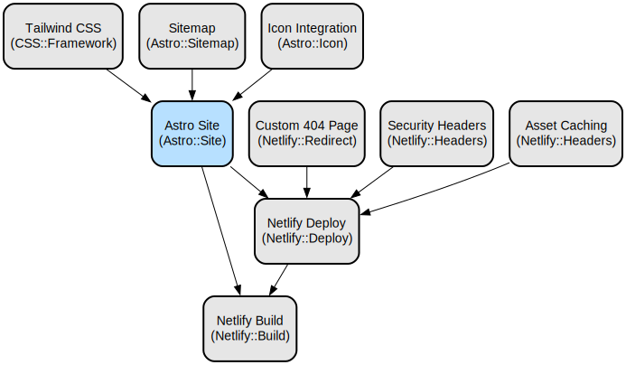

# Best of Vacuum: Expert Vacuum Cleaner Reviews & Buying Guides

Best of Vacuum is a comprehensive review platform that provides scientifically-backed vacuum cleaner reviews, detailed buying guides, and expert cleaning advice. Our team of certified experts conducts rigorous testing using laboratory-grade equipment to deliver unbiased, data-driven recommendations that help consumers make informed purchasing decisions.

The platform features innovative testing methodologies including particle counting, suction power measurement, and long-term durability assessments. Our reviews cover all vacuum categories from cordless stick vacuums to commercial models, with detailed analysis of cleaning performance, filtration efficiency, noise levels, and value for money. The content is enhanced with structured data for improved search visibility and uses modern web technologies for optimal user experience.

## Repository Structure
```
.
├── src/                      # Source code directory
│   ├── components/          # Reusable UI components
│   │   ├── ReviewDetail/   # Review-specific components (ratings, pros/cons, etc.)
│   │   └── PrivacyPolicy/  # Privacy policy page components
│   ├── content/            # Content collections (blog posts, reviews, team info)
│   ├── layouts/           # Page layout templates
│   ├── pages/            # Route definitions and page components
│   ├── styles/           # Global styles and Tailwind configuration
│   └── utils/           # Utility functions and schema generators
├── public/              # Static assets and admin configuration
└── config files         # Project configuration (Astro, Tailwind, PostCSS)
```

## Usage Instructions
### Prerequisites
- Node.js version 18.17.1 or higher
- Package manager (pnpm recommended)
- Basic understanding of Astro and Tailwind CSS

### Installation
```bash
# Clone the repository
git clone <repository-url>
cd vacuum-reviews

# Install dependencies using pnpm
pnpm install

# Set up environment variables
cp env.example.env .env
```

### Quick Start
1. Start the development server:
```bash
pnpm dev
```

2. Build for production:
```bash
pnpm build
```

3. Preview production build:
```bash
pnpm preview
```

### More Detailed Examples
1. Adding a new review:
```markdown
---
title: "Vacuum Model Review"
excerpt: "Detailed review description"
pubDate: 2024-03-15
author: "Expert Name"
rating:
  overall: 4.8
  suction: 5.0
  maneuverability: 4.6
---
```

2. Creating a blog post:
```markdown
---
title: "Vacuum Cleaning Tips"
category: "Guides"
tags: ["cleaning", "maintenance"]
---
```

### Troubleshooting
Common issues and solutions:

1. Build Errors
- Issue: Missing dependencies
- Solution: Run `pnpm install` to ensure all dependencies are installed

2. Content Not Updating
- Issue: Cache-related issues
- Solution: Clear the `.astro` directory and rebuild
```bash
rm -rf dist .astro
pnpm build
```

3. Schema Validation Errors
- Issue: Invalid content frontmatter
- Solution: Verify content structure matches defined schemas in `src/content/config.ts`

## Data Flow
The application follows a content-driven architecture where markdown content is processed through Astro's content collections and rendered using reusable components.

```ascii
[Content Collections] -> [Astro Build] -> [Static Pages]
     |                       |                |
[Schema Generation] -> [Component Render] -> [HTML/CSS/JS]
```

Key interactions:
- Content is organized in collections (blog, reviews, team)
- Schema utilities generate structured data for SEO
- Components render content with consistent styling
- Build process generates static pages
- Netlify handles deployment and hosting

## Infrastructure


Netlify Configuration:
- Build Command: `pnpm build`
- Publish Directory: `dist`
- Node Version: 18
- Asset Processing: CSS/JS bundling and minification enabled
- Custom Headers: Security headers configured
- Cache Control: Long-term caching for static assets

## Deployment
1. Prerequisites:
- Netlify account
- Environment variables configured

2. Deployment Steps:
```bash
# Build the site
pnpm build

# Deploy to Netlify
netlify deploy --prod
```

3. Environment Configuration:
- Set required environment variables in Netlify dashboard
- Configure build settings and deploy contexts