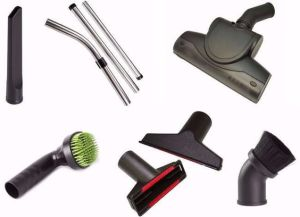

If you are looking for a fantastic vacuum cleaner, then you have come to the right place. Just read on. While shopping for a vacuum cleaner, you should know the things to consider for to get a fair deal in the market and to ensure that you purchase the best cleaner that is efficient and cost effective. Visible vacuum lines on a carpet make your clean house feel even cleaner. Can you imagine having them all the time, and at the same time having gleaming, dust-free floor?

## Things to Consider While Shopping For a Vacuum Cleaner

For you to find your dream vacuum cleaner, you must consider the following things.

### **1\. The types of cleaning you do**

As you know, cleaning needs differ depending on the types of cleaning that you want a cleaner for. As you know, the type of cleaning determines your cleaning needs, which in turn dictates the type of a vacuum cleaner you should buy. Furthermore, your cleaning needs will determine the features to look for in a cleaner.

If you are looking for a machine to clean a wall-to-wall carpet, or many rugs, [a bagged vacuum cleaner is the best choice.](https://www.bestofvacuum.com/best-bagged-vacuum/) However, canisters might be the right vacuum cleaners especially if you have many stairs. Tile floors, laminate, or hardwood floors where maneuvering is required. Simply put, canisters are very easy to maneuver.

### **2\. Check Features**

Modern vacuum cleaners come in a range of designs and sleek shapes if not cool colors. However, you should always remember that what matters most is how well these cleaners clean. Yes, it’s true that one type of a vacuum might have features that appear extremely cool and attractive to you, but it might not be able to meet all your cleaning needs.

So, it’s extremely important that you check features and settle for a vacuum cleaner whose futures fit your cleaning needs. Consider vacuum cleaners with a manual carpet bile-height adjustment control suction control because in that way, you will be able to clean draperies and other delicate fabrics very well.

A vacuum cleaner that features a motorized brush will clean your carpets better than a one powdered cleaner with suction only. Precisely, the switch, which is supposed to deactivate the motorized brush, helps a great deal in protecting the finish of bare floors. Furthermore, it also helps in avoiding debris.

### **3\. A bag or a bagless vacuum cleaner**

Yes, it is true that bagless vacuum cleaners save you a lot of money especially on purchasing bags. However, they require more filters that need either periodic cleaning or replacing. Is important to note that HEPA filters require periodic replacing and in the end, a bagless vacuum cleaner will prove to be more expensive than a bagged one.

### **4\. Asthma or allergies**

If you want to clean carpets and rugs, it is important to note that the dust and mess that involves cleaning will definitely affect you if you are allergic to dust. For this reason, it is very important to look for a vacuum cleaner that is safe for you especially if allergies are a concern like **[Shark Perfect II](https://www.amazon.com/gp/offer-listing/B0037HHFMO/ref=as_li_tl?ie=UTF8&camp=1789&creative=9325&creativeASIN=B0037HHFMO&linkCode=am2&tag=bestofvacuum2-20&linkId=9471a0669d0a3ee98f2a6a0e7e561f87">Shark Cordless Pet Perfect II Hand Vac \(SV780\)</a>).**

If you are asthmatic or allergic to dust, you should not go for bagless vacuum cleaners because they require more filters, which need periodic cleaning. This is actually not good for anyone asthmatic or allergic to dust because the dust and mess of emptying the bins will definitely have adverse effects on such a person. So, the best vacuum cleaners to purchase if allergies are a concern are the bagged ones.

### **5\. Keep an ear out for noise**

Even though it’s hard to find a vacuum cleaner that reaches the level of recommended hearing protection, it is extremely important that you consider the noise that a machine producers when at work. When it comes to hearing protection, canister vacuums are the best choice because they tend to be quieter as compared to other types of vacuum cleaners.

### **6\. How often should you change the filter on your vacuum cleaner?**

Remember that a vacuum cleaner that requires you to replace its filters regularly will prove to be costly as compared to the one whose filters lasts longer. However, it’s better to work with a vacuum cleaner that requires you to replace the filter regularly than working with the one whose filter need periodic cleaning especially if you are allergic to dust, or if you are asthmatic. Of course, you won’t be able to withstand the dust and mess of emptying the bins regularly.

### **7\. Ease of installation**

The ease of installation is among the most important things you need to consider while shopping for a vacuum cleaner. If you are not a professional, and you just want to do some light cleaning jobs in your home then you need a vacuum cleaner that do not require professional installation. Otherwise, you might not be able to use it. On the other hand, if you are a professional, and you have a lot of cleaning to do, then you need a vacuum cleaner that requires professional installation.

### **8\. The cost**

Consider the purchasing and maintenance cost of a vacuum cleaner while shopping for one in the market. While you can be able to get great deals in the market, it’s advisable that you don’t cut corners so much because you might end up with a machine that won’t be able to take care of your cleaning needs perfectly. The good news is that discounts of 10 to 40 percent off are increasingly available, and you can be able to get even a better deal in the holiday season.

### **9\. What are the attachments for?**

Vacuum attachments are extremely important because they make your cleaning jobs a breeze. For example, a ceiling fan attachment makes it possible and easy for you to reach fan blades, and the mini-blind attachment allows for simple removal of dust from hard-to-clean blinds. If you are an allergy sufferer then you must put more thought on attachments while shopping for a vacuum cleaner.

### **10\. How often you should change the filter**

Vacuum cleaners with the cheapest filtration systems contain cloth bag that you have to dump, clean and replace regularly because it becomes saturated with dust. The best systems should have two to four stage filtration systems with at least throw-away paper filters bag down to .3 micros or even less to reduce dust. So, you will take longer time to change the filter if you have the best vacuum cleaner.

### **11\. Motor size**

Motor size of a vacuum cleaner is measured in amps. The best machine has the largest number, which means that the motor is very powerful.

### **12\. Construction material**

Choose a vacuum cleaner that is lighter, durable and easy to maintain instead of choosing a machine based on appearance.

### **13\. Fill location**

The top fill is the ideal choice because it can either fill the bag from the bottom or the top, and it doesn’t put more strain on the motor.

### **14\. Number of motors**

A two-motor set up is ideal. With tow motors, one will be for the vacuum and the other one will be for the brush.

### **15\. Air flow**

Air flow is usually measured in cubic feet per minute or centimeters per minute. You should understand that the air flow is what carries the dirt up into the container or bag. Therefore, the more air flow, the better.
