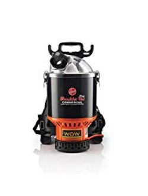
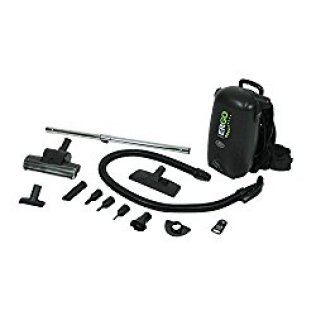
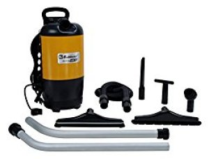
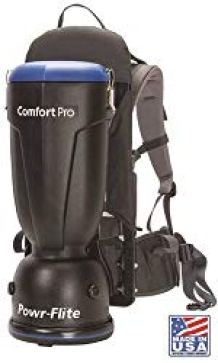
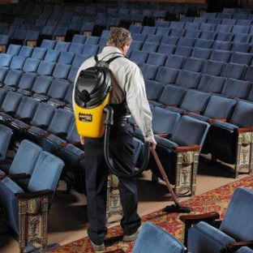

Finding the best backpack vacuum that fit your cleaning needs can be a daunting task. With all those brands in the market today promising heaven, not all of them actually deliver.

Let’s review the top best to help you right the one within no time.

## Best Backpack Vacuum Cleaners Reviews

| PICTURE | NAME                                                 | WEIGHT \[lbs] | Power Cord Length |
| ------- | ---------------------------------------------------- | ------------- | ----------------- |
|         | ProTeam Backpack Vacuum                              | 11            | 50                |
|         | ProTeam ProVac FS 6 Commercial Backpack Vacuum       | 9.6           | 50                |
|         | Hoover Commercial Lightweight Backpack Vacuum, C2401 | 9.2           | 48                |
|         | Powr-Flite BP6S Comfort Pro Backpack Vacuum          | 12            | 50                |

These are the best backpack vacuums on the market right now.

### 1. ProTeam Super CoachVac Commercial Backpack Vacuum

**Review**

* This is a powerful cleaner that comes with a backpack design and allows users to tackle even challenging cleaning operations. **[Click here to see today’s price on Amazon.](https://www.amazon.com/dp/B09NB32MB4?th=1&linkCode=ll1&tag=bestofvacuum2-20&linkId=998126ee5347d23c648156545e0d758c&ref_=as_li_ss_tl)**
* The high filtration and effective backpack vacuum cleaner is perfect for vacuuming areas that witness a lot of foot traffic and needs to be cleaned the most thus making it the best commercial backpack vacuum.
* Proteam Super Coachvac a powerful unit that combats poor quality indoor air with mote amount of mobility and comfort than can be expected from a  HEPA backpack vacuum cleaner.
* The unit is the best backpack vacuum for home use. Ideal for vacuuming upholstery, stairs, carpets and hard floors, as well as lighting, fans, vents, blinds and other surfaces above the floor.

**Suggestions**

* You have to watch out for the suction of the unit. Once you take the aluminum wand off, it appears that anything that comes within 4 – 5 inches of the hose end risks being sucked up and into the cleaner bag.
* As the unit is lightweight, it is common to bump into stuff with the cleaner latched on to your back. You can forget its existence on your back until you bump into doorways, walls, and furniture. It is important to walk slowly, in order to avoid falling down due to impact. However, the vacuum tends to fit near to the body, which reduces risks of accidental contact with doorways and walls in any case.

**Tips**

You have to wear the cleaner properly so that the adjustable harness of the cleaner properly responds as you move. This will also reduce the strain of cleaning on your arms, back, leg and core muscles.

### **Buyer’s Guide**

Although cleaning the corners is very easy, the vacuum has a tendency to stick to papers or pant legs that its nozzle comes close to.

**Pros**

* ProTeam Super CoachVac Commercial Backpack Vacuum is light in weight and versatile in operations. It is perfect for commercial cleaning such as lodging, stadiums, arenas, large meeting facilities, schools, universities, colleges and for building contractors.
* This is a highly productive cleaning tool and happens to be dear to commercial cleaning professionals at any location. It can clean up allergens, dust, mite, bacteria, mold, pollen, dead skin cells, pet hair and more.
* The tool helps save a lot of time and effort in cleaning, whether you are intending to tidy up small or large areas, low or high surfaces, carpet or hard surfaces. For people with a busy lifestyle and having no one else to clean at home, it can be perfect, time-saving cleaning equipment.

**Cons**

* The hose attached to the aluminum wand is not very secure and can fall off as you vacuum clean. It is a good idea to wrap this with Velcro tape in order to keep it securely attached to the unit.
* The carpet or floor head does not swivel when you stand up straight, and you need to bend down to have it vacuum properly. This can put your back under strain when you are cleaning for a long time.

**Also see:**

* **[Laminate floor vacuums](https://www.bestofvacuum.com/best-vacuum-for-laminate-floors/)**
* **[Good vacuums for long hair](https://www.bestofvacuum.com/best-vacuum-for-long-hair/)**
* **[Best lightweight vacuum cleaner for the elderly](https://www.bestofvacuum.com/best-lightweight-vacuum-cleaner-for-the-elderly/)**

### 2. ProTeam ProVac FS 6 Commercial Backpack Vacuum

**Review**

* This restaurant vacuum has been specially designed to help cater to the cleaning requirements of the hospitality and food service industry. **[Click here to see latest price on Amazon.](https://www.amazon.com/gp/offer-listing/B00GM50P9S/ref=as_li_tl?ie=UTF8&camp=1789&creative=9325&creativeASIN=B00GM50P9S&linkCode=am2&tag=bestofvacuum2-20&linkId=cf9fada804798837a303cee208f6a1da)** 
* This backpack vacuum cleaner is commercial-grade and has been designed without brushes, belts or beater bars.
* It is used in school cafeterias, motels, hotels, kitchens, bars, nightclubs, eateries, restaurants etc.
* The cleaning tool is integrated with a HEPA media filter, which combats poor quality air in the indoor environment, in order to increase mobility and comfort. If you have asthmatic patients or small kids or babies at home, this can be a good equipment to ensure safety for their health.
* The unit is useful for cleaning lighting, fans, vents, blinds and other above-the-floor surfaces. It can also be used for cleaning upholstery, stairs, carpets and hard floors.

**Suggestions**

It is important to adjust the harness properly, to prevent bumping into objects at the time of cleaning. You should be careful while fitting the harness, to avoid any issues while cleaning.

**Tips**

It is important to unclamp the top prior to using it for the first time, and then checking it to ensure that the filters are in proper position.

### **Buyer’s Guide**

* The device is very easy to use. All that you have to do is plug the flexible hose into the cleaner, connecting it to the tool, taking the cord out and plugging it inside. This can be enough to make the device ready to use.
* Although the device is not the perfect cleaner to deep clean pile carpets, it is enough to be used in most restaurants and offices. It might not be a problem to use it on any facility having these types of floor surfaces.

**Pros**

* This is a durable unit and has been designed to last for a long time. You will not have to buy another cleaner anytime soon.
* The product comes with a very long cord, which lets you use it over a longer area. You can take it around from one room to another without any difficulties.
* This is a backpack vacuum cleaner and can be taken along easily. There is no need to drag the drag the tool and bounce it off furniture and walls. Although it has to be worn on the back, it is easily movable.
* The device is light in weight and comes with an extremely adjustable harness. It has an extra long extension pole, which makes it convenient for you to clean up cobwebs from the corners of high ceilings.

**Cons**

* The device does not have too many negative points. However, it has a slightly thick wand and those with extremely small hands would find it difficult to hold on to something.
* The hose of the cleaner simply inserts into the upper section of the vacuum cleaner as well into its wand. Over time, the parts can be separated due to the connections getting loose. It would be better to have a screw on or clip connection.

### 3. Hoover Commercial C2401 Shoulder Vac Pro Backpack Vacuum

### 

**Review** 

* Hoover c2401 shoulder vac pro commercial backpack vacuum is a compact but powerful cleaning tool. All the dust and debris are neatly packed away into a backpack canister, which means cleaning is easy and hassle-free. **[Click here to see latest price on Amazon](https://www.amazon.com/gp/offer-listing/B005NASZG8/ref=as_li_tl?ie=UTF8&camp=1789&creative=9325&creativeASIN=B005NASZG8&linkCode=am2&tag=bestofvacuum2-20&linkId=62ffd1cdc057b02b08e247ca0c3fc6ce).**
* You can check the amount of debris and dust at any time due to the clear dome lid. The amazing HEPA filtration helps clear away all types of particulates, whether dust  mites, pollen or allergens. The unit is capable of carrying a maximum amount of 6.4 quarts of debris and dust.
* Hoover backpack vacuum cleaner has an easy design, which has been approved by chiropractors. The device can easily be carried by users and even taken up and down stairs with convenience.
* This industrial backpack vacuum has a long cord, meant for covering a wider area and cleaning up with more convenience. Users can cover a bigger area at one go, which can reduce their time for cleaning up the inside of their home, office or other  industrial floors. 

**Suggestions**

* The back of the unit can push down your pants while the waist strap pulls at the shirt, and makes your dress come off. It is better to wear a longer belt and shirt, or vacuum when no one else is at home.
* Hoover C2401 backpack vacuum is noiseless, but it is important to maintain it properly to keep the noise-free operations intact.

**Tips**

* The cleaner does not work well on shag or high-pile carpets, and it is not meant for you if your home consists of tall carpet mostly. **See reviews for  [vacuums for shag carpet.](https://www.bestofvacuum.com/best-vacuum-for-shag-carpet/)**
* Emptying the bag can be annoying at times, and the frequency will be higher if you have to do more amount of cleaning in one session. You should be mindful of the direction of the wind while emptying the bag.

### **Buyer’s Guide**

The cord attached to the device is long enough, and can sometimes get into your way and pose risks of tripping. You can avoid this problem by tying it into a knot. This is true for every vacuum cleaning unit with a long cord, and cannot be actually regarded as a negative point that is singular to this device. See our reviews for  [vacuum with retractable cord](https://www.bestofvacuum.com/best-vacuum-with-retractable-cord/)

**Pros**

* Hoover C2401 commercial backpack vacuum is lightweight, which weighs just 9.2 pounds. Naturally, carrying it around is not a problem for users. The strap that comes with the unit allows users to rest it very securely on the shoulders and back. Even when you stand up straight, the device will not cause backaches for you. This device lets you operate it well and its functionality is inarguable.
* The hose of the unit hangs down from the back. You can pick up the wand again easily even when you let the wand go, such as while cleaning furniture.
* The end of the hose has a curved piece of plastic, which makes it useful for tidying up the top sections of baseboards.
* Hoover c2401 shoulder vac pro backpack vacuum comes with a long extension cord, which allows users to get a wider and longer reach for cleaning.

**Cons**

* Carrying it on the back for an extended time can make you feel quite hot, especially during hot summers. It is important to switch the device off and get it off your back for some time, before resuming work once again.
* Although the device boasts of bagless operation and comes with a reusable bag, it can be somewhat unpleasant to empty the bag.

### 4. Atrix VACBP1 Hepa Backpack Vacuum – Corded – HEPA backpack vacuum

**Review**

* This HEPA backpack vacuum boasts of 4 stage fine filtration and 3-quart filter capacity. **[Click here to see latest price on](https://www.amazon.com/gp/offer-listing/B004LYNU3K/ref=as_li_tl?ie=UTF8&camp=1789&creative=9325&creativeASIN=B004LYNU3K&linkCode=am2&tag=bestofvacuum2-20&linkId=d02204dc301868f74308c7d904e2a508)** **[Amazon.](https://www.amazon.com/gp/offer-listing/B004LYNU3K/ref=as_li_tl?ie=UTF8&camp=1789&creative=9325&creativeASIN=B004LYNU3K&linkCode=am2&tag=bestofvacuum2-20&linkId=348a6fa55924da0351447d1c872950fc)** 
* It is robust and light in weight and can be transformed conveniently into a blower. It is just 10 pounds in overall weight, and there is easy weight distribution, which makes it comfortable and convenient to use.
* The belt loops have an accessory storage, and the device offers a convenient and ergonomic fit.
* It has a versatile design and has robust blower and vacuum capabilities. It is ideal for hospitals, hotels, schools, lobbies and offices.
* Atrix VACBP1 backpack vacuum has a telescopic wand and various other accessories, which satisfy all types of cleaning requirements. It is perfect for those areas that need plenty of cleanings, such as air vents, blinds, drapes or slot machines.

**Suggestions**

[If your home has a lot of long human hair and pet hair,](https://www.bestofvacuum.com/best-vacuum-for-long-hair/) the brushes on the cleaner attachment can be clogged. It is a good idea to use a comb at the end of every cleaning session, to pull out all the hair.

**Tips**

The unit boasts of an intense suction and can pull in almost any light object that comes close to its hose. It is a good idea to clean while keeping this in mind.

### **Buyer’s Guide**

Although the vacuum has a strong belt to be worn around the waist, it would have been better to have straps that fit at the point where it connects to the sternum. It would have ensured better distribution of weight. Naturally, you should keep the device off your back for a few minutes in between cleaning operations.

**Pros**

* The device is not very loud in operations and can be a perfect fit for homes where elderly patients or small babies are in the family. It is also great for offices and calls centers.
* The cleaner is considerably light in weight, and you can be assured that it will not place your arms, back or neck under strain. The backpack makes cleaning much more convenient.
* The turbo floor brush is wide enough. There is no need to crawl beneath or between furniture items to tidy up spaces.
* The device comes with a durable build, and even the telescopic wand is made of metal and not plastic.
* The small rectangular attachment offered with this unit allows convenient dusting of wooden furniture as well as cleaning of pet hairs.

**Cons**

The bag offered with the unit has a paper top. As a result, it cannot be washed and cleaned. It would have been better if the manufacturer had included a disposable bag instead.

### 5.  Koblenz BP-1400 Commercial Grade Backpack Vacuum

### **Review**

* This backpack vacuum cleaner is commercial grade and can be operated with a lot of conveniences. **[Click here to see latest price on Amazon.](https://www.amazon.com/gp/offer-listing/B003A78CWI/ref=as_li_tl?ie=UTF8&camp=1789&creative=9325&creativeASIN=B003A78CWI&linkCode=am2&tag=bestofvacuum2-20&linkId=8151244357aaad7c3ee32a4423434c93)** 
* The unit consists of a robust 11.5 amp motor that drives all operations quietly. The noise level is very low during cleaning operations.
* The cleaner comes with an entire set of accessory tools, which makes reaching difficult spots very convenient.
* The device comes with a durable build, which is expected from its manufacturer Koblenz which has been in the business of creating superior floor care products for more than 4 decades now.
* The cleaner has an ergonomic design, which ensures amazing performance, versatility, and durability. It has full padded shoulder straps and a back plate harness and support to ensure good health. This ensures cleaning is very convenient.

**Suggestions**

If the fittings are not placed properly, it can be difficult to get them changed. You need to ensure that the ring is fitted tightly. Otherwise, it will not hold securely.

**Tips**

One of the accessories of Koblenz backpack vacuum causes too much friction, producing a lot of noise and ending up scratching the piece. You can solve this issue by using the attachment included for the carpet. It would have been better if the maker integrated the attachment with small wheels for vacuuming the floor.

### **Buyer’s Guide**

The extension cord is of a good length, but if you are into cleaning malls or large offices, you might need an extension cord to lengthen its reach even more.

**Pros**

* It has a pigtail line cord of 50-foot length, which lets users clean bigger areas and save a lot of time in the process.
* The on/off switch with belt clip helps cleaners to get convenient access. Koblenz BP-1400 has a good carrying handle, which ensures that the unit can be easily transported without putting the arms under strain.
* There is a 4-stage filtration system, which consists of a HEPA filter, an outer cloth bag, and a disposable filter bag. It offers great bang for the buck.
* The unit boasts of amazing suction power, and can easily clean up dust, mites, pollen, [pet hair](https://www.bestofvacuum.com/best-vacuum-for-pet-hair/), allergens and more.

**Cons**

Koblenz backpack vacuum does not seem to have any negatives worth talking about. However, you might find it tough to carry on extended cleaning with this backpack vacuum. It is a good idea to take it off your back for some minutes before placing it back on and resuming work.

### **6. Power-Flite BP6S Comfort Pro Backpack Vacuum**

If you have been struggling to find a vacuum cleaner that has a cord that can reach all rooms, you will love this latest best backpack vacuum cleaner. Power-Flite BP6S backpack vacuum cleaner comes with a 50-ft power cord that can stretch to reach every room. Also it’s one of the best backpack vacuum for carpet. **[Click here to see today’s price on Amazon.](https://www.amazon.com/gp/offer-listing/B014JLBDFQ/ref=as_li_tl?ie=UTF8&camp=1789&creative=9325&creativeASIN=B014JLBDFQ&linkCode=am2&tag=bestofvacuum2-20&linkId=366157037034ef0292f73179ad188325)**

**Features**

* The vacuum cleaner has an innovative design that makes it possible for anybody in the home to use the vacuum.
* Unlike other vacuums, Power-Flite BP6S has an ergonomic shoulder harness. Thanks to the shoulder strap, it is easy to carry the vacuum on the back. You do not need assistance to pull the vacuum to your back.
* It is a commercial grade vacuum cleaner, which means you can use it at home as well as in commercial enterprises and hospitality establishments such as hotels and restaurants.
* The vacuum comes with a waist belt. You can use the waist belt to hold all the other tools that you need for any cleaning exercise. Some of the things you can carry include gloves, brushes, and damp clothes for wiping.
* Power-Flite BP6S has 4-stage air filtration ability. Combined with true HEPA filtration, the 120 CFM cleans the air in your home without leaving any impurities.
* It meets LEED requirements because the vacuum cleaner is 70dB.

**Pros**

* Easy to pull and place at the back.
* Long power cord that can reach every room from a single wall socket.
* You can carry many other tools necessary for the cleaning campaign thanks to the waist belt.
* The vacuum is commercial graded thus you can use it at home and in commercial purpose.
* Cleans every impurity from the hair within the house.
* You can wind the cord back to its place without stress.
* The shoulder strap helps alleviate weight that might be resting on the hips if the vacuum lacked the harness.

**Cons**

* The long power cord may be a nuisance to those that live in small rooms.
* It is a bit noisy when working.
* The vacuum cleaner is heavy.

## Why Use a Backpack Vacuum

Many people who have used a vacuum cleaner know that to get the best results, it is not about the cost of the vacuum cleaner. It is not on how to use the cleaner either. Although these are important aspects, there is a lot more. One must know the type of vacuum cleaner they should use. It is for this reason the backpack vacuum cleaner is gaining popularity and to many, it is the ideal vacuum cleaner for both home and office use.

But why prefer it over any other type of vacuum cleaner? What are the [advantages of using the backpack vacuum](http://proteamfilter.com/2017/01/4-reasons-choose-backpack-vacuum/) cleaner over the others?

### **1. Portable**

It is easy to maneuver around with a backpack vacuum. It is true that it doesn’t affect your posture. But there is more to that. With the right size of straps and a light vacuum, it is easy to move with it around when cleaning.

### **2. You Will Stand Upright**

Can you imagine how it would be if you were asked to bend for more than three hours? It would be excruciating. With a backpack vacuum, you will be doing your cleaning while standing upright thus not pain at your back.

### **3. Powerful Filters**

Most backpack vacuums in the market today come with extremely powerful filters. These allow for longer cleaning hours without breaking unnecessarily to empty the dust.

### **4. They are Ergonomic**

Yes, when it comes to design, backpack vacuum cleaners will help users get rid of many complications that might occur during the cleaning process. For instance, it is hard to get injuries. Putting the device on the back is in itself safety.

### **5. Offer More Health Benefits**

As opposed to other types of vacuums, backpack vacuum cleaners come with superior filtration process. This allows for the annihilation of harmful microbes that other vacuums do not. Yes, it is easy to contain bacteria, viruses, and germs using a backpack than any other vacuum cleaner.

## What To Look For When Choosing the Best Backpack Vacuum

Like many other appliances for home use, you should be keen when choosing for a vacuum cleaner. As mentioned above, not all vacuum cleaners in the market today perform the same function. Some are superior to others while others have certain attributes that are not present in others.

What are some of the things you should look for when choosing a vacuum cleaner?

### **1. Power**

A good vacuum cleaner should not be that which consumes a lot of energy. There is no doubt that in some countries, electricity bills are always high. Therefore, you should always look at a vacuum that does not consume a lot of power.

While most of those in the market have 500W to 3,000W, I’d advise you go for a vacuum with a power consumption of 1,400W.

### **2. Weight**

Weight is a big factor. If you have a heavy backpack vacuum, then you know how tedious it is to move around with it. Ideally, you need a vacuum that is below 10 lbs. If you find a powerful, vacuum cleaner weighing around 7 or 7.5 lbs, the better.

### **3. Comfort, Easy To Carry** [****](https://www.bestofvacuum.com/best-backpack-vacuum/)

Nobody doesn’t want to be comfortable. With a backpack, you are assured of the comfort. You will not even feel the 10 lbs on your back. Besides, a backpack vacuum comes with straps to ensure firmness and stability.

### **4. Features**

Yes, although some of the things mentioned above may amount to features, there are specific details you may want to look at. Some of the things you much look at are:

* Filtration power.
* Dust cup.
* Power cord vs cordless.
* Dustbin capacity.
* Cord length if any.
* Height (adjustable or not).
* Brush roll on/off.
* Variable power setting.
* Telescoping Wand.
* Upholstery tool.
* Crevice Tool (Attachments).
* LED Light.

#### **Conclusion**

Overall, which best backpack vacuum cleaner you should go for ultimately depends on your choice and the various benefits that the devices come with.

If you want to use the backpack vacuum machine for cleaning up your carpets, or only pet hair, or simply floors, you have to buy a unit that does the work in an appropriate way.

It is hardly a good idea to buy a cleaner without considering your daily cleaning purposes and requirements. Once you have factored in all such things,  be assured of better cleaning equipment.
