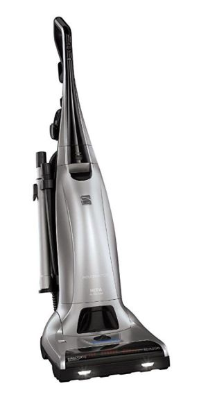
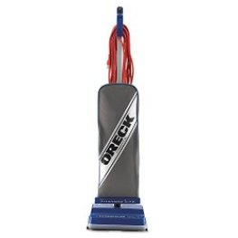
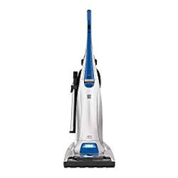
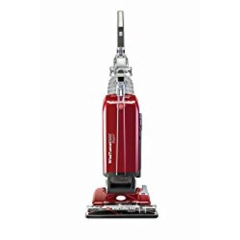
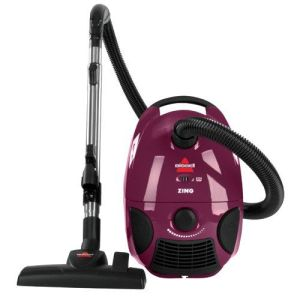

Bagged vacuums undoubtedly offer better air-filtration performance compared to bagless vacuums.  As these vacuums have one extra layer of filtration.  Bagged vacuum cleaners have been in use for long, and have only got better with time and with more useful features being added. But which is the best bagged vacuum? Here, we review eight best bagged vacuum cleaners to help you make an informed choice hassle free.

##  5 Best Bagged Vacuum Cleaners

These are the best bagged vacuum cleaners.

## ***1. Kenmore Elite 31150 Pet & Allergy Friendly Bagged Upright Vacuum Cleaner*** 

This best bag vacuum comes with a fantastic balance of mobility, performance and cost-effectiveness. It offers a raw cleaning performance that can beat the work of much pricier counterparts available in the market. **[Click here to see today’s price on Amazon.](https://www.amazon.com/gp/product/B075DZY7FR?ie=UTF8&linkCode=ll1&tag=bestofvacuum2-20&linkId=04005c8d4d1c32cbde5c635a25860168&language=en_US&ref_=as_li_ss_tl)**

### ***Pros***

* The product is perfect for cleaning various situations, whether it comes to hardwood floors or shag carpets. It can clean up large dirt particles as easily as small dirt grains. If you are looking for the best bagged vacuum for hardwood floors, this one can be a great choice.
* This is a self propelled vacuum and there are no risks of straining your back when you are vacuuming the entire home.
* Kenmore elite 31150 vacuum comes with different accessories, including a dirt sensor and some regular attachments such as thick bristles – which makes it ideal for cleaning up stairs and pet hair – as well as telescopic wand and a crevice tool.
* It has a cord that is as long as 33 foot, which makes it easy to clean up a wider area. The vac can be useful for cleaning up most rooms without any need to re-plug or un-plug the unit.
* Kenmore Elite 31150 has a dirt sensor which is an additional attachment. An indicator lights up when the vacuum is detected by the built-in sensor.
* Unlike a standard upright vacuum, you do not have to exert a lot of push force to move the upright vacuum in a forward direction. You can move it ahead even with very small effort.

### ***Cons***

* It is bulky in weight, which can make it tough to carry about during long cleaning operations. It is slightly more than 20 pounds and if you have to clean more than one floor the extra weight can be a hassle.
* The vacuum tends to tip over when you use its extension hose.

## ***2. Oreck Commercial XL Commercial Upright Vacuum, XL2100RHS***

This is a dedicated upright vacuum that can deep clean surfaces to remove all traces of dirt and debris. It is perfect for homes having wall to wall carpeting. **[Click here to see latest price on Amazon.](https://www.amazon.com/dp/B001NDNV18?aod=1&ie=UTF8&th=1&linkCode=ll1&tag=bestofvacuum2-20&linkId=1127647faf4f5b225ba2240b30f298ff&language=en_US&ref_=as_li_ss_tl)** 

### ***Pros***

* This is a commercial grade vacuum that comes at about the cost of a consumer grade vacuum cleaner. It is rated to be used for commercial cleaning operations, and is capable of sustaining the daily strain experienced by vacuum cleaners.
* It is just 8 pounds in overall weight, and using it can be an ease. The low weight makes it a joy especially for people who have to use [vacuum cleaners](https://www.bestofvacuum.com/best-vacuum-cleaner/) for a long time in multiple levels at home. It is one of the best lightweight bagged vacuum cleaning tools in the market at present.

**[Read our reviews for lightweight vacuums for the elderly](https://www.bestofvacuum.com/best-lightweight-vacuum-cleaner-for-the-elderly/)**

*  It is capable of deep cleaning operations and can be ideal for tidying up floor surfaces. You can use it for cleaning carpets and bare floors.
* Its low profile design lets you use it easily for reaching and deep cleaning up of areas beneath low furniture pieces.
* It has a bagged system, adding to your convenience of cleaning in some ways. The disposal of dirt involves less mess. There are side brushes that can ensure easier cleaning of the edges.
* The hand controls and 35 foot long power cord gives you easier access. There is robust brush roll and suction power.
* Despite offering services similar to a professional grade cleaner, it is not very costly.
* It is perfect for deep cleaning of carpets, low to deep pile. It has side brushes that offer a fantastic cleaning performance on edges and baseboards.

### ***Cons***

* There is no swivel steering or headlights.
* You have to spend more on bags, and replace bags after every 6 months.

## 3. Kenmore Pet Friendly 31140 Lightweight Bagged Vacuum

What more would you want if you have the best bagged vacuum that comes with a 4-position manual adjuster? To many people, this is all they need. Thankfully, Kenmore Pet-friendly vacuum cleaner has more than just the 4-position adjuster. [**Click here** **to see today’s price on Amazon.**](https://www.amazon.com/Kenmore-Allergy-Friendly-Upright-Cleaner/dp/B075GFLQ7K?th=1&linkCode=ll1&tag=bestofvacuum2-20&linkId=ea378a77ed5e43d56843f3aa2868e92a&language=en_US&ref_=as_li_ss_tl)

### Features

* This item weighs only 19 lbs. Although it is considered lightweight, the vacuum cleaner comes with two motors. The two-motor system is the reason why the vacuum excels in suctioning.
* Thanks to the 2-motor system, the airflow inside the vacuum cleaner is ideal and optimum.
* The vacuum cleaner is built with triple HEPA filtration. Because of the enhanced filtration system, the cleaner has the ability to filter up to 99.7% dirt including dust, mold, trapping pet dander, and lifting the most stubborn debris.
* To remove pet dander, dust, and mold easily, the best bagged vacuum uses its high-velocity air driven turbine, which spins the brush to hit higher RPM. Once the roller brush is at the highest RPM, cleaning of the most stubborn stains becomes extremely easy.
* For the vacuum cleaner to reach a large surface area, the manufacturer has included 3 attachments. One of the main attachments that enable you to reach a larger surface area is a flexible hose.
* The wand, combined with a flexible hose and the crevice tool help the vacuum cleaner to extend a cleaning area.
* Kenmore 31140 has a 30-ft power cord, which you can plug in to a nearby socket as you continue with your cleaning.
* You can use this machine to clean whatever surface you feel. Some of the areas you can use the machine for include car interior, ceilings, walls, under furniture, and in areas that have tight spaces. This is made possible because of the machine’s aluminum telescoping wand and a detachable handle.

### Pros

* Cleans tight space areas.
* Attachments help extend cleaning area.
* 4-position manual adjuster enables anybody to use the machine.
* Strong suction power.
* Doesn’t lose suction power.

### Cons

* The roller is loose.
* Bristles scratch surfaces.
* The exhaust scatters pet fur everywhere.

**[Read our reviews for lightweight vacuums for the elderly](https://www.bestofvacuum.com/best-lightweight-vacuum-cleaner-for-the-elderly/)**

## ***4. Hoover Windtunnel MAX Bagged Vacuum UH30600***

This upright bagged vacuum comes with 7 varied height settings, various on-board accessories, a long power cord and HEPA filtration technology. **[Click here to see latest price on Amazon.](https://www.amazon.com/Hoover-WindTunnel-Upright-Cleaner-UH30600/dp/B0055SNR2A?th=1&linkCode=ll1&tag=bestofvacuum2-20&linkId=fb0bdec40493bd6d7b6991a64f2184d1&language=en_US&ref_=as_li_ss_tl)**

### ***Pros***

* It has a very robust suction power, which allows sucking up of dirt particles, allergens, pet hair, dust and more very easily.
* Hoover *UH30600* has a long power cord that allows wider cleaning at one go, and not have to look for another power source very quickly.
* It comes with washable filters, and you can keep it clean whenever needed. This allows a more hygienic vacuum cleaner for your home.
* The High Efficiency Particulate Air (HEPA) level filtration technology makes the cleaner a perfect choice for everyone who is suffering from asthma or allergies. It can remove ragweed, dust mite feces, pollen and many other particles.
* Its stretch hose is long at 15 feet and allows you to reach crevices and corners that are difficult to reach otherwise. The ease is enhanced by the presence of the telescopic wand that offers a cleaning reach of around 17 feet. It can clean up pet hairs very effectively.
* The cleaning swath is wide with this vacuum and you can sweep a wider area at one go.
* Its hand tool is air-powered and functions very well. It has been designed to work on bare floors as well as carpets.
* Its brushroll and belt can be accessed with ease, and you do not need the use of any screwdrivers for its assembly.
* You can easily find out when you have to change the bag, given that the cleaner comprises of a bag check indicator.
* Its bags can be set up, taken off and discarded with ease.
* It is priced reasonably, and can come within the budget of most homeowners.

### ***Cons***

* The vacuum is slightly heavy, which can make long cleaning operations slightly cumbersome for users. However, the carrying handle makes it easier for users to transport the cleaner.
* It is slightly noisy while in operational state, which can make early morning or late-night cleaning inconvenient for you.

## ***5. Bissell Zing Bagged Canister Vacuum, 4122***  

This is one of the best bagged canister vacuum cleaners and comes from the popular brand BISSELL, which is known for being a capable vacuum cleaning tool manufacturers for homes. **[Click here to see latest price on Amazon.](https://www.amazon.com/Bissell-Bagged-Canister-Vacuum-4122/dp/B00AZBIV9Q?th=1&linkCode=ll1&tag=bestofvacuum2-20&linkId=199e3960a96c63e8733d28158527b080&language=en_US&ref_=as_li_ss_tl)**

### ***Pros***

* It is light in weight, and can be maneuvered with ease. You can carry it about without experiencing back problems or other issues during the cleaning operations. There is also a carry handle, which makes it easier to move around.
* This is the best multi purpose vacuum as it’s able to clean up various surfaces, such as auto interiors, upholstery, curtains, stairs, bare floors, rugs, carpets and more.
* It comprises of a telescoping wand that can be moved easily under and around furniture, as well as clean up ceilings, drapes and other areas that are tough to reach otherwise.
* Bissell zing bagged canister vacuum has a long cord that allows cleaning up of a wider area with one sweep, but there is an auto cord rewind feature as well – that lets you rewind the cord automatically with a simple button push.
* The upright vacuum comprises of a Multi-Surface Floor Nozzle that can be used for easy tidying up of various types of surfaces. You can shift easily to hard floor cleaning mode from carpet cleaning mode by flipping a switch.
* The Full Bag Indicator lets you find out when it is time to empty the bags, and not have to make any guesses about the same.
* It is compact in size and can be stored easily even in smaller spaces, which makes it a good option for people with small apartments.

### ***Cons***

The tool holder tends to fall off.

## **Buying the Best Bagged Vacuum Cleaner – Things to Consider**

There are many vacuum cleaners with bags in the market, from various brands, and it could be tough to choose just one cleaner. At times, customers are unsatisfied with the device that they choose. If you wish to buy the **best bagged vacuum cleaner**, you need to consider these things first.

***Cleaning space***

You have to consider the type of space that you would use the vacuum to be cleaned – whether it is a full house, a big living room, a small-sized room or any other area. Based on the area, the model that you choose could be larger or smaller and the ability to suck debris out could vary as well.

***Type of filtration***

Look for a vacuum with a superior filter, which is especially important if you suffer from allergies. A cleaning device with an on-board HEPA filter is capable of trapping the smallest amount of allergens and dust particles, and can remove around 99.97% of all the particles that are airborne.

***Canister or Upright***

Upright vacuums would be the best option in case you want to use it for cleaning wall-to-wall carpets or rugs. These have a suction head and a motor. The cleaners are heavy but can clean hard-to-reach areas due to various attachments and a hose. Canister vacuum cleaners are more compact and lighter than upright models, and can easily remove debris from the space under low furniture items.

***Noise level***

Bagless vacuum cleaners produce a lot of loud sounds, which can make your early cleaning operations inconvenient for kids and neighbors. Look for devices that have a lower noise level and are more bearable in form. The best bagged vacuum cleaning units are noiseless or low-noise.

### **What are the Pros and Cons of Bagged Vacuums?**

Bagged vacuum cleaners have been designed to make the cleaning process easier and faster.

***Pros***

* There is not a lot of contact with the dust and debris. Once the bag is full, simply get it out of the vacuum and throw it into the trash.
* Bagged vacuums come with different types of filtration, including HEPA filtration. Most of these have bags included in the whole filtration system – allowing you a clean filter while changing the bag.
* It makes it easier for users to clean every nook and cranny with ease, and save time in tidying up homes.
* These are available in many styles, sizes and shapes.
* You do not have to empty these cleaners as often as the dirt receptacle of bag-less cleaners. **See our reviews for [best water vacuum cleaner](https://www.bestofvacuum.com/best-water-vacuum-cleaner/)**

***Cons***

* You should always have bags beside you. Else, a full bag will hasten your cleaning operations to a premature end. You have to purchase more number of bags, and replace the existing ones each time before they get full.
* You can have problems in finding replacement bags if you have a vacuum cleaner of an older model. In case the brand does not continue with its bag production, you will be unable to use your vacuum cleaner that is fine otherwise.

#### **Conclusion**

The market abounds in such bagged upright vacuums, and you should take out time to consider your needs, pros and cons of each unit as well as your budget in order to get the best bagged vacuum.
