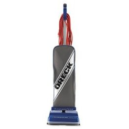

Whether you run  janitorial services, a school, a restaurant or even if you just want the vacuum for residential place, finding the best commercial vacuum or industrial grade vacuums**,** amongst all those  that are available on the market is vital.  As these vacuums are a whole different from what most people use in their homes.

In order to get the best industrial vacuum for yourself, there are certain things that you need to understand about such heavy-duty vacuum cleaners in the first place.

The first thing that you need to be aware of is the fact that these commercial vacuum cleaners are far heavier than residential vacuum cleaners. As such, you will have to take a lot of [things into consideration](https://www.bestofvacuum.com/vacuum-cleaner/) when getting one that suits your needs. Also, a good motor is the basic requirement of a good business vacuum.

**See Also:**

-   [**Best shark vacuum for pet hair**](https://www.bestofvacuum.com/best-shark-vacuum-for-pet-hair/)
-   [**Vacuum for tight spaces**](https://www.bestofvacuum.com/best-vacuum-for-small-apartment/)
-   [**Top rated shark vacuums**](https://www.bestofvacuum.com/best-rated-shark-vacuum/)

Not only that, but you should also know about the main advantages of getting such a vacuum cleaner. Here mentioned are some of them:

### **Good Cleaning:**

One of the main reasons why a lot of people go for commercial vacuum cleaners  even for household purposes is because of the simple fact that they deliver a far better performance compared to residential ones. After all, heavy duty vacuums are built keeping in mind the heavy amount of stress they are put through.

### **Endurance:**

As mentioned right above, these heavy duty vacuum cleaners – like   [Shark APEX DuoClean](https://www.amazon.com/gp/product/B074F21F43/ref=as_li_tl?ie=UTF8&camp=1789&creative=9325&creativeASIN=B074F21F43&linkCode=am2&tag=bestofvacuum2-20&linkId=d75c36dc9644e5a79f173d1742f0f629) – are made from the ground up keeping in mind the huge amount of workload that will be put upon it. This is why such vacuum cleaners tend to have huge amounts of endurance in terms of durability and longevity. It is needless to say that you will get everything worth the money you put in.

### **Adaptability:**

Another great thing about such vacuum cleaners is that they are very adaptable to other environments and are thus flexible in their usage. Just above, we have mentioned how several people resort to commercial cleaners for residential purposes. That is just a small testament to how these vacuum cleaners are extremely adaptable to their surrounding environments.

| Picture | Name | Type | Features |
|---|---|---|---|
|  | ProTeam Backpack Super CoachVac Commercial Backpack Vacuum | Backpack | *Xover Floor Tool - All-in-one tool for low-pile carpets and hard surface. |
|  | Oreck Commercial Upright Vacuum with 40ft Power Cord, U2000R1 | Upright | *HELPING HAND HANDLE: The convenient on/off switch on the handle has received Ease-Of-Use Commendation from the Arthritis Foundation. |
|  | Hoover Company 40140201 Hepa Cartridge Filter 1 Pack | Canister | *Includes a reusable commercial cloth bag with paper option. |
|  | Hoover Commercial Lightweight Backpack Vacuum, C2401 | Backpack | Chiropractor Designed Harness |

## Top Rated Commercial Vacuums

These are the top rated commercial vacuums for business or for household purposes.

## 1\. ProTeam Commercial Backpack Vacuum

This ProTeam commercial backpack is the best vacuum for cleaning business as it comes with a powerful filtration, backpack and is formidable for battling the poor air quality inside. [**Click here to see today’s price on Amazon.**](https://www.amazon.com/gp/offer-listing/B00GM4YKWC/ref=as_li_tl?ie=UTF8&camp=1789&creative=9325&creativeASIN=B00GM4YKWC&linkCode=am2&tag=bestofvacuum2-20&linkId=3bf826da3da271a9e0a02d26cae2a35e) 

It is versatile in nature and is great for commercial purposes. It is best used for cleaning up hard floors, stairs, vents and carpets.

### **Suggestion/Tips for Usage**

-   Make sure you do not bump it into other items.
-   Avoid using it on soft surfaces.

### **Pros**

-   Best backpack vacuum for high traffic areas like restaurants, schools.
-   Has Xover Floor Tool – All-in-one tool for low-pile carpets and hard surfaces.
-   Perfect for commercial cleaning.
-   Very durable in nature.
-    Quietest heavy duty vacuum – \[66 Dba\]

### **Cons**

-   Your back may hurt due to the height of the cleaner.
-   The straps can get very uncomfortable.

## 2\. Oreck Commercial Upright Vacuum, U2000RB1

Coming with a 12-inch cleaning path and a cogged up V-belt, this upright vacuum cleaner comes with a cog motor as well as a brush pulley. [**Click here to see latest price on Amazon.**](https://www.amazon.com/gp/offer-listing/B008BPEVGU/ref=as_li_tl?ie=UTF8&camp=1789&creative=9325&creativeASIN=B008BPEVGU&linkCode=am2&tag=bestofvacuum2-20&linkId=e0de6b7c355afad3c594700bc69ecee9) 

This allows you to replace a damaged cord more easily and with fewer expenses. It is powerful, it is balanced, and it has a lot of speed to it as well.

It is well suited to getting underneath furniture.  Overall, this vacuum definitely is the best commercial vacuum as it’s lightweight, easy to maneuver and great suction.

### **Suggestion/Tips for Usage**

-   Make full use of the exclusive helping hand that comes with it.
-   Feel free to use it on hard surfaces like wood, floors.

### **Pros**

-   Folds flat to enable you vacuum under tables.
-   Helping Hand handle has received Ease-of-Use Commendation from Arthritis Foundation and on/off switch is located in handgrip for convenience.
-   It comes with dual action movement.
-   The cord is 40 feet long, thus making it great for long range usage.
-   Extremely easy to carry as well as the handle.

### **Cons**

-   No hose or attachments.
-   Needs to be self-assembled.
-   Can be too light in weight for some users.

## **3\. Oreck Commercial Vacuum – best vacuum for carpet** 

As you know, upright cleaners are far better suited for dealing with carpets compared to canister vacuum cleaners.

This little devil comes packed with an auto floor management system, a helping hand handle, an engine that is powerful as well as fast and high capacity of 630 CI. The transition  between carpets to the floor is also smooth and consistent. [**Click here to see latest price on Amazon.**](https://www.amazon.com/gp/offer-listing/B00260TWII/ref=as_li_tl?ie=UTF8&camp=1789&creative=9325&creativeASIN=B00260TWII&linkCode=am2&tag=bestofvacuum2-20&linkId=4098740ac125709625e3f9068c9e9d24) 

### **Suggestions/Tips for Usage**

-   It is perfect for usage along the edges and corners of carpets and floors so make full use of it.
-   Make sure you do not bump it around on furniture too often.

### **Pros**

-   Its lengthened cord makes it perfect for long range usage.
-   It is very light in nature, making it easily movable.
-   It is also very durable for long term usage.

### **Cons**

-   The handle is fixed at a height which may be uncomfortable for short people.
-   Some people have found Oreck U200R-1 to be loud and noisy. Which cleaner does not make a little sound?

## **4\. Hoover CH30000 Canister Vacuum**

This product is perfect when it comes to cleaning up tight places and those who do not have enough space in between.

Also, it is great for digging out dust and debris from sharp corners and awkward places where you would usually not find your range. Also, the cord is 33 feet long, thus allowing you to go for long range cleaning as well. [**Click here to see latest price on Amazon.**](https://www.amazon.com/gp/offer-listing/B005NASSRO/ref=as_li_tl?ie=UTF8&camp=1789&creative=9325&creativeASIN=B005NASSRO&linkCode=am2&tag=bestofvacuum2-20&linkId=d8b25841cf243d658dfcca51d1a27ee4)

### **Suggestion/Tips for Usage**

-   Try not to use the cleaner for general usage because the bag is very small and needs to be emptied very often.

### **Pros**

-   The extensions are made of steel which makes the whole thing very light in weight.
-   It is great for using around corners, ceilings and windows because of its maneuverability.

-   The vacuum has a blower built into it and it helps to clean better.

### **Cons**

-   Hoover CH30000 can get very heavy on usage, so emptying periodically is necessary.

## 5. **Oreck Commercial XL2100RHS**  

It is an upright vacuum cleaner that has a huge 12 inches wide path for cleaning. It is well suited for dealing with carpets and does not take as much space for storage. [**Click here to see latest price on Amazon.**](https://www.amazon.com/gp/offer-listing/B001NDNV18/ref=as_li_tl?ie=UTF8&camp=1789&creative=9325&creativeASIN=B001NDNV18&linkCode=am2&tag=bestofvacuum2-20&linkId=cf63ec435d933c42f3dd9287cacd1d8e) 

Also, it comes equipped with an auto floor adjustment system which enables it to move from carpet to floors much easily. There are also powerful brush rolls on the side for better cleaning.

### **Suggestions/Tips for Usage**

-   You will find great usage for it as a portable vacuum cleaner because of its light weighted nature.

### **Pros**

-   The helping hand handle which comes along with this product increases the comfort of usage.
-   Great for getting under furniture and pulling out dust and debris.

### **Cons**

-   Some users have complained that pet hair cannot be handled by this product. Click here to read our reviews for **[best vacuum for pet hair.](https://www.bestofvacuum.com/best-vacuum-for-pet-hair/)**

## **6\. Hoover Commercial Vacuum Cleaner** 

Capable of carrying 6.4 quarts of dust particles/debris, this commercial  backpack vacuum cleaner is extremely popular in the market because of it’s easy to use functions and learn-ability. [**Click here to see latest price on Amazon.**](https://www.amazon.com/gp/offer-listing/B005NASZG8/ref=as_li_tl?ie=UTF8&camp=1789&creative=9325&creativeASIN=B005NASZG8&linkCode=am2&tag=bestofvacuum2-20&linkId=b9be8854859e292e2e4bfc4ea392229e)

It also very light in weight, thus making it good for people with low amounts of stamina. The HEPA filtration technology also makes sure that the air you breathe is clean. This is the best vacuum to use for cleaning business and home that have pets.

### **Suggestion/Tips for Usage**

-   Make sure you use it with all the attachments which come with the product because that increases the overall efficiency.

### **Pros**

-   It is extremely versatile in nature because of all the attachments and extensions that come along with it  thus making it the best [commercial backpack vacuum](https://www.bestofvacuum.com/best-backpack-vacuum/).
-   It is also very powerful in terms of its performance and can be used for long periods of time.
-   There is little to no sound emanated from it, thus keeping it down for the most part.

### **Cons**

-   The cord can get too long for usage for some customers.

## **7\. Sanitaire SC3683B Commercial Canister Vacuum.**

Light is weighing in nature and installed with the HEPA technology for getting clean air; this product is perfect for using on hard floors and similar surfaces. [**Click here to see  the latest price on Amazon.**](https://www.amazon.com/gp/offer-listing/B0006HUYTE/ref=as_li_tl?ie=UTF8&camp=1789&creative=9325&creativeASIN=B0006HUYTE&linkCode=am2&tag=bestofvacuum2-20&linkId=6dd251ae7a4a3eb99da389bee70c6194)

There is also a cleaning attachment which comes with it. You will also find 2 different plastic wands that can help you reach awkward places. There is a 2-year warranty in total.

### **Suggestions/Tips for Usage**

-   Always dry the vacuum cleaner up before using it.
-   Make sure you do not use hot water to clean it.

### **Pros**

-   The suction power is extremely strong for this product.
-   Its weight is also optimal.

### **Cons**

-   The handle might be weak compared to rest of the product.

## **8\. Sanitaire SC679J Heavy Duty Commercial Vacuum**  

This corded and bagged vacuum cleaner is made of plastic overall and has a metal handle. With a volume of 4.5 gallons, it has a huge capacity in terms of storage.

The motor that comes along with it is also extremely powerful and well suited for a vacuum cleaner of its type. It has also earned a CRI seal of approval. [**Click here to see latest price on Amazon.**](https://www.amazon.com/gp/offer-listing/B084T6M9DX/ref=as_li_tl?ie=UTF8&camp=1789&creative=9325&creativeASIN=B084T6M9DX&linkCode=am2&tag=bestofvacuum2-20&linkId=d7badfca4f2214b20d7e608111bcbecc)

### **Suggestions/Tips for Usage**

-   Make sure you do not overuse the motor because it can burn out pretty easily.

### **Pros**

-   Sanitaire SC679J heavy-duty is very well built and sturdy in nature.
-   Easy to sweep up dust and debris in low-lying

### **Cons**

-   The cord is not as long as other products.

## 9\. **[Windsor Sensor S12 Industrial Vacuum](https://www.amazon.com/gp/offer-listing/B006U0J1ZE/ref=as_li_tl?ie=UTF8&camp=1789&creative=9325&creativeASIN=B006U0J1ZE&linkCode=am2&tag=bestofvacuum2-20&linkId=2cd02c5f557956edf78d1fc9a1d1374a)** 

Are you looking for the best heavy duty commercial vacuum? You will not go wrong with Windsor Sensor S12 Commercial Vacuum. Windsor, the manufacturer of this particular brand has ensured that all clients get the value of whatever dollar they spend. [**Click here to see latest price on Amazon.**](https://www.amazon.com/gp/offer-listing/B006U0J1ZE/ref=as_li_tl?ie=UTF8&camp=1789&creative=9325&creativeASIN=B006U0J1ZE&linkCode=am2&tag=bestofvacuum2-20&linkId=d2686fe3155babdccc740e6bde0a7a78)

Before I take you through some of the features of the Windsor Sensor S12, allow me tell you something. If you are planning to start a commercial cleaning project, this is the greatest I have seen those in the business use.

Windsor Sensor S12 Commercial Vacuum may be expensive to some people but that isn’t the right thinking. Thanks to its performance, you will save a lot of money in the long run.

### Features

To make it ideal for detailed cleaning, Windsor Sensor S12 industrial vacuum is fitted with a light ergonomic handle.

It comes with light alerts and roller indicators. These will alert you whenever you make a mistake in setting the brush height incorrectly.

Windsor Sensor S12 Commercial Vacuum has an in-built capacity to protect itself whenever there is clogging of some kind or when the bag is full.

It comes with a high-performance vacuum motor with 1.6 hp, 2-stage filtration ability, and consumes some 1200 watts as its power input.

### Pros

-   Has one of the best dog hair picking abilities in the market.
-   No fluffs.
-   Nice cleaning and versatile.
-   Strong suction power.
-   The large wheels work better for most terrains.
-   It is not too loud as other commercial vacuums.
-   It will last longer.
-   Easy to assemble.
-   A sizeable power cord that will help you reach many parts.

### Cons

-   At 20 lbs, it is one of the heaviest commercial vacuums in the market.
-   Because it does not have light in the front, it makes it a bit difficult to locate dirt in some parts of the house.
-   You need to manually adjust the vacuum height.

## **How to Choose Best Commercial Vacuum Cleaners**

Choosing a good vacuum cleaner for business is so vital has it’s something which differs from individual to individual. At the end of the day, what is best for one person may not be the same for someone else. It depends completely on yourself and your own unique set of needs. As such, it is something which you will have to personalize yourself.

#### **However, there are some things you can do in order to get the best product for yourself:**

-   Reading product reviews is one of the things you can do in order to get in the right direction. Check out all the ratings issued by customers worldwide. After all, personal experience goes a long way. Also, check out the major sites for reviews regarding the product you are buying.
-   Weighing your options; this is something which you do when buying pretty much anything from the market. There should be no exception for a vacuum cleaner either. First, check out all the different options that are available to you and compare them before settling for any one of them.
-   Ask your peers for their opinions regarding your purchase. After all, they too might have bought a commercial vacuum cleaner for themselves at some point in. So, make sure you ask them for their advice and how to go about getting the product you want. Personal opinion is always a good source for forming your own ones.
-   Another thing you should strive to do in order to make every penny you spend seem worth it is to get a vacuum cleaner that is extremely durable in nature. The longer the cleaner lasts, the better it is for the user and more the worth it will have for you.
-   Last but not the least; make sure that the product you are buying for yourself is in complete alignment with your own needs and demands. After all, that is why you are buying it in the first place. Hence, that is the requirement which you should try to fulfill no matter what.

### **Buying the Best commercial vacuum – Things To Consider**

Now that you know the importance of having a commercial vacuum cleaner and the benefits of using it, you will probably want to know about the different factors involved in choosing one for yourself. So without any further ado, here are some of the things you might want to consider when selecting a commercial vacuum for yourself:

-   **Purpose**

This is one of the most important things that you have to consider when buying pretty much anything for yourself. You need to have a clear idea regarding the purpose of the machinery you are buying for yourself. And that depends on your needs and the utilities it can have in your field of work. So think hard before opting for a particular vacuum cleaner.

-   **Debris**

This is pretty much tied in with the point made above. You have to keep in mind the amount and kind of debris that you want to clean up when choosing the vacuum cleaner you want. Heavy duty cleaners are capable of cleaning out hard materials like saw dust while residential cleaners can only deal with minute dust particles and such.

-   #### **Features**
    

Vacuum cleaners these days come with a ton of variety in terms of the features available to them. Not only that, there are tons of attachments which come available with them as well. Make sure you know about them when making a final decision.

-   **Weight**

The weight of the commercial vacuum cleaner is also a huge factor when considering which one you are going to buy for yourself. Obviously, this depends on your needs as well. For instance, heavy duty cleaners weight far heavier than residential vacuum cleaners and are generally used in places where they do not need to be moved around too much.

-   #### **Capacity**
    

Also, a big factor in choosing any kind of vacuum cleaner for yourself is its capacity. You need to know how much it can hold before you can make a final decision on the product you are buying. A portable vacuum cleaner, for instance, needs to be emptied more often than a commercial one. This is because of the differences in capacity between the two.

-   #### **Power**
    

Last but not the least, you will also want to know about the power usage of the vacuum cleaner. This is something which is dependent on the type of motor it is using. For performing heavy-duty functions, you would want something which has a powerful motor compared to ones which do not need to do so much work. So keep in mind the kind of work you want to do with your cleaner.

-   **Filters**

Vacuum filters come with different filters fitted in them. And when it comes to choosing them, you have a lot of choices available. There are some filters which are fitted by default and some which can also be removed. Make sure you do the necessary research before selecting the ones you need.

### **Should you go for a canister or upright Commercial Vacuum?**

The two major types of heavy duty vacuum cleaners are known as Canister and Upright vacuum cleaners. Like a lot of other things, the choice between the two depends completely on personal needs and preferences. However, there are certain things that you need to keep in mind when making a choice between the two.

### **Canister Vacuum Cleaner:**

A canister is basically a cylindrically shaped container which can hold an object inside it. A canister vacuum cleaner is basically a type of vacuum cleaner which uses such a container in order to house the cleaner’s motor, to filter it and to collect the dirt gathered. There is usually a suction hose attached along with small wheels as well.

#### **Pros**

-   Better suction power and performance for a certain areas.
-   The hose is very flexible in nature and gives a better range in terms of motion and versatility.
-   Because of its light weighing nature, it is extremely easy to push around the house or office and get the cleaning done.
-   The head of the cleaner has a lower profile compared to others and as such is easy to get it under different furniture.
-   Usually, these cleaners also come with an electrical cord which is self-retracting in nature. Most models have this feature.
-   Easier to carry around from place to place, thus giving it better portability compared to upright cleaners.
-   These are easy to swap out with tools that are onboard, thus making it convenient for cleaning off weird surfaces.
-   Better in terms of use for people who suffer from allergies due to their design and the HEPA system installed in them.

**Cons**

-   Usually, you have to drag the canister around by keeping it behind you. This is something which can get awkward for a lot of people.
-   Also, these vacuum cleaners tend to have smaller wheels in comparison to pretty much everything else out there. Thus, you might be required to lift it over thresholds.
-   Changing the vacuum heads is also something that can get very problematic and may require you to change the brushes when moving from carpet to the bare floor.

### **Upright Vacuum Cleaner:**

This is basically a type of vacuum cleaner which is used for getting rid of all the dirt and debris from carpets and floors. These are usually larger in capacity when compared to other vacuum cleaners on the market, and as such, you need not empty them as often as you do other cleaners of other types.

**Pros**

-   Upright vacuum cleaners are perfect for commercial cleaning. Large hallways and open carpets are good examples.
-   No matter where or how you are using this vacuum cleaner, it is always in front of you which reduce the chances of tripping over. A lot of people prefer such a mechanism.
-   Also, these cleaners usually come with larger sized bags compared to other vacuum cleaners on the market. This automatically implies fewer amounts of changing and replacing.
-   Usually, such cleaners come with a hose on most models. This provides better versatility and better cleaning overall.

**Cons**

-   Getting under furniture can be very difficult with this type of vacuum cleaner.
-   This is also harder to manoeuvre around, especially with houses with little space between furniture.
-   Usually, does not come with retractable electrical cords.
-   Far heavier than canister vacuum cleaners and thus harder to carry around.
-   Lesser option for tools and thus not as flexible like canister vacuums.
-   Usually not designed with allergy sufferers in mind.

### **Bagged or Bagless Commercial Vacuum?**

Another categorisation of vacuum cleaners which can be done is in terms of the bag provided by it. As the name suggests, a bagged vacuum cleaner is one which provides a separate bag for storing the dust and debris collected over time as opposed to a bag-less one which makes no such provisions. As such, here is a direct comparison of the two.

### **Bagged Vacuum Cleaners.**

**Pros**

-   Usually, bagged cleaners are far more hygienic compared to bagless After all, the bag can be disposed of anytime it fills up.
-   Also, because of the material of the bag which acts as a filter, it is perfect for people who suffer from allergies. Because of its nature, it is nearly impossible for any sort of dust particles to exit the bag.
-   Going hand in hand with the point made, usually such cleaners have HEPA filtration meaning these bags go through a lot of rigorous testing before being passed on for approval. As such, they are very clean for usage.
-   Also, for the most part, they do not require as much maintenance as bag-less vacuum cleaners because they did not need to change and emptied as often. After all, these bags can contain around 2 pounds of dust and debris altogether.

**Cons**

-   You will have to buy a lot of replacement bags over the course of time. Each time it gets full, it needs to be replaced. As such, costs can go high.
-   You will also notice a slight dip in performance when the bag nears fulfillment. Thus, optimum performance cannot always be reached.

### **Bag-less Vacuum Cleaners**

**Pros**

-   Usually, such cleaners are less expensive because the extra charges for the bags are reduced by a lot.
-   It is also far easier to know when this cleaner is reaching emptiness in comparison to bagged cleaners.
-   In a way, this type of cleaner is eco-friendly in nature because there won’t be repeated buying and dumping of bags filled with debris.

#### **Cons**

-   There is an increased chance of being exposed to dust, thus making it bad for those who suffer from different allergies.
-   Maintenance is pretty high and can get pretty dirty as well. After all, you will have to empty the chamber yourself as you do not have the option of getting rid of the bag itself.

#### **Conclusion**

Finding the **best commercial vacuum** may not be that difficult. Normally what really happens to be tough is the fact that most of our readers are unaware about the things that they should opt for while shopping for an industrial vacuum cleaner. Some do not know the brands, or what features to look for, etc while others are still contemplating should they buy a commercial vacuum or stick to the normal ones. I hope this post will help you make an informed choice, assuming that we have covered everything under this topic in a concise yet clear way. Whatever the product, make sure you do some research before buying it. A little more information will not do you any harm.