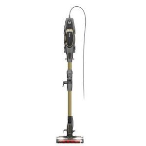
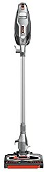
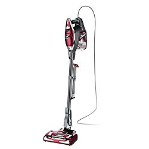
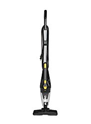
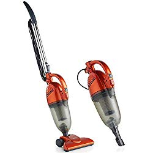

Everybody knows how stick vacuums work: they suck in dirt from your floors. However, what many people may not know is that only the best corded stick vacuum will ensure the sucked-in dirt doesn’t escape back into the air.

A [study by researchers from Queensland University](https://www.webmd.com/allergies/news/20120106/are-vacuum-cleaners-bad-for-health#1) of Technology in Brisbane, Australia, showed that poor quality and old vacuum cleaners are likely to release dirt into the air. The dirt will certainly contain bacteria and allergens, which will ruin your family’s health.

That’s why you need to replace your old corded stick vacuum.

## Top Rated Corded Stick Vacuums

Most importantly, you need to find the highest quality corded stick vacuum. The most critical feature of such a high-quality best corded stick vacuum is the high-efficiency particulate air (HEPA) filter. HEPA filters are designed to eliminate 99.9% of pollen, animal dander, as well as bacteria from the air.

And that’s just one of the benefits of getting a high-quality corded stick vacuum.

Besides providing allergy relief by eliminating pollutants, such a vacuum cleaner also:

* Eliminates dust mites.
* Keeps your skin healthy and free from irritants.
* Makes your carpet last longer.
* Gives your home a fresh smell by removing bad odors.

But, perhaps the real question is why purchase a corded cleaner instead of a cordless one.

Here’s why…

A corded vacuum gives you far more suction power than a cordless one. That extra power means more thorough cleaning that produces a healthier indoor environment. Besides, you won’t be inconvenienced by having to charge the vacuum just when you need to urgently clean your house.

Even so, you still have to sift through multiple corded stick vacuums to identify the best quality you can afford.

To make your search as easy as possible, this guide lists 8 of the best corded stick vacuums. It features only vacuums with the best specifications and highest reviews from buyers.

All you have to do is pick one that matches your specific needs.

##  Best Corded Stick Vacuum Cleaners

These are the top rated best corded stick vacuums you can buy.

## 1. Shark Flex DuoClean Ultra-light HV391 Corded  Stick Vacuum

Shark DuoClean HV391 Corded Cleaner has a MultiFLEX Technology, which helps homeowners to reach some areas such as under low furniture, which would not be reached otherwise.

### **Review**

MultiFLEX Technology combined with the already in place DuoClean Technology helps in the easy rolling of the vacuum over carpets. At the same time, the two related technologies help give the vacuum cleaner a freestanding stature. **[Click here to see the latest price on Amazon.](https://www.amazon.com/gp/offer-listing/B074F2PHLB/ref=as_li_tl?ie=UTF8&camp=1789&creative=9325&creativeASIN=B074F2PHLB&linkCode=am2&tag=bestofvacuum2-20&linkId=cc7a67828caeb6fc69d0195d5159d9df)**

You are able to pull even larger debris from wherever they may be inside your carpet.

**See our reviews for [vacuum cleaner for laminate floors](https://www.bestofvacuum.com/best-vacuum-for-laminate-floors/)**

Did you know that this corded stick vacuum has the ability to identify and pick pet hair as well as dander quite easily from your floor and upholstery?

HV391 Corded Vacuum Cleaner has a sophisticated yet elaborate Anti-Allergen Complete Sealing Technology. With this technology, it is now possible to capture 99.99 percent dust. This leaves the user safe from dust.  

It is not a hard thing to convert this corded cleaner into a hand-held vacuum cleaner. Once you do so, it is now easy to reach other areas of your house such as the ceiling.

The vacuum cleaner is powerful, which enables you to conduct cleaning in virtually every corner of your house. This means you are able to clean your carpet (whatever type it is) and the floor itself.

The VH391 corded cleaner has another technology that you will no doubt love. It is the Reduction Technology. With this technology, whether you are cleaning a carpet or a bare floor, you or your neighbor may not even realize that there is a machine set on in the house. It is quiet.

Again, this best lightweight corded stick vacuum is not heavy. It weighs only 9.8 lbs.

### **Suggestions**

This suggestion is directly pulled from the makers of Shark DuoClean HV391 Corded Cleaner. They clearly state that when designing this vacuum cleaner, they had your pets in mind. So, if you have a dog, cat, or any other pet in the house, this is the ideal corded vacuum cleaner for your family.

### **Tips**

How big is your living room where you have spread your carpet? In most cases, you will find that the living room is the biggest in the entire house. Even so, DuoClean HV391 comes with a 30-ft long cord. With a power cord of this length, you do not have to move your machine in order to locate the power source.

### **Buyer’s Guide**

Many people who have used the vacuum cleaner for a long time will tell you that when it comes to picking pet hair, some vacs do not even identify it as dirt. This is one of the strengths of Shark DuoClean HV391 that comes with both MultiFLEX and DuoClean Technology.

### **Pros**

* It is light at 9.8 pounds.
* The vacuum cleaner comes with a long power cord (30-feet).
* Praised a lot for easily identifying and picking pet hair.
* Remember the Reduction and Active-Glide Technologies? They help in sound reduction and easy floor maneuverability respectively.
* Removable dust cup-this helps to clean up the dust fast.

### **Cons**

* The cord is long. For those with a small house or room, they may feel that it is way too much. Besides, it is rugged.

## 2. SharkNinja Rocket DuoClean HV382 Bagless Vacuum

This most powerful lightweight corded stick vacuum is  one of the world’s most sort vacuum cleaners today. This year alone, thousands of homeowners have ordered this home appliance from various online stores.

### **Review**

The technology that is behind the designing of this corded stick vacuum cleaner is special. It features a type of brush with hard bristles that allow proper cleaning and removal of all types of dirt. What is more is that this corded stick vacuum comes with a soft brush roll. This is especially ideal for easy pulling of large particles that might be locked inside the rugs of your carpet.

Shark DuoClean Corded has a garage where you can easily access the brush roll. With this capability, it is easy to clean and maintain the vacuum whenever necessary. **[Click here to see latest price on Amazon.](https://www.amazon.com/gp/offer-listing/B01K7L8U62/ref=as_li_tl?ie=UTF8&camp=1789&creative=9325&creativeASIN=B01K7L8U62&linkCode=am2&tag=bestofvacuum2-20&linkId=2b44b551886b0fb4d715dc97a1ebc323)**

The word ultra-light should tell you something about this best-corded stick vacuum for carpet. The exact weight for this vacuum cleaner is 4.6 lbs. With this lightweight, you are sure that you can work on a large surface when cleaning and that makes it the best lightweight corded stick vacuum .

There is something you’ll love about this vacuum cleaner that is not in many of its competitors. Have you seen this vacuum cleaner’s LED lights? They are strategically placed at the floor nozzle. It requires lithium-ion batteries. You will see that they are included when you will order it.

### **Suggestions**

Did you know that there are people who are still wondering whether it is possible to find a vacuum cleaner with less than 10 lbs? This is what you need to capitalize on. In the past, some vacuum cleaners could weigh over 30 lbs.

**You might also be interested in [best shark vacuum for pets](https://www.bestofvacuum.com/best-shark-vacuum-for-pet-hair/)**

### **Tips**

Shark DuoClean HV382 Charcoal Grey has LED lights that are placed at the nozzle. Make good use of these lights. They will help you to easily see some of the hidden debris.

### **Buyer’s Guide**

When you are out to buy this vacuum cleaner, it is important to go through some corded stick vacuum reviews. They will help you know what you are about to buy. Remember that those views are honest reviews given by your fellow homeowners who’ve used the appliance.

### **Pros**

* Specifically designed with dual-brushes for laminate and low carpet.
* It is ultra-light with only 4.6 lbs.
* Comes with LED lights. This is a very ingenious design to help spot any debris.
* Comes with an easy-to-access garage.
* Has hard bristles that help in proper cleaning.

### **Cons**

* The batteries, when new, make the cleaner look good. However, if they are off, it might be challenging to replace them as fast as you may want.

## 3. Shark Rocket HV322 Ultra-light TruePet Upright Vacuum

It is a good thing when you change from a heavy thing to something light and powerful. That is how it feels when you start to use Shark Rocket TruePet HV322 Ultra-light vacuum cleaner that is corded.

### **Review**

Just like many other vacuum cleaners today, [Shark Rocket TruePet](https://www.bestofvacuum.com/best-rated-shark-vacuum/) is uniquely designed to give you the best cleaning service effortlessly. Although it is close to 9 pounds in weight, it is easy to convert this vacuum cleaner into a handheld vac. **[Click here to see latest price on Amazon.](https://www.amazon.com/gp/offer-listing/B00NGVF4II/ref=as_li_tl?ie=UTF8&camp=1789&creative=9325&creativeASIN=B00NGVF4II&linkCode=am2&tag=bestofvacuum2-20&linkId=257992ccc8df49a950f80e1246fd7afe)**

It is called a Hard Floor Hero. That is another nickname given to it by the manufacturer. In essence, that means the vacuum can easily pick surface litter as well as stuck debris in an instant. This results in a superb bare floor cleaning.

This is the best corded stick vacuum for pet hair. This is the reason; it is also referred to as Pet Multi-Tool. It doesn’t matter on which surface the pet hair is; Shark Rocket TruePet HV322 will simply pick it even without you noticing. You will only come to learn it picked when cleaning the machine itself.

Again, Shark Rocket TruePet HV322 is built with LED lights. These are placed on the machine’s nozzle and hand. Do not also forget that this corded stick lightweight vacuum comes with an XL dust cup. With it, you do not need to stop along the way to empty it to create space for more dirt. You will work with the machine from the start to the end.

Shark Rocket TruePet HV322 is one of the few stick vacuums with attachments that have power steering. With this capability, maneuvering around the cleaning area is excellent.

### **Suggestions**

When cleaning your house, the aim is to achieve the best. You need your house to be clean all the time. Because this best-corded stick vacuum for carpet comes with LED lights, use them. Yes, the position of the LED lights should tell you that the manufacturer did not place them there haphazardly. The strategic placement was deliberate. Let them help you achieve your cleaning experience.

### **Tips**

You can use this best-corded stick vacuum cleaner to ensure your picture frames, ceiling fans, and any other interior deco with easy. Do not worry about the weight. 8.6 lbs isn’t a thing. Make use of the LED light.

### **Buyer’s Guide**

If you have a big house, this is the ideal home cleaning appliance for you. Shark Rocket TruePet HV322 is equipped with a 32-foot power cord. With it, you only need to fix it to the power source and carry on your cleaning work. When buying it, ensure that the power cord is intact.

Insist on the 32-ft long cord if your house is big. Otherwise, if you buy a different vacuum cleaner and it happens that the power cord is shorter, you will need to place power sources in different parts of the house. This may not be convenient.

### **Pros**

* It’s light in weight at only 8.6 lbs.
* The LED lights are so bright thus optimum service.
* It is versatile (can clean hard floors, carpets, upholstery, and ceilings).
* Designed to pick pet hair with ease.
* Strong suction power.
* Comes with swivel steering.
* Has a 32-feet power cord.
* XL dust cup.

### Cons

* May not be ideal for quick cleanups with its 32-ft power cord.
* The high-pitched sound when cleaning. This is irritating.
* Doesn’t stand on its own!
* It is not possible to remove attachments using one hand.
* Has a plastic tube.
* Doesn’t have HEPA filtration.

## 4. HOOVER Linx Corded Lightweight Stick Vacuum SH20030

Perhaps, of all the vacuum cleaners that have ever been manufactured, HOOVER Linx Corded Lightweight Stick Vacuum SH20030 has the best wheels.

### **Review**

HOOVER Linx Corded Lightweight Stick Vacuum SH20030 has excellent edge cleaning bristles. As you now know, any vacuum that does not enable you to reach those hard-to-clean areas is useless. But this one will help you. **[Click here to see latest price on Amazon.](https://www.amazon.com/gp/offer-listing/B003ZYPZ0I/ref=as_li_tl?ie=UTF8&camp=1789&creative=9325&creativeASIN=B003ZYPZ0I&linkCode=am2&tag=bestofvacuum2-20&linkId=948e4f172c7f396c777c2e596c9c59aa)**

You will love the recline handle. It is designed to help you clean below the furniture without necessarily moving them around.

The wheels of this corded stick vacuum are non-marring. This means the cleaner will not get stuck on the floor or on the carpet. This combined with a swivel steering wheel will give you the best cleaning experience.

This corded stick vacuum cleaner has Cyclonic Technology. Equipped with this technology, it is easy to transition the cleaner from the hard floor to carpets, upholstery, and ceilings.

### **Suggestions**

For a smooth ride, ensure that the wheels of HOOVER Linx Corded Lightweight Stick Vacuum SH20030 are free from any obstacle. That’ll ensure you won’t regret buying the machine.

### **Tips**

The Cyclonic Technology and the corded vacuum cleaner’s wide mouth will help you achieve the best results. Capitalize on this ability to have a clean home.

### **Buyer’s Guide**

I may not exactly know what you are looking in a corded vacuum cleaner. If it were me, everything that is in HOOVER Linx Corded Lightweight Stick Vacuum SH20030 is superb. Well, I do not know yet but with excellent recline ability, long cord, and non-marring wheels, look at these things when buying it.

### **Pros**

* Comes with long power cord (20-ft), for those with big cleaning areas.
* It’s quiet.
* With non-marring wheels, this machine will help you move the vacuum cleaner back and forth on the carpet.
* It is VERY light (4 lbs).
* Extremely low power consumption (220W).

### **Cons**

* The 20-feet power cord is troublesome to others.
* Does not have HEPA filtration.
* Has a small dust cup.
* May not be good at picking large debris.
* No accessories. It doesn’t even have a crevice tool!

## 5. Eureka Blaze Swivel Lightweight 3-in-1 Hand-held Stick Vacuum Cleaner

Not many vacuum cleaners come with the ability to do three things. Most of those in the market are simple machines while a few are 2-in-1. When you get a 3-in-1 corded stick vacuum, buy it.

### **Review**

The main feature in the Eureka Blaze Swivel Lightweight NES210 is its 3-in-1 versatility. This means you are able to use it in three different ways. It can be on the floor that is a stick vacuum, to a stair vacuum cleaner, and then to a hand-held cleaner.

There is nothing like large particles or debris to Eureka Blaze Swivel Lightweight NES210. It simply collects and cleans off any dirt thanks to its Swivel Steering and powerful Capture Nozzle. **[Click here to see latest price on Amazon.](https://www.amazon.com/gp/offer-listing/B075P7J8BB/ref=as_li_tl?ie=UTF8&camp=1789&creative=9325&creativeASIN=B075P7J8BB&linkCode=am2&tag=bestofvacuum2-20&linkId=5690dbfdef11e2f21cc0d467e656488b)** 

I’m sure you will love the vacuum cleaner’s large dust cup and its permanent washable filter.

With an 18-ft long power cord, you are sure that you do not have to stop amid your cleaning to look for a power source.

It is fitted with a 2 Amp power motor, which will definitely be one of the factors you should be looking at when purchasing it. I mean, who is not sensitive about their electricity bill?

### **Suggestions**

If your house has staircases and would like to clean them easily, I’d suggest you think of the Eureka Blaze Swivel Lightweight NES210. Its 3-in-1 capability together with its lightweight will help you clean your stairs.

### **Tips**

Eureka Blaze Swivel Lightweight NES210 is versatile. Instead of using it in one version, try using its three-in-one applications. Turn it into a hand-held vacuum whenever you want. Use it as a stick vacuum with cord, and as a stair vacuum too.

### **Buyer’s Guide**

When out there to source for the ideal vacuum cleaner look for stick vacuums with attachments. When you stumble on Eureka Blaze Swivel Lightweight NES210, do not leave it. Remember that it has a powerful 2 Amps power motor. Apart from being effective at work, this motor will help you save your power consumption.

### **Pros**

* It is light with only 3.9 lbs.
* With its 3-in-1 versatility, it will help you do a thorough cleaning.
* Doesn’t require a big storage space (it is 44 x 10 x 6 inches).
* Swivel steering for easy maneuverability.
* Permanent washable filter. So you can’t lose any part.
* Comes with a sizeable power cord of 18 feet.
* Easy to assemble.

### **Cons**

* None so far.

## 6. VonHaus Lightweight Stick Corded Vacuum Cleaner

VanHaus 2 in 1 Bagless Vacuum Cleaner with HEPA Filtration is one of the most powerful vacuum cleaners with a cord in the market. If you are looking for something powerful, this is it.

### **Review**

VanHaus 2 in 1 Bagless Vacuum Cleaner with HEPA Filtration comes with a whopping 5.5 Amps power mortar. This means the engine that is equipped with a 14 Kpa suction power, you are able to collect and clean up litter easily within minutes. **[Click here to see latest price on Amazon.](https://www.amazon.com/gp/offer-listing/B00OHTKVM2/ref=as_li_tl?ie=UTF8&camp=1789&creative=9325&creativeASIN=B00OHTKVM2&linkCode=am2&tag=bestofvacuum2-20&linkId=8e5e86fe5c9f34671189dbcda48ed936)** 

It is also equipped with a 1.3-liter dust cup. With this capacity, you do not need to stop cleaning your house in a bid to empty the litter bin. You will do it all the way to the end.

With the HEPA Filtration, you are safe. This vacuum actually locks in some dust particles that other vacuum cleaners with cord are unable to lock. Instead, with them, they re-circulate it back.

The above capability helps prevent harmful bacteria from invading your house. Think about this when purchasing the vacuum cleaner.

The machine comes with close to 20-ft power cord. With this length, it is possible to reach every corner of your house without looking for power sources.

VanHaus 2 in 1 Bagless Vacuum Cleaner with HEPA Filtration is ideal for hardwood floors, carpets, furniture, and stairs.

The machine is among a few stick vacuums with attachments in the market. It has a shoulder strap, hose adapter, crevice tool, and a small brush among other attachments.

### **Suggestions**

If you live in a home that has pets, carpets, upholstery, and a floor made of wood, you need this cleaning appliance. Do not look for any other. See our reviews for [water based vacuum cleaners](https://www.bestofvacuum.com/best-water-vacuum-cleaner/) that are great for pet hair.

### **Tips**

Ensure that the HEPA Filtration feature is in place. Do not tamper with it because it means your health and that of your family. It will help you avoid any allergies and ailments that are associated with dust.

### **Buyer’s Guide**

Do you get tired at times when you are cleaning your house? Do not any to happen. Use this VanHaus 2 in 1 Bagless Vacuum Cleaner with HEPA Filtration. It has a shoulder strap that can help you lessen the weight.

### **Pros**

* It measures only 12 x 6 x 8 inches.
* Weighs 5.6 lbs.
* Has a shoulder strap that helps in carrying.
* It comes with a powerful HEPA Filtration feature.
* The crevice attachment tool is essential to many users.

### **Cons**

* Does not have LED lights thus may not help you spot dirt in some areas of the house.

#### **Conclusion**

So far, I have shared with you a list of 8 top-rated stick vacuums. I’m sure that with this well-researched information, together with a few tips, suggestions, and unique things to look at, you will grab yourself the best corded stick vacuum that you have been searching for. It will be an honor if I hear from you soon.
