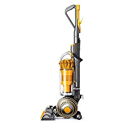
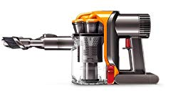

From [removing pet hair](https://www.bestofvacuum.com/best-vacuum-for-pet-hair/) on the go to [maintaining the appearance of shag carpets](https://www.bestofvacuum.com/best-vacuum-for-shag-carpet/) with ease, the **best Dyson vacuum** can handle just about any vacuuming task you throw to it. Their exceptional suction power and the technology that protects the main filter from clogging make them ideal for different scenarios.

At the very least, Dyson vacuum cleaners come in different forms. From cordless and corded solutions to canister and upright models, the brand spoils you with limitless options to choose from.

What’s more?

The [company tests each model](https://medium.com/dyson/inside-the-testing-facility-where-dyson-breaking-its-own-devices-23a5a3881ead) for function and durability before release. This gives you an assurance that the vac you buy will give you the value you’re looking for by serving you for years to come.

So the question is:

Which Dyson model will you choose? Are you more comfortable with the handheld version? Or do you prefer [a corded stick model](https://www.bestofvacuum.com/best-corded-stick-vacuum/) from the same brand?

### Best Dyson Vacuum Cleaners

| Picture | Name | Type | Features |
|---|---|---|---|
|  | Dyson Cyclone V10 Absolute Lightweight Vacuum Cleaner | Cordless Stick | Up to 60 minutes' run time when using a non-motorized tool. Best suction in any cordless vacuum |
|  | Dyson V11 Torque Drive Cordless Vacuum Cleaner, Blue | Cordless Stick | Twice the suction of any cord-free vacuum. |
|  | Dyson Ball Animal 2 Total Clean Upright Vacuum Cleaner, Blue | Upright | Self-adjusting cleaner head seals in suction |
|  | Dyson DC34 Handheld | Hand Vac | Most power efficient handheld Vac |

### Which Dyson vacuum is the best?

In this guide, we’ll walk you through top rated Dyson vacuum cleaners in the brand’s product line. In particular, we’ll highlight the features, pros, and cons of each model to help you choose wisely.

## 1\. Dyson Cyclone V10 Absolute

Are you’re in the market for a vac that combines durability, aesthetic, and function in their right balance? Cyclone V10 Absolute is for you. It weighs just 5.9 lbs, making it one of the most lightweight options in Dyson’s stick vacuum series. Absolute’s three power modes boost lightweight and heavy-duty tasks. And the built-in twisters can easily capture debris of different sizes from all surfaces. [**Click here to see latest price on Amazon.**](https://www.amazon.com/gp/product/B0798FVV6V/ref=as_li_tl?ie=UTF8&camp=1789&creative=9325&creativeASIN=B0798FVV6V&linkCode=am2&tag=bestofvacuum2-20&linkId=3f631eb1d375fbd84ab1749c9bd2606e)

### **Features**

-   Dyson V10 Absolute has three power suctions: low, medium, and max. These give you the flexibility you need for lightweight as well as heavy-duty vacuuming.
-   This unit uses a rechargeable battery to power the built-in digital motor. We recommend charging the battery for at least four hours before the first time use. How long the battery lasts depends on the suction mode you choose, with the low mode lasting up to 60 minutes.
-   The V10 Absolute features a big dust cup, making it a good option for vacuuming a larger area. In fact, it’s about 40% bigger compared to what you get with the  Dyson V8 model.
-   Although the fourteen twisters are tiny, they still exert the pressure needed to capture different kinds of debris from any surface.
-   Dyson V10’s soft roller head easily captures dust and debris, especially from delicate floors. And the brush head can help a great deal when deep cleaning your carpet.

### **Pros**

-   The V10 is one of the most lightweight vacuums in the Dyson models.
-   It has three unique suction modes.
-   You can easily convert it to a handheld vac.

### **Cons**

-   It doesn’t have the best battery life when working on maximum suction mode.
-   The V10 is quite expensive.

## **2\. Dyson V11 Torque Drive** 

The V11 Torque Drive is the best Dyson vacuum cleaner for someone who’s in the market for a vac with an integrated smart technology. It’s a lightweight device, just like the V10 Absolute. And it’s quieter during operation than many vacuum cleaners in the market. [**Click here to see latest price on Amazon.**](https://www.amazon.com/gp/product/B07NX8XBMP/ref=as_li_tl?ie=UTF8&camp=1789&creative=9325&creativeASIN=B07NX8XBMP&linkCode=am2&tag=bestofvacuum2-20&linkId=f2dfec40a0db932606dc9c23733c0245) 

From the price tag, it takes just a second to notice this is a high-end model. But is the unit really worth the price? Reviews suggest that this unit cuts it quite well. And with a decent rating on sites like Amazon, it’s easy to see why Dyson V11 Torque Drive is worth the asking price.

### **Features**

-   This vacuum cleaner features 185 air watts, making it more powerful than the earlier version. In fact, it’s 4 times more powerful than the dyson V8 and 2 times more powerful than the dyson V10.
-   The LED light indicator at the back of the vacuum is a very important feature. It acts as a real time communication medium between you and the V11. At the very least, it lets you know the current power mode, blockages, the time to clean the filter, and the remaining runtime.
-   The Dynamic Load Sensor is one of  Dyson V11 Torque Drive’s strongest selling points. The smart technology automatically adjusts the speed of the motor depending on the surface you’re vacuuming. This integration takes away the need to adjust power setting manually, hence convenience.
-   Another impressive feature is the battery with a decent life. You get a runtime of close to 60 minutes, so you can do a lot of vacuuming with just a single charge.

### **Pros**

-   You get 185 air watts of suction power in boost mode
-   The LED light indicator is a good communication medium.
-   It has a decent battery life.
-   The Dyson V11 Torque Drive cordless vacuum has three unique cleaning modes: auto, boost, and echo.

### **Cons**

-   It’s an expensive vacuum cleaner.
-   Its dustbin capacity is somewhat small.

## **3\. Dyson Ball Animal 2 Upright Vacuum Cleaner** 

The Ball Animal 2 is a good option for someone who’s looking for the best dyson  vacuum for pet hair.  It weighs 17.5 lbs, which tells you that it isn’t a lightweight cleaner in the Dyson vacuum models. But regardless of its weight, which is close to 3 times that of V10 and V11, Ball Animal 2 has hundreds of positive reviews and a good rating. [**Click here to see latest price on Amazon.**](https://www.amazon.com/gp/product/B079KFQ351/ref=as_li_tl?ie=UTF8&camp=1789&creative=9325&creativeASIN=B079KFQ351&linkCode=am2&tag=bestofvacuum2-20&linkId=c5edcb90b5f90735b85179b5914e3251)

You will love this vacuum because it has a washable filter, and a decent suction power. Also, it’s a good option because it comes with many additional accessories.

The power cord is 35 feet long. This gives you a decent reach and makes it possible for you to clean different parts of your home.

### **Features**

-   Ball Animal 2 is the best all around Dyson vacuum in this guide. From [vacuuming your stairs](https://www.bestofvacuum.com/best-vacuum-for-stairs/) and cleaning your mattress to getting rid of pet hair from different surfaces, this cleaner can perform quite well for the price. In fact, it’s effective for vinyl plank, tile, and even wooden floors.
-   It features a flexible floor head base, which automatically adjusts itself depending on floor height. This self-adjustment helps to enhance airflow during vacuuming. And it ensures there’s sufficient power suction to get the job at hand done.

### **Pros**

-   The filters are washable. This goes a long way to reduce maintenance cost.
-   It comes with a 5-year customer warranty, which is better than many options out there.
-   It doubles as the best [vacuum cleaner for long and thick hair](https://www.bestofvacuum.com/best-vacuum-for-long-hair/).

### **Cons**

-   This vac doesn’t have a heavy-duty feel .
-   It makes a lot of noise when in use.

## 4\. Dyson Ball Multi Floor 2 Upright Vacuum Cleaner

You’ve probably read positive reviews about Dyson Ball Multi Floor 2. And you’re wondering whether it lives up to the hype. Or, is this just another random vacuum cleaner that will eventually disappoint you? [**Click here to see latest price on Amazon.**](https://www.amazon.com/gp/product/B01NAGRRRU/ref=as_li_tl?ie=UTF8&camp=1789&creative=9325&creativeASIN=B01NAGRRRU&linkCode=am2&tag=bestofvacuum2-20&linkId=64a6934b78fb79fb25e661ee6213c9a0) 

Here’s the deal:

In an age where ecommerce platforms have gone social, people talk. And if we’re being honest, over 60% of verified buyers on Amazon alone left positive reviews for this vac. If anything, 60% is a huge number. And numbers don’t lie, or do they?

### **Features**

-   The Ball Multi Floor 2 isn’t lightweight, but it isn’t heavy either. At 16.5 lbs, it should be easy to move around, even when working on tough projects like stairs.
-   This is an electric powered unit with a 31 feet cord. Although the cord is 4 feet less the length of Ball Animal 2, the unit can span up to 40 feet without a struggle.

-   This vacuum has a HEPA filtration system that does two things. It pulls particles and debris from different floors. And it helps with air purification.
-   The built-in floor head can automatically adjust itself depending on floor heights. This is important because it ensures the unit provides appropriate suction to get the vacuuming job done right.

### **Pros**

-   The extension hose is a good addition that helps to reach difficult to reach areas.
-   This vacuum comes with additional accessories.
-   It’s reasonably priced, hence a good option for you if you’re on a budget.

### **Cons**

-   This vac looks and feels bulky.
-   The extension hose is hard to detach and clean.
-   It’s not a good vacuum to use on shag carpet.

## **5\. Dyson Ball Multi Floor Canister Vacuum**

If you are looking for a Dyson vacuum cleaner that can remove dust and debris from just about any floor type, choose Ball Multi Floor Canister Vacuum. So whether you want to [vacuum vinyl floors](https://www.bestofvacuum.com/best-vacuum-for-vinyl-floors/) or you want to [dust laminate floors](https://www.bestofvacuum.com/best-vacuum-for-laminate-floors/), this is the right vac for you. It’s a reasonably priced model, hence a good option for you if you’re on a budget. And it has dozens of positive reviews on Amazon, which goes a long way to justify the price. [**Click here to see latest price on Amazon.**](https://www.amazon.com/gp/product/B0076ZGC04/ref=as_li_tl?ie=UTF8&camp=1789&creative=9325&creativeASIN=B0076ZGC04&linkCode=am2&tag=bestofvacuum2-20&linkId=5359bb39fffe892f2aea02c1bbc71d8d) 

Dyson Ball Multi Floor is a two-part device joined by an extension hose, which means it takes after similar canister vacuums in terms of design. One part consists of an articulating handle, a cleaning head, and an extension wand. The other part includes a ball base, a bin canister, and a motor.

### **Features**

-   This vacuum cleaner generates up to 250 air watts (AW) of suction power. That’s quite a lot of energy for an [affordable vacuum cleaner](https://www.bestofvacuum.com/best-vacuum-under-200/). And it’s exactly what you need for lightweight as well as heavy-duty tasks.
-   It features a self-adjusting cleaning head, which automatically aligns itself depending on floor heights. This ensures the utilization of maximum suction power for the job at hand.
-   The integrated Radial Root Cyclone technology is a plus. Not only does filter out debris of different sizes, it also enhances flow and air preservation while maximizing the vacuum’s suction power.

### **Pros**

-   It can remove dust and debris from all floor types
-   Dyson ball canister vacuum comes with additional accessories, including a dusting brush, a crevice tool, a stair tool, and a wand rotator tool.
-   It has a good suction power than many vacuums in the market.

### **Cons**

-   At 17 lbs, this is a heavy and bulky vacuum cleaner.
-   It might be hard to maneuver if you aren’t used to canister vacuum cleaners.

## **6\. Dyson V7 Motorhead Cordless Stick Vacuum** 

The Dyson V7 Motorhead Cordless Stick Vacuum is a good option for you if you don’t mind spending more than $200 on a vacuum. And it’s the best Dyson vacuum for pet hair. The V7 has received mixed reactions from different buyers. But stats clearly indicate that it’s a unit worth buying. In fact, close to 75% of buyers on Amazon alone left over 1,000 positive reviews for this unit. If this number is anything to go by, the V7 Motorhead does live up to its promise. [**Click here to see latest price on Amazon.**](https://www.amazon.com/gp/offer-listing/B0798B31TC/ref=as_li_tl?ie=UTF8&camp=1789&creative=9325&creativeASIN=B0798B31TC&linkCode=am2&tag=bestofvacuum2-20&linkId=7f9d565acfb42d22dfdfe984ef3f0506) 

### **Features**

-   This vacuum features a motor that powers the nylon bristles to drive deep into carpets and remove dust and debris with ease.
-   Since this unit is cord-free, it gives you the flexibility and convenient you need to move around with ease. This allows you to get the vacuuming job completed in a very short time.
-   The Dyson V7 Motorhead supports suction adjustment, which means you can modify the suction power depending on the kind of vacuuming you’d like to do. For example, you can use the regular mode to clean hard floors. And you can switch to max mode to vacuum your carpets.
-   It has a filtration system that easily captures all debris. And it comes with a no-touch dustbin that has a good capacity.
-   Dyson V7 Motorhead also comes with a docking station. Once you mount this on your wall, you use to hold the vacuum when it’s not in use. It also doubles as a charging station for the unit.

### **Pros**

-   It has a decent battery life. You can vacuum for 30 minutes on a single charge.
-   This vacuum comes with many additional accessories.
-   You get a two-year warranty, effective from the day of purchase.

### **Cons**

-   It’s more expensive than many options out there.

## 7\. Dyson DC34 Handheld

Are you looking for the best [vacuum cleaner under 200](https://www.bestofvacuum.com/best-vacuum-under-200/) from a reliable brand? Maybe you are cautions about buying devices and you just want to get your purchase the right time? Or perhaps you need [a good option for car detailing](https://www.bestofvacuum.com/best-vacuum-for-car-detailing/) but you’re wondering which option to choose? [**Click here to see latest price on Amazon**](https://www.amazon.com/gp/offer-listing/B006WS39NE/ref=as_li_tl?ie=UTF8&camp=1789&creative=9325&creativeASIN=B006WS39NE&linkCode=am2&tag=bestofvacuum2-20&linkId=c4297f02d12dde9bf4d02b2cc2f9e6ce).

We definitely recommend Dyson DC34 Handheld vac, and for a good reason. First, over 70% of verified buyers on Amazon alone left positive reviews for this product. This is a good figure, which means the DC34 Handheld vac has a good rating. And this justifies the price tag.

### **Features**

-   The digital motor is the most powerful feature of this machine. Designed to spin three times faster than all the alternatives in the market, the motor gives the DC34 a high suction power and enhanced brush movement. This guarantees the best cleaning outcome.
-   The DC34 has a dual power mode, each with a varying battery lifespan. The battery gives you a runtime of about 15 minutes in high constant suction mode and 6 minutes in max mode.
-   It comes with a LED light indicator that lets you keep an eye on the battery. You’ll know when the battery is about to die, when it’s charging, and when it’s fully charged. This goes a long way to enhance the overall quality of the battery.

### **Pros**

-   The Dyson DC34 Handheld vac is easy to empty
-   It’s lightweight and easy to carry around.
-   The dustbin is clear, so it’s easy to know when it needs emptying.

### **Cons**

-   This vacuum cleaner is somewhat bulky.
-   It doesn’t come with a storage unit for the attachments.

## **8\. Dyson Ball Animal 2 Total Clean Upright Vacuum**

Hundreds of Dyson vacuum reviews suggest that this unit lives up to the hype. In fact, if you look at the reviews on Dyson’s website and Amazon, you’ll notice that verified buyers give this unit a good rating. It may not be a good option for you if you are on a budget. But if cost is not an issue, this allergy and asthma friendly vac will make a good fit for you. [**Click here to see latest price on Amazon.**](https://www.amazon.com/gp/offer-listing/B079KFQ351/ref=as_li_tl?ie=UTF8&camp=1789&creative=9325&creativeASIN=B079KFQ351&linkCode=am2&tag=bestofvacuum2-20&linkId=b7d94f84ac5567fd3e7727fe61d47e74) 

**Features**

-   This is an electric powered vac, so it has to remain plugged in the entire time. The cord is 35 feet, which is standard for most Dyson vacuum models.
-   The Dyson suction power of this unit is better than the competition. We know this by comparing performance and reviews. In fact, this vacuum can easily clean up spilled cereal, kitty litter, and flour in a pass or two.
-   The cleaner head is self-adjustable. This helps to seal in suction power so you can do your vacuuming task with ease and convenience.

**Pros**

-   It’s a good vacuum cleaner for pet hair.
-   It cleans hard surfaces with ease.
-   The unit is easy to use.
-   Cleaning large carpeted areas with this vacuum should be easy.

**Cons**

-   This vacuum cleaner is very expensive.

## **Frequently Asked Questions (FAQs)**

### **Are Dyson Vacuums Worth It?**

Considering their superior performance, hundreds of positive reviews on Amazon, and additional accessories and attachments included in every model, Dyson vacuums are, by all means, worth it.

Moreover, many versions we’ve looked at in this review can handle multiple tasks, which is another reason to consider Dyson vacuums. Also, they come in different prices. And this means there is a Dyson vacuum for everyone.

### **What’s the Difference between a Multi Floor and an Animal Vacuum?**

The animal vacuum’s power cord is 5 feet longer than that of multi floor. And it has 10 times more suction power than the multi floor vacuum.  The animal vacuum comes with a mini-turbo head attachment, a feature that’s not present in a multi floor vacuum. The other difference is with the color: the multi floor vacuum is yellow while the animal vacuum is purple.

### **How Do I Empty My Dyson Vacuum?**

First, press the bin release button to remove the canister from the cleaner. Then, hold the canister over a bin, open the base, and release the dirt. That’s it. You’re done.

### **How to Clean Dyson Vacuum**

-   **Dust Chamber:** Remove it from the vacuum cleaner and use a damp cloth to wipe the inner section as well as the outer section.
-   **Floor Head & Brush Bar:** Remove both from the vacuum and use a clean, damp piece of cloth to clean them.

### **Best Dyson Vacuum Buyer’s Guide**

From the Dyson models list above, we can conclude that the brand has many vacuum cleaners in its product line. If you look at the comparison chart, however, you will notice that every model is different from the other. And this necessitates a buyer’s guide. So, here’s what to look for before buying a vac cleaner from this brand.

**1\. Weight**

Dyson vacuum cleaners differ in terms of weight. If you’re up for a lightweight unit, the [Dyson V10 Absolute](https://www.amazon.com/gp/product/B0798FVV6V/ref=as_li_tl?ie=UTF8&camp=1789&creative=9325&creativeASIN=B0798FVV6V&linkCode=am2&tag=bestofvacuum2-20&linkId=1557a459458c63c76f367abe4a78be0b),  [Dyson V11 Torque Drive](https://www.amazon.com/gp/product/B07NX8XBMP/ref=as_li_tl?ie=UTF8&camp=1789&creative=9325&creativeASIN=B07NX8XBMP&linkCode=am2&tag=bestofvacuum2-20&linkId=3181b02ee8d3d3a0073e1c942bbc92c9) and  [Dyson V7 Motorhead stick vacuum](https://www.amazon.com/gp/product/B0798B31TC/ref=as_li_tl?ie=UTF8&camp=1789&creative=9325&creativeASIN=B0798B31TC&linkCode=am2&tag=bestofvacuum2-20&linkId=ae543a51fdd6c838db00c0aff216dca9) are the best options to choose. Canister vacuums are somewhat bulky, so you need to keep this in mind when shopping for a model from the brand’s product lineup.

**2\. Body Style**

Dyson vacuums come in three different body styles: canister, stick, and upright.

Canister vacuum take a bit from stick and upright vacuum. It’s lightweight and it has a larger dust chamber. It’s also a suitable option for heavy-duty vacuuming.

A stick vac is easy to move around and you can even convert it into a Dyson handheld unit. However, they have a small dust chamber, which means you’ll have to empty it regularly for better performance.

An upright vacuum is a good option for removing almost any debris from different surface. Its large dust chamber makes it a good option to use in an environment where there’s a lot of dust and particles to remove.

**3\. Noise**

Noise level is an important factor to consider when choosing a vacuum from this brand. Of course, some models are quiet. And some are quite noisy when in operation. To be precise, cordless models tend to be quieter when in use but the upright vacs tend to make the most noise. Canister models, on the other hand, are somewhere in between.

**4\. Extra Features and Functions**

If you need a more feature-rich dyson vac, make sure to choose one that has the features you’re looking for. Some features include:

-   Additional accessories like dustbin brush and stair tool
-   LED display for real time communication and interaction
-   A wall mountable docking station

**5\. Capacity of the Dust Chamber**

Dyson vacuum cleaners have varying dust chamber capacity. The standard range is between 0.5 and 2 liters. More often than not, handheld models have the smallest capacity while the upright models have the largest.

#### **Conclusion**

We hope that this guide has helped you to find the best Dyson vacuum cleaner. And we hope that our buyer’s guide has shed light into what’s important to look for when picking a vacuum from this brand. In fact, with the help of this guide, picking what’s best for you and your budget shouldn’t be difficult.