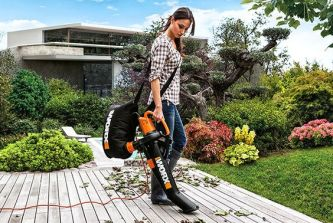
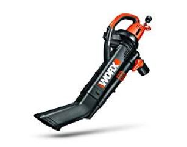
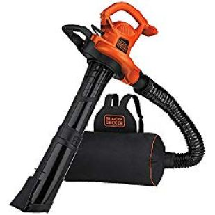
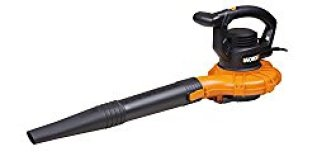
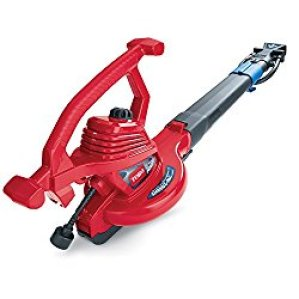
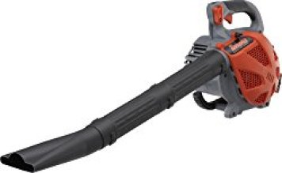
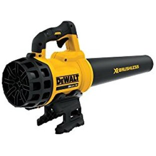
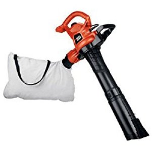
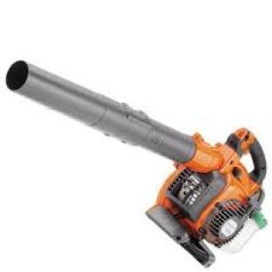

A leaf vacuum mulcher is a device that vacuums the leaves that have fallen. It uses internal blades for slicing leaves into smaller pieces and bits. The mulch that is created can be thrown away or used for fertilizing or composting the yard.

This saves money to buy costly mulch from local gardening stores. You can easily use a leaf vacuum and convert trash leaves into amazing compost material as fertilizer for the yard. You can save a lot of stress and hassles with a leaf vacuum and mulcher. Know about some of the **best leaf vacuum mulchers**.

### **Best Leaves Vacuum Mulchers**

| Picture | Name | Power Source | Maximum Speed |
|---|---|---|---|
|  | WORX WG512 Trivac 2.0 Electric 12-amp 3-in-1 Vacuum Blower/Mulcher/Vac | Corded-Electric | 210 miles_per_hour |
|  | WORX WG518 Electric Blower/Mulcher/Vac, 12 Amp | Corded-Electric | 250 miles_per_hour |
|  | Sun Joe IONBV-XR 40V Variable-Speed Cordless Blower/Vacuum/Mulcher | Battery Powered | 200 miles_per_hour |

## 8 Best Leaf Vacuum Mulcher

Let’s dive into leaf blower vacuum mulcher reviews regarded as the best in the market. These are the best leaf vacuum mulchers that you can buy from the Amazon online store.

## 1\. Worx WG509 TRIVAC Electric Vacuum/Mulcher/Blower

Worx WG509 TRIVAC 12 Amp is one of Worx’s top-selling leaf vacuum mulchers that do better in mulching and blowing. With a dimension of 20 by 15 by 9 inches, Worx WG509 TRIVAC 12 Amp comes with exceptional features than most of its competitors in the market. [**Click here to see latest price on Amazon.**](https://www.amazon.com/gp/product/B07PGX4SXW/ref=as_li_tl?ie=UTF8&camp=1789&creative=9325&creativeASIN=B07PGX4SXW&linkCode=am2&tag=bestofvacuum2-20&linkId=abbe19cf101678e1998b9caa56f22a86)

Worx has a very powerful motor. With 12 Amps, you are sure that this best leaf vacuum mulcher will not let you down along the way, no matter the amount of work.

The machine allows you to operate it using one hand. This gives you the liberty to use the other hand in doing other necessary mulching chores.

Thanks to its lightweight, you will not feel any unnecessary discomfort.

Another reason why I personally love Worx WG509 TRIVAC 12 Amp is the mulcher’s metal impeller that allows for a ridiculously 18:1 mulching ratio. This means that the vacuum blower comes with the ability to carry over 100 gallons of dry leaves, which in turn fit into a large collector bag that comes with this home appliance.

When Worx WG509 TRIVAC 12 Amp is in a vacuum mode, it has the ability to provide up to 350 cfm of volume. This is possible even if it is reaching some hard-to-reach areas such as under desks.

The blower mode provides an even powerful experience. You can adjust Worx WG509 TRIVAC 12 Amp from 75 mph to as high as 210 mph without any difficulty.

### Pros

-   It is a 3-in-1 home appliance. With Worx WG509 TRIVAC 12 Amp, you have a vacuum cleaner, mulcher, and blower.
-   You only need one hand to operate the machine.
-   It is powerful that you do not have to stop along the way to change tubes.
-   It uses electricity: no bad odor that comes in handy with gasoline-powered blowers.
-   The extra large collection bag will save you time that you would take to empty a small bag amid your work.

### Cons

-   Does not do better on wet leaves. Some of the leaves clog inside the machine’s propeller.
-   If not properly dried up before you storage, it will rust with time.

## 2\. BLACK+DECKER BEBL7000 BackPack Leaf Blower Vacuum & Mulcher

BLACK + DECKER BEBL7000 backpack vacuum performs as a mulcher, vacuum and a blower at the same time. [**Click here to see latest price on Amazon.**](https://www.amazon.com/gp/product/B00FREQC10/ref=as_li_tl?ie=UTF8&camp=1789&creative=9325&creativeASIN=B00FREQC10&linkCode=am2&tag=bestofvacuum2-20&linkId=ca3288f1913ffae3d4bd384624e6cc55) 

It is extremely easy to wear this machine at the back. It is designed with a bag capacity that is 2 times larger than most blowers and mulchers in the market. This makes it stand out.

For quick litter emptying, BLACK + DECKER BEBL7000 Backpack mulcher is fitted with a zipper-free collection bag.

Although BLACK + DECKER BEBL7000 is just 11.1 lbs, measuring 15 by 21 by 11 inches, it goes from 250 mph to 400 mph cfm. Look around, chances are that there are very few vacuum blowers with this ability.

BLACK + DECKER BEBL7000 is made in such a way that makes it easy to convert it from a leaf vacuum to a leaf blower then finally to a leaf mulcher.

When BLACK + DECKER were designing this vacuum blower, they ensured they include a flexi-tube. This explains why it is easy to maneuver BLACK + DECKER BEBL7000 through the yard, collecting leave and debris.

This vacuum blower comes with the POWERBOOST. This feature is not found in any other vacuum mulcher. As the name suggests, the POWERBOOST enables you to get extra power whenever you need it to complete a certain heavy task. To get the power, you only need to press the POWERBOOST button.

### Pros

-   The POWERBOOST is its biggest strength.
-   BLACK + DECKER BEBL7000 has a zipper-free collection bag. Do not worry, it doesn’t litter your yard but enables you to collect dry leaves fast.
-   Easy to wear and carry on the back.
-   Offers 250 mph and has an air volume of 400 cfm.

### Cons

-   Some of the wet leaves that clog inside the machine generate a bad odor.
-   It is a bit hard to disconnect some parts such as the hose.

## **3\. WORX WG518 Electric** 

This electric leaf vacuum is powered by a 12 amp motor and can make a good heap of leaf mulch. It is a **commercial leaf vacuum**, mulcher and electric leaf blower rolled into one, and allows switching between functions. Those with 250 mph have the highest speed, and ensure a proper job. [**Click here to see latest price on Amazon.**](https://www.amazon.com/gp/offer-listing/B00LQZP2D8/ref=as_li_tl?ie=UTF8&camp=1789&creative=9325&creativeASIN=B00LQZP2D8&linkCode=am2&tag=bestofvacuum2-20&linkId=a3587a410f744526b281a206e853c56e)

This is a powerful vacuum and can easily suck up various types of debris, pine needles, twigs, leaves etc that you can easily find on the lawn. It has a 16:1 reduction ratio and consists of a metal impeller that can avoid clogging while mulching.

The mulcher operates on electric power and comes with an attached cord. Its mulch collection bag can hold one bushel. The device is 10.8 pounds in weight. Its dual speed adjustment is a standout feature, and is practical for owner with diverse yard types, having delicate flowers, grasses etc.

### ***Pros***

-   Its strong metal impeller makes operations easier when you mulch leaves.
-   WORX WG518  has a robust 12 amp motor  which allows the highest speed of 250 mph.
-   Its dual speed adjustment feature makes it ideal for yards having delicate flowers.
-   You can switch easily between different functions.

### ***Cons***

-   The mulcher has to be always plugged into an AC outlet, which can make things tough if you have a large yard.
-   The device is slightly heavier at 10.8 pounds.

## **4\. Toro 51621 UltraPlus Leaf Blower Vacuum** 

This leaf vacuum  is powered by a 12 amp motor and can offer a 250 mph speed. It can work as a mucher, **walk behind leaf vacuum mulcher** and a blower as well, and lets you switch between 3 options. It has metal impellers, more durable than plastic counterparts.[**Click here to see latest price on Amazon.**](https://www.amazon.com/gp/product/B00TNCJU3E/ref=as_li_tl?ie=UTF8&camp=1789&creative=9325&creativeASIN=B00TNCJU3E&linkCode=am2&tag=bestofvacuum2-20&linkId=e3d244549e77cffa239875ec28e9c7ac)

Toro 51621 has Shredz-All Shred Ring, an attachment that collaborates with the metal impeller to reduce the leaf volume that is admitted inside. A zipper at the bottom of its collection bag allows easy mulch removal instead of needing removal of the whole bag each time it is filled. The device has tube attachments for difficult to access corners and wet leaves.

It is 8.9 pounds in weight, which means no shoulder or back pain from continuous usage. The mulcher needs electric supply for operations. An extension cord makes it better for people with larger yards.

### ***Pros***

-   Its collection bag is easy to use.
-   Toro 5162’s tube attachments help in specialized purposes.
-   Its metal impeller has Shredz-All attachment.
-   It can work as mulcher, vacuum and blower.
-   Its strong 12 amp motor can attain peak speed of 250 mph.
-   Its speed control allows user for varied yard styles and plant beds.

### ***Cons***

It needs continuous electric supply.

## **5.Tanaka Commercial Grade Gas Powered Handheld Blower** 

Tanaka commercial grade 25cc 1.3 HP – best leaf vacuum

It is a powerful gas powered mulcher having an awesome 393 cfm volume. It has some amazing fatures, such as a soft elastomer handle and cruise control. **Click here to see latest price on Amazon.** 

The electronic feature cruise control lets you switch the device on with a button push, and make the blower pump air out consistently at a pre-chosen speed, which allows direct and very easy operations.

The elastomer handle is rubbery and soft, and reduces the fatigue or strain associated with using the device.

There is a high-volume fan nozzle as well, which raises the air volume that can be delivered. This helps increase the overall effectuality.

It also comes with a shredder blade as an optional feature. It has the power to blow debris around directionally out of or around gardens or lawns, making operations more convenient.

### ***Pros***

-   The device is effective, reliable and solid, and can work great on smaller as well as larger yards.
-   Its soft handle keeps the hands and fingers comfortable even when you use the mulcher continuously for a long time.
-   Its high-volume fan nozzle makes the mulcher more efficient in usage.
-   It is convenient in operations.

### ***Cons***

-   The device is heavy in size, and comes in handheld and not [backpack](https://www.bestofvacuum.com/best-backpack-vacuum/) style. This can make hands uncomfortable after some time.
-   The mulcher is also slightly on the expensive side.

## **6\. DEWALT DCBL720B Brushless Battery Powered Blower** 

The blower has a unique axial fan design, and you can maximize on air output and run time effectively with the DCBL720B.

DEWALT DCBL720B  has variable speed trigger and speed lock, which provides users with maximum blower control. It offers a peak performance of 400 cubic ft per minute air volume and 90 miles air speed per hour.

This leaf mulcher has a lightweight and ergonomic design, and weighs only 7.1 pounds. [**Click here to see latest price on Amazon.**](https://www.amazon.com/gp/product/B01C5YWSBW/ref=as_li_tl?ie=UTF8&camp=1789&creative=9325&creativeASIN=B01C5YWSBW&linkCode=am2&tag=bestofvacuum2-20&linkId=b582b850373f0add3a1ee30270db89de) 

It produces only 61 decibels, which makes it right for early morning operations.

The device boasts of a brushless motor, and can be used for longer. Its battery, however is separately sold.

### ***Pros***

-   The unit is efficient in its job, due to its top performance of 90 miles per hour speed and 400 cfm.
-   It is light in weight, and is portable enough to use. It does not cause any soreness of muscles.
-   Its brushless motor makes it efficient and durable. It has variable trigger and speed lock.
-   It makes minimal noise, and can be used without causing any disturbance to neighbors.
-   DEWALT DCBL720B  is highly reliable and powerful in operations, and can be used for fast cleaning.

### ***Cons***

It should have come with some more power to make things more efficient.

## **7\. Black & Decker BV3600 Blower Vac**  

Black & Decker BV3600 has a 12 Amp motor, which offers all the power that is needed for garden or yard maintenance.

It comes with 3 functions, mulcher, blower and vacuum. This 230 mph, heavy-duty unit boasts of a steady and robust airflow. This makes it perfect for clearing debris, pine needles, grass clippings, leaves etc from large or mid-sized yards. [**Click here to see latest price on Amazon.**](https://www.amazon.com/gp/product/B007VSQFIU/ref=as_li_tl?ie=UTF8&camp=1789&creative=9325&creativeASIN=B007VSQFIU&linkCode=am2&tag=bestofvacuum2-20&linkId=b2ee604d4b2ebd0ec8f83119da6d9ab2) 

It has dual speed settings that can let you sweep debris gently from delicate flowerbeds. You can also get rid of heavily matted leaves. Its push start engine allows dependable, fast and effortless starting ups.

With a low noise output of 69 dbA, it does not tax the ears. It weighs just 8.1 pounds, and is light in weight. You can switch easily between the vacuum and blower mode. Its blower vacuum bag can easily be emptied, saving you plenty of effort and time.

Its Anti-Clog Vortex Impeller ensures that there is no clogging during mulching. It is able to grind as many as 10 bags of leaves to a single bag of mulch, making mulching much easier.

The cord retainer built into its system keeps the extension cord in proper place. You can plug it in when you need constant power.

### ***Pros***

-   It is well balanced and can be used easily.
-   This leaf mulcher powerful in operations.
-   It is noiseless when used on low setting.
-   Black & Decker BV3600 is perfect for use in large or medium sized yards.

### ***Cons***

-   It is slightly weighty, and you might require a shoulder strap while using it.
-   On a high setting, it can be noisy while in operations.
-   While using it, its fan cover can detach abruptly.

##  **8. Husqvarna 125BVx Gas Powered Blower/Vac**

Husqvarna 125BVx 28cc is gas-powered, and weighs just 9.6 pounds even with gas tanks being present. It has a flare nozzle that boasts of greater air speed.  The device measures just 9 x 38.5 x 14 inches, and is handheld in operations. However, hand fatigue is reduced due to its ergonomic design. It is highly powerful. [**Click here to see latest price on Amazon.**](https://www.amazon.com/gp/product/B002FU5SKU/ref=as_li_tl?ie=UTF8&camp=1789&creative=9325&creativeASIN=B002FU5SKU&linkCode=am2&tag=bestofvacuum2-20&linkId=234173e2a089dec174fe29e3c406ada1) 

The device has a well-constructed and placed housing fan that allows a lot of ease. Its air stream is in direct line with its handle, which reduces the rotational force on the wrist and helps avoid soreness of joints even when you use it for a long time.

The starter, smart start system and engine of the unit have been designed in such a way that the startup needs minimal effort. The device can work like a vacuum, and the **best pull behind leaf vacuum** for that matter. It is available with a vacuum bag that allows collection of leaves through vacuum. The unit is offered with a manual, two flat and round nozzles, a harness and a vacuum kit.

### ***Pros***

-   The unit is light in weight, and easily portable.
-   It offers fine control over its speed, and starts easily.
-   It is available with two types of nozzles than can handle various kinds of tasks.
-   Husqvarna 125BVx 28cc 2-Cycle boasts of robust vacuum suction, and has amazing blower functionality.

### ***Cons***

-   It needs compatible fuel.
-   At times, the device leaks some oil. The issue is common for mulchers powered by gas.

### Types of Leaf Mulchers

Leaf mulchers are of 3 types:

### ***1\. Electric Mulchers***

These have to be plugged in to a power source with a power cable. Electric mulchers have an edge over gas mulchers, as these are lighter, cleaner and quieter.

As these do not use gas, the machines do not leak and can be stored easily. However, electric mulchers work better on smaller yards and do not handle larger yards too well.

### ***2\. Gas Mulchers***

Older mulchers are powered by gas. You can move these around freely, and these can work without power cords. You do not have to worry about drained out internal batteries.

These can be used for larger areas better than battery powered and electric mulchers. However, these have a lot more weight than their counterparts and the devices cannot be used when the weather is too hot. These can pollute the air and are noisier due to being gas powered. Gas mulchers need some amount of maintenance.

### ***3\. Battery Powered Mulchers***

These are equipped with a portable battery source that has to be changed before use. You can use them in a wider yard than electric mulchers, although not for as long or as wide as gas-run counterparts given that the battery might be drained of power.

You can run some mulchers in battery even when they are being charged. These are noiseless, quieter, eco-friendlier and allow more mobility. However, battery powered leaf mulchers are costlier than the electric or gas mulchers.

## What to look for when shopping for the Best Leaf  Vacuum Mulcher

Some standout features in a good leaf mulcher are:

**Speed** – Buy one with speed options. Get one with a slow and fast speed setting at least. Those with a slower speed do not clog and are great for piles of leaves as well as on delicate plants and flowers.

**Blade Quality** – Inferior blades, such as the ones constructed of plastic, have to be changed often. Superior blades, such as those constructed of metals, tend to last for more time.

**Motor specification and power** – The power of mulcher is measured in Amps. Look for a mulcher with 12 – 14 amps power. Those with a lower power makes it tough to mulch leaves well.

**Reduction Ratio** – It is the ratio of the original leaf volume to the volume of mulch formed. The best ones have 16:1 – 18:1 ratios.

**Capacity** – Those with varying capacities must match up to the size of yard you have. Larger capacities are needed for larger yards, and smaller for smaller yards.

Easy mode switching capacity – Go for mulchers that, while in operations, can be switched between vacuum and built-in leaf blower.

#### **Conclusion**

If you are looking for the **best leaf vacuum mulcher** on the market, these are worthwhile to consider. These leaf vacuum and mulchers are an attractive combination of useful features, top performance and affordable price. The best one is obviously one that suits your garden or yard size, specific requirements and budget. It is important to consider all such aspects carefully before making a choice.
