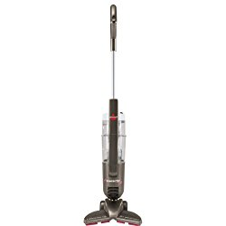

Cleaning chores that were once easy, now pose difficulties as individuals step into their senior years. Loss of muscular strength and other health concerns like bad back pose daunting challenges as they perform their everyday routine. Unless you get the best lightweight vacuum cleaner for the elderly, it will be difficult for the elderly to take part in maintaining cleanliness of their environment.

### Top Rated Lightweight Vacuums for Elderly

| Picture | Name | Weight | Type |
|---|---|---|---|
|  | Dyson Cyclone V10 Lightweight Cordless Stick Vacuum | 5.8 lbs | Stick vacuum |
|  | Oreck Commercial XL Commercial Upright Vacuum Cleaner, XL2100RHS | 8.2 lbs | Upright Vacuum |
|  | Dyson V7 Animal Cordless Stick Vacuum Cleaner, Iron | 5.3 lbs | Cordless Stick Vacuum |
|  | Shark Rocket TruePet Ultra-Light Corded Bagless Vacuum (HV322), Bordeaux | 8.6 lbs | Corded stick Vacuum |

## 9 Best Lightweight Vacuum Cleaner For Elderly

Choosing the best lightweight hoover for the elderly from the vast number of brands in the market isn’t always an easy thing. Consider this article your only way of arriving at the easy-to-push vacuum cleaners. The list of 9 best lightweight vacuum cleaners for the elderly starts right now!

**See Also:**

-   [**Water based vacuum cleaner**](https://www.bestofvacuum.com/best-water-vacuum-cleaner/)
-   **[Best stick vacuum for long hair](https://www.bestofvacuum.com/best-vacuum-for-long-hair/)**

## 1\. Dyson V7 Motorhead Stick Vacuum (Cordless)

If you do not like corded vacuum cleaners, then Dyson have something for you. The Dyson V7 Motorhead is among best lightweight cordless vacuums for the elderly. [**Click here to see latest  price on Amazon.**](https://www.amazon.com/gp/offer-listing/B0798FVV6V/ref=as_li_tl?ie=UTF8&camp=1789&creative=9325&creativeASIN=B0798FVV6V&linkCode=am2&tag=bestofvacuum2-20&linkId=5a1a30989cdea8b6d6981206f1611cba) 

### Features

-   Because Dyson V7 Motorhead is cordless, it is also hassle-free but with amazing suction power.
-   If you prefer not to use the motorized tool, which comes with the vacuum cleaner, Dyson V7 Motorhead can run for a minimum of 30 minutes.
-   Before you start to use Dyson V7 Motorhead, you need to charge it for about 3.5 hours.
-   Dyson V7 Motorhead is equipped with the hygienic-emptying technique. This ensures you do not touch the dirt when you are cleaning the house.
-   It transforms into a hand-held vac with a press of a button.
-   Lifetime washable filter

### Pros

-   Ultra-light at 5.3 lbs.
-   It is versatile.
-   Works magic on hard floors.
-   Reputable suction power.
-   Cordless, hassle-free.
-   Keeps seniors off germs thanks to the hygienic bin emptying technique.

### Cons

-   You need to ensure you clean within 30 minutes.
-   Battery runs for only 5 or so minutes when the cleaner is on maximum suction.

## 2\. Shark Rocket HV322 Ultra-Light Upright Vacuum

Shark Rocket HV322 is among the top-tier lightweight hoovers for the elderly you can trust. One of the main strengths is that Shark Rocket HV322 has the extra large litter cup that allows you to do your cleaning until the end. [**Click here to see latest price on Amazon.**](https://www.amazon.com/gp/offer-listing/B00NGVF4II/ref=as_li_tl?ie=UTF8&camp=1789&creative=9325&creativeASIN=B00NGVF4II&linkCode=am2&tag=bestofvacuum2-20&linkId=fc4aa723506f17f478c7848461e19cb9) 

### Features

-   Shark Rocket HV322 comes with advanced swivel steering, making it easy for seniors to maneuver between rugs, carpets, and furniture with ease.
-   The extremely powerful LED lights placed on the handle and the nozzle of this best lightweight upright vacuum cleaner enable you to spot debris from a distance.
-   It easily and conveniently converts into a hand-held vacuum, with the ability to clean other hard-to-reach areas such as ceilings.
-   Shark Rocket HV322 comes with a pet multi-tool.
-   XL dust cup.
-   Utilizes with a “never loses suction” cyclonic technology

### Pros

-   Lightweight (8.6 lbs).
-   Has an extra large dust cup.
-   LED lights placed on the handle and nozzle.
-   Powerful on hard floors, carpets, and ceiling.

### Cons

-   Does not stand on its own.
-   No HEPA filtration.

## 3\. Oreck Commercial XL Commercial Upright Vacuum Cleaner, XL2100RHS

Many people love the ‘rocket-like’ Oreck [Commercial upright vacuum](https://www.bestofvacuum.com/best-commercial-vacuum/) XL2100RHS because of various reasons. Personally, I’m attracted by the vacuum’s sleek design. This lightweight upright powerful vacuum is ideal for cleaning low-pile carpets, and it’s recommended as the best vacuum for arthritis sufferers. [**Click here to see latest price on Amazon.**](https://www.amazon.com/gp/offer-listing/B001NDNV18/ref=as_li_tl?ie=UTF8&camp=1789&creative=9325&creativeASIN=B001NDNV18&linkCode=am2&tag=bestofvacuum2-20&linkId=bf5429d6dd4cf8b2e3935e5207d980d6)

### Features

-   Has an automatic floor adjustment, which enables you to hoover and maneuver the vacuum between hard surfaces and low carpets with ease.
-   For convenience purposes, Oreck Commercial XL2100RHS’s on/off button is located at the handgrip.
-   The vacuum’s brush whirls at a very high speed of 6,500 RPM, making vacuuming an enjoyable task.
-   As you clean the house, Oreck Commercial XL2100RHS draws debris and other dirt closer to the dirty cup for easy litter collection.

### Pros

-   It is ideal for those living with arthritis.
-   Speedy collection of dirt.
-   Sleek design.
-   Strategic placement of the on/of button.
-   It is upright, ideal for senior citizens with back problems.
-   Easy to assemble.
-   Excellent suction power.
-   Long cord is good for commercial users.

### Cons

-   The 40-ft power cord may not be convenient to those in small rooms.
-   Switch connectors develop a problem after some time.

The wheels are small.

## 4\. Shark Rocket DuoClean HV382 Ultra-Light Bagless Vacuum

SharkNinja, the manufacturer of this ultra-light vacuum cleaner for the seniors constantly ensures that the appliance has the necessary features that make house cleaning an easy task for the elderly. [**Click here to see today’s price on Amazon.**](https://www.amazon.com/gp/offer-listing/B01K7L8U62/ref=as_li_tl?ie=UTF8&camp=1789&creative=9325&creativeASIN=B01K7L8U62&linkCode=am2&tag=bestofvacuum2-20&linkId=404616b166777fd6aa4cb75debd4a05a)

You will love Shark Rocket DuoClean HV382 because it weighs only 4.6 lbs.

### Features

-   Shark Rocket DuoClean HV382 weighs 4.6 pounds. This is ideally an impressive thing for anyone that does not have much energy to struggle with heavy vacuum cleaners.
-   The home-cleaning appliance easily converts into a hand vac, making it versatile to clean areas that are above the floor.
-   It is equipped with a pet multi-tool, which helps to remove dirt, such as pet dander and any other hair embedded on certain parts of the floor.
-   Has a brushroll garage. You will not have any difficulty when you are maintaining this best ultra light vacuum because the garage is easily accessible.
-   Shark Rocket DuoClean HV382 comes with large LED lights. These lights are strategically placed on two areas: at the hand vac and at the floor nozzle.
-   Has a complete crevice tool.
-   Comes with a 25-ft power cord.
-   Apart from the hard bristle brush, this best vacuum cleaner for senior citizens also comes with a softer brushroll that helps in the pulling of extra large particles and gives your floor a nice polish look.

### Pros

-   You can easily spot debris thanks to the LED lights.
-   Gives your floor a hard and soft clean.
-   The softer brushroll polishes the floor.
-   Easy to maintain thanks to the easy-to-access garage.
-   A complete crevice tool.
-   Lightweight (9.9 lbs).
-   Converts into a hand vac.
-   Long power cord for convenience.

### Cons

-   The LED lights require a lithium-ion battery (you’ll suffer if batter suddenly runs low).
-   Makes noise when in use.

## 5\. Hoover BH50020PC Linx Signature 18V Stick Vacuum

Are you looking for a lightweight vacuum cleaner that has a design that is out of this world? Hoover BH50020PC Cordless by Hoover is one of the few easy to push vacuum cleaners for the elderly around.

To extend its strength, this cordless best vacuum cleaner for bad back comes with interchangeable batteries. **[Click here to see latest price on Amazon](https://www.amazon.com/gp/offer-listing/B01KWZECOM/ref=as_li_tl?ie=UTF8&camp=1789&creative=9325&creativeASIN=B01KWZECOM&linkCode=am2&tag=bestofvacuum2-20&linkId=6ffac8ebebd10c30bd3e59ed3d75f242).** 

### Features

-   Hoover BH50020PC Cordless thrives on the latest WindTunnel technology. This technology enables the vacuum cleaner to create various suction stages thus removing and lifting all dirt from the floor and the carpet.
-   Bristles are designed to ensure excellent edge cleaning.
-   For seniors who are able to do so, Hoover BH50020PC Cordless comes with a reputable recline handle. This is ideal for cleaning places such as under sofas, tables, and chairs.
-   Has a multi-color cleaning element thus you shouldn’t worry about losing the original color of your carpets, rugs, and floor mats.

### Pros

-   Lightweight at 7.3 lbs.
-   Interchangeable batteries provide power extension.
-   Powerful suction.
-   Extreme recline feature.
-   The vacuum has a charger, which you use to charge the battery.
-   Fuel gauge, also known as battery indicator.

### Cons

-   Suction power heavily depends on battery voltage.
-   The dust cup is small.
-   Battery runs for only 20 minutes on average work.

## 6\. Shark IONFlex 2X DuoClean Ultra-Light Vacuum (IF251)

SharkNinja has come up with yet another best ultra light vacuum cleaner ideal for the seniors. One thing you will love about this vacuum is that it is upright. It gives any senior citizen the needed courage to use it easily. **[Click here to see latest price on Amazon](https://www.amazon.com/gp/offer-listing/B074F2YGBF/ref=as_li_tl?ie=UTF8&camp=1789&creative=9325&creativeASIN=B074F2YGBF&linkCode=am2&tag=bestofvacuum2-20&linkId=921a8da6b9612b7d7dafc23f54df5ffa).** 

### Features

-   Shark IONFlex 2X IF251 DuoClean is cordless. This means you will not have the challenge to store it.
-   The vacuum cleaner comes with a rechargeable lithium-ion battery that is removable. The latter enables you to replace it whenever it develops a problem.
-   It is developed using the latest MultFlex technology that gives many vacuum cleaners the ability to clean every corner of the house without any hassle.
-   Shark IONFlex 2X IF251 DuoClean is the best lightweight vacuum cleaner for the elderly because it easily converts into a hand vacuum. With this versatility, you can clean the ceiling, any place above the floor, and your car.
-   The vacuum comes with among other things the battery, charger, anti-allergen brush for the dust, duster crevice tool, wide upholstery tool, and the dusting brush.
-   Remember too that Shark IONFlex 2X IF251 features a DuoClean technology. This means this [Shark lightweight vacuum](https://www.bestofvacuum.com/best-rated-shark-vacuum/) has two types of brush rolls that combine to do the cleaning. The hard brush is for deep carpet cleaning and the additional soft brush is for pulling larger particles close to the vacuum for collection. Besides, the soft brush roll helps in the final polishing of the floor.

### Pros

-   It is upright thus conducive for the elderly.
-   Easily converts in a hand vac for extra cleaning in places like the ceiling, stairs and the car.
-   Comes with a crevice tool fitted with many accessories.
-   Equipped with two brush rolls.
-   It is light at 8.7 lbs.

### Cons

-   You need to fully charge the vacuum’s two lithium-ion batteries before you start working.
-   Because it is cordless, the runtime is limited compared to a corded vacuum.

## 7\. BLACK + DECKER POWERSERIES HCUA525J

This is a cordless vacuum cleaner thus no reason to worry about winding and unwinding the power cable. Besides, it is the best vacuum cleaner for arthritis suffers thanks to 4 UNIQUE features. **[Click here to see latest price on Amazon.](https://www.amazon.com/gp/offer-listing/B075VTL22Q/ref=as_li_tl?ie=UTF8&camp=1789&creative=9325&creativeASIN=B075VTL22Q&linkCode=am2&tag=bestofvacuum2-20&linkId=c0bad8b73b28925cceb8b0cd2ed5f23c)** 

### Features

-   BLACK + DECKER POWERSERIES HCUA525J comes with a removable canister.
-   This is among the few easy to push vacuum cleaners is versatile. You can use it to clean the floor, rugs, carpets, various upholsteries, and the ceiling thanks to its ability to turn into a hand-held vac.
-   BLACK + DECKER POWERSERIES HCUA525J comes with a huge dust compactor, which creates enough space for the dust, pet dander, and any other debris until you finish your cleaning.
-   Comes with 4 unique features:

1.  Battesense- to show the remaining battery life.
2.  Smartech- for easy cleaning.
3.  Autosense- adjusts the suction power according to the surface.
4.  Filtersense- warns you when it is time to change the filter.

-   It is equipped with a complete crevice tool.
-   Has a touchpad control panel for easy setup.

### Pros

-   The four unique features make the vacuum cleaner a great cleaning tool.
-   It will help you plan how to do your cleaning thanks to its battersense feature.
-   The touchpad is easy to control.
-   The vacuum has a large dust cup thus you will only empty it at the end.
-   Runtime goes up to 60 minutes.
-   Fitted with a 4-ft extension hose.
-   The filter is washable and then replaced.
-   Weighs only 8 lbs.
-   Comes with LED lights for easy dirt identification.

### Cons

-   Takes long to charge.

## 8\. Shark Navigator Cordless SV1106

Nobody doesn’t love nice colors. Shark Navigator Cordless SV1106 comes in a sparkling white color to decorate your house. This cordless upright best lightweight vacuum cleaner for the elderly gives you more than the color. [**Click here to see latest price on Amazon.**](https://www.amazon.com/gp/offer-listing/B00C351GBC/ref=as_li_tl?ie=UTF8&camp=1789&creative=9325&creativeASIN=B00C351GBC&linkCode=am2&tag=bestofvacuum2-20&linkId=d02ee069c72e94f72c0100252d3f47c1) 

### Features

-   Shark Navigator Cordless SV1106 features an extended runtime.
-   It is easy to move around with the vacuum cleaner.
-   Lightweight at 10.5 lbs.
-   Powerful suctioning.
-   XL dust cup.
-   Completely swivel steering.

### Pros

-   The vacuum is light in weight.
-   Easily maneuverable.
-   Comes with an extra large dust cup, which allows for extended cleaning.
-   Long runtime.

### Cons

-   Difficulty gliding across the carpet.

## 9\. Bissell PowerEdge Bagless Vacuum 81L2A

This is an upright bagless lightweight vacuum cleaner ideal for elderly. Check online and you will notice that it is one of the best-selling light vacuum cleaners for the elderly. Again, you will notice something: it is very affordable. [**Click here to see latest price on Amazon.**](https://www.amazon.com/gp/offer-listing/B00450U7V8/ref=as_li_tl?ie=UTF8&camp=1789&creative=9325&creativeASIN=B00450U7V8&linkCode=am2&tag=bestofvacuum2-20&linkId=931d0a9c071ee107f2c561fd6b90d6f7) 

### Features

-   Designed with a V-shape, which allows for easy capture of debris along the edges of the house.
-   Comes with a 20-ft power cord.
-   Ideal for low-pile carpets thanks to its versatility.
-   Height adjustment ability.
-   Fitted with an easy-to-empty dust cup.
-   Has a power rating of 6 amps.

**You might be interested in [vacuum for tight spaces](https://www.bestofvacuum.com/best-vacuum-for-small-apartment/)**

### Pros

-   It is extremely affordable.
-   Easy to use.
-   The V-shape together with low-profile versatility allows cleaning of the edges.
-   Longer power cord to reach a larger space.
-   Height auto adjuster does well with the seniors.
-   The item is light at 7.5 lbs.

### Cons

-   The foam filter may develop a problem.
-   Small dust cup.

## Things To Consider When Buying A Vacuum Cleaner For Seniors

There are quite a number of things you should consider when you are purchasing a vacuum for a senior citizen. Apart from the usual things, you would look for if you were to buy for the whole family or for commercial use, the elderly need special attention, or let’s say, they need to use exceptional vacuum cleaners.

Here are 8 points to consider when you are on the verge of buying the best lightweight vacuum cleaner for the elderly:

### 1\. Type

How many types of vacuum cleaners do you know? There could be as many as over 20 vacuums. I will mention 9 vacuums that are common namely:

-   Upright vacuums.
-   [Backpack vacuums.](https://www.bestofvacuum.com/best-backpack-vacuum/)
-   Self-propel vacuums.
-   [Pet hair vacuums](https://www.bestofvacuum.com/best-vacuum-for-pet-hair/).
-   Handheld vacuums.
-   Robot vacuums.
-   Sweeper or stick vacuum cleaners.
-   Deep cleaners.
-   Canister vacuum cleaners.

You will realize that each of the vacuum cleaners mentioned above is best in cleaning a specific place or thing in the house. Some of the best types of vacuum cleaners suited for the elderly include handheld vacuum, upright vacuum, because of the seniors’ back condition, and a stick vacuum.

Robotic vacuums are also becoming very common as the best vacuums for arthritis suffers. As the name suggests a robot vacuum works without any supervision. However, because of the sophistication involved in the setting it up, it might not suit all seniors.

### 2\. Power

Power is another point to consider. Conventionally, you need to look for a vacuum cleaner that does not consume a lot of electricity. However, a vacuum cleaner with a small motor will not perform optimally. If the vacuum is cordless thus rechargeable, you need to look for one that has a runtime of at least 45 minutes.

Suction power is another point. A vacuum cleaner that does not or has less suction power will not help seniors or any other person for that matter who is looking into cleaning their houses. When buying the best vacuum cleaner for bad back elders need to have a powerful suction ability.

### 3\. On/Off Switch Location

The best light vacuum cleaner ideal for the elderly should have the on/off button should be placed where the senior citizen will get access it with ease. In most cases, the best lightweight hoovers for the elderly come with the on/off switch at the handle like [Oreck Commercial XL2100RHS](https://www.amazon.com/gp/offer-listing/B001NDNV18/ref=as_li_tl?ie=UTF8&camp=1789&creative=9325&creativeASIN=B001NDNV18&linkCode=am2&tag=bestofvacuum2-20&linkId=5e716cd9b1d8765ee617a8f9ed3b6b38).

### 4\. Bagged/Bagless

Whether you will buy a bagged or bagless best lightweight vacuum cleaner for the elderly should depend on the amount of litter you intend to collect. A bagged vacuum cleaner will hold more dirt compared to a bagless cleaner. The disadvantage of some bagless vacuum cleaners is that you might be forced to stop along the way to empty them before you resume your cleaning work. This wastes time.

### 5\. Full Indicator

Without a battery full indicator, it is hard to know if the vacuum has charged to full capacity. It is easy to manage vacuum cleaners that come with LED indicators that alert you when you need to do something.

For instance, the benefit of knowing that the vacuum cleaner is fully charged helps in not only saving money thanks to the use of less electricity but also can be of great benefit to your vacuum cleaner. You will not leave your vacuum cleaner unnecessarily connected to power. This helps lengthen the life of the battery inside the vacuum cleaner.

### 6\. Self-Propel

With many people doing many things, little time is left to do a thorough cleaning. To help ease the tension many senior citizens, self-propelled vacuum cleaners are recommended.

The difference between a self-propelled vacuum cleaner and a robot cleaner is the size and shape each takes. Most self-propelled vacuum cleaners take up the normal upright stature.

Seniors who use robot vacuum cleaners do not need to push or pull the vacuum cleaner. They do not even need to be present in the room or at home when the vacuum does the cleaning. You only need to arrange things in the room to make way for the vacuum cleaner.

### 7\. Maneuverability & Weight

It would be impractical to speak about the best cleaners for the elderly without the mentioning of weight. Senior citizens do not have the energy as millennials or teenagers who may have the energy to push or pull heavier vacuum cleaners.

For this reason, you need a lightweight vacuum or if possible, an ultra-light vacuum cleaner like Shark Rocket DuoClean HV382. This will especially be ideal for seniors that have health complications such as arthritis, bad back, and other health-related complications. Check out our reviews for [best stationary vacuum](https://www.bestofvacuum.com/best-stationary-vacuum/), best option for people with bad backs.

The vacuum must also be easy to push or pull around. Vacuum cleaners with extra-large wheels are easy to maneuver between desks, chairs, sofas and carpets. When looking for a vacuum cleaner for a senior citizen, ensure that it is easy to push and the wheels do not clog unnecessarily.

### 8\. Retractable Cord

Is it important to have a vacuum with a retractable cord? Some would say there isn’t. In my view, a [vacuum cleaner that comes with a retractable cord](https://www.bestofvacuum.com/best-vacuum-with-retractable-cord/) is easy to store. After use, you only have to press a button and the cord winds itself back to a safe compartment within the vacuum cabinet.

Although some types of vacuums do not come with a button, you can wind back the power cord to its place. Whichever way, it is easy for the vacuum’s storage.

#### **Conclusion**

Elders are important people in our society. Their rooms need to be cleaned, vacuumed, and polished. Senior citizens love when they do this job by themselves. To help them you need to get the best lightweight vacuum cleaner for the elderly that serves the purpose.

Now you can grab the vacuum you feel is ideal and will serve the senior citizen. Above all, before you choose the best lightweight vacuum cleaner for the elderly, look at the needs of the senior who is going to use it.