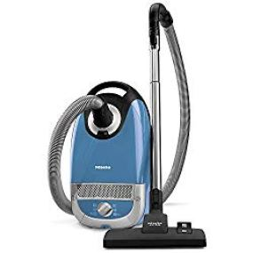
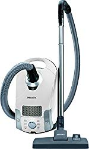

Miele has been in the domestic and commercial appliances market for more than 100 years. Older than Dyson and Dirt devil, this company designs some of the best vacuum cleaners that money can buy. The quality of their production and powerful technologies explain why they’re among the top 5 leading manufacturers in the world.

### Top Rated Miele Vacuum Cleaners

| Picture | Name | AirClean Filter | Weight | Best For |
|---|---|---|---|---|
|  | Miele Complete C3 Cat and Dog Canister HEPA Canister Vacuum | Active | 10.4 lbs | Best for pets and carpet |
|  | Miele Classic C1 Turbo Team Canister Vacuum Cleaner |  | 12.9 lbs | Best for Hard Floor and Low - Medium Pile Carpet |
|  | Miele Electro+ Canister Vacuum Marine Blue (Compact C2) | HEPA | 10 lbs | Best for all the different carpeting and hard floor surfaces |

Each vacuum cleaner in Miele’s product lineup packs tons of bells and whistles to enable you clean different surfaces with ease. Whether you’re looking for a [vacuum cleaner for shag carpet](https://www.bestofvacuum.com/best-vacuum-for-shag-carpet/), a unit for hardwood floor, or an option to vacuum pet hair, this brand has something for you.

## **8 of the Miele Vacuum Cleaners** 

One of the things you will love about Miele vacuums is the quality build. The brand invests time and money to make sure they build products they can be proud of and confident enough to sell. In this guide, we review some of the top rated Miele vacuums.

## 1\. Miele Complete C3 Cat and Dog Canister Vacuum

Pets’ messes shouldn’t drive you nuts because Miele Complete C3 Cat and Dog canister vacuum can help you get rid of all of them. Designed to vacuum clean in the shortest time possible, this vacuum has the power to get rid of pet hair from all floor types. [**Click here to see today’s price on Amazon.**](https://www.amazon.com/gp/offer-listing/B07JMHW1WP/ref=as_li_tl?ie=UTF8&camp=1789&creative=9325&creativeASIN=B07JMHW1WP&linkCode=am2&tag=bestofvacuum2-20&linkId=c466546cef048f80fe015a86147aa0be)

### **Features**

-   Complete C3 Cat and Dog vacuum features a 1,200 watts motor, which gives it sufficient suction power to get rid of pet messes from different surfaces.
-   The unit has 6 speed settings, which allow you to control how much suction power you want to use to vacuum your house. This, of course, will depend on the type of floor that you intend to clean.
-   It includes an AirClean Filtration System, which cleans air by getting rid of over 90% of dust particle that would otherwise damage your respiratory system.

### **Pros**

-   You will love this vacuum cleaner because it’s so quite that you can even use it to vacuum the house when others are still sleeping.
-   It vacuums smooth as well as hardwood floors really well.
-   With a high level of dirt filtration, you can expect this unit to get rid of dust particles as small as 0.3 microns in just a short time.

### **Cons**

-   This one is very expensive.

## **2\. Miele Complete C2 Hard Floor Canister Vacuum**

Miele Complete C2 is one of the brand’s best vacuum for hardwood floors. While it’s heavier than Classic C1 Turbo, it’s so compact that it can easily fit in a small space. It promises a lot of working power, which enables it to remove tough dirt from hard floors. Add to this the rug and floor tool, and what you get for the price is a unit that can pull even the most stubborn debris stuck between tight fibers. [**Click here to see today’s price on Amazon.**](https://www.amazon.com/gp/offer-listing/B07B3LR8JB/ref=as_li_tl?ie=UTF8&camp=1789&creative=9325&creativeASIN=B07B3LR8JB&linkCode=am2&tag=bestofvacuum2-20&linkId=a0a9e8ac02cfaddcef911b59eba3e1e7)

### **Features**

-   Many small upright vacuum cleaners don’t often have enough power to get the job done. But Miele goes against this concept by equipping this unit with a 1,200 watts motor, which is powerful enough to vacuum hardwood floors and clean up dirty carpets.
-   But powerful motors don’t always make a vacuum cleaner nearly as quite as you’d like them to be. While vacuums with extremely powerful motors, like this one, make a lot of noise, Miele adds a quiet setting to the mix to keep the noise to the minimum.
-   Complete C2’s parquet brush is this model’s strongest selling point. Designed to enable you reach just about any surface you want to clean, this brush gives you the convenience you need to clean with ease. Reach around tight corners, low under furniture, and even the baseboards in just a matter of seconds.
-   Then there’s the speed setting option. It’s adjustable, easy to maneuver, and it gives you the convenience you need to vacuum different areas of your house, including a sensitive place like the drapes.

### **Pros**

-   This unit is extremely quiet, thus a good option to use even very early in the morning when many people at home are still asleep.
-   The integrated AirClean filtration system is a plus. Because, as the vacuum cleans up dirt from whatever surface, the technology purifies air so that people in the room can breathe quality.

### **Cons**

-   It doesn’t feature settings for an automatic suction.
-   At 19 lbs, this thing isn’t exactly lightweight.

## **3\. Miele Classic C1 Turbo Team Canister Vacuum Cleaner**

The Classic C1 Turbo Team isn’t close to a lightweight canister vacuum. But it’s a model that does the cleaning job right, giving you almost a perfect clean up from different surfaces. Rated as one of the quietest pics in Miele’s vac line, the C1 Turbo is the kind of product you can use if you live in an apartment or you just need a unit that you can even use at night when your loved ones are deep asleep. [**Click here to see today’s price on Amazon.**](https://www.amazon.com/gp/offer-listing/B07P97JJNZ/ref=as_li_tl?ie=UTF8&camp=1789&creative=9325&creativeASIN=B07P97JJNZ&linkCode=am2&tag=bestofvacuum2-20&linkId=622f661a99916b1ef0fc9d4947b8b9ec)

### **Features**

-   With Classic C1 Turbo, you have full control over the suction power. The device includes 6 settings, which you can control by adjusting the Rotary Knob. These options let you choose a cleaning level that suits your needs, mostly depending on the floor type or surface you want to clean.
-   Receiving its power from the unit’s air stream, the turbo brush floorhead easily loosens up dirt and cleans hair and threads. The brush’s built-in air valve makes it easy to maneuver over carpets. And because the floorhead is slim, it should fit well even under low profile carpet.
-   This vacuum cleaner also has an AirClean System that adds to the convenience of the vacuuming process. Collectively, the AirClean exhaust filter, Miele FilterBag, and motor protection filter not only ensures maximum filtration of dust but also helps to clean air in your room as you vacuum the floors.

### **Pros**

-   Has a built-in AirClean System that filters dust and cleans air in the room you’re vacuuming.
-   It’s so quite that you can even use it at night when other people are asleep.

### **Cons**

-   It will struggle to move some messes from carpets.

## **4\. Miele Scout RX2 Home Vision Robot Vacuum**

Miele’s effort to build a robot vacuum didn’t quite pick well with Scout RX1. The quality of this first version wasn’t at par like its canister vacuum. And the likes of iRobot Roomba 690 definitely beat it down to dust in the robot vac category. To up its game, the brand went ahead to introduce an upgrade of RX1, the Miele Scout RX2. [**Click here to see today’s price on Amazon.**](https://www.amazon.com/gp/offer-listing/B07FR4N6DF/ref=as_li_tl?ie=UTF8&camp=1789&creative=9325&creativeASIN=B07FR4N6DF&linkCode=am2&tag=bestofvacuum2-20&linkId=83db5d99491a06423f415fe9dc454183)

While robotic technology is nothing new, Miele is one of the few brands branching out to add the collection to its product line. And with their new RX2 upgrade, it’s hard to deny that they have something special in store. Of course, the RX2 isn’t as top rated as models from iRobot. For now, though, Miele’s technology is sufficient to get the job done.

One of the things that you will love about this vacuum cleaner is the 3D vision capability. In other words, this vacuum cleaner can easily clean every part of your home with the least effort possible. And while the tech workaround is relatively new to Miele, this is the brands best robot vacuum so far.

### **Features**

-   Scout RX2 features built in turbo brush and two side brushes, which rotate consistently to clean different areas in your home, including the places that are hard to reach. Combined with a power rating of 1,200, the RX2 performs better than RX1, easily getting the cleaning job completed in the shortest time possible.
-   Miele adds a Quattro Cleaning Power to this vacuum cleaner, a cleaning system that makes it easy for you to vacuum your house. It starts by using rotating brushes to clean any dirt underneath the Scout RX4. The side arms extend, cleaning up corners that canister vacuums would otherwise struggle to and the beater bar cleans up any debris in front of the machine. After gathering dirt, the suction sucks it all and draws it in the dustbin.

### **Pros**

-   This vacuum cleaner is a better upgrade of the Scout RX1 and it has tons of features that make it worth trying.
-   The 4-stage cleaning mechanism makes this unit easy to use. And the best part is that it can easily clean areas that are difficult to reach.

### **Cons**

-   It’s an expensive model compared to robot vacuum cleaners from other brands.

## **5\. Miele Swing H1 Tactical**

Miele canister vacuums are relatively heavy. Weighing between 14 and 22 pounds, they may not be ideal for someone who loves mobility. And that’s where their stick vacuums come in, one of the best being the Swing H1 Tactical. At 9.4 pounds, this device is the most lightweight pick on this list, an option to consider if you need an alternative to a canister vacuum. [**Click here to see today’s price on Amazon.**](https://www.amazon.com/gp/offer-listing/B079MYDD1Z/ref=as_li_tl?ie=UTF8&camp=1789&creative=9325&creativeASIN=B079MYDD1Z&linkCode=am2&tag=bestofvacuum2-20&linkId=fe7dad1f1707051e34b60ce5ea8e2bee)

Lightweight means easy to maneuver, so you get the convenience you need to finish the vacuuming job in the shortest time possible. Miele does optimize this unit for better performance, and you can use it to clean area rugs as well a different type of carpets.

### **Features**

-   This vacuum cleaner is so flexible that you can convert it to a handheld vacuum and use it to clean the upholstery. And don’t worry about weight when doing so. At 9.4 pounds, this should be relatively easy to lift and use.
-   Miele Swing H1 Tactical has an upholstery tool that makes areas above the floors easy to clean, so you can vacuum your seats’ cushions in just a couple of minutes. Plus, it includes a crevice tool, which makes it easy for you to reach to and vacuum hard to reach areas in your home.

### **Pros**

-   It has an AirClean filter that helps to purify air in your room as you vacuum your house. This ensures that you and the other people present in the house breathe quality air.
-   Swing H1 Tactical features a HEPA grade filter, which helps to vacuum dust particles of different sizes with just a few passes.

### **Cons**

-   Probably the biggest disadvantage of this vacuum cleaner is that it requires multiple passes to clean up carpet well. You’ll need 5 passes to pick up dirt well, and that’s quite a lot.
-   The wheels have lifted the brush roll a little too high, making it hard to clean up dirt and debris in one pass.
-   It’s not an ideal vacuum for pet hair, mostly because it struggles to pick up long strands. The hair tends to stick on the brush, eventually clogging it and making vacuuming quite difficult.

## **6\. Miele Electro+ Canister Vacuum**

Sometimes you just want to vacuum your house without moving round too much. And what’s a better way to do that than with Miele Electro+ canister vacuum. Easy to move from space to space and use, and recording the lowest price tag on this list so far, the Electro+ is an effective vacuum cleaner that does not break the bank. [**Click here to see today’s price on Amazon.**](https://www.amazon.com/gp/offer-listing/B06XHQJKKD/ref=as_li_tl?ie=UTF8&camp=1789&creative=9325&creativeASIN=B06XHQJKKD&linkCode=am2&tag=bestofvacuum2-20&linkId=7f4172fde53424c33a7ef66e9a032ace)

With Electro+, you get 6 suction settings and 2 floor heads, which help a great deal when it comes to allowing you to complete the vacuuming job in time. Plus, you get additional accessories that you can use to make the vacuuming process easy and straightforward.

### **Features**

-   Electro+ is a powerful vacuum cleaner for a reason. The built-in motor is so powerful, with 1,200 watts of power under the hood. That’s a lot to give to such an affordable vacuum cleaner. And the best part is that it makes vacuuming a lot easier compared to units that have motors with less power.
-   One of the things you will love about the Electro+ is the inclusion of the HEPA filter. The purpose of this filtration system is to enable you clear all kinds of dusts, easily getting rid of even the smallest particles in your home. Since this unit includes this filter, it makes a good option for someone who suffers from allergies.
-   The Electro+ SEB228 Powerbrush floorhead allows for deep suction. And as such, it makes it easy for you to vacuum all types of carpets with ease, particularly the high pile ones. Given its strong power, though, it’s best if you don’t use it on soft carpets as it could cause damage.
-   Electro+ canister vacuum also has a useful swivel mechanism, which makes vacuuming easy and fun. Whether you want to clean under furniture in minutes or navigate round corners without leaving dirt behind you or on the side, you can be confident that the 360 degree swivel will enable you get the job done.

### **Pros**

-   It features a built-in AirClean technology, which ensures that air getting out of the vacuum is clean and healthy for people to breathe.
-   The HEPA filter also helps to ensure that you not only clean up 99.9% of the dirt particle but also it enhances the quality of air in your room.

### **Cons**

-   Miele puts the tools on the hose. Sadly, this does make the unit difficult to use, especially when it comes to moving it constantly around the house.
-   Another problem is that the power button is on the vacuum. It would have been better if Miele put it on the handle.

## 7\. Miele Blizzard CX1 Pure Suction Bagless Canister Vacuum Cleaner

If you’re in the market for a Miele bagless vacuum cleaner then the Blizzard CX1 is a good option to consider. Well-rated just like other models in the brand’s vac series, this pick is such a great quality product at a price lower than that of the New Complete C3. [**Click here to see today’s price on Amazon.**](https://www.amazon.com/gp/offer-listing/B07DX7BGW3/ref=as_li_tl?ie=UTF8&camp=1789&creative=9325&creativeASIN=B07DX7BGW3&linkCode=am2&tag=bestofvacuum2-20&linkId=c8dc81dc8ec8691c376f7aa577abc201)

And when it comes to application, the Blizzard CX1 is the kind of model that you can use to vacuum hard floors.

### **Features**

-   One feature that makes the Blizzard CX1 to stand out from the competition is the Hygiene Lifetime Filter. Built to clear up to 99% of airborne particles, this technology ensures that you not only clean your floors but also leave fresh air in your room after the vacuuming process.
-   The parquet head is one of the most important parts of this vacuum cleaner. Because it’s made of smooth synthetic fiber, it can always clean of even the smallest dust particle on different surfaces. And given that the swivel rotates smoothly, you should have an easy time picking up dust from the floor.
-   When you finish vacuuming your room, you don’t want to have a difficult time emptying and cleaning the vacuum cleaner. And thankfully, Miele has made this quite easy for you by adding a push-to-open mechanism.

### **Pros**

-   Blizzard CX1 is an affordable option in the Miele vacuum cleaners series. Thus, it’s a good option for a buyer on budget.
-   You will love this unit because it has a high suction power and a good filtration system. It also has a decent warranty, which means you get long-term after sale support.

### **Cons**

-   Miele Blizzard CX1 is heavier than some models discussed in this guide.

## **8\. Miele Compact C1 Canister Vacuum Cleaner**

The Compact C1 Pure is one of Miele’s top canister vacuum with a decent suction power. Earning a higher rating for having a reasonable weight, C1 Pure is easy to maneuver and easy to use. And when it comes to cost, the Compact C1 Pure is downright the best alternative to the New Miele Compact C3. [**Click here to see today’s price on Amazon.**](https://www.amazon.com/gp/offer-listing/B06XHPLYZL/ref=as_li_tl?ie=UTF8&camp=1789&creative=9325&creativeASIN=B06XHPLYZL&linkCode=am2&tag=bestofvacuum2-20&linkId=134d9affc845f3a3f850d58775e61495)

### **Features**

-   One of the best features of the Compact C1 Pure is the size of the motor. At 1,200 watts, the vortex motor system is powerful enough to provide sufficient suction power required to vacuum different surfaces with ease. Add the 6-step suction adjustment to the mix, and what you get is a powerful unit that gets the job done.
-   Its versatility is something hard not to love, thanks to the AllTeQ Combination Floorhead, which easily adjust to the type of floor that you would like to vacuum.
-   You will love this canister vacuum because it includes an AirClean feature. This filtration system not only captures up to 99.9% of dust particle, it also freshens up air so you breathe clean. The AirClean technology is something we haven’t seen in many vac brands yet. And it’s such a good thing that Miele adds it here.
-   At 14.8 pounds, this vacuum cleaner is one of the lightest in Miele’s canister vacuum series. Plus, it allows 360 degree swiveling, giving you the convenience you need to clean your home in style.

### **Pros** 

-   It has a built-in multi-layer filtration system, which not only cleans up most dust particles but also helps to increase the quality of air in your room.
-   The dust bag is made of polymer fiber, which means that what you get for the price is a vacuum cleaner built to last for a very long time.
-   It’s a quiet vacuum cleaner and, as such, it’s a good option for someone who prefers vacs that don’t make noise.

### **Cons**

-   This vacuum cleaner doesn’t guarantee the best results on medium and high pile carpets.
-   It doesn’t have a motorized brush.

## **Why go for Miele vacuum Cleaners?**

Miele puts in a lot of work to ensure they built nothing but the best vacuum cleaners for someone like you. And there are reasons why you should consider their vacuum cleaners.

-   **Innovation and technology**

Miele thinks outside the box. Each of their upgrade has features that many vacuum cleaners simply don’t have. From suction power control to AirClean technology to HEPA standard filters and a variety of floorhead brushes, Miele adds them all.

-   **Unparalleled Quality**

When it comes to quality, Miele plays by the book. From upgrade to upgrade, time after time, they make sure that every newer version of a vacuum cleaner is better than its predecessor is. Plus, each model packs some generous customer warranty, which means that the after sales service is downright promising.

-   **Sleek design**

From looks to better placement of control options, Miele has the design of each vacuum cleaner in their product line figured out. They do compromise on weight here and there. But then again, the materials used for design are sturdy and make each unit durable.

## **How to clean Miele vacuum**

First, press the release button on the unit to open the dust compartment. Once you open the compartment, pull out the dustbin and use a dry cloth to wipe it.

If the filter is outdated, consider replacing it with a new one. Remove the old filter and fix the new one in place. Then, connect the dust bag to the nozzle and unfold the bag. The final step is to close the compartment.

## **Frequently Asked Questions**

**Are Miele vacuums worth the money?**

I believe they’re worth the money, because the brand adds all the bells and whistle that you won’t find in many other vacuum cleaners out there.

**Is Miele better than Dyson?**

Miele and Dyson are top vacuum brands in the world. These rivals design some of the best units that you can depend on to get your home vacuumed thoroughly.

Because they are of good quality, none is better than the other is. While that’s my take on this, whether you choose a Miele or Dyson vacuum really comes down to personal preference.

**How often should you change HEPA filter in Miele vacuum?**

You should replace the filter once every 3 month.