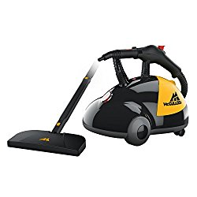

When it comes to cleaning, perhaps you need the best multi purpose steam cleaner and you are sorted. One thing I love about steam cleaning is that it effectively trades heat for chemicals without sacrificing strength.

In fact, when used correctly, steam can easily kill 99.99% of germs and bacteria, thus making it a safe, healthy, eco-friendly, all-natural way to clean your home from top to bottom.

But why invest in the best all purpose steam cleaner? What value does a canister steam cleaner offer that other steam cleaners don’t?

Where would you find answers to these concerns? Look at the term ‘multi-purpose’.

As the word suggests, a multipurpose steam mop is a steam cleaner that does a number of things at ago. Modern machines clean by mopping, [steaming,](https://www.bhg.com/homekeeping/house-cleaning/surface/why-use-a-steam-cleaner/) vacuuming, ionizing, and even deodorizing any surface.

### Top Rated Multi Purpose Steam Cleaners

| Picture | Name | Special Features |
|---|---|---|
|  | Steamfast SF-370WH Multi-Purpose Steam Cleaner | Pro-grade power - 1500 W |
|  | Pure Enrichment PureClean XL Rolling Steam Cleaner | 18 Accessories for Deep Cleaning |
|  | McCulloch MC1275 Heavy-Duty Steam Cleaner with 18 Accessories | 18 versatile accessories |

In this article, I will address three main points. The first one is a review of 7 best multi purpose steam cleaners you should look for.

The second point will address 4 main reasons why you should prefer all purpose steam cleaners to other types of steam cleaners. Lastly and most importantly, I will highlight 4 key features to pay attention to when purchasing the best multi purpose steam cleaner.

So now, let’s start with the first point, 7 best all-purpose steam cleaners reviewed:

## What is the best multi purpose steam cleaner?

## 1\. Steamfast SF370WH Multi Purpose Steam Cleaner

If you are looking for a steam cleaning solution, Steamfast SF-370WH is the best multi-purpose steam cleaner to settle on. Why? The steamer comes with a large water tank that will help you complete a whole day’s job among other nice attributes. [**Click here to see latest price on Amazon.**](https://www.amazon.com/gp/offer-listing/B0051T8XMW/ref=as_li_tl?ie=UTF8&camp=1789&creative=9325&creativeASIN=B0051T8XMW&linkCode=am2&tag=bestofvacuum2-20&linkId=6934df788d4d5339d858daa606ffd3ca) 

### Features

-   This 1500-watt cleaner gives you pressurized steam enough to carry out your cleaning job with a total voltage of 120v.
-   It has a large water tank, which heats up in a matter of minutes to save you time and clean at the shortest time.
-   Thanks to the heavenly steam-on-demand controls, you can easily control the steam. Press the lock button to enjoy 45 minutes of uninterrupted steam supply.
-   The 15 versatile accessories include a steam mop attachment, which enables you to remove every stubborn dirt on your surfaces.
-   You won’t need to use expensive chemicals which tend to be harsh sometimes. All because this cleaner naturally deep cleans and sanitizes your surfaces.
-   The integrated cord wrap comes in handy for you to store the rest of the power cord and keep it in order.
-   With Steamfast SF-370WH best multi-purpose steam cleaner, you can heat water over 200º F and comfortably clean all your surfaces.

### Pros

-   This cleaner is non-toxic as you’ll only use tap water and add zero chemicals.
-   Cleans even grout lines thus saving you the hustle of scrubbing your floors and you won’t get yourself dirty.
-   This cleaner is easy to use though you can check the manufacturer’s guide just to familiarize yourself with it.
-   The steam cleans every surface including the hard to reach ones and the surfaces dry up quite fast.
-   It’s cost effective since in the future you won’t need to buy any other tools as it has everything you’ll need.

### Cons

-   No water lever indicator.
-   You’ve got to be careful so you don’t burn yourself with the pressure steam.

## 2\. McCulloch MC1275 Heavy Duty Steam Cleaner

Why should you change the way you clean your surfaces? McCulloch MC1275 Heavy-Duty Steam Cleaner gives you a solid reason. This is the ability to spotlessly clean every surface without you breaking a sweat. [**Click here to see latest price on Amazon.**](https://www.amazon.com/gp/offer-listing/B0000DF0RB/ref=as_li_tl?ie=UTF8&camp=1789&creative=9325&creativeASIN=B0000DF0RB&linkCode=am2&tag=bestofvacuum2-20&linkId=5d381a7589d3c7e4e83083b37efacdc8)

### Features

-   You can actually let the steam out continuously thanks to the incredible lock button so you won’t hurt your thumb holding it down.
-   The steam cleaner comes with a powerful jet nozzle, which enables you to focus the stream in your desired direction. This helps you clean where you exactly want.
-   It has 48-ounce capacity ensuring you have sufficient supply of cleaning water for a good 45 minutes.
-   This cleaner has up to 18 accessories, which you’ll find useful now and even in the future thus saving you recurring costs.
-   The cleaner magically uses tap water only to clean and deodorize your entire surfaces.
-   McCulloch MC1275 Heavy-Duty Steam Cleaner has anamazing Floor Mop Attachment, which enables you to practically clean each surface.

### Pros

-   McCulloch MC1275 Heavy-Duty Steam Cleaner cleans a wide variety of surfaces so you get value for your money.
-   This steam cleaner performs a neat job so don’t mess yourself up and the surfaces dry up real fast.
-   Do you see that stubborn dirt and grime? They have no space on your surfaces, as this cleaner will wipe them off without a trace.
-   Exhausting all your energy while you squeeze the mop head will become a thing of the past to you.
-   Once you get used, you’ll easily clean all your surfaces in a short time.

### Cons

-   If you fail to keenly follow the simple manufacturer’s instructions, you may get yourself burnt by the steam.
-   Some say that this model is a bit expensive.

## 3\. Dupray Neat Steam Cleaner Multipurpose Heavy Duty Steamer

Dupray Neat Steam multi purpose steamer is one of the highly-rated steam cleaners for homes and large commercial units. [**Click here to see latest price on Amazon.**](https://www.amazon.com/gp/offer-listing/B07C44DM6D/ref=as_li_tl?ie=UTF8&camp=1789&creative=9325&creativeASIN=B07C44DM6D&linkCode=am2&tag=bestofvacuum2-20&linkId=d17231d7f4df3c995eb75928bd141bd3) 

The unit is designed for high performance with an amazing cleaning power to disinfect and sanitize any surface.  Dupray neat steam cleaner easily removes dirt, stains from surfaces while killing up to 99.9% of germs.

### Features

-   You get up to 50 minutes cleaning time per fill up of 54 ounces.
-   The Dupray neat steamer has 275 degrees Fahrenheit steam pressure which heats up to 7 minutes.
-   It sanitizes and picks dirt on any surfaces without using chemicals.
-   Smooth rolling wheels.
-   Has retractable handle.
-   Neat Steam Cleaner delivers cleaning power for larger commercial units.
-   The cleaner comes with a 16 feet power cord, integrated with a wrapped cord.
-   It has a steam lock for continuous cleaning action.

### Pros

-   No need for expensive pads.
-   Its lightweight and portable nature makes it easy to use and maneuver.
-   Compact size, making it easy to store.
-   Dupray Neat Steam cleaner is etl (electrical testing labs) certified; for use in the U.S and Canada
-   A 6 feet 6 inch steam hosepipe makes mobility easier while you work.
-   Given its cleaning power, neat steam cleaner is affordable compared to similar machines.
-   Made of a heavy plastic that seems long-lasting.

### Cons

-   No vacuum/suction function.
-   The unit is a little messy as it drips here and there.
-   The handle gets hot with extended usage.

## 4\. Pure Enrichment PureClean XL Multi Purpose Household Steam Cleaning System

Pureclean XL Rolling Steam Cleaner is a set of 18 heavy-duty pieces that effectively clean both in and out of your home. [**Click here to see latest price on Amazon.**](https://www.amazon.com/gp/offer-listing/B06XB1TZXV/ref=as_li_tl?ie=UTF8&camp=1789&creative=9325&creativeASIN=B06XB1TZXV&linkCode=am2&tag=bestofvacuum2-20&linkId=90f128c59b3a51369973cdce4ac82c05) 

### Features

-   Comes with 2 washable pads for steam mopping.
-   It has a water boiler of 1.5-liter capacity capable of producing continuous hot pressurized steam up to 45 minutes while eliminating any existing dirt.
-   The machine is fitted with a 16-foot power cord that makes it easy for you to steam clean your entire home.

### Pros

-   It can be used on a wide range of surfaces.
-   Pureclean XL Rolling Steam Cleaner – 1500 water boiler gives you a supply of steam up to 45 minutes.
-   With its long power cord, Pureclean XL Rolling Steam Cleaner makes it easy for you to maneuver in an entire home.
-   Has a compact design with a wrapped cord, which stays tucked away for easy storage.
-   It comes with a 5-year warranty.
-   Pureclean XL Rolling Steam Cleaner eradicates all little animals even in cracks without using chemicals.

### Cons

-   Need to use two mop pads on the vinyl floor to prevent discoloration.
-   Its fully extended handle is delicate.
-   The small bushes wear out quickly.
-   No indicator to show as the water level reduces. The steamer just stops when the unit is empty.
-   During extended operation, the handle gets hot.
-   It puts out a lot of water.

## 5\. Sienna Luna Plus SSM 3016  Multi Purpose Cleaning System,

This is an all purpose steam cleaner you can trust because it is easy to operate. The product is durable and worth the money. Siena Luna plus SSM-3016 Cleaning system is a great multi-purpose cleaner that will transform your cleaning experience. It has an excellent ability to clean the tile and hard floors. [**Click here to see latest price on Amazon.**](https://www.amazon.com/gp/offer-listing/B00R59WV6A/ref=as_li_tl?ie=UTF8&camp=1789&creative=9325&creativeASIN=B00R59WV6A&linkCode=am2&tag=bestofvacuum2-20&linkId=ce5d41943779fe13b17c0bc87bd7c294) 

### Features

-   Luna plus has the great ability of using technology in its sonic micro pulse vibration. This assists in loosening grime and dirt. The sonic micro pulse vibration provides an effect of scrubbing thus reducing your cleaning time.
-   LED headlight, which lights the cleaning area thus allowing you to clean more confidently.
-   High temperature of 212°F in 30 seconds steam, which ensures that the bacteria and mold are killed during cleaning.
-   The whole Luna Plus unit has 2 washable cleaning pads, carpet glider, 12 piece accessory kit, storage bag, window squeegee, 4 nylon brushes, concentrator nozzle, shoulder strap and an eco-microfiber pad.

### Pros

-   The whole unit is portable thanks to its Luna Plus shoulder strap.
-   The cleaning system has different cleaning accessories. They allow you to clean a range of surfaces including bathrooms, windows, children toys, kitchen fixtures and BBQ grills.
-   Unit stands upright on its own.
-   Energy saving power shut off.

### Cons

-   The nylon brushes get worn out fast depending on how much you are using them and the type of surface.

## 6\. Bocca Multi Purpose Steam Heavy Duty Cleaning Machine

Bocca brings you a powerful heavy-duty adjustable rolling cleaner. This is the best multi purpose steam cleaner for floors as well as carpets. [**Click here to see latest price on Amazon.**](https://www.amazon.com/gp/offer-listing/B07D9CWDBY/ref=as_li_tl?ie=UTF8&camp=1789&creative=9325&creativeASIN=B07D9CWDBY&linkCode=am2&tag=bestofvacuum2-20&linkId=cf3d53bd2b721f11c25135582904a9be) 

If you are wondering why you should choose this machine then consider its features such as the automatic feature, the 2.0L tank, and runtime among others. Sanitation is also guaranteed with the 226°F water steam that kills germs in your house.

### Features

-   It has 13 accessories that enable the user to choose from a variety of cleaning options. The Bocca Rolling Steam Cleaner accessories include a carpet glider and towel of floor among other features.
-   The cleaner has a large capacity of 2.0 L tank. The water requires a short time to heat and it can be used continually for 40 minutes.
-   Its great design of a curved handle will have you feeling comfortable when using it.
-   Indicator lights, which allow you to know when the cleaner needs water and when it is working well. Red shows that there is water shortage while green shows the cleaner is working.

### Pros

-   With its 360° two universal wheels, it is possible to move the cleaner around freely and clean efficiently.
-   Fitted with a coil that ensures the long wires will not get you stumbled.
-   The ability of the cleaner to be rotated through 180° ensures that all crevices are reached properly for a thorough cleaning.
-   The steam cleaner is suitable for cleaning ceramic tile, floors, cars and other surfaces. All you need to do is to adjust cleaner.

### Cons

-   Costly compared to its competitors. 

## Why Prefer Steam Cleaners?

For various cleaning tasks that require more than just wiping or sweeping, pressure steam cleaning comes in. You can use a multipurpose steam cleaner anywhere you want, in office, home, restaurant, bathtub, and car. Discussed below are some of the major reasons to use a steam cleaner in place of others.

-   ### **Versatile**
    

Steam cleaners cover various kinds of surfaces that need cleaning, both large and small surfaces. Talk of wooden floors, furniture, tiles, carpets, sofa sets, curtains, cars, heavy-duty mattresses, difficult to reach house corners and kitchen counters. You can clean, sanitize, sterilize, and remove mites and stubborn dirt from your house.

-   ###  **Eco-Friendly**
    

Most manufacturers claim that their detergents and cleaning agents are friendly to the environment but they are still chemicals. They contain components that can damage the atmosphere including the surfaces you want to clean. You may observe that after a prolonged period of using cleaning agents on tiles, they gradually begin discoloring and become prone to breakage at the slightest impact.

A steam cleaner naturally deep cleans surfaces using hot pressurized steam to remove grease, grime, dry, clean and disinfect house surfaces devoid of harmful effect. You will not need to use abrasives and harmful harsh chemical products to get your cleaning job done.

-   ###  **Disinfect and Deodorize**
    

Normal cleaning is normally done only on the visible surfaces forgetting of grease, grime and dust left in between cracks and crevices as well as dirt lying beneath the surface. This kind of environment becomes a residence for harmful microorganisms and bad odor.

Steam cleaning rid off surfaces from dirt, mold, and grease at the same time disinfecting it from harmful bacteria using a high level of pressurized steam. The vapor infiltrates the surfaces that need cleaning and sanitizes them by killing all kinds of germs, infection and stubborn germs.

It is also effective for removing bad smell accumulated either from foods or from any other day-to-day activities.

-   ###  **Easy And Safe To Use**
    

Lighter models of steam cleaners are easy to use than larger ones. You fill the tank with water, switch it on for the water to heat, and then switch the steam button to start your cleaning.

The long steam cleaner cord allows you to access a wide area away from the power source with a cord wrap for easy management. They also have an easy setup and maintenance making them convenient for your home cleaning job.

Best multipurpose steam cleaners are safe and protected from possible accidental use and water leakage. They are fitted with a safety lock for children and pets. Unless you press the steam button and move the safety, lock to on it is impossible to use it.

When temperatures are high or there is no water in the tank, the machine switches off automatically for safety.

## Key Features To Pay Attention To When Shopping For the Best Multi Purpose Steam Cleaner

Choosing the best multipurpose steam cleaner is not an easy task. Identify what you want by looking at the various key features and factors to pay attention to when shopping for a steam cleaner that will best satisfy your cleaning needs.

-   ### **High Power**
    

The degree of heat your steam cleaner generates is a factor to look into. Steam cleaning requires the use of high-pressure steam to remove stubborn dirt, mold, grime and any other kind of a mess. For effective sanitization and sterilization, high temperatures are not an exception.

Consider the consistency at which the cleaner can keep the pressure. Inability to maintain temperature and pressure level will only lead to a less efficient cleaning service in your home.

To achieve professional cleaning, ensure that you select a multi-purpose cleaner that has the ability to produce high-temperature steam vapor with high pressure. The steam cleaner must generate steam at temperatures ranging at 360 degrees Fahrenheit for effective elimination of harmful bacteria and allergens.

-   ### **Water Capacity**
    

Steam cleaners produce steam only if there is water to heat. Using a steam cleaner that holds a little amount of water will only make the cleaning a very tiresome exercise since you will be required to occasionally refill the tank.

A good steam cleaner has a large water tank that requires less refilling. Others come with dual tank mechanism making it easy to fill one as you continue cleaning for extra convenience. Based on your requirements, make a decision of whether to buy small, large or dual tank steam cleaners.

-   ###  **Portability**
    

Cleaning requires you to move constantly and it can be difficult if your cleaner is heavy. Lighter models are easy to work with since you can carry them around from one place to the other depending on what area you want to clean.

Steam cleaners often vary in terms of size, weight, and shapes. It depends on which type you want to buy and one that best suits the intended purpose. Before purchasing one, check the weight and the dimensions of the appliance.

-   ###  **Number Of Cleaning Attachments**
    

To enhance their versatility, multi-purpose steam cleaners normally come with an array of attachments. Most manufacturers provide you with the attachments. However, there are and those that you can buy separately. A steam cleaner with more attachments translates to increased versatility. They can be used on different types of surfaces for sanitization.

If you need a versatile steam cleaner, consider the attachments that come with each given model and what is available for you to buy alongside it. Ensure in advance that the appliance you buy has the attachments for various cleaning tasks in your home. There is no point of buying a steam cleaner that will not allow you to clean areas you want to.

There are many varieties of steam cleaners available in the market. An above average multipurpose steam cleaner handles a variety of tasks with efficient tools for cleaning services beyond floors.

Consider one that ascertains a healthy and safe home environment, reduced harmful microorganism build up and cut down the use of chemicals in your home. Consider a well established and certified store that supplies great brands of multipurpose steam cleaners of good reputation.

#### Conclusion

With the vast knowledge shared above, you are now able to get the best multi purpose steam cleaner of your choice. I’d say that when making the decision, focus on your needs and what the steam cleaner offers. Otherwise, it would be embarrassing if at the end of the day, you do not get the ideal multi-surface steam cleaner because you made a haste decision. Good shopping buddy!