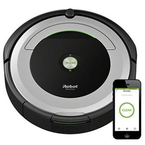
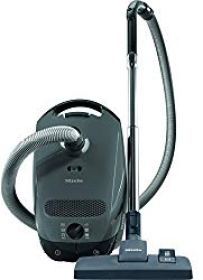
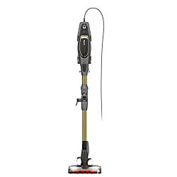

If you’re in the market for the best multi surface vacuum cleaner, this guide is for you. These vacs take away the need for multiple cleaning products, allowing you to handle cleaning tasks with ease. They pick up dirt and dust fast, manage wet messes with ease, and deep clean and condition carpets in the shortest time possible.

Because a multi surface vacuum cleaner can easily clean different floor and carpet types, they make the best alternative to all the shop vacuums out there. Once you have a multifunction vacuum, you won’t ever need to purchase a separate [vacuum cleaner for shag carpets](https://www.bestofvacuum.com/best-vacuum-for-shag-carpet/), or a [vacuum for cat litters](https://www.bestofvacuum.com/best-vacuum-for-cat-litter/), or a vacuum that can [clean up messes from stairs](https://www.bestofvacuum.com/best-vacuum-for-stairs/). A single multi surface unit is enough to get the work done.

Also, multi surface vacuum cleaners are readily available, versatile, more dynamic, and very easy to use. Because they are available in different price ranges, you can easily get a cleaner that’s within your budget. In this guide, we’ll look at the 8 best multi surface vacuum cleaners in the market right now.

###  Best Multi-Surface Vacuum Cleaners

| Picture | Name | Weight | Features |
|---|---|---|---|
|  | Dyson V15 Detect Cordless Vacuum Cleaner | 7.6 lbs | Powerful and intelligent for whole-home deep cleaning. |
|  | BISSELL CrossWave Floor and Carpet Cleaner with Wet-Dry Vacuum, 1785A | 11 lbs | Dual Action Multi Surface Brush Roll- that Uses An Innovative Microfiber And Nylon Brush To Mop And Pick Up Dry Debris At The Same Time. |
|  | iRobot Roomba 690 Robot Vacuum | 7.8 lbs | 3 Stage Cleaning System and Dual Multi Surface Brushes pick up everything from small particles to large debris |
|  | Shark Flex DuoClean Ultra-Light Multi Surface Vacuum | 9.8 lbs | Anti-Allergen Complete Seal Technology captures and traps 99.9% of dust and allergens down to 1 micron. |
| Picture | Name | Weight | Features |

##  **Best Rated Multi-Surface Vacuum Cleaners**

## 1\. Dyson V15 Detect Cordless Vacuum Cleaner

### **Features**

-   Fluffy Optic cleaner head reveals hidden dust on hard floors.
-   Digital Motorbar cleaner head deep cleans all floor types and detangle long hair and pet hair as you clean.
-   Converts to a handheld vacuum for cleaning cars, stairs, and upholstery. [**Click here to see today’s price on Amazon.**](https://www.amazon.com/Dyson-Detect-Cordless-Vacuum-Cleaner/dp/B0C2J8KJH9?crid=9LUN2ZUV9ZUG&keywords=dyson%2Bv15&qid=1706245800&sprefix=dyson%2Bv%2Caps%2C567&sr=8-3&th=1&linkCode=ll1&tag=bestofvacuum2-20&linkId=47359e462033c4d4c7d8fd44b2b60d7e&language=en_US&ref_=as_li_ss_tl)

-   Dyson Cyclone V15 Detect comes with so many useful accessories. For the price, you get a crevice tool, Digital Motorbar cleaner head, a docking station for storage when the unit is not in use, a charging cable, hair screw tool and a Fluffy Optic cleaner head. These help you to vacuum faster and with ease.
-   The Hair screw tool sucks up long hair and pet hair. Its anti-tangle conical brush bar removes long hair and pet hair from pet beds, car seats, stairs, and more.
    

### **Pros**

-   This vacuum cleaner is very quiet during operation.
-   The two cleaning heads enable you to clean multi surface floors with ease.
-   It has a good suction power.
-   You get a runtime of up to 60 minutes on a single charge.

### **Cons**

-   It’s somewhat costly.
-   Hard to hold when cleaning high areas.

## 2\. BISSELL CrossWave Floor and Carpet Cleaner with Wet-Dry Vacuum, 1785A

If you’re in the market for a [multipurpose vacuum cleaner](https://www.bestofvacuum.com/best-multi-purpose-steam-cleaner/) that does the job right, then you should consider the Bissell 1785A CrossWave Vacuum. Remember, Bissell is one of the best and trusted brand in the cleaning business. Which means that if you buy this multi surface vacuum and mop, you’ll get the value for your money. That’s because it works so well, just like the Dyson Ball Floor 2. [**Click here to see latest price on Amazon.**](https://www.amazon.com/gp/offer-listing/B01DTYAZO4/ref=as_li_tl?ie=UTF8&camp=1789&creative=9325&creativeASIN=B01DTYAZO4&linkCode=am2&tag=bestofvacuum2-20&linkId=224dcca9572d820ae10349b406bed8d6)

### **Features**

-   The head of this vacuum cleaner swivel with ease. This, of course, is a feature that enhances performance by giving you the flexibility you need to easily reach to and vacuum deeper areas.
-   There’s a LED light on the nozzle area of this Bissell model. You can use it to get a better view of the area you’re vacuuming. Of course, you won’t use this feature often, but it will be quite handy if you ever need it. The only problem is that it doesn’t stay on for long, so that’s something to keep in mind.
-   Two Tank System keeps cleaning solution and dirty water separate this ensures that you’re always cleaning with a fresh mix of water and formula. When both tanks are full, you can clean more than 700 square feet with ease.

-   The model has a 25-feet code. This is both good and bad. On the one hand, the cord length is good enough to clean a smaller apartment/room without the need to constantly unplug and plug the cord. On the other hand, it’s not suitable for large rooms because the cord is so short. Still, it should work fine if you don’t mind the inconvenience of having to unplug and plug it to different power sources.

### Pros

-   It has a suction power of 150 air watts, which is similar to what you get from [Dyson V10](https://www.amazon.com/gp/offer-listing/B0798FVV6V/ref=as_li_tl?ie=UTF8&camp=1789&creative=9325&creativeASIN=B0798FVV6V&linkCode=am2&tag=bestofvacuum2-20&linkId=83f8512781af384a030508ad2b92e316).
-   It doesn’t make noise when in use.
-   Can clean up a large area thanks to the dual tank system.

### Cons

-   It doesn’t have a True HEPA filter.

## 3\. iRobot Roomba 690 Robot Vacuum- Good for Pet Hair, Carpets, Hard Floors

As a company, iRobot takes smart technologies and integrates them in vacuum cleaners in a way that competition never can. With advanced technology comes the crazy cost, which explains why many vacs from this brand are often so expensive. To see that the Roomba 690 is actually an inexpensive model from the same brand is actually a great relief for a budget buyer who has always wanted to own an automated vacuum cleaner from the brand. [**Click here to see latest price on Amazon.**](https://www.amazon.com/gp/offer-listing/B06XRT2B3P/ref=as_li_tl?ie=UTF8&camp=1789&creative=9325&creativeASIN=B06XRT2B3P&linkCode=am2&tag=bestofvacuum2-20&linkId=08e1deb0321b2d212072b217cd38fbae)

### **Features**

-   This multi surface vacuum cleaner is small and lightweight. With a total height of just 3.6 inches and an overall width of only 13 inches, this unit can easily get to the hard to reach areas and vacuum them thoroughly. Plus, with a weight of only 7.8 pounds, this unit is more lightweight than many vacuum cleaners in the market.
-   Roomba 690 has a number of accessories and parts that work together to vacuum different areas of your home. These include a virtual wall barrier, a rechargeable battery, a cleaning tool, and a charging station. This unit also has a True HEPA filter, which is a common standard in many high quality vacuum cleaners.
-   One of the things hard not to love about this unit is its versatility. In fact, if you are in the market for vacuum cleaner that can easily clean multi surface floor types, then this is a good option for you. Roomba 690 can [vacuum vinyl floors](https://www.bestofvacuum.com/best-vacuum-for-vinyl-floors/), hardwood floors, low pile carpets, and even high pile carpets.
-   This vacuum cleaner has a decent battery life. In fact, the one that comes with it can work well for up to 3 years before you itch for an upgrade. When fully charged, this vac can work for 60 minutes before running out of charge. It takes about 3 hours to charge the battery.

### **Pros**

-   This vacuum is small and lightweight.
-   The built-in true HEPA filter makes it a good option for allergies .
-   Decent battery life that takes only 3 hours to charge.
-   Cheaper than many iRobot vacuum cleaners.
-   It’s one of the battery operated vacs that has a decent runtime per charge.

### **Cons**

-   It doesn’t support home mapping.
-   Struggles to clean high pile carpet.

## 4\. Miele Classic C1 Canister Vacuum Cleaner- best canister vacuum for multi surface

Miele Classic C1 is one of the best vacuums for all floors on this list. It became popular because of its reasonable weight, material quality, suction power, maneuverability, and ease of use. Today, it’s one of the well-rated vacs in the market. [**Click here to see latest price Amazon.**](https://www.amazon.com/gp/offer-listing/B075QPCX9L/ref=as_li_tl?ie=UTF8&camp=1789&creative=9325&creativeASIN=B075QPCX9L&linkCode=am2&tag=bestofvacuum2-20&linkId=315e25ebb2f7837f0d2a24bb42dc8ed1)

### **Features**

-   One of the best things about this vacuum cleaner is its flexibility. In fact, if you are in the market for a unit that can vacuum multiple floors for the long haul, this would be the best option to use. To put this into perspective, this vacuum cleaner can easily lift and suck up rice, sugar, dry cereal, and kitty litter on the fly.
-   As if cleaning different types of dirt is not enough, Miele has made sure that you can use this vacuum cleaner on different floors with ease. Therefore, the Classic C1’s performance on hardwood floor, high pile carpet, and low pile carpet is definitely up to the standard.
-   You will love this vacuum cleaner because it’s easy to use. There are only three steps to get started with Miele C1 Classic. Pick a cleaning tool that you want to use, plug the machine in, choose your preferred cleaning style, power the vacuum cleaner, and then start cleaning your house.

### **Pros**

-   Cleans the edges of different floors really well.
-   It’s lightweight and easy to move around.
-   It has a number of surface cleaning options, allowing you to vacuum your floors in style.
-   You get up to 30 feet of cleaning radius.
-   It has variable power control options.

### **Cons**

-   It’s not a good option for cleaning pet hair.
-   The cable is somewhat short and this means your reach is limited.
-   The wheels don’t hold up well on deep carpets.

## **5\. Shark Navigator NV352 Lift Away Upright Vacuum**

There’s no doubt that [Shark vacuums](https://www.bestofvacuum.com/best-rated-shark-vacuum/) are some of the best options in the market. This brand puts a lot of time, resources, and design skills to work and end up bringing the highest quality vacuum cleaners to the market. Shark Navigator NV352 Lift Away is one of these high quality vacuums. [**Click here to see latest price on Amazon.**](https://www.amazon.com/gp/offer-listing/B004Q4DRJW/ref=as_li_tl?ie=UTF8&camp=1789&creative=9325&creativeASIN=B004Q4DRJW&linkCode=am2&tag=bestofvacuum2-20&linkId=f0dda62886b35f5591c7f413c9ce229f)

### **Features**

-   Shark Navigator NV352 Lift Away comes with a number of accessories, which are necessary for the cleaning process. Generally, the package includes four additional attachments whose purpose is to enable you clean different areas of your home with ease. The attachments are a brush tool, a power brush for pet hair, a 5-inch crevice tool, and a 24-inch crevice tool.
-   This unit has a cord length of 25 feet, which is long enough to cover a sizeable area. If you live in a bigger apartment, however, you might find yourself changing the power outlets for flexibility. For the most part, though, this length is enough to get you through a cleaning session.
-   This dual floor vacuum has two filters: a washable foam filter and a true HEPA filter. It’s best to wash the foam filter at least after every 2 or 3 months. The HEPA filter is different, which gets rid of even the tiniest dirt particles as you vacuum cleaning, is also easy to clean. But you should not clean it in a washing machine. Use running water to clean it, instead.

### **Pros**

-   The True HEPA filter gets rid of tiny dirt particles and manages all types of allergens quite well.
-   Its dustbin has a decent size.
-   You have the option to use a motorized brush, which a good option that helps to protect your hard floors from scratches.
-   It can even clean above the floor areas.

### **Cons**

-   The handle doesn’t feature any control.
-   Doesn’t swivel well like a Dyson vacuum cleaner.
-   Doesn’t have LED lights.

## 6\. Shark Flex DuoClean Ultra-Light Upright Vacuum for Pet, Carpet and Hard Floor

There are many reasons to love this vacuum cleaner. The brand uses high quality material to design it. It’s therefore sturdy, stable, and durable. The suction power is up to the standard, providing just enough air watts require to clean up different floors. Also, this is one of the best [Shark vacuum for pet hair](https://www.bestofvacuum.com/best-shark-vacuum-for-pet-hair/). [**Click here to see latest price on Amazon.**](https://www.amazon.com/gp/offer-listing/B074F2PHLB/ref=as_li_tl?ie=UTF8&camp=1789&creative=9325&creativeASIN=B074F2PHLB&linkCode=am2&tag=bestofvacuum2-20&linkId=71b2dc5b7d8f24bd7b69ae020c19b1df)

### **Features**

-   The DuoClean technology is simply a combination of a bristle brush and soft roller bar that work together to get rid of dirt, leaving the vacuumed area sparkling clean.
-   Active-Glide Technology for smooth maneuverability on floors and carpets while maintaining powerful suction.
-   The LED headlights system isn’t exactly a feature that you’ll use often. But you‘ll find it useful when you want to vacuum under furniture where there’s usually low light.

### **Pros**

-   Has a decent suction power, which means outstanding performance on multi surfaces.
-   The LED lights help to collect dust from dark areas, especially under furniture .
-   Includes a true HEPA filter.
-   The multi flex technology helps with easy storage when the device is not in use.

### **Cons**

-   The dust cup is small.

##  7. Dyson Ball Multi Floor 2 Upright Vacuum Cleaner

Dyson has grown to become a popular brand mostly for designing high quality vacuum cleaners that give the target market the value for money. Take their Ball Multi Floor 2, for example. It’s a well-made, lightweight unit. And it has a number of premium features that make it a good option for vacuuming multi surface floors. [**Click here to see latest price on Amazon.**](https://www.amazon.com/gp/offer-listing/B0771GVCV3/ref=as_li_tl?ie=UTF8&camp=1789&creative=9325&creativeASIN=B0771GVCV3&linkCode=am2&tag=bestofvacuum2-20&linkId=9f6a65be0a4bff1381680180a8da3a00)

### **Features**

-   The first and probably the most important feature of this vacuum cleaner are the cyclones. Located just above the 1.6-liter dustbin, they help to capture particles in a way that doesn’t compromise the hygiene around you. They are particularly important because they filter out even the tiniest particles, ensuring they don’t escape.
-   The suction power of this Dyson vacuum is also up to the standard. At the very least, you get around 250 air watts, which is more suction power compared to the 150 air watts of suction power than Dyson V10 provides. The Multi Floor 2 doesn’t have much suction compared to Dyson Animal 2, but what it gives you is still good enough to vacuum different surfaces with ease.
-   Because it’s heavy and somewhat tasking to push around, it might be best to use this [vacuum for a small apartment](https://www.bestofvacuum.com/best-vacuum-for-small-apartment/). However, if the weight isn’t something that would bother you that much, then you can use on any room size anyway.
-   The self-adjusting cleaner head of this [Dyson vacuum cleaner](https://www.bestofvacuum.com/best-dyson-vacuum/) gives you the flexibility you need to clean different floor types with ease. Whether you want to clean hardwood floors, high pile carpet, low pile carpet, or shag carpet, the cleaner head will adjust itself just fine.

### **Pros**

-   A 250 AW suction is such an impressive power. At the very least, it’s up to 40% more than what Dyson V10 provides.
-   It has a dustbin capacity of 1.6 liters, which is quite big compared to what you get from other brands.
-   It comes with a number of accessories that enhance the cleaning process.

### **Cons**

-   At 15 pounds, this vacuum cleaner is heavier to carry from space to space in the house.

### **Features to Consider While Buying the Best Multi-surface Vacuum**

-   **Wet/Dry Capability**

When we talk about wet/dry capability of a vacuum cleaner, we’re actually referring to the versatility of the device. Like you can vacuum your area rugs and carpets and then sterilize hard flooring with just the flick of a switch. Also, make sure it provides enough air watts, because, at the end of the day, you need enough suction power to pick up debris of all sizes.

-   **Filter**

A vacuum cleaner will have different filters. But the most important one that an option you pick shouldn’t miss is the HEPA filter. It’s a standard filter system, well known and recognized worldwide for being human-friendly.

-   **Accessories**

Many vacuum cleaners come with additional accessories. And fortunately, manufacturers and seller don’t charge you extra for these. It’s up to you to decide how many accessories you’d like in a vacuum cleaner. This will help you to make the right choice in the end. For example, Dyson V10 Absolute comes with so many additional accessories while the likes of Miele and Sebo X5 only come with a few.