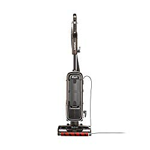
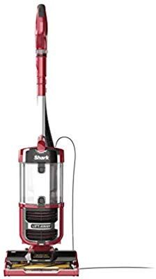
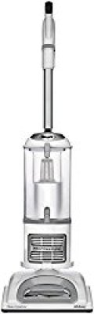
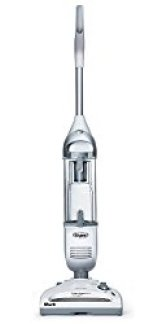

After reviewing multiple vacuum brands, you’ve finally settled on Shark vacuums. That’s certainly a smart choice, since it’s among the most reputable vacuum brands; however, which is the best rated Shark vacuum?

There’s a whole range of cordless, robot, upright, and corded stick vacuums.

Plus, each category has about 5 different models to choose from. That’s roughly 20 different vacuums. And the tricky part is evaluating the 600+ different parts and components in the vacuums, just so you can pick the best one.

Fortunately, you don’t have to do that.

This review features only the best Shark vacuums, based on the ratings of thousands of people just like you who used the products. They tried out the products and gave their honest feedback, so you can make an informed choice without going through trial and error.

###  4 Top Recommended Shark Vacuums

| Picture | Name | Bagged/ Bagless |
|---|---|---|
| Best overall | Shark APEX Upright Vacuum with DuoClean for Carpet and HardFloor Cleaning, Zero-M Anti-Hair Wrap(AZ1002) | Bagless |
|  | Shark Navigator Upright Vacuum with Lift-Away, Zero-M Anti-Hair Wrap Technology,(ZU561), Red Peony | Bagless |
|  | Shark Rotator Powered Lift-Away TruePet (NV752) Upright Vacuum, Mini-Motorized Brush, Bordeaux | Bagless |
|  | SHARK ION Robot Vacuum R85 WiFi-Connected with Powerful Suction(RV850) | Robot |

Best of all, this guide provides an in-depth evaluation based on the merits of the hundreds of parts and components in the vacuums.

You’ll know exactly what the vacuums can do and what they can’t do.

Taking a few minutes to read this review can spare you the costly error of making an impulse purchase (you definitely don’t want to end up with a vacuum you can’t use, just because you bought it for its fancy looks).

So, here’s the review.

###  Top Rated Shark Vacuum Reviews

## 1\. Shark APEX Upright Vacuum with DuoClean (AZ1002)

Shark APEX Upright is one of the highest rated shark vacuum cleaners in the market today. It is comes with DuoClean technology for an effortless carpet cleaning .[**Click here to see latest price on Amazon.**](https://www.amazon.com/gp/offer-listing/B07FX5PCMN/ref=as_li_tl?ie=UTF8&camp=1789&creative=9325&creativeASIN=B07FX5PCMN&linkCode=am2&tag=bestofvacuum2-20&linkId=459e8532860701c4cabce2a93ff091ea) 

The best shark vacuum must always be good for not only carpet cleaning but for hardwood floor cleaning too. Shark vacuum reviews are mostly positive due to the ability of this vacuum to lift away dirt and loose long hair with ease.

### Features

-   DuoClean technology: This amazing technological feature enables a deep cleaning of carpets and hard floors. There is also a dual brushroll, which does the cleaning.
-   The vacuum has powered lift away. This means that the canister can be detached and extended to reach under the furniture.
-   There is a complete and advanced anti-allergen seal. The technology employs the use of an HEPA filter.
-   Zero-M self-cleaning allows the brushroll to continually remove hair with less stress. This technology allows for anti-hair wrap.
-   It has a five years limited warranty.

### Pros

-   This vacuum is highly portable thanks to the detachable canister. You can easily lift the canister to reach all the hard to clean surfaces such as under the furniture.
-   The upright mode allows for easier carpet and floor cleaning.
-   Zero-M makes the removal of all hair strands easy. If you have long hair or pets that shed hair in your home, then this will be your best vacuum.
-   The Zero-M also allows the vacuum to clean itself in the cleaning process.

### Cons

-   It’s heavy \[16 pounds\]

## 2\. Shark Navigator Vacuum with Zero-M Anti-Hair Wrap Technology (ZU561)

This top rated shark vacuum cleaner is the answer to the dreaded hair wrap during vacuuming. Among all the shark vacuum cleaners reviews, this vacuum has the best reviews to handle long human hair, shot hair and pet hair. Shark navigator is also lightweight thus making it the top shark vacuum. [**Click here to see latest price on Amazon.**](https://www.amazon.com/gp/offer-listing/B07FX7Z3NL/ref=as_li_tl?ie=UTF8&camp=1789&creative=9325&creativeASIN=B07FX7Z3NL&linkCode=am2&tag=bestofvacuum2-20&linkId=209d8afe075257e5cb7ebe33cd9d764d) 

### Features

-   The Zero-M technology allows the vacuum to clean itself. The best shark upright vacuum spotlessly cleans floors and carpets.
-   Equipped with an HEPA filter that traps allergens and dust into the vacuum.
-   A swivel steering for easy maneuverability.
-   The vacuum comes with a five years of limited warranty.
-   This vacuum requires no batteries.

### Pros

-   Zero-M technology brushroll continually removes hair. This is really important for people who have long hair and pets such as cats and dogs that shed hair around the house.
-   It has an option of lifting the canister away for easy cleaning of stairs and furniture.
-   The anti-allergen seal keeps all the allergens sealed in the vacuum with the use of the HEPA filter.

### Cons

-   The cord seems shorter.

## 3\. Shark Rotator Powered TruePet (NV752) Upright Vacuum

Are you looking for a vacuum that maneuvers easily around the room? This is the best shark upright vacuum. It is also the best shark vacuum for pet hair. Your house will thank you for this great investment. The vacuum comes equipped with great LED lights; they enable you to see dirt in hard to reach areas. [**Click here to see latest price on Amazon.**](https://www.amazon.com/gp/offer-listing/B00X7R1FZ2/ref=as_li_tl?ie=UTF8&camp=1789&creative=9325&creativeASIN=B00X7R1FZ2&linkCode=am2&tag=bestofvacuum2-20&linkId=db46617fbe3a1e455245b785b29b28f6)

### Features

-   Original Shark’s 2 in one powered upright lift-away vacuum.
-   It has a detachable canister allowing for easier cleaning of the hard to get areas.
-   It has a true pet brush, which is motorized. The brush is able to clean pet hair from all the surfaces.
-   The vacuum has fingertip controlled on/off power button.
-   A complete anti-allergen control technology. This vacuum cleaner employs the use of HEPA filter.

### Pros

-   Strong cleaning performance on both carpet and hardwood floors.
-   Best vacuum for getting all the pet hair from your house.
-   A lift-away feature makes it exceptionally versatile.

### Cons

-   A bit pricey

## 4\. Shark ION F80 Cordless Stick Vacuum

If you are asking yourself which shark vacuum is best, you got the answer. This is the highest rated shark vacuum. It is also the best shark cordless vacuum. This amazing lightweight vacuum is suitable for carpet cleaning as well as the hardwood floors. [**Click here to see latest price on Amazon.**](https://www.amazon.com/gp/offer-listing/B07FX7Z3NR/ref=as_li_tl?ie=UTF8&camp=1789&creative=9325&creativeASIN=B07FX7Z3NR&linkCode=am2&tag=bestofvacuum2-20&linkId=7c6defdc2c0997975f5f869b7f4503df) 

### Features

-   Uses two interchangeable batteries. This can have you vacuum for up to 80 minutes.
-   It is a cordless vacuum.
-   MultiFLEX technology that makes it easy to bend the ward. This also allows for easier storage.
-   Includes two removable batteries. The batteries are rechargeable.
-   Seven years limited warranty.

### Pros

-   A powerful suction force that ensures that all debris, dirt and pet hair is removed completely.
-   The two rechargeable batteries ensure you get to vacuum for long without stopping.
-   MultiFLEX technology enables for easy under the furniture cleaning. The vacuum can bend flat under tight furniture.
-   This vacuum is lightweight; you will not tire so easily while vacuuming. It is also versatile.

### Cons

-   It may not have the enough power required to suck up most things.

## 5\. Shark ION R85 ION Robot Vacuum

Among all the Shark’s vacuum models, Shark ION R85 ION Robot  stands out as the best shark model. It comes with a Wi-Fi connection and a 3 times the suction of the Shark previous ION robot R75. The extra-large dust cup is also an added advantage. You will be mesmerized by how fast and efficiently you can clean from your Smartphone. Use the option of Amazon Alexa or the Google home. [**Click here to see latest price on Amazon**](https://www.amazon.com/gp/product/B07FX7394L/ref=as_li_tl?ie=UTF8&camp=1789&creative=9325&creativeASIN=B07FX7394L&linkCode=am2&tag=bestofvacuum2-20&linkId=7afa243f2dc4ea3bf35ae22149d5cfc5).

### Features

-   Shark has brought this robot vacuum that delivers three times the suctioning power. The suctioning power is better than the old models.
-   An advanced sensor technology enables an incredible everyday cleaning experience.
-   Comes with a downloadable mobile application. The app can be used by the user to set cleaning schedules.  The app can also be used to start the robot from any place.
-   A smart sensor that is advanced. It is highly sensitive, enables movement of the robotic vacuum around obstacles.
-   The combination of the self-cleaning brush and the corner brushes ensure that every dirt, hair, dust, allergens and dander are captured.
-   This vacuum comes with: Shark ION robot, filter, side brushes, batteries, charging dock and an eight foot bot boundary strip.

### Pros

-   You can easily vacuum your room from the comfort of your phone. This is due to the robotic application operated function.
-   Specially designed for the pet hair.
-   Uses the latest smart technology to operate thus saves time.

### Cons

-   No place to store accessories on charging dock.
-   Short battery life.

## 6\. Shark Navigator Professional NV356E

If you have been wondering which shark vacuum is best for hardwood and carpet, allow the Shark Navigator Professional to sway your opinion. This vacuum cleaner presents state-of-the-art anti-allergen technology that will clean and keep away the dust away from your carpet and hard floors. No need to vacuum twice, this unit has it all sorted. [**Click here to see latest price on Amazon.**](https://www.amazon.com/gp/offer-listing/B005KMDV9A/ref=as_li_tl?ie=UTF8&camp=1789&creative=9325&creativeASIN=B005KMDV9A&linkCode=am2&tag=bestofvacuum2-20&linkId=ef0ede9a92feac8845689bd88a97aac1) 

### Features

-   Presents a two in one upright vacuum with a detachable canister.
-   Features Anti-Allergen Complete Seal Technology with a HEPA filter.
-   The brush roll can be shut on/off.
-   Holds a pet focused attachment wand.
-   Has a 30-foot power cord.
-   Its dust cup capacity is at 2.2 quarts
-   It weighs 13.7 pounds.
-   Maintains wattage of 1200.
-   Measures 15” x 11.4” x 45.5”

### Pros

-   No tools necessary from assembly to first use as the detachments were made easy to assemble.
-   It can easily transition from cleaning mats and rugs to hardwood floors as the brush roll can be shut off for a thorough clean making it the best shark vacuum for carpet.
-   Its lightweight design ensures that the user can easily carry it around when and where needed.

**PS.** Wash the pre-motor foam and felt filters every 3 months under normal use. For optimal performance of the post-motor HEPA filter, wash and air-dry once every 2 years, or as needed.

-   This top rated shark vacuum showcases a powerful suction ability that can clear debris off an area with thorough precision.
-   The pet focused wand easily picks up coarse hairs stuck in the carpet by your beloved animal companions keeping the area safe and clean.
-   The power cord is long enough to allow the user to work freely in an area without being bound to a power outlet location.

### Cons

-   The roller bar has to be regularly cleared of detritus as letting it pile up cuts the effectiveness of the vacuum cleaner.

## 7\. Shark Rocket DuoClean HV382 Bagless Vacuum – Best for Small Spaces

This shark vacuum review will tell you why you should get the DuoClean Bagless Cleaner. If you keep missing spots while you clean, you won’t have to worry any more. This vacuum cleaner holds LED lights that allow you to see those places you keep passing over. Dust and grime will definitely be a thing of the past once you own this. [**Click here to see latest price on Amazon.**](https://www.amazon.com/gp/offer-listing/B01K7L8U62/ref=as_li_tl?ie=UTF8&camp=1789&creative=9325&creativeASIN=B01K7L8U62&linkCode=am2&tag=bestofvacuum2-20&linkId=62ed84bf8f59160e7732fcfaa22f9688)

### Features

-   Showcases its DuoClean Technology highlighting with a pliable brush roll and bristle brush.
-   Presents an ultra-lightweight design.
-   Comes with a brush roll garage.
-   Boasts of LED Lights along the floor nozzle.
-   Has both a Crevice and Pet Multi-Tool.
-   Has a storage hook.
-   The dust cup is detachable.
-   It weighs 9.9 pounds.
-   Uses Lithium ion batteries.
-   Measures 10.2” x 9.8” x 46.4”

### Pros

-   The Shark DuoClean Vacuum Cleaner showcases a malleable brush roll that sucks in large particles of dirt while giving the floor that enviable polished look. Its bristle brush is also ideal for deep carpet cleaning.
-   This top shark vacuum features bright LED lights allowing users to spot dust in hidden corners and crevices.

-   What makes this product the best rated shark vacuum on the market is its brush roll garage. It gives users easy access during maintenance checks promoting the vacuums overall longevity.
-   Pet hair is no longer an issue with the Pet Multi-Tool. It’s specially designed to get rid of hair on a variety of surfaces.
-   The storage hook makes putting away the vacuum a much easier task. It can be mounted on a wall when not in use.
-   Comes with a dust cup that can easily be emptied due to its detachable nature.
-   Its lightweight shape improves its overall maneuverability, allowing the vacuum cleaning to move around easily.

### Cons

-   It does not clean the edges of walls very well as the side of the vacuum head does not have enough suction power.

## 8\. Shark Rocket Motorized Hand Vacuum, HV292

Are you desperate to get that pet hair off your car seats? With the Shark Rocket Vacuum, you won’t have to lug around a huge piece of equipment just to get the job done. It is lightweight and easily portable, perfect for difficult-to-reach areas. [**Click here to see latest price on Amazon.**](https://www.amazon.com/gp/offer-listing/B00P9Z36T8/ref=as_li_tl?ie=UTF8&camp=1789&creative=9325&creativeASIN=B00P9Z36T8&linkCode=am2&tag=bestofvacuum2-20&linkId=0bf89f79f5aaa5c5f512ac0107bebfc9) 

### Features

-   Has a motorized multi-directional hand brush.
-   15-foot power cord.
-   Washable filters.
-   Includes a dust cup.
-   Holds a 12” crevice tool.
-   A dusting brush is included.
-   Maintains an extendable hose.
-   Nice color.
-   Measures 9.7” x 4.9” x 13.6”.
-   Weighs 3.7 pounds.

### Pros

-   Its lightweight make handling the vacuum effortless.
-   The dust cup can be easily emptied by a press of a button.
-   One doesn’t need to replace the filters, they can be washed and have the vacuum cleaner working as good as new.
-   Attachments are easy to replace as needed and need no tools to affix.
-   The motorized hand brush is ideal for collecting pet hair and dust due to its powerful suctioning power.
-   One can easily clean crevices thanks to the hand brush’s rotating ability.
-   Has an extendable reach in part due to the retractable hose it carries.

### Cons

-   The cord does not pull in, making it awkward to stow away when not in use.

## 9\. Shark Navigator Upright 2-Speed Vacuum SV1106 – Best Rated Shark Vacuum

This unit is one of the top rated vacuum cleaners for sale due to its cordless body and XL dust cup. Uninterrupted cleaning no matter the place because it is a versatile cleaning product. [**Click here to latest price on Amazon.**](https://www.amazon.com/gp/offer-listing/B00C351GBC/ref=as_li_tl?ie=UTF8&camp=1789&creative=9325&creativeASIN=B00C351GBC&linkCode=am2&tag=bestofvacuum2-20&linkId=bb8795ec0330b0ae6e3ccd7c3609d30e) 

### Features

-   Comes with a rechargeable lithium ion battery.
-   Possesses of a brush roll that moves in two speeds.
-   It has a motorized brush.
-   Has an XL dust cup.
-   It is cordless.
-   Measures 10.5” x 9.6” x 46”.
-   Weighs 7.5 pounds.

### Pros

-   This the best shark model to use for long periods of time due to its XL dust cup. Users won’t have to stop and empty it every so often.
-   Its battery is rechargeable, enabling the vacuum cleaner a wide range of mobility.
-   Safety is assured in the Shark Navigator with its cordless feature that prevents trip ups and related injuries.
-   It’s light weight.
-   The brush roll maintains two speeds to cater for cleaning on both bare floors and carpets.
-   Its suctioning power and motorized brush make it perfect for pet owners as hair is easily taken care of by the unit.

### Cons

-   Replacement brush heads are hard to find.

## What Makes Shark Vacuums Special

Shark vacuums have certain attributes that are not present in other machines. For instance, look at these 7 qualities that make Shark vacuums stand out:

-   **The swivel head design** – you may argue that having a swivel head is nothing unusual. Modern vacuum cleaners have this. It is true! But, have you looked at Sharks’ heads? Their design is out of this world. The swivel-head design enables Shark vacuums to reach whatever point in the house.

-   **Affordable** – high-end machines are very expensive. While it is true that Shark vacuums are premium machines, they are not costly. Shark vacuums have a price tag that is quite friendly to many of us.

-   **Superior filtration and allergy control** – this is the one fundamental thing that drives many people to buy a vacuum cleaner. Studies indicate that Shark vacuum cleaners, especially those fitted with true HEPA filters are the best in removing allergens and killing germs. Their exceptional HEPA filtration makes Shark the common vacuum in the world.

-   **Maneuverability** – this is self-explanatory. Most Shark machines have a swivel head, which translates to easy access of the vacuum to every point in the house. Unlike other vacuum cleaners, you can use most Shark cleaners on any surface in the house. 

-   **Powerful suction** – OMG! Sharks come with superior suction ability. Whatever Shark model you buy, you won’t be let down on the suction power.

-   **Accessories –** Perhaps, no other vacuum manufacturer that fits its products with additional attachments, as does Shark. These accessories help in times of need. For instance, think of a crevice tool, extended tube, hose, and extra brushes. When the manufacturer includes these attachments on the package, the aim is to help you conduct a comprehensive cleaning of your home. Do you see this as an advantage?

-   **Easy to repair** – in case of repairs, it is extremely easy to bring back a faulty Shark vacuum cleaner into life. Why? There is ready repair in most major markets. Besides, as an established brand, Shark has ready vacuum cleaner spare parts in every major city in the world.

## Factors to Consider When Buying Shark Vacuums

There are various vacuum cleaners in the market, which are available in different colors and sizes. Choosing the ideal vacuum for your needs can be a huge task. A shark vacuum is lightweight, innovative, and is designed in a way that can accommodate most cleaning requirements.

Apart from price and quality, there are many other factors to consider before you purchase your best rated shark vacuum which include but are not limited to the following;

-   ### **Type of Cleaning Surface**
    

Modern vacuum cleaners can be used to clean stairs, ceilings, and various floor types. Whether the floor is made of tiles, carpeted, and or covered with hardwood, there is a vacuum that does that job. Your cleaning requirements should determine the type of vacuum to purchase.

The best shark upright vacuum is ideal for cleaning surfaces with large areas of carpeting. Additionally, they are available in bagless or bagged units, offering you a variety of choices to choose from.

-   ### **Vacuum Features**
    

Although many top rated shark vacuum cleaners are available in various attractive colors and sizes, what is most essential is how well the machine can clean. It is important that you are conversant with various vacuum features. That way, you will be able to settle for the best shark model that suits your cleaning needs.

Some of the features you should beware of include suction power, wattage, power cord or cordless, handheld, stick, LED lights, steering, and handle among other things.

-   ### **Asthma and Allergies**
    

Even though vacuums assist in keeping homes clean, there are cases where not any vacuum can be used for cleaning. In cases where there are people who suffer from asthma, are allergic to dust, cold, or any other allergens, you may need special vacuums.

If you have pets, you need pet hair vacuum cleaners. These machines are efficient in getting rid of all hair and pet dander that cats, dogs, and other pets leave on furniture, floors, and carpets. The vacuum you buy should have a HEPA filter. Most machines with HEPA filtration captures 99.99% of the dirt and dust that may have allergens, ensuring that any particles that may circulate in the air are minimized.

-   ### **Portability and Storage**
    

To make your cleaning work easy, you require a vacuum that is lightweight, making it easy for you to pull it on the floors or lift it upstairs. You can check the vacuum weight in the product description if you are purchasing it online. Alternatively, if you are buying it from your local store you can lift or push it to identify the ideal weight you are comfortable.

Any good vacuum should be easy to store. Identify a top shark vacuum, which can be wall-mounted to make your storage easier especially if you have space limitation. Many vacuums though, are compact enough for you to pack them in a box and place them somewhere in your room. This does not require much space.

-   ### **Attachments**
    

Vacuum attachments are essential because they make your cleaning easy and enjoyable. A cleaning fan attachment, for example, enables you to reach fan-blades with ease while a mini-blind attachment assists in the removal of dirt from hard to clean blinds.

Shark Navigator vacuum cleaner for instance, comes with additional attachments. These accessories help in the complete cleaning of your home. Check out Shark vacuum reviews for more details.

-   ### **Price**
    

The best Shark vacuum for carpet does not really have to cost you much especially if you are on budget. Ensure to purchase a vacuum cleaner that suits all your cleaning requirements.

#### Conclusion

The above guideline is aimed at shedding some light on what to look out for when you are purchasing a vacuum cleaner. It should be able to assist you acquire the best rated Shark vacuum that will serve you  and give you the value for your money.