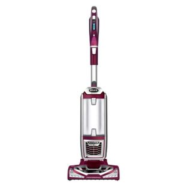
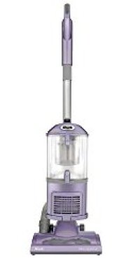
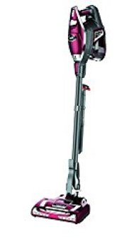

Pets play important roles in our lives, and no matter how much we love our furry friends, they tend to shed their fur. Researchers have found out that in some instances, animal fur is the base cause of respiratory problems by people living with pets. To avoid such predicaments it is important to equip yourself with proper tools to rid off pet hair and maintain hygiene in the household and keep your family safe from pet fur related complications.

This is where the best shark vacuum for pet hair plays an important role. There are several arrays in the market which raises the question, which shark pet vacuum is best for pet hair that can efficiently erase all traces of animal hair from your house? In this article, we have listed down details of each one to guide you pick the best shark vacuums for pet hair that suits your needs.

We have handpicked shark vacuum cleaners for pet [hair removal](https://www.bestofvacuum.com/best-vacuum-for-long-hair/); including their features, pros and cons. The in-detailed description of each one of them is depicted from an expert point of view. This has proven useful to many families by answering the technical questions arising when picking the best shark vacuums for pet hair removal.

**Also Read: [How to wash pergo floors without streaks](https://www.bestofvacuum.com/how-to-clean-pergo-floors/)**

### The Best Shark Vacuums for Pets Hair

| PICTURE | NAME | WEIGHT |
|---|---|---|
|  | Shark Navigator Upright Vacuum with Zero-M Anti-Hair Wrap Technology(ZU561) | approximately 13.4 lbs |
|  | Shark Rotator Professional Upright Corded Bagless Vacuum | 15.5 lbs |
|  | Shark APEX AZ1002 DuoClean with Self-Cleaning Brushroll Lift-Away Upright Vacuum | 16 lbs |

## Which is the best shark vacuum for pet hair?

Let’s review each one of them so that you are in a better position to pick the best shark vacuum for pet hair that meets your needs.

## 1\. SharkNinja Canister Upright Vacuum TruePet

SharkNinja Canister Upright Vacuum with mini-motorized brush continues to be many people’s favorite vacuum cleaner for pet hair thank to its ability to detach, making deep cleaning a possibility. It’s among the most powerful of Shark vacuums and can clean pet hair on hard floors and carpets efficiently. [**Click here to see today’s price on Amazon.**](https://www.amazon.com/gp/product/B00X7R1FZ2/ref=as_li_tl?ie=UTF8&camp=1789&creative=9325&creativeASIN=B00X7R1FZ2&linkCode=am2&tag=bestofvacuum2-20&linkId=7b9e3bb0c4e9e97b3ef1908d9df4cbfd) 

### Features

-   It is lightweight.
-   Stands upright, making it possible to clean while standing.
-   Easily maneuvers around the house past anything that may deem an obstacle.
-   Large-capacity dust cup thus you do not have to empty this Shark pet hair amid your cleaning.
-   Fitted with a never-lose-suction technology.
-   Brushroll shut off functionality.
-   It is corded.
-   SharkNinja Canister Upright Vacuum uses HEPA filtration technology.
-   Does not contain a bag.
-   Comes with a washable filter \[even the HEPA one\].
-   Lift-away handle that is prompted by a touch on a button for a change from hard-floor cleaner to a hand-held vacuum.
-   Cleans above the floor (ceiling, walls, and any other surface) thanks to a long hose and extra wand. This combination gives this best Shark vacuum for pet hair an extra 10ft that enables you to reach a larger area.
-   Advanced Swivel Steering for easy maneuverability.
-   Bright LED lights placed at the hand vac.

### Pros

-   It is lightweight at 15.50 lbs.
-   Does a better job when cleaning all types of floors.
-   Doesn’t lose suction power.
-   The upright stature allows SharkNinja Canister Upright Vacuum for easy maneuverability around the house.
-   The large dust cup does not give room for interruption. You can clean from the start to the end.
-   The 10-ft hose and wand extension help in the user reaching a larger cleaning area.

### Cons

-   The LED lights are so bright, making it uncomfortable for other users.

## 2\. Shark Navigator Vacuum with Zero-M Anti-Hair Wrap Technology, (ZU561)

Shark Navigator Upright ZU561 best vacuum for pet hair is red peony in color, making it one of the most stylish vacuum cleaners for pet hair Shark has ever made. [**Click here to see the today’s price on Amazon.**](https://www.amazon.com/gp/product/B07FX7Z3NL/ref=as_li_tl?ie=UTF8&camp=1789&creative=9325&creativeASIN=B07FX7Z3NL&linkCode=am2&tag=bestofvacuum2-20&linkId=eed2867656f223971c02b1f507890f28)

### Features

-   Fitted with a Zero-M head, which is responsible for guarding the cleaner against hair wrap.
-   Still on Zero-M cleaner head technology, it is easy for this Shark pet hair cleaner to remove long and short dog hair from clogging inside the brushroll.
-   To trap the dust from the house inside the vacuum, Shark Navigator Upright ZU561 comes with an anti-allergen complete seal. This plus the HEPA filter work better to lock the dust inside the vacuum.
-   Has detachable canister, making it easy to change from an upright Shark vacuum for pet hair for hard floor and carpet cleaning to other areas such as stairs, walls, and furniture.
-   Effortless maneuverability thanks to Advanced Swivel Steering technology.

### Pros

-   Lightweight at 13 lbs.
-   Swivel steering for easy maneuverability.
-   Complete dust seal technology thus no contamination when cleaning.
-   Works better on all types of floors, carpets, and above the floor areas.
-   The cord isn’t too long.
-   Best vacuum for pets for seniors who enjoy its maneuverability.
-   Easy-to-empty canister.
-   The hose and wand are extremely easy to use.
-   Not costly compared to others vacuum cleaners in the market.
-   Rotator feature is perhaps the biggest stronghold making navigation in tight corners easy.
-   The on/off button together with its placement is fantastic.

### Cons

-   No retractable cord.

## 3\. Shark Rotator Professional NV501 Vacuum

Shark Rotator Professional NV501 best Shark vacuum for pet hair is ideal for your family because it comes with an anti-allergen seal. With this in-built seal, it is not easy for this best shark vacuum cleaner for pet hair to let lose dust particles when you are cleaning. [**Click here to see the latest price on Amazon.**](https://www.amazon.com/gp/product/B0091JG0LY/ref=as_li_tl?ie=UTF8&camp=1789&creative=9325&creativeASIN=B0091JG0LY&linkCode=am2&tag=bestofvacuum2-20&linkId=6d9b1c1a0e1998a7e13bb9aaf3b580c3) 

### Features

-   This vacuum cleaner comes with a powerful premium brush that allows for the easy picking of any type of pet hair like labrador hair as well as other debris that may be in the house.
-   Fitted with anti-allergen complete seal, allowing users to be certain they aren’t leaving any dirt out of the vacuum cleaner. With this ability, you are sure of trapping over 99.9% of all allergens, pet hair and dust inside the vacuum.
-   With a press on a button, you can quickly convert Shark Rotator Professional NV501 into a hand-held best Shark vacuum for pets.
-   LED lights, placed at the right place, together with the advanced swivel steering, it will never be a problem to maneuver Shark Rotator Professional NV501 around the room even if the room is filled with furniture.
-   This best Shark vacuum cleaner for pet hair comes with an extra-large dust cup thus you can do your cleaning without the fear that you need to stop along the way to empty the cup.

### Pros

-   Strong brush with firm bristles that pick up debris and pet hair with easy.
-   The Anti-allergen complete seal is a good feature that guards your family against the spread of germs.
-   With the Lift-Away touch-on-the button feature, you can clean every part of the house even if it is above the floor.
-   The LED lights enable you to easily spot dust, debris, and pet hair before the best Shark vacuum for pet hair picks it up.
-   It is light in weight at only 15.5 lbs.

### Cons

-   The belt is not strong enough.
-   Roller brush is feeble.

## 4\. Shark Navigator NV352 Pet Vacuum

SharkNinja is stopping at nothing in designing affordable vacuum cleaners that will serve you in real time. The Shark Navigator NV352 Shark vacuum animal hair remover is one of these cleaning tools. You will love it because it is one of the lightest yet powerful vacuums for pet hair. [**Click here to see the latest price on Amazon.**](https://www.amazon.com/gp/product/B004Q4DRJW/ref=as_li_tl?ie=UTF8&camp=1789&creative=9325&creativeASIN=B004Q4DRJW&linkCode=am2&tag=bestofvacuum2-20&linkId=ed8ff603baa6e601d1a2bac130b78ca7) 

### Features

-   Portable, powerful, and lightweight, with all sorts of versatility.
-   Fitted with powerful swivel steering that offers exclusive control even in congested rooms.
-   No pet power brush.
-   Designed with wide pet upholstery.
-   Brushroll shutoff that allows for real time cleaning and shuts off whenever it hits the time set.
-   Fitted with advanced Anti-allergen complete seal that ensures not dirt drops on the surface or to the air once it has been collected into the vacuum.
-   Lift-away capability, making it easy to clean areas above the floor.

### Pros

-   Light in weight at 12.5 lbs.
-   Comes with additional accessories that include crevice tool and dusting brush.
-   Has an aggregate 30-ft long reach from the 5-ft hose and 25-ft power cord.
-   Excellent in picking up fur, pet dander, hair, and other debris.
-   Easy to use on carpets, rugs, and other surfaces above the floor.
-   Switching it to a hand-held vac is a press on the button, something that doesn’t take even a second.

### Cons

The top end part is a little heavy, making it prone to fall even with a slightest touch such as the touch of a playing kitten.

## 5\. Shark Rocket TruePet HV322 Corded Pet Hair Vacuum

Finding the best Shark vacuum for pet hair from a list of well-sorted Shark vacuums is not an easy thing. Perhaps, Shark Rocket TruePet HV322 is what your family needs.

Look at this! Shark Rocket TruePet HV322 best Shark vacuum for pet hair is indeed ultra-light, weighing just 9 lbs. [**Click here to see the latest price on Amazon.**](https://www.amazon.com/gp/product/B00NGVF4II/ref=as_li_tl?ie=UTF8&camp=1789&creative=9325&creativeASIN=B00NGVF4II&linkCode=am2&tag=bestofvacuum2-20&linkId=7a79d986c24f1f1cc13ff0798b11055e) 

### Features

-   A 2-in-1 vacuum cleaner that you can use on your bare floor, rugs, carpets and all forms of upholstery, as well as above the floor areas.
-   Convenient attachments that help you reach certain hard-to-reach areas in your house such as ceilings, shelves, and sharp corners of the room.
-   Features a whooping 10 LED lights that are placed on the floor base.
-   Two washable foam filters.
-   Microfiber towel that helps to clean your bare floor.
-   Fitted with advanced swivel steering that allows for easy and quick maneuverability around the house.

### Pros

-   It is super light weighing only 9 pound.
-   Bright LED lights that spot any dirt.
-   Easy-to-empty dust cup.
-   Shark Rocket TruePet HV322 comes with a 30-ft long power cord.
-   Press on the button that allows you to convert this Shark pet hair into a hand-held vac to clean stairs, ceilings, and other areas above the normal floor.

### Cons

-   Doesn’t come with HEPA filtration.
-   Small dust cup.
-   Hard to stand on its own.
-   Has whistling sound, which proves irritating to some users.

## 6\. Shark Rocket HV292 Ultra-Light Vacuum With Mini-Motorized Brush

You will definitely love this Shark vacuum for pets for many reasons. But, 2 chief reasons is that it is a Shark upright pet vacuum that is perhaps the most affordable.

Besides, it is extremely light. Think about it: you get everything you needed at the most affordable price and without the worry that it will tire you when pushing or pulling it around. [**Click here to see the latest price on Amazon.**](https://www.amazon.com/gp/product/B00P9Z36T8/ref=as_li_tl?ie=UTF8&camp=1789&creative=9325&creativeASIN=B00P9Z36T8&linkCode=am2&tag=bestofvacuum2-20&linkId=1daf909cf842e1ac21f8fd2ab66ee556) 

### Features

-   Comes with a mini-motorized brush that allows for easy and quick picking of debris.
-   Easy to empty dust cup. You do not have to use a lot of energy when emptying the cup. Rather, you only need to press a button, and that is it.
-   Strong suction power.
-   15-ft power cord that allows you to complete your cleaning without interruptions such as recharging.
-   This Shark upright pet vacuum uses only 400 Watts.
-   Has washable filters.
-   Contains dusting brush.
-   Has a 12” crevice tool.

### Pros

-   Ultra-light with only 3.7 lbs.
-   Shark Rocket HV292 uses little energy with only 400 Watts.
-   With washable filters, you will save a lot of money that would be used to purchase filters that cannot be washed then be used.
-   It is affordable compared to most Shark vacuums for pets.
-   Strong suction power.
-   No clogging.

### Cons

-   Needs to have more and better attachments.

### What Makes Shark Vacuum Great?

It is important to know that like other vacuum cleaner manufacturers, SharkNinja has been in the industry for many years. The company continues to stay afloat because of a number of reasons. In this write-up, I’ll address 5 reasons why you should consider Shark vacuum for pets to be your number one vacuum cleaner.

### 1\. Pricing

Contrary to the general opinion that price corresponds to quality, Shark vacuums are so far the most affordable. It is true that you can get other brands at a lower price but from my experience, most Shark vacuums for pet hair are affordable compared to their competitors.

You may argue that buying a vacuum cleaner at let’s say $299 is not affordable. Yes, I agree with you. But, what if you buy a vacuum cleaner that offers the same service with the exact features from a competing client at a cost of $499?

### 2\. Dual-Floor Capability

I bet you have used different types of vacuum cleaners and seen how each of them work. You will agree with me that not all brands you have used come with dual-floor capability. I mean, not all vacuum cleaners in the market have the ability to clean all types of floors, carpets, rugs, upholstery; furniture, stairs, walls, and even ceilings.

Interestingly, almost all Shark vacuums come with this capability. What is more, all the six Shark vacuums for pets listed  below come with this capability. What more do you need than a vacuum that helps you to clean every corner of your house?

### 3\. Maneuverability

If you live in a house filled with furniture, have two or more pet animals, and of, course your family, then you know an easy-to-maneuver vacuum cleaner is essential.

In a society where various investors need to get rich quickly without offering better services, it is easy to find substandard products. Vacuum cleaners with rigid steering and small tyres make it almost impossible to clean a congested room.

The beauty about Shark vacuum cleaners especially the best Shark vacuums for pet hair is that they all have Advanced Swivel Steering Technology. This technology, coupled with a number of other features makes it easy to clean even a house that is filled with all sorts of furniture.

### 4\. Upright Stature

Trust you me, all the Shark vacuum cleaners above are upright. You cannot begin to think of the benefits of having an upright vacuum cleaner in the house.

-   First, they do not require a big storage space. As long as you lean then against the wall or something that cannot easily fall, you are done with storing your Shark upright pet vacuum.
-   Second, [upright vacuum cleaners are the best for seniors](https://www.bestofvacuum.com/best-lightweight-vacuum-cleaner-for-the-elderly/) whose backs and joints do not need much bending. You see! Shark upright vacuums are the best for these senior citizens.

### 5\. Lightweight

Weight is perhaps one of the biggest factors you look at when purchasing a vacuum cleaner. Although most Shark vacuum cleaners for pet hair come with power cords, their weight is excessively low compared to other brands.

From the below list alone, you can get the best Shark vacuum for pet hair that is below 4 pounds! This is incredibly light and anyone can use it without complaining of their arms feeling the fatigue from the weight.

The entire shark vacuum for pets in the list below is sourced firm one manufacturer. The company under the name SharkNinja has preceded its reputation for supplying reliable and the best shark [vacuums for pet hair removal](https://www.bestofvacuum.com/best-vacuum-for-pet-hair/) across families in the world. Either way this list is your best option to ensure your family is living in a hygiene and fur free homestead.

#### Conclusion

I hope you have seen that there is a lot that SharkNinja is doing to ensure your house is free from pet hair. Besides, you do not have to spend hundreds of dollars to get the best Shark vacuum for pet hair. For you and your family to stay a stress-free life, pick one Shark vacuum for animal hair and you will never regret to have made the decision.