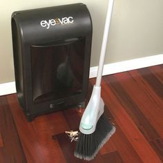
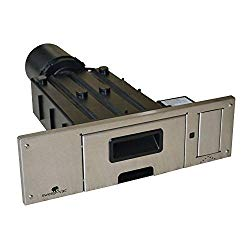
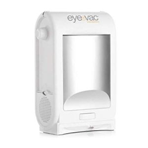
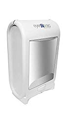
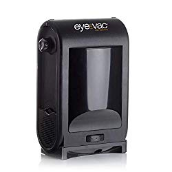
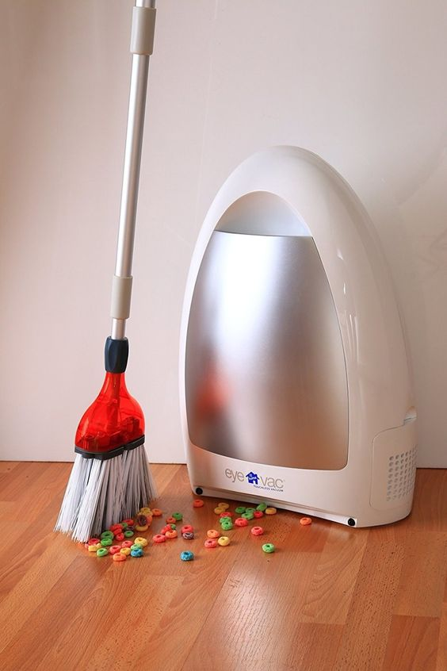

Stationary vacuums, are the modern-day answer especially to those tired of bending over with a handheld dustpan when cleaning.

People love touchless stationary vacuums because of their incredible suction power which gets rid of pet hair, [long and short human hair,](https://www.bestofvacuum.com/best-vacuum-for-long-hair/) dirt and dust from wooden floors without making the user bend over.

Although these vacuums are a common fixture in commercial places like hair salons, boutiques and custom-built kitchens, they are affordable for almost anyone. Some styles don’t even require installation.

| Picture | Name | Weight | Special Features |
|---|---|---|---|
|  | EyeVac Pet -Touchless Stationary Vacuum for Pet Hair, Dust and Debris | 14 lbs | Corded |
|  | EyeVac Home - Touchless Stationary Vacuum | 9 lbs | HEPA Filter |
|  | Sweepovac SVP SL2 Undercounter Kitchen Vacuum |  | Comes with anti-bacterial bags |

## The Best Stationary Vacuums in 2022

This article delves into best stationary vacuums you can consider. When evaluating each of the following machines, look at exceptional features. You will see that some have powerful motors, others excellent HEPA filtration, and LED indicators. Let these and other features guide you as you look into best touchless stationary vacuum cleaners that are top rated on market right now.

## 5) Sweepovac Silver Finish Built-in Kitchen & Cabinet Vacuum Cleaner

Here is a solution to all your kitchen-cleaning problems. The Sweepovac Vacuum best toe kick vacuum is designed to clean even the smallest places in your kitchen. It also has a sleek and modern design that makes it a beautiful accessory to your kitchen. [**Click here to see today’s price on Amazon.**](https://www.amazon.com/gp/product/B07FNRZPYP/ref=as_li_tl?ie=UTF8&camp=1789&creative=9325&creativeASIN=B07FNRZPYP&linkCode=am2&tag=bestofvacuum2-20&linkId=1533bf68792661a883108ff65f125a26)

### Features

-   Small vacuum that can fit under your kitchen counters.
-   Easy to turn on. Tap the vacuum with your foot and switch it on then leave it to clean.
-   The vacuum switches itself off after every ten seconds in order to save energy and electricity.
-   Easy to empty dust bag. You can also re-use the bag once you have emptied it.
-   Has anti-bacterial bags that can remove bad odors and harmful bacteria in your home.
-   It is made with heavy-duty materials that can withstand constant use.
-   Easily cleans pet hair and dust.
-   It can be installed in the bottoms of cabinets which makes it easier to collect dust.

### Pros

-   Best toe kick vacuum.
-   Easy to install and easy to maintain.
-   Three attachments that makes cleaning easier.
-   Re-usable and easy to clean bags.
-   Easy to turn on.
-   Cleans under cupboards and hard to reach areas.

### Cons

-   The plastic casing wears out easily.
-   There might be some issues when it comes to installation.

## 4) EyeVac PRO Best Stationary Vacuum

If you sweep a lot and have back problems, mobility problems or knee problems, EyeVac PRO stationary vacuum will allow you to sweep while removing the burden of bending down to use a regular handheld dust pan. It is easily activated with infrared sensors. [**Click here to see today’s price on Amazon.**](https://www.amazon.com/gp/product/B01CDIEAJS/ref=as_li_tl?ie=UTF8&camp=1789&creative=9325&creativeASIN=B01CDIEAJS&linkCode=am2&tag=bestofvacuum2-20&linkId=d8d31ca0b1e8075f16975383912a2b35)

### Features

-   The vacuum has touchless activation with infrared sensors that easily activate it.
-   EyeVac PRO has a 1400-watt motor that sucks 100% of dust and all debris on hard floors.
-   It has high efficiency dual filtration. This removes and cleans all dust, pet hair, and debris from your home.
-   If you are looking for a commercial vacuum, EyeVac PRO can make a good salon vacuum cleaner. It has the ability to remove hair in between seats.
-   Good pet hair vacuum that removes all pet hair, feathers and treats leaving the floors clean.
-   Has an easily removable filter. All you have to do is remove the filter and empty it making it easy to maintain.
-   Turns itself off automatically once all the debris has been removed.
-   It comes with dual settings for automatic activation or for manual activation according to your specifications.
-   Stress-free vacuum. Doesn’t need you to constantly monitor it. The machine works on its own.

### Pros

-   Cleans up dirt, hair, and debris on hard floors with high efficiency.
-   Sleek and stylish design that can fit in any office.
-   Dual high-efficiency filters that remove and purify air at home.
-   High powered motor that increases its suction power.
-   Best vacuum for people with back problems.

**Also Read: [Backpack vacuums](https://www.bestofvacuum.com/best-backpack-vacuum/)**

### Cons

-   There can be problems with the sensors.
-   Cannot pick up larger debris.

## 3) EyeVac Pet -Touchless Stationary Vacuum for Pet Hair

If you are looking for a [vacuum that is specially designed to remove pet hair,](https://www.bestofvacuum.com/best-shark-vacuum-for-pet-hair/) then the EyeVac Pet-Touchless Vacuum is the answer to your problems. [**Click here to see today’s price on Amazon.**](https://www.amazon.com/gp/product/B01CDIEAJS/ref=as_li_tl?ie=UTF8&camp=1789&creative=9325&creativeASIN=B01CDIEAJS&linkCode=am2&tag=bestofvacuum2-20&linkId=0284e7ed5f4dfaa881fec52efd088dcb)

The vacuum can pick up any hair shed by your pet. This machine can also clean any kind of mess left around by your pet. It makes having pets in the house much easier because you don’t have to clean up after them.

### Features

-   Touchless stationary vacuum that is specifically made for cleaning in houses with pets or spaces that require regular cleaning.
-   It is a stationary vacuum for pet hair, food, or other debris. The vacuum uses infrared sensors to sweep up any dirt or dust left by your cat or dog.
-   Comes with a powerful 1400-Watt motor that gives powerful suction enabling the machine to pick dirt and debris.
-   Dual filtration system that not only cleans your house but also purifies the air.
-   Has a red indicator light that lights up to indicate when the canister is full and needs to be emptied.

### Pros

-   Dual HEPA filtration system that cleans and purifies the air in your home.
-   Infrared sensors that easily sweep up all the dirt and dust around it.
-   Automatic turn-on and switch/off features.
-   Easy to empty and clean bag-less canister.
-   Red status indicator to show when the canister is full.
-   Perfect for houses with pets.

### Cons

-   The sensors might turn themselves off even when in use.
-   Small dirt collecting hole that might get clogged up with heavier objects.

## 2) EyeVac Home Stationary Vacuum

This eye vac home touchless sensor activated vacuum comes in two colors, white and black. It sweeps up whatever kind of dirt that is thrown its way. The EyeVac Home-Touchless sensor activated vacuum does not need constant monitoring. It automatically turns itself on with the automatic sensors. [**Click here to see today’s price on Amazon.**](https://www.amazon.com/gp/product/B00RVMC58U/ref=as_li_tl?ie=UTF8&camp=1789&creative=9325&creativeASIN=B00RVMC58U&linkCode=am2&tag=bestofvacuum2-20&linkId=476f75c3f4049db73122470bbc5ec506)

### Features

-   It is a [lightweight vacuum](https://www.bestofvacuum.com/best-lightweight-vacuum-cleaner-for-the-elderly/). At 9 pounds, this vacuum is easy to move around with thereby increasing mobility.
-   It has a powerful 1000W motor that makes high suction power to clean anything around it.
-   Has two settings, automatic and manual. This allows you to choose the mode you are more comfortable with.
-   The vacuum also has a third indicator light that signals whenever the canister is full.
-   Large bag-less canister that can hold a lot of dirt.
-   Easy-to-empty canister.
-   It has a dual HEPA filtration that can be used by people who are allergic to dust or have asthma.
-   The EyeVac Home has a pair of infrared sensors that automatically turn on when there is dirt nearby.

### Pros

-   Automatic infrared sensors that turn on whenever there is dirt.
-   Bagless canister that is easy to empty.
-   Dual HEPA filtration that removes allergens.
-   Has an indicator that shows when the canister is full.
-   Lightweight thus portable.

### Cons

-   The sensors might be touchy.

## 1) EyeVac PRO Touchless Stationary Vacuum

Here is another marvelous vacuum from the EyeVac geniuses. This [vacuum is good for use in any commercial places](https://www.bestofvacuum.com/best-commercial-vacuum/). It can pick up any kind of hair, whether human or pet. You can use the vacuum either in salons or at home. The vacuum is highly efficient and can remove any debris however huge they are making it one of the **best stationary vacuums** in the market. [**Click here to see today’s price on Amazon.**](https://www.amazon.com/gp/product/B00RVMC58U/ref=as_li_tl?ie=UTF8&camp=1789&creative=9325&creativeASIN=B00RVMC58U&linkCode=am2&tag=bestofvacuum2-20&linkId=476f75c3f4049db73122470bbc5ec506)

### Features

-   It is a stationary floor vacuum. This means that it can clean without moving around. You can, however, move it from place to place if you need to clean different areas.
-   The EyeVac PRO is a touchless stationary vacuum. It has infrared sensors that have auto turn-on features so you don’t have to switch it on manually.
-   Has a modern design that can fit into any environment, whether a work environment or at home.
-   It cleans dirt, dust and food particles easily.
-   The vacuum contains a dual high efficiency filtration that leaves you with pure and clean air.
-   Easy to use and doesn’t need a lot of maintenance.
-   It is perfect for houses with pets. It can also be used commercial places like hair salons due to its high efficiency cleaning.

### Pros

-   Bag-less canister that is easy to empty.
-   Auto turn-on features so you won’t have to touch it.
-   Two modes – automatic and manual, which makes work easy.
-   Cleans up any kind of dirt, dust and debris easily.
-   Modern design that allows it to fit in office environments.

**Cons**

-   Touchy sensors that once faulty it becomes difficult to operate the machine.

**Also See:**

-   [**Best vacuum with retractable cord**](https://www.bestofvacuum.com/best-vacuum-with-retractable-cord/)
-   [**Best vacuum for cat litter on hardwood floors**](https://www.bestofvacuum.com/best-vacuum-for-cat-litter/)
-   **[Best vacuum cleaners for elderly](https://www.bestofvacuum.com/best-lightweight-vacuum-cleaner-for-the-elderly/)**

## Touchless Stationary Vacuum Cleaner Buyer’s Guide

A stationary vacuum cleaner is a modern and more efficient solution to handheld dustpans. What makes the difference between the two machines? A stationary floor vacuum is an automated dustpan that sucks dirt with the aid of a sensor, leaving no mess behind. It is a life-saver for people with very busy schedules or bad backs. The device is most common in salons and homes with many pets.

If you want to have the best stationary vacuum, you must put a few factors into consideration. After all, everyone feels happy if they get a machine that best suits your needs, here are some of the factors and features to look for:

-   **Style**

Stationary vacs are made as either built-in or free-standing. If you are looking to save on space or if you do not have much space then your best option would be the built-in system. Built-ins are common in bathrooms and kitchens due to the limited space.

On the other hand, most people who own salons and shops prefer the free-standing stationary floor vacuums. In my view, most free-standing vacuums have sleeker design. Whichever way you choose, style is a personal preference.

Most stationary vacuums do not hold as much dirt as full-sized uprights. They are much smaller therefore have slightly smaller capacities. Generally, built-in vacuums hold less waste than free-standing ones.

The best part of home stationary vacuums is that they do not require a large space. However, you can also choose which style you need from the many that are available in the market.

-   **Filtration**

Filtration is an important factor especially for people with allergies or those who have fur-shedding pets. Different vacuums have different filters.

Some vacuum cleaners are frilled while others are fluffy. They also vary in particle-capturing percentage. Majority of vacuum cleaners trap about 90-95 percent of dirt while a few trap about 99 percent of dirt. HEPA filters are the best because they offer 99.7% filtration. You can also get a few exceptions with recyclable filters.

It is a good thing to look at filtration details for they determine how clean your home can be.

-   **Motor**

A vacuum’s motor specifications determine its power usage and suction capabilities. The watts show how much power the motor utilizes and the number of amps affect other aspects such as indicator lights.

Initially, touchless vacuums were designed for commercial use. They were not very common in homes. This changed when people realized how effective the machines are. Today, many homeowners prefer touchless vacuum.

Manufacturers have seen the demand thus have designed more touchless vacuums for home use. Most of the touchless vacuums can be used both at home and in salons but some are designed for commercial purposes only.

-   **Indicator**

Anything that has an indicator is a lifesaver. With an indicator, you are able to know where you are headed to. Some indicators tell you what to do, the direction to follow and such like.

Touchless stationary vacuums’ indicators do not show you where to go. Instead, the LED light indicators inform you when the machine is clogged, something is faulty or when it senses dirt.

What else would you want than a modern machine that alerts you when it senses danger in the house?

**PS.**Not all touchless home cleaners have indicators; only the best stationary vacuums have indicators.                                                                                                                   

#### **Conclusion**

Whether you have a busy schedule, many pets, a hair salon to run, kids in the house or you are just looking to make work easier, it is quite clear that a touchless stationary vacuum cleaner is an important device. Choose one of these **best stationary vacuums** you have just read about and witness the difference – especially those tired of bending over with a dustpan.

## **Frequently Asked Questions**

## ****How do I clean an eye vac filter?**** 

The first step is to turn the control dial off. You then need to unplug the unit from the power source. To locate the filter, pull out the bin and lift the grip away from the main unit.  
Twist the filter to the unlock position by turning it in an anti-clockwise motion. You will then pull the filter out, wash it with mild soap and water.

After cleaning, ensure the filter is completely dry before putting it back. Once it dries up, slide the filter back into the collection bin and lock it. Then return the bin in place.

## ****Which is better between EyeVac home version and EyeVac PRO?**** 

It all depends on your needs and preference. The PRO version is more suitable for commercial use such as in hair salons and beauty parlors. The EyeVac home version best suits residential environments.

The machine is for excellent in cleaning up pet hair, dust, pollen and any other debris that is likely to be found in homes.

## ****Can I use a regular broom with home stationary vacuum?****

Yes! You can use a regular broom to sweep the dirt to the vacuum cleaner be it a salon vacuum or home vacuum. This has no effect on the functionality of the vacuum cleaner.  
You can use also use a Swiffer sweeper or anything else, as long as it will get the dirt closer to the cleaner.