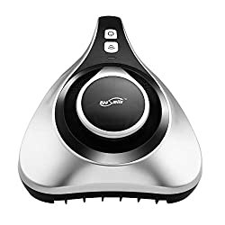
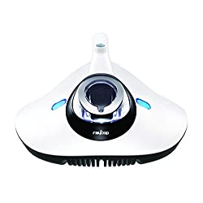
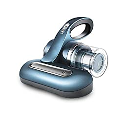
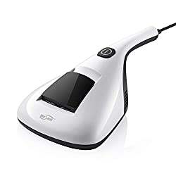
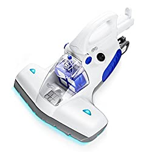

I’m sure by now you have used several vacuums. Because there are many vacuum cleaners in the market, the big question is, Which is the best UV vacuum cleaner you can trust?

From my own research, I have realized that it is not easy to find the ideal UV vacuum cleaner. Nonetheless, it does not mean that it is impossible to land on the best uv vacuum. If you take your time, you will find the UV vacuum cleaner you’ve ever wanted.

All of us crave for health families. However, it is not easy to find the right tools and apparatus that ensure our loved ones stay in a conducive environment such as a UV vacuum cleaner that can eliminate dust mites, pollen, viruses, bacteria, and other harmful microorganisms.

It is with your best interest and that of your family at my heart that I have spend several months doing research on the UV handheld vacuum cleaners for home.

## Best Uv Vacuum Cleaners

| Picture | Name | Suction Power | Weight |
|---|---|---|---|
|  | Mattress Vacuum Cleaner with 11KPa Powerful Suction | 11 Kpa | 2.86 lbs |
|  | LivePure Ultramite UVC HEPA Allergen Vacuum & Fabric Sanitizer |  | 2.86 lbs |
|  | Raycop LITE-100AWH Vacuum |  | 4.29 lbs |

## **1\. Housmile UV Vacuum Cleaner (Upgraded 810)**

If you want to own a vacuum cleaner with advanced HEPA filtration, consider Housmile 810 Upgraded the best option. The UV handheld vacuum cleaner is built with the exceptional ability to capture up to 99.98% of particles. [**Click here to see today’s price**](https://www.amazon.com/gp/product/B08NTHYLJ4/ref=as_li_tl?ie=UTF8&camp=1789&creative=9325&creativeASIN=B08NTHYLJ4&linkCode=am2&tag=bestofvacuum2-20&linkId=8c624b73e391828192c4712b06f88ea9) **on Amazon.**

One of the things that stand out about this UV vacuum cleaner is that you can reinforce its filtration strength by purchasing additional filters. The more HEPA filters you add to this mattress vacuum cleaner, the more powerful it gets.

To ensure efficiency, Housmile Upgraded 810 comes with 20% more UV light. With an additional UV light, you can be sure this best UV vacuum will deep clean your upholstery, mattresses, and other mats in your house.

Thanks to the exceptional Activated Carbon Filtration Technology, you are assured that no single air pollution will get its way to your home. The result is a safe and air-pollution free home.

**You might be interested in [water filtration vacuums](https://www.bestofvacuum.com/best-water-vacuum-cleaner/)**

Surely, what more would you want other than a UV handheld vacuum cleaner with only 4.5 lbs? For many nannies or any other user in the house, a UV vacuum that is less than 5 lbs is ideal and does not tire your hands.

In addition, the vacuum cleaner has a compact design, something that makes it stand out. Besides, the UV vacuum cleaner is fitted with an in-built 200ml dust collector.

### **Notable features**

-   5 KPa suction power.
-   Activated Carbon Filtration Technology.
-   A 200ml dust collector.
-   Upgraded UV light.
-   Advanced HEPA filtration.

**Pros**

-   The UV vacuum cleaner is light.
-   Collects up to 0.03 microns of dust.
-   You can easily access under chairs, tables, and beds.
-   You will enjoy having a large dust cap at the bottom.
-   The vacuum cleaner has advanced suction power.
-   You can add HEPA filters as you wish.
-   It has a compact design and is handheld.
-   Effectively removes and curbs air pollution from the house.

**Cons**

-   The motor vibrates a lot thus a bit noisy.

## **2\. RAYCOP LITE UV Sanitizing HEPA Allergen Vacuum for Mite and Viruses**

RAYCOP LITE UV is one of the bed vacuum cleaners with UV light I have come across. With a patented RayClean Advanced technology, you will easily clean all parts of your house including under the tables, walls, cabinets, and under carpets. [**Click here to see today’s price on Amazon.**](https://www.amazon.com/gp/product/B073GD62CN/ref=as_li_tl?ie=UTF8&camp=1789&creative=9325&creativeASIN=B073GD62CN&linkCode=am2&tag=bestofvacuum2-20&linkId=6231de12d84c8d1f8086149fe44308e5)

Using a powerful UV lamp that has a calibrated wavelength, the best UV vacuum cleaner ensures you get the best results in the house. I am taking about removing over 99.9% of all harmful bacteria, fungi, mold, dust, viruses, and pollen that might have its way to your house.

Because the lamp has a lot of power, you do not have to expose it for long to your skin or use the UV sterilizer for bed for long. You only need to start cleaning the house using this UV vacuum cleaner when you are set.

Interestingly, according to studies, the bacterial survival rate after getting in contact with RAYCOP LITE UV Sanitizer & Vacuum Cleaner is close to none. The studies reveal that even with a 2-second exposure to the UV lamp, the bacterial survival rate was zero percent.

To loosen and agitate dust, mold, and any harmful deposits in concealed parts of the house, RAYCOP LITE UV Sanitizing HEPA Allergen Vacuum’s pulsating pads vibrate up to 5000x per minute. With these vibrations, no mite or dust will remain in the house no matter how long these unwanted things have remained in the house.

The HEPA filtration fitted in this machine has an additional mesh that helps trap large, small and fine dust particles. This, coupled with the powerful suction, you will not go wrong with this dust mite cleaner.

This product has received numerous approvals such as the British Allergy Foundation Seal of Approval as well as Certificate of Quality from SLG.

### **Notable features**

-   Powerful UV lamp.
-   Patented RayClean Advanced Technology.
-   Pulsating pads (vibrating between 4600 and 5000x per minute).
-   Purification filter with additional mesh.
-   UV sanitizer.

**Pros**

-   Eliminates dust, mite, pollen, viruses, allergens, and polluted air from home. The aforementioned are the leading causes of deaths in the U.S alone.
-   Powerful UV lamp.
-   The UV vacuum cleaner is lightweight
-   Highly effective purification filter.
-   Kills germs within 2 seconds of UV lamp exposure.
-   Thanks to the additional mesh, the filtration is superb.
-   Powerful brush function.

**Cons**

-   Overexposure to the UV lamp may damage your skin.
-   The UV lamp may go on or off at a time you are not prepared.

## **3\. Make Lemonade UV HEPA Filtration Vacuum**

While other vacuum cleaners come with a single UV lamp, this upholstery vacuum cleaner comes with UV bulbs. These non-toxic bulbs are deemed powerful than a single lamp. Because of their strength, the bulbs are able to identify and eliminate bacteria, dust mites, allergens, and other microorganisms within a few seconds, usually 5 or less. [**Click here to see today’s price on Amazon**](https://www.amazon.com/gp/product/B07HD1KDNY/ref=as_li_tl?ie=UTF8&camp=1789&creative=9325&creativeASIN=B07HD1KDNY&linkCode=am2&tag=bestofvacuum2-20&linkId=f83d5c8446036df862fe2ad5fde98989)

To make your cleaning work a lot easier, Make a Lemonade UV HEPA Vacuum cleaner is fitted with 18V lithium battery. With this rechargeable battery, you do not have to worry that your vacuum cleaner will not help you at a time you have a power outage.

The interesting thing about Make a Lemonade’s 18V lithium battery is that it is able to charge in 4 hours or less. Upon completion of the charge, you are able to use the vacuum cleaner for about 30 minutes, which is enough time to complete the whole house.

In addition, this UV sterilizer for bed is cordless. What other convenience do you want apart from a cordless vacuum cleaner with 10W and 4KPa suction power?

### **Notable features**

-   4KPa suction.
-   8V rechargeable lithium battery.
-   10W motor.
-   UV sanitization.

**Pros**

-   It is cordless thus convenient to carry anywhere in the house.
-   Does not consume a lot of power (just 10W motor).
-   Strong and powerful suction.
-   Beautiful look with stunning design.
-   Powerful UV bulbs for detecting and killing germs.
-   You can conveniently recharge within 40 minutes.
-   You can replace filters whenever you want.
-   Works for close 30 minutes after charging.

**Cons**

-   The battery subsides fast.
-   It is a bit heavy at some 6.3 lbs.

## **4\. Housmile 804 UV Vacuum Cleaner for Anti Dust Mites** 

If you are disappointed with ordinary vacuum cleaners, try this UV sterilizer for bed. This deep cleaning vacuum for mattress has among other things exceptional features that make it stand out among its peers. [**Click here to see today’s price on Amazon.**](https://www.amazon.com/gp/product/B07HD1KDNY/ref=as_li_tl?ie=UTF8&camp=1789&creative=9325&creativeASIN=B07HD1KDNY&linkCode=am2&tag=bestofvacuum2-20&linkId=f83d5c8446036df862fe2ad5fde98989) 

Housmile 804 UV Vacuum cleaner is specifically bestowed with the power to clean up mites. While it doesn’t mean that this best bed bug vacuum cleaner cannot do other things, the fact is priority is given to eliminating mites.

This best UV vacuum cleaner is built with a unique 253.7mm UV tube for sterilizing.

In addition, the machine has the ability to heat up to 55 degrees Celsius. At this temperature, no single mite will survive no matter where it hides in the house. Apart from mites, the UV vacuum cleaner eliminates bed bugs, bacteria, viruses, and other microorganisms.

Double suction power combined with the perfect cooperation of the machine’s 3800x vibrations per minute makes this mattress vacuum cleaner with UV light ideal for eliminating all fungi and bacteria.

The machine has 8.5 KPa suction, which attracts mites and dust on its base as well as the upper. With this ability, you are sure to eliminate dust and mites from high-risk places such as below the mattress, under carpets, doormats and any other upholstery in the house.

### **Notable features**

-   HEPA filtration technology.
-   Activated carbon filtration.
-   Powerful suction measuring 8.5 KPa.
-   Vibrates up to 3,800 – 6,500 times every 60 seconds.
-   Capture up to 99.7% dust and bacteria.

**Pros**

-   Captures up to 0.03 microns of dust.
-   Ideal for mites, fungi, and other harmful bacteria.
-   Powerful suction.
-   Good in removing mites and dust from under the mattress and carpets.
-   Blocks pollution up to two times more.
-   Good sterilizer.
-   Lightweight with just 3.3 lbs.
-   Exceptional for eliminating all allergens thanks to the high temperatures.

**Cons**

-   Vibrations make it a bit loud and shaky.
-   The tube light does not glow well.

## **5\. Housmile UV Bed Vacuum Cleaner- Best Uv Vacuum**

This mattress vacuum cleaner with UV light is built with a unique handle. The handle is telescopic. Besides, it is concealed from many people yet you can access it. Once you have a firm grasp of the telescopic handle, cleaning your mattresses, sofas, curtains, pillows, and mats will be an easy thing. [**Click here to see today’s price on Amazon.**](https://www.amazon.com/gp/product/B07HD1KDNY/ref=as_li_tl?ie=UTF8&camp=1789&creative=9325&creativeASIN=B07HD1KDNY&linkCode=am2&tag=bestofvacuum2-20&linkId=f83d5c8446036df862fe2ad5fde98989)

Housmile Upgraded 836 comes with an advanced suction power with 12 KPa. With this suction power, you are sure the machine will remove all dust mites, fungi, viruses, and any harmful bacteria from your house.

The most important thing is that the vacuum cleaner comes with a strong UV light, a feature that helps in identifying, capturing, and eliminating all pathetic germs from your upholstery, mats, mattresses, and seats.

### **Notable features**

-   Upgraded 836 version.
-   12 KPa powerful suction.
-   Telescopic & concealed handle.

**Pros**

-   Cleans mattress, pillows, and sofas fast and conveniently.
-   Easy to use.
-   Nice-looking handle.
-   Compact design.
-   Powerful sucking thus reliable.
-   Little vacuum with quality features.
-   Sturdily built.

**Cons**

-   The lamp goes off when you need it.
-   Sanitizing isn’t as quality as such.

## **What Are Dust Mites?**

Dust mites are small pests. It is not easy to identify dust mites using your naked eyes. In fact, it is even difficult with the help of glasses. Unless you use special magnifying glasses, chances of seeing dust mites are minimal.

Just imagine how hard it would to see a pest that is less than a millimeter. Scientists argue that an adult dust mite is a **half a millimeter**. If the size of a mature dust mite is that small, what of a juvenile dust mite?

The funniest part about dust mites is their body color. Dust mites are cream in color. As you well know, cream or bright colors are some of the colors many people prefer. Most houses here in the U.S are painted cream or any other bright color.

With a cream color, you can imagine how difficult it would be to spot a dust mite even if you had the powers to. As such, dust mites blend with the surrounding.

Although small, dust mites have 8 legs. Still, you cannot see dust mites. In fact, even when they are in a group, which is usually the case, you are likely to take them for a small pile of sand or dust.

The other thing you need to understand about dust mites is that they are not found in dirt homes alone. Well, it is true that dirty homes have more dust mites than clean homes. However, dust mites can invade a clean home fast. They build colonies within a short while, making it impossible for humans to breathe freely.

Dust mites feed on dead food. I mean, they thrive and survive on dead cells that fall from your skin. So, you can see that dust mites need you to be alive for their survival. They quench their thirst with humid air thus they do not need a glass of cold or warm water. That is how simple their life is!

## **How Do Dust Mites Affect You?**

A dust mite is not a bed bug. When I speak about bed bugs, perhaps you know I am talking about how painful they bite. However, you do not expect dust mites to behave the same. On the contrary!

Although dust mites might find their way to your skin, that is usually not their intention. Dust mites want to hide themselves in humid and warm environment and they find it close to the human skin. However, they prefer hitching on your clothes and beddings for the warmth.

If they don’t bite you, how do they affect you? The truth is, dust mites are one of the leading causes and spreaders of asthma in small children whose breathing system is fragile.

Many people who are allergic to dust usually are enemies of dust mites and not the dust itself.

When they die, dust mites can form a large pile on unclean parts of the house such as below tables, chairs, sofas, upholstery, and cabinets that are not cleaned from time to time.

In the end, if you let dust mites invade, accumulate, and thrive in your home, you will be breathing air that is full of dead dust mites. This air gets into your lungs through the nostrils. The result is having a weak immune system, which is potentially a health disaster. Alternatively, dust mites can even get to you via your skin. As you know, at this point, chances of getting eczema are high.

## **How Can You Avoid Dust Mites?**

A clean home is a no-go zone for not only dust mites but also many other microorganisms. Here are a few practical ways to avoid dust mites in your home:

***Vacuum regularly using UV vacuum cleaners –***regular UV vacuuming is a sure way of ensuring you destroy the conducive environment for dust mites. Again, at this point, you need a UV vacuum not just any other vacuum cleaner. If you find the best UV vacuum cleaner, like those in this list, be assured of eliminating dust from your beddings, seats, and shelves in your house and no day will you see dust mites in your house.

***Make good use of HEPA filters –*** remember, HEPA filters are designed with exceptional abilities to trap up to 99.9% particles. This way, you will minimize the chances of dust mites releasing allergenic enzymes into the air.

***Keep your home’s humidity levels as low as possible –*** while you might not have absolute control over this, chances are you can regulate the humidity levels of your house. Utilizing [dehumidifiers](https://www.amazon.com/gp/product/B07VWHR7LQ/ref=as_li_tl?ie=UTF8&camp=1789&creative=9325&creativeASIN=B07VWHR7LQ&linkCode=am2&tag=bestofvacuum2-20&linkId=45fc5fa64be15fd901ca6db310747a12) help in removing excessive water from the air (a crucial element for dust mites’ survival).

***Avoid cluttering your house –*** sweep all litter away as fast as possible. Whenever possible, have a litter bin set aside somewhere outside the house and clean it regularly.

***Use hypoallergenic bed linens*** – you may ask, “Why the hell should I use [hypoallergenic bed linens](https://www.amazon.com/Sheets-Pillowcases-Hypoallergenic-Bedding/s/ref=as_li_ss_tl?rh=n:1063274,p_n_feature_seven_browse-bin:10671128011&linkCode=ll2&tag=bestofvacuum2-20&linkId=dafff1cd7436192b59daa93281871648&language=en_US)?” or “What are hypoallergenic bed linens?” The simple answer is these are bed linens that are tightly-woven. The aim is to make it difficult for even the smallest particle or pest to pass through. Therefore, in case there are dust mites in the house, or somewhere close to the house, using hypoallergenic beddings helps curb the spread and the invading of dust mites to your bed. if possible try as much as you can to use linens, sheets, bed covers, pillow covers, and even seat covers that are tightly-woven.

## What is the Best UV Vacuum?

**7 Best UV Vacuum cleaners:**  
**1\. RAYCOP LITE UV Sanitizing HEPA Allergen Vacuum Effectively Removes Dust Mite.  
2\. LivePure Ultramite UVC HEPA Allergen Vacuum.  
3\. Mattress Vacuum Cleaner Vacuum Cleaner with 11KPa Powerful Suction Handheld UV Vacuum.   
4\. Raycop LITE-100AWH Vacuum.  
 5. Housmile Corded Handheld Vacuums, Mattress Vacuum Cleaner with Roller**   
 

#### **Conclusion**

Yes, with diligence, hard work, and good resources such as investing in the best UV vacuum cleaners that have exceptional suction power and HEPA filtration, you get rid of dust mites and other harmful microorganisms completely. With a clean home, you are sure of saving a lot of money and resources and having healthy and loving family for long.