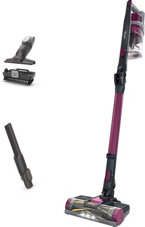
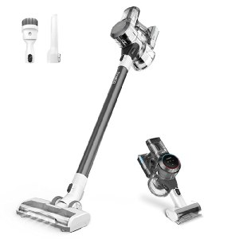
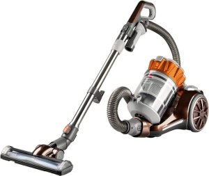
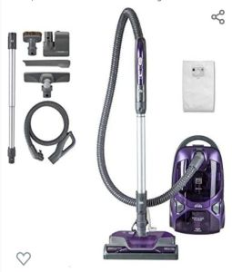
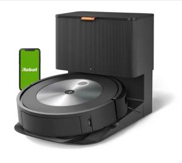

Hardwood floors are a beautiful addition to any home, but keeping them clean and free of dust, dirt, and pet hair can be a real challenge.

That’s why finding the **best vacuum cleaner for hardwood floors** is so important.

A good vacuum should have strong suction power, adjustable height settings, and be gentle enough to not scratch or damage your hardwood floors.

 In this blog post, we will explore some of the best hardwood floor vacuums, including corded and cordless options, and provide you with tips for choosing the best one for your needs.

Whether you have pets, kids, or just a busy household, we have you covered.

So, let’s get started on finding the best vacuum cleaner for your beautiful hardwood floors!

### **Quick Comparison Table**

| Picture | Name | Type | Run Time |
|---|---|---|---|
|  | Shark IZ163H Pet Plus Cordless Stick Vacuum | Stick | 40 Mins |
|  | Tineco Pure ONE S11 Cordless Vacuum Cleaner | StickHandheld | 40 Mins |
|  | Bissell Hard Floor Expert Multi-Cyclonic Bagless Canister Vacuum | Canister | Corded |
|  | iRobot Roomba j7+ (7550) Self-Emptying Robot | Robot | 85 Mins |

## **5 Best Vacuum Cleaners for Hardwood Floors**

There are several good options for vacuum cleaners that are suitable for hardwood floors. Some of the best include:.

### **1\. Shark IZ163H Pet Plus Cordless Stick Vacuum** 

The Shark IZ163H Pet Plus Cordless Stick Vacuum is a great option for those who are in search of a vacuum cleaner specifically designed for hardwood floors. [**Click here to see today’s price on Amazon.**](https://www.amazon.com/Shark-IZ163H-MultiFlex-Self-Cleaning-Technology/dp/B088C6VTKY?&linkCode=ll1&tag=bestofvacuum2-20&linkId=571dbacddfbfe4261567bb8360abf615&language=en_US&ref_=as_li_ss_tl)

Here are some pros and cons of this vacuum that make it stand out:

**Pros:**

-   **Cordless design**

With its cordless design, you can easily move around your home and clean every corner without worrying about tripping over cords.

-   **Self-cleaning brushroll**

The self-cleaning brushroll is perfect for removing pet hair, dander, and other debris from your hardwood floors with no hair wrap.

-   **PowerFins**

The PowerFins technology provides improved suction and cleaning power, making sure your floors are left spotless.

-   **MultiFLEX technology**

The MultiFLEX technology allows you to reach tight spaces, underneath furniture, and in other hard-to-reach areas.

-   **Long runtime**

The 40-minute runtime is enough to clean most homes without needing a recharge.

**Cons:**

-   **Limited attachments**

While the vacuum comes with a crevice tool and pet multi-tool, it doesn’t have as many attachments as other models.

-   **Price**

The Shark IZ163H Vacuum is on the higher end of the price range, which may not be suitable for everyone’s budget.

Shark IZ163H Pet Plus Cordless Stick Vacuum is a great choice for those who want a cordless, easy-to-use vacuum cleaner specifically designed for hardwood floors.

**Also read: [Best vacuum for hard floors and tile](https://www.bestofvacuum.com/best-vacuum-for-tile-floors/)**

With its powerful suction, self-cleaning brushroll, and long runtime, this vacuum will leave your floors spotless in no time.

### **2\. Tineco Pure ONE S11 Cordless Vacuum Cleaner**

The Tineco Pure ONE S11 is the best vacuum for hardwood floors for several reasons. [**Click here to see today’s price on Amazon.**](https://www.amazon.com/Tineco-Cordless-Handheld-Multi-Surface-Cleaning/dp/B08CDQ52TB?&linkCode=ll1&tag=bestofvacuum2-20&linkId=c0f57718d7a6ebd826b509a4d0713bf7&language=en_US&ref_=as_li_ss_tl)

Firstly, its cordless design allows you to clean your floors without being tethered to an outlet, making it easier to reach every corner of your home.

Secondly, its powerful suction makes it easy to remove dirt, dust, and pet hair from your  hard floors, leaving them sparkling clean.

The adjustable height settings also make it easy to adjust the vacuum to the correct height for your floors, preventing scratches on your hardwood floors.

Additionally, the lightweight design and easy to handle stick design make it easy to maneuver the vacuum and clean your floors with ease.

Finally, the Pure ONE S11 also has a Smart mode that automatically adjusts suction power based on the surface being cleaned, ensuring optimal performance for any type of flooring.

All these features make the Tineco Pure ONE S11 Cordless Vacuum Cleaner the best choice for hardwood floors.

**Pros:**

-   Cordless design for ease of use and mobility.
-   Adjustable suction power to tackle even the toughest messes.
-   Lightweight design for easy maneuverability and cleaning.
-   Comes with a range of attachments for versatile cleaning.
-   Strong suction power to effectively clean deep into the floor.

**Cons:**

-   Limited battery life compared to corded models.
-   Can be noisy on high suction power.
-   Attachments may not be as durable as other models.

Overall, the Tineco Pure ONE S11 Cordless Vacuum Cleaner is a highly effective and convenient tool for cleaning hardwood floors.

Whether you’re looking for a quick clean-up or a thorough floor-to-ceiling clean, this vacuum will do the job.

### **3\. Bissell Hard Floor Expert Multi-Cyclonic Bagless Canister Vacuum**

The Bissell Hard Floor Expert Multi-Cyclonic Bagless Canister Vacuum is a top-rated vacuum for hardwood floors.

This vacuum is specifically designed to clean and protect hard floors from scratches and damage, making it a must-have for those with hardwood flooring. [**Click here to see today’s price on Amazon.**](https://www.amazon.com/Bissell-Multi-Cyclonic-Bagless-Canister-1547/dp/B015OORUCW?&linkCode=ll1&tag=bestofvacuum2-20&linkId=1cc38466d2c68eba0e016f585206d27e&language=en_US&ref_=as_li_ss_tl)

One of the standout features of this vacuum is its **multi-cyclonic filtration system**, which effectively separates dirt and debris into different chambers, ensuring that dust, dirt, and other particles are captured and trapped.

The vacuum also comes with a **specialized Hard Floor TurboBrush**, which is highly effective in removing dirt and debris from hard floors.

The vacuum’s swivel head design allows for smooth and effortless maneuvering around furniture and other obstacles, making it easy to clean every nook and cranny of your hardwood floors.

Additionally, the vacuum has adjustable height settings, making it suitable for cleaning different types of hard floors, including high pile carpets and low pile carpets.

The vacuum’s corded design provides a constant and powerful suction, making it highly effective in picking up dirt and debris from your hardwood floors.

At just under 10 pounds, the vacuum is lightweight and easy to maneuver, making it ideal for cleaning hard-to-reach areas and stairs.

 The Bissell Hard Floor Expert Multi-Cyclonic vacuum is a highly effective vacuum for hardwood floors.

Its specialized features, effective filtration system, and lightweight design make it a top choice for those looking for a vacuum specifically designed for hard floors.

### **4\. Kenmore 600 Series Friendly Lightweight Bagged Canister Vacuum** 

The Kenmore 600 Series Friendly Lightweight Bagged Canister Vacuum with Pet PowerMate is considered the best vacuum for hardwood floors for several reasons:

[**Click here to see today’s price on Amazon.**](https://www.amazon.com/Kenmore-Lightweight-PowerMate-Telescoping-Retractable/dp/B08JTVDQ2G?&linkCode=ll1&tag=bestofvacuum2-20&linkId=ee18843a471a7ff104be2518be81643c&language=en_US&ref_=as_li_ss_tl)

-   **Lightweight Design**

At only 10 pounds, the vacuum is lightweight and easy to maneuver, making it ideal for cleaning hard-to-reach areas and stairs.

-   **Bagged System**

The vacuum’s bagged system helps to trap dust and debris inside the bag, reducing the risk of allergies and ensuring a clean air output.

-   **Adjustable Suction**

The vacuum’s adjustable suction allows for cleaning different types of hard floors, including high pile carpets and low pile carpets, without damaging the surface.

-   **HEPA Filtration**

The vacuum features a HEPA filtration system, which captures and traps small particles, including pet dander, dust, and allergens, making it a great choice for those with allergies or sensitivities.

-   **On-Board Tools**

The vacuum comes with on-board tools, including a crevice tool and dusting brush, allowing you to clean a variety of surfaces and hard-to-reach areas.

-   **Cord Rewind System**

The vacuum’s cord rewind system makes it easy to store and prevents the cord from getting tangled, saving you time and hassle.

**Cons:**

-   The bagless design may not be suitable for everyone.
-   May not have the suction power of some other models.

### **5\. iRobot Roomba j7+ (7550) Self-Emptying Robot Vacuum** 

The Robot Roomba j7+ (7550) Self-Emptying Robot Vacuum is considered the best robot vacuum for hardwood floors due to its unique features and performance. [**Click here to see today’s price on Amazon.**](https://www.amazon.com/iRobot-Roomba-Self-Emptying-Robot-Vacuum/dp/B094NYHTMF?&linkCode=ll1&tag=bestofvacuum2-20&linkId=56c2ccf58325be45da169ecb0bc81815&language=en_US&ref_=as_li_ss_tl)

**Pros:**

-   **Self-emptying feature**

The Roomba j7+ has a self-emptying feature that allows it to empty itself for up to 60 days, which means less maintenance for you.

-   **Smart Mapping**

The Roomba j7+ uses Smart Mapping technology to identify and avoid obstacles like pet waste, cords, and furniture, making it ideal for homes with pets.

-   **Works with Alexa**

The Roomba j7+ can be controlled using voice commands through Alexa, making it easy to start and stop cleaning.

-   **Ideal for pet hair**

The Roomba j7+ is specifically designed to pick up pet hair, so you can keep your hardwood floors clean and free of pet hair.

**Cons:**

-   **Price**: The Roomba j7+ is a premium robot vacuum, so it comes with a premium price tag.
-   **Complex setup**: Some users have reported that the setup process can be complex and difficult to understand, especially for those who are not tech-savvy.
-   **Limited battery life**: The Roomba j7+ has a limited battery life, so it may need to be charged frequently during cleaning.

The Roomba j7+ is a powerful and versatile robot vacuum that is ideal for hardwood floors and pet hair. Its self-emptying feature, smart mapping technology, and Alexa compatibility make it a great investment for any home.

## **What should I look for when vacuuming hardwood floors?**

### 1\. Suction power

Look for a vacuum with strong suction power to effectively pick up dirt, dust, and debris from the floor.

### 2\. Hard floor setting

Many vacuums have a hard floor setting that will lower the brush roll to prevent scratching or damaging the floor.

### 3\. Lightweight and maneuverable

Hardwood floors can be tricky to clean, especially in tight spaces or around furniture.A lightweight vacuum that is easy to maneuver will make the task much easier.

### 4\. Brush roll off feature

 Some vacuums have a brush roll off feature which will turn off the brush roll when cleaning hard surfaces, reducing the risk of scratches.

### 5\. Cleaning attachments

 Look for a vacuum with a crevice tool or dusting brush to clean tight spaces, corners, and furniture.

### 6\. HEPA filtration

Consider a vacuum with HEPA filtration to remove allergens and pollutants from the air and keep the air in your home clean.

#### **Conclusion**

 The best vacuum cleaners for hardwood floors vary based on personal preference, budget, and specific cleaning needs.

However, the options discussed in this blog post are some of the top contenders in the market today.

 Whether you prefer a stick vacuum, canister vacuum, or robot vacuum, there is something for everyone.

When choosing a vacuum for your hardwood floors, make sure to consider the suction power, weight, and maneuverability.

With the right vacuum, you can keep your hardwood floors looking beautiful for years to come.