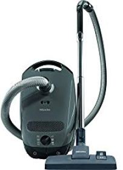
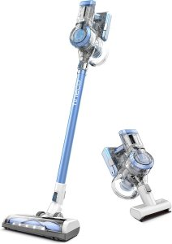
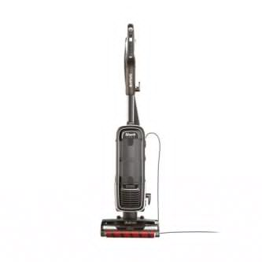
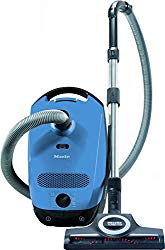
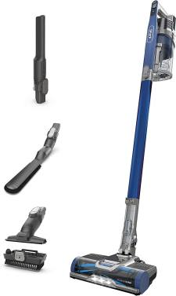
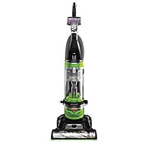
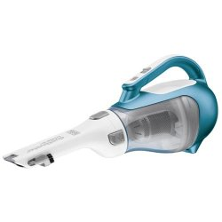
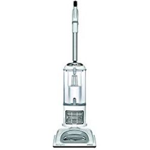
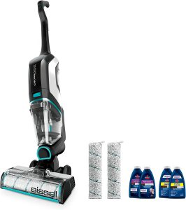
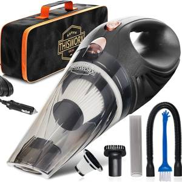

Are you in the market for a new vacuum cleaner? Look no further! Our team of experts has tested and reviewed the top vacuum cleaners on the market to help you find the perfect one for your home.

From versatile upright models to powerful canister vacuums, we’ve got you covered.

In our comprehensive guide, we break down the features and benefits of each product, as well as provide tips for maintaining and using your vacuum to its full potential.

Don’t settle for a subpar cleaning experience – read our guide and find the best vacuum cleaner for your needs today.

## **The Best Vacuum Cleaners 2025**

1. **Best Overall Vacuum Cleaner –[Shark AZ1002 Apex Upright Vacuum](https://www.amazon.com/Shark-AZ1002-Self-Cleaning-Brushroll-Upholstery/dp/B07FX5PCMN?th=1&linkCode=ll1&tag=bestofvacuum2-20&linkId=70e3d1072c049b27c3c916c1f3a6bd64&language=en_US&ref_=as_li_ss_tl)**
2. **Best Robot Vacuum – [iRobot Roomba j7+ (7550) Robot Vacuum](https://www.amazon.com/iRobot-Roomba-Self-Emptying-Robot-Vacuum/dp/B094NYHTMF?th=1&linkCode=ll1&tag=bestofvacuum2-20&linkId=abb477d7de06dc583379013f56ff1303&language=en_US&ref_=as_li_ss_tl)**
3. **Best Vacuum for Hardwood Floors –[Tineco Floor ONE S3 Cordless Cleaner](https://www.amazon.com/Tineco-Cordless-Lightweight-Powerful-Multi-Surface/dp/B082VRFWB8?th=1&linkCode=ll1&tag=bestofvacuum2-20&linkId=03ff10234052688e3aeb975d7dca8e6a&language=en_US&ref_=as_li_ss_tl)**
4. **Best Vacuum for Pet Hair – [BISSELL 2254 CleanView Swivel Rewind Pet Vacuum](https://www.amazon.com/2254-CleanView-Automatic-Steering-Specialized/dp/B07F6MXJ9X?&linkCode=ll1&tag=bestofvacuum2-20&linkId=a08dfe09d3bccf6ceaf03f1377dc25bd&language=en_US&ref_=as_li_ss_tl)** 
5. **Best vacuum for Carpet –[Miele Compact C1 Turbo Team Bagged Canister Vacuum](https://www.amazon.com/Miele-Compact-Bagged-Canister-Obsidian/dp/B08L5NN6QV?th=1&linkCode=ll1&tag=bestofvacuum2-20&linkId=983310fac2ca7729470a5c044e7cdec9&language=en_US&ref_=as_li_ss_tl)**
6. **Best Bagged Vacuum – [Kenmore Floor Care Elite Upright Bagged Vacuum](https://www.amazon.com/Kenmore-Allergy-Friendly-Beltless-Upright/dp/B075DZY7FR?crid=1UNT1JJND2EBD&keywords=kenmore+floor+care+elite+upright+bagged+vacuum%2C+silver&qid=1671132870&sprefix=Kenmore+Floor+Care+Elite+Upright+Bagged+Vacuum%2Caps%2C536&sr=8-3&linkCode=ll1&tag=bestofvacuum2-20&linkId=142f1793d3704d7dea9e9a5b54e049b7&language=en_US&ref_=as_li_ss_tl)**
7. **Best Cordless Vacuum Cleaner –[Tineco A11 Hero Cordless Stick Vacuum Cleaner](https://www.amazon.com/Tineco-Cordless-Handheld-Charging-Hardwood/dp/B07R9KDNKL?&linkCode=ll1&tag=bestofvacuum2-20&linkId=06442abf7e77d5969519a9fb08a94fc8&language=en_US&ref_=as_li_ss_tl)**
8. **Best Vacuum Shag Carpet – [Shark AZ1002 Apex Upright Vacuum](https://www.amazon.com/Shark-AZ1002-Self-Cleaning-Brushroll-Upholstery/dp/B07FX5PCMN?th=1&linkCode=ll1&tag=bestofvacuum2-20&linkId=c9a89ce92972a3bd896b86fba89ee016&language=en_US&ref_=as_li_ss_tl)** 
9. **Best Vacuum for long Hair**–**[Shark ZU561 Navigator Vacuum](https://www.amazon.com/Navigator-Lift-Away-Technology-Anti-Allergen-ZU561/dp/B07FX7Z3NL?crid=1EVKPI4L1RYHP&keywords=Shark%2BZU561%2BNavigator%2BLift-Away%2BSpeed%2BSelf-Cleaning%2BBrushroll%2BLightweight%2BUpright%2BVacuum&qid=1671133335&sprefix=shark%2Bzu561%2Bnavigator%2Blift-away%2Bspeed%2Bself-cleaning%2Bbrushroll%2Blightweight%2Bupright%2Bvacuum%2Caps%2C629&sr=8-1&th=1&linkCode=ll1&tag=bestofvacuum2-20&linkId=31f543e8d5a0dfe2a93af764edc79bd0&language=en_US&ref_=as_li_ss_tl)** 
10. **Best Cordless Stick Vacuum –** **[Shark IZ363HT Anti-Allergen Pet Power Cordless Stick Vacuum](https://www.amazon.com/Shark-IZ363HT-Anti-Allergen-Lightweight-Self-Cleaning/dp/B08FP95RQD?th=1&linkCode=ll1&tag=bestofvacuum2-20&linkId=136663dcf7f3b4a10fbec1a71eeaa82c&language=en_US&ref_=as_li_ss_tl)** 

## **1. Shark AZ1002 Apex Vacuum – Best Overall Vacuum Cleaner**

Shark AZ1002 Apex Powered Lift-Away upright vacuum is a versatile and powerful cleaning tool that can tackle a wide variety of surfaces and messes. **[Click here to see today’s price on Amazon.](https://www.amazon.com/Shark-AZ1002-Self-Cleaning-Brushroll-Upholstery/dp/B07FX5PCMN?th=1&linkCode=ll1&tag=bestofvacuum2-20&linkId=ff219357d945e706c17d3f82610ba728&language=en_US&ref_=as_li_ss_tl)**

Its DuoClean technology features two brushrolls that work together to remove large and small debris from carpets and hard floors, while the self-cleaning brushroll helps prevent hair and other debris from getting tangled in the brushes.

The vacuum also features a detachable canister that can be easily lifted away for cleaning above-floor surfaces like furniture and stairs.

It comes equipped with a crevice tool and upholstery tool for more targeted cleaning, as well as a pet power brush that effectively removes pet hair from carpets and upholstery.

In addition, to its impressive cleaning capabilities, the Shark AZ1002 Apex is also designed for convenience and ease of use.

It has a large capacity dustbin that allows for longer cleaning sessions without having to stop and empty it, and its advanced swivel steering makes it easy to maneuver around furniture and tight corners.

Overall, the Shark AZ1002 Apex Powered Lift-Away vacuum is the best overall vacuum cleaner due to its powerful cleaning performance, versatile design, and convenient features.

It is perfect for deep cleaning on both floors and above-floor surfaces, making it a valuable addition to any home cleaning routine.

## **2. iRobot Roomba j7+ (7550) Self-Emptying Robot Vacuum – Best Robot Vacuum**

 Self-Emptying Robot Vacuum")

The iRobot Roomba j7+ (7550) is a self-emptying robot vacuum that can operate for up to 60 days without requiring manual emptying.

This is a significant benefit for those with busy lifestyles who may not have the time to constantly monitor and empty their vacuum. **[Click here to see today’s price on Amazon.](https://www.amazon.com/iRobot-Roomba-Self-Emptying-Robot-Vacuum/dp/B094NYHTMF?th=1&linkCode=ll1&tag=bestofvacuum2-20&linkId=c1f21272f574492b7f4625f5d960e699&language=en_US&ref_=as_li_ss_tl)** 

Additionally, the j7+ is equipped with advanced sensors that allow it to identify and avoid obstacles like pet waste and cords, ensuring a thorough and efficient cleaning experience.

iRobot Roomba j7+ also features smart mapping technology that allows it to navigate and clean multiple rooms with ease, providing complete coverage of your home.

Furthermore, the j7+ is compatible with Alexa, allowing for hands-free operation and the ability to control the vacuum with voice commands.

This feature is especially useful for those who are looking for a convenient and effortless cleaning experience.

In terms of performance, the j7+ excels at picking up pet hair, making it an ideal choice for households with furry friends.

Its powerful suction and tangle-free brushrolls ensure that even the most stubborn pet hair is removed from carpets and floors.

Overall, the iRobot Roomba j7+ (7550) is a top-of-the-line robot vacuum cleaner that offers a convenient, efficient, and effective cleaning experience.

Its self-emptying capabilities, obstacle avoidance, smart mapping, and compatibility with Alexa make it a standout choice for those looking for the best robot vacuum.

## **3. BISSELL 2254 CleanView Swivel Rewind Pet Bagless Vacuum – Best Vacuum for Pet Hair**

BISSELL 2254 CleanView Swivel Rewind pet vacuum is designed specifically for pet owners. **[Click here to see today’s price on Amazon.](https://www.amazon.com/2254-CleanView-Automatic-Steering-Specialized/dp/B07F6MXJ9X?&linkCode=ll1&tag=bestofvacuum2-20&linkId=4f0e1126b8f5688d656ea10d3ec4fb5b&language=en_US&ref_=as_li_ss_tl)**

 Its swivel steering and specialized pet tools make it easy to clean up pet hair and other debris from carpets, hardwood floors, and furniture.

The vacuum’s [automatic cord rewind feature](https://www.bestofvacuum.com/best-vacuum-with-retractable-cord/) saves time and effort, allowing you to quickly and easily retract the power cord when you’re finished cleaning.

The large capacity dirt tank means you can clean more area without having to stop and empty the tank as often.

In addition to its powerful pet hair pickup, the BISSELL 2254 CleanView also has a multi-level filtration system that captures allergens and other small particles, helping to keep your home clean and healthy.

The specialized pet tools include a pet turboEraser tool, a crevice tool, and a dusting brush, making it easy to clean even the most stubborn pet hair and debris from corners and tight spaces.

Overall, the BISSELL 2254 CleanView Swivel Rewind pet upright bagless vacuum is [an excellent choice for pet owners](https://www.bestofvacuum.com/best-vacuum-for-pet-hair/) looking for a powerful, versatile, and easy-to-use vacuum that can handle even the toughest pet hair and debris.

With its specialized pet tools, large capacity dirt tank, and multi-level filtration system, this vacuum is sure to keep your home clean and healthy for you and your furry friends.

## **4. Tineco Floor ONE S3 Cordless Cleaner – Best Vacuum for Hardwood floors**

Tineco Floor ONE S3 cordless vacuum is an excellent choice for cleaning your hardwood floors. It’s lightweight, making it easy to maneuver around your home, and it’s a wet/dry vacuum, so you can use it on a variety of surfaces. **[Click here to see today’s price on Amazon.](https://www.amazon.com/Tineco-Cordless-Lightweight-Powerful-Multi-Surface/dp/B082VRFWB8?th=1&linkCode=ll1&tag=bestofvacuum2-20&linkId=fab3af5438df9fd3ac566b05aff974b0&language=en_US&ref_=as_li_ss_tl)**

Plus, it has a smart control system that allows you to customize your cleaning experience.

One of the best things about Tineco Floor ONE S3 is that it’s cordless, so you don’t have to worry about getting tangled up in cords or having to constantly search for outlets.

It’s also very versatile, with different attachments for different cleaning tasks.

For example, the carpet glider attachment is perfect for cleaning carpets and rugs, and the crevice tool is great for getting into tight corners and crevices.

Another standout feature of the Tineco Floor ONE S3 is its smart control system. This allows you to adjust the suction power and the water flow to suit your specific cleaning needs.

This means that you can use it on a variety of surfaces and tailor the cleaning experience to each one.

Overall, the Tineco Floor ONE S3 cordless hardwood floors cleaner is an excellent choice for anyone looking for a high-quality, versatile vacuum for their hardwood floors.

Its cordless design, smart control system, and variety of attachments make it the perfect tool for keeping your hardwood floors clean and tidy.

## **5. Kenmore Floor Care Elite Upright Bagged Vacuum-  Best Bagged Vacuum**

The Kenmore Floor Care Elite bagged vacuum is perfect for households with pets as it has a triple HEPA filtration system that effectively captures pet dander and allergens. **[Click here to see today’s price on Amazon.](https://www.amazon.com/Kenmore-Allergy-Friendly-Beltless-Upright/dp/B075DZY7FR?crid=1UNT1JJND2EBD&keywords=kenmore+floor+care+elite+upright+bagged+vacuum%2C+silver&qid=1671132870&sprefix=Kenmore+Floor+Care+Elite+Upright+Bagged+Vacuum%2Caps%2C536&sr=8-3&linkCode=ll1&tag=bestofvacuum2-20&linkId=8d4bdf453b63798dd51a7a36c574adc2&language=en_US&ref_=as_li_ss_tl)**

The 3D inducer motor also provides powerful suction to pick up any pet hair and debris.

In addition to its excellent pet hair and allergen control, Kenmore Floor Care Elite [bagged Vacuum](https://www.bestofvacuum.com/best-bagged-vacuum/) also has other features that make it stand out from other vacuums.

For example, it has a multi-surface brushroll that easily transitions from carpets to hard floors, so you can use it to clean your entire home.

It also has a generous dust bag capacity, so you won’t have to empty it as often.

One of the things that I like about this vacuum is its sleek design. It’s slim and lightweight, so it’s easy to maneuver around your home and store when not in use.

The long power cord also allows you to cover a large area without needing to constantly switch outlets.

Overall, I would recommend Kenmore Floor Care Elite bagged vacuum for anyone in need of a powerful and effective pet hair and allergen control vacuum.

It’s a great investment for any home and will make cleaning a breeze.

## **6. Shark ZU561 Navigator Lift-Away Vacuum – Best Vacuum for Long Hair**

Shark ZU561 Navigator Lift-Away lightweight vacuum is a great choice for those looking for [the best vacuum for long hair](https://www.bestofvacuum.com/best-vacuum-for-long-hair/) and pets. **[Click here to see today’s price on Amazon.](https://www.amazon.com/Navigator-Lift-Away-Technology-Anti-Allergen-ZU561/dp/B07FX7Z3NL?crid=1EVKPI4L1RYHP&keywords=Shark%2BZU561%2BNavigator%2BLift-Away%2BSpeed%2BSelf-Cleaning%2BBrushroll%2BLightweight%2BUpright%2BVacuum&qid=1671133335&sprefix=shark%2Bzu561%2Bnavigator%2Blift-away%2Bspeed%2Bself-cleaning%2Bbrushroll%2Blightweight%2Bupright%2Bvacuum%2Caps%2C629&sr=8-1&th=1&linkCode=ll1&tag=bestofvacuum2-20&linkId=af501f8217bf8f898b8ca9ea8ccb35dd&language=en_US&ref_=as_li_ss_tl)**

One of the standout features of this vacuum is its self-cleaning brushroll, which is designed to remove hair from the bristles as you vacuum, helping to prevent tangles and clogs.

This is especially useful for those with long hair, as it can be difficult to clean the brushroll on a regular vacuum.

In addition to the self-cleaning brushroll, the Shark ZU561 also has a HEPA filter, which is designed to capture small particles like dander and dust, making it a good choice for those with allergies or sensitivities.

The vacuum also has a lift-away design, which allows you to easily detach the canister and use it to clean stairs, upholstery, and other hard-to-reach areas.

Overall, Shark ZU561 Navigator vacuum is a powerful and versatile choice for those with long hair.

It’s easy to use, effective at cleaning, and has features that make it particularly well-suited for those with long hair.

## **7. Miele Compact C1 Turbo Team Bagged Canister Vacuum – Best Vacuum for Carpet**

If you’re looking for a vacuum that can handle carpet, then I would recommend the Miele Compact C1 Turbo Team. This [bagged canister vacuum](https://www.bestofvacuum.com/best-bagged-vacuum/) is specifically designed to clean carpets, and it does an excellent job. **[Click here to see today’s price on Amazon](https://www.amazon.com/Miele-Compact-Bagged-Canister-Obsidian/dp/B08L5NN6QV?th=1&linkCode=ll1&tag=bestofvacuum2-20&linkId=75383e2028195147210db204145fb744&language=en_US&ref_=as_li_ss_tl)**

One of the things that set this vacuum apart is its powerful motor. It has a 1200-watt Vortex Motor System, which provides plenty of suction power to pick up even the deepest dirt and debris.

The vacuum also has six different suction settings, so you can adjust the power to suit your specific cleaning needs.

Another great feature of the Miele Compact C1 Turbo Team is its variable speed control. This allows you to adjust the speed of the vacuum’s brush roll, which is great for cleaning a variety of different carpet types.

The vacuum cleaner also has an LED headlight, which makes it easier to spot dirt and debris in low-light areas.

Overall,  Miele Compact C1 is an excellent choice for cleaning carpets. It’s powerful, versatile, and easy to use, and it’s backed by Miele’s outstanding reputation for quality and durability.

Plus, with its compact size, it’s easy to maneuver around your home and store when not in use.

## **8. Tineco A11 Hero Cordless Stick Vacuum Cleaner- Best Cordless Vacuum Cleaner**

[****](https://www.amazon.com/Tineco-Cordless-Handheld-Charging-Hardwood/dp/B07R9KDNKL?th=1&linkCode=ll1&tag=bestofvacuum2-20&linkId=dc6216a2cee34c28443aa50a1f6064d8&language=en_US&ref_=as_li_ss_tl)

Tineco A11 Hero cordless stick vacuum is truly a top-of-the-line option when it comes to cordless vacuums.

It has a powerful 450W motor that provides ultra-powerful suction, making it perfect for tackling all sorts of messes on carpets, hard floors, and even pet hair.

Plus, it’s lightweight and easy to maneuver, so you can clean quickly and efficiently without getting tired. **[Click here to see today’s price on Amazon.](https://www.amazon.com/Tineco-Cordless-Handheld-Charging-Hardwood/dp/B07R9KDNKL?th=1&linkCode=ll1&tag=bestofvacuum2-20&linkId=dc6216a2cee34c28443aa50a1f6064d8&language=en_US&ref_=as_li_ss_tl)**

One of the things that I like about this vacuum is its impressive battery life. It can run for up to 40 minutes on a single charge, so you can clean an entire room without having to stop and recharge.

And when you do need to recharge, the vacuum has a quick charging function that gets it back up to full power in just 3.5 hours.

Another great feature of the Tineco A11 Hero is its detachable handheld design. This allows you to easily switch between cleaning floors and furniture or even use it as a [portable vacuum for your car.](https://www.bestofvacuum.com/best-vacuum-for-car-detailing/)

It comes with a variety of attachments, including a crevice tool and a dusting brush, so you can tackle all sorts of cleaning tasks with ease.

Overall, the Tineco A11 Hero vacuum cleaner is a fantastic option for anyone looking for a powerful, versatile, and easy-to-use cordless vacuum.

It’s perfect for cleaning carpets, hard floors, and even pet hair, and its long battery life and quick charging function make it a breeze to use.

## **9. Shark AZ1002 Apex Upright Vacuum – Best Vacuum Shag Carpet**

Shark AZ1002 Apex Powered Lift-Away vacuum is the best option for shag carpets due to its unique DuoClean technology and self-cleaning brushroll. **[Click here to see today’s price on Amazon.](https://www.amazon.com/Shark-AZ1002-Self-Cleaning-Brushroll-Upholstery/dp/B07FX5PCMN?th=1&linkCode=ll1&tag=bestofvacuum2-20&linkId=f324665d03541e211d5868723db39cff&language=en_US&ref_=as_li_ss_tl)**

This vacuum has two brushrolls in one – a soft, bristle brushroll that effectively cleans both large and small debris on carpets, and a second, soft roller that picks up fine dust and debris.

The self-cleaning brushroll also helps to prevent hair and debris from getting tangled in the bristles, ensuring a deep clean every time.

In addition, the Shark AZ1002 comes with a crevice tool, upholstery tool, and pet power brush, making it easy to clean tight spaces and remove pet hair from your shag carpet.

Overall, the Shark AZ1002 is the perfect [vacuum for shag carpets](https://www.bestofvacuum.com/best-vacuum-for-shag-carpet/), providing a deep clean. Its powerful suction and innovative technology make it the top choice for anyone with a shag carpet in their home.

## **10. Miele Compact C1 Turbo Bagged Canister Vacuum – Best Canister Vacuum**

The Miele Compact C1 Turbo Team is a top-of-the-line canister vacuum that offers powerful suction and a variety of features to make cleaning your home a breeze. **[Click here to see today’s price on Amazon.](https://www.amazon.com/Miele-Compact-Bagged-Canister-Obsidian/dp/B08L5NN6QV?&linkCode=ll1&tag=bestofvacuum2-20&linkId=ac77e33c0c0bc41590859371cf102de9&language=en_US&ref_=as_li_ss_tl)**

One of the standout features of this vacuum is its Turbo Team nozzle, which is specifically designed to tackle pet hair and deep-down dirt.

It’s equipped with a rotating brush roll that agitates the carpet fibers to lift out stubborn debris, and its adjustable suction power allows you to customize the cleaning power to suit your needs.

In addition, the Miele Compact C1 vacuum is also designed with convenience in mind.

It has a compact design, making it easy to maneuver around tight corners and hard-to-reach areas, and its lightweight construction means you can carry it upstairs with ease.

The vacuum also comes equipped with a HEPA filter, which traps 99.9% of dust and allergens, making it perfect for people with allergies or asthma.

And, with its large capacity dustbag, you can clean your entire home without having to stop and empty the bag multiple times.

Overall, the Miele Compact C1  is a top-performing canister vacuum that offers powerful suction, convenient features, and effective filtration. It’s worth considering if you’re in the market for a new vacuum.

## **11. Shark IZ363HT Anti-Allergen Pet Power Cordless Stick Vacuum – Best Cordless Stick Vacuum**

Shark IZ363HT Anti-Allergen Pet Power cordless stick vacuum is an amazing option for those looking for a high-quality, efficient, and versatile cleaning tool. **[Click here to see today’s price on Amazon.](https://www.amazon.com/Shark-IZ363HT-Anti-Allergen-Lightweight-Self-Cleaning/dp/B08FP95RQD?th=1&linkCode=ll1&tag=bestofvacuum2-20&linkId=f9d07c4314a8181b6b0664c63a1233cf&language=en_US&ref_=as_li_ss_tl)**

This  cordless stick vacuum comes equipped with a self-cleaning brushroll, PowerFins, and a crevice tool, which allows you to easily remove dirt, dust, and pet hair from any surface.

The anti-allergen dusting brush and pet multi-tool make it perfect for those with allergies or pets, as they help to capture and remove allergens and pet dander from the air and surfaces.

Additionally, the Shark IZ363HT is cordless, which means you don’t have to worry about getting tangled up in cords while cleaning. This makes it easy to maneuver and use in any room of your home.

 It also has a powerful suction, which ensures that it picks up even the smallest particles and debris.

Overall, the Shark IZ363HT Anti-Allergen Pet Power vacuum is a fantastic option for anyone looking for a versatile, efficient, and powerful cordless stick vacuum.

## **12. BISSELL 2252 CleanView Swivel Upright Bagless Vacuum -Best Budget Vacuum**

BISSELL 2252 CleanView Swivel upright bagless vacuum is a fantastic option for those looking for a budget-friendly option. **[Click here to see today’s price on Amazon.](https://www.amazon.com/BISSELL-Cleanview-Upright-Bagless-2252/dp/B07F6N3RT6?th=1&linkCode=ll1&tag=bestofvacuum2-20&linkId=5302403d519e1cc94605cb6ae8dfbdd9&language=en_US&ref_=as_li_ss_tl)**

It’s a powerful vacuum that’s specifically designed to tackle pet hair, and it comes with specialized tools to make the job easier.

The swivel steering is a nice touch, as it allows for easy maneuvering around furniture and tight corners.

The large capacity dirt tank is another great feature, as it allows you to vacuum more before needing to empty it. And when it comes time to empty, it’s super easy thanks to the convenient design.

Plus, the bagless design means you won’t have to worry about buying and replacing bags, which can save you money in the long run.

Overall, the BISSELL 2252 CleanView Swivel bagless vacuum is a fantastic option for those looking for a budget-friendly vacuum that can still tackle pet hair and other dirt and debris.

Its powerful suction and specialized tools make it a great choice for pet owners, and the large capacity dirt tank and easy emptying make it a breeze to use.

## **13. BLACK+DECKER dustbuster AdvancedClean Cordless Vacuum (CHV1410L) – Best Handheld Vacuum.**

The BLACK+DECKER dustbuster AdvancedClean cordless handheld vacuum (CHV1410L) is the premier option for individuals seeking a high-quality, efficient, and versatile handheld vacuum. **[Click here to see today’s price on Amazon.](https://www.amazon.com/BLACK-DECKER-Dustbuster-Cordless-CHV1410L/dp/B006LXOJC0?th=1&linkCode=ll1&tag=bestofvacuum2-20&linkId=702a7ce3b2807671b06e849d0e6d61d7&language=en_US&ref_=as_li_ss_tl)**

This vacuum boasts a lithium-ion battery, providing strong suction power and extended run time.

The patented brush and nozzle technology effectively cleans debris and pet hair from carpets, upholstery, and other surfaces.

The removable, washable bowl and filter allow for easy cleaning and ensure that the vacuum remains hygienic.

Additionally, the dustbuster AdvancedClean includes a crevice tool and flip-up brush, allowing for a wide range of cleaning capabilities.

The cordless design allows for easy maneuverability and eliminates the need for cumbersome cords. The lightweight and compact design make it easy to store and transport.

In conclusion, the BLACK+DECKER dustbuster AdvancedClean cordless handheld vacuum (CHV1410L) is the ideal choice for those seeking a high-performance, versatile, and easy-to-use handheld vacuum.

Its powerful suction, efficient brush technology, and versatile attachments make it a valuable addition to any household.

## **14. Shark NV356E 31 Navigator Lift-Away Vacuum – Best Vacuum for Allergies and Asthma**

The Shark NV356E 31 Navigator Lift-Away professional  vacuum is the perfect choice for individuals with allergies and asthma. **[Click here to see today’s price on Amazon.](https://www.amazon.com/Shark-Navigator-Lift-Away-Professional-NV356E/dp/B005KMDV9A?&linkCode=ll1&tag=bestofvacuum2-20&linkId=b44baebaf00456b93e01886edd003811&language=en_US&ref_=as_li_ss_tl)**

Its powerful suction and HEPA filter effectively capture and trap allergens and pollutants, ensuring a clean and allergen-free environment.

The vacuum’s swivel steering and Lift-Away technology allow for easy maneuverability and access to tight corners and hard-to-reach areas.

Additionally, the included pet power brush and dusting brush ensure that pet hair and dander are effectively removed from surfaces.

The large XL dust cup allows for extended cleaning without the need for frequent emptying, and the crevice tool allows for detailed cleaning of tight spaces.

Overall, the Shark NV356E 31 Navigator Lift-Away Professional Upright Vacuum is a versatile and effective tool for individuals with allergies and asthma, providing a thoroughly clean and healthy living space.

## **15. BISSELL 2554A CrossWave All-in-One Wet-Dry Vacuum Cleaner and Mop – Best Vacuum Combo**

BISSELL 2554A CrossWave Cordless Max All-in-One Wet-Dry vacuum and mop for hard floors and area rugs, is a versatile and efficient cleaning solution for any home. **[Click here to see today’s price on Amazon.](https://www.amazon.com/BISSELL-2554A-CrossWave-Cordless-Wet-Dry/dp/B07SXD5KKG?th=1&linkCode=ll1&tag=bestofvacuum2-20&linkId=f54d13806f3af98ecd616760cc1e1efe&language=en_US&ref_=as_li_ss_tl)**

This innovative [vacuum and mop combo](https://www.bestofvacuum.com/best-vacuum-mop-combo/) effectively tackle both wet and dry messes, making it the perfect choice for hard floors and area rugs.

One of the standout features of the BISSELL 2554A is its cordless design, which allows for easy maneuverability and hassle-free cleaning.

It also features a powerful lithium-ion battery that provides up to 30 minutes of runtime, ensuring that you can clean your entire home without needing to stop and recharge.

In addition to its impressive cleaning capabilities, the BISSELL 2554A also boasts a sleek and stylish design. Its black and pearl white color scheme with electric blue accents adds a touch of sophistication to any space, making it a welcome addition to any home.

But the BISSELL 2554A is not just about good looks. It is also designed with convenience in mind, featuring a removable tank that allows for easy filling and emptying, as well as a washable microfiber mop pad that is simple to clean and maintain.

Overall, the BISSELL 2554A CrossWave Cordless Max All-in-One Wet-Dry Vacuum Cleaner and Mop is a powerful and versatile cleaning solution that is sure to impress.

Whether you need to tackle wet or dry messes, this vacuum and mop combo has you covered.

## **16. ThisWorx Car Vacuum Cleaner – Best Car Vacuum**

ThisWorx Car Vacuum Cleaner is an essential car accessory for maintaining a clean and tidy vehicle.

With its powerful 12V motor and included attachments, this handheld portable vacuum effectively cleans all surfaces of your car, from the seats and carpets to the dashboard and cup holders. **[Click here to see today’s price on Amazon.](https://www.amazon.com/Handheld-Car-Mini-Vacuum-Cleaner/dp/B06ZY896ZM?th=1&linkCode=ll1&tag=bestofvacuum2-20&linkId=aa058ea1592b9f4ca3d3a282e3db4702&language=en_US&ref_=as_li_ss_tl)**

Its 16 ft cord and bag make it easy to reach all areas of the car, and its compact size allows for easy storage and convenience during travel.

In addition to its practicality and convenience, this car vacuum also offers a high level of durability and performance.

Its robust construction and premium materials ensure that it will withstand regular use and maintain its effectiveness over time.

Furthermore, this [car vacuum](https://www.bestofvacuum.com/best-vacuum-for-car-detailing/) is an essential tool for those who love to travel or own an RV or camper. Its compact size and lightweight design make it perfect for taking on road trips, and its versatility allows for quick and easy cleaning of any type of vehicle.

Overall, the ThisWorx Car Vacuum Cleaner is the best option for maintaining a clean and tidy car, both at home and on the road. Its powerful suction, durability, and convenience make it a must-have car accessory for any driver.
