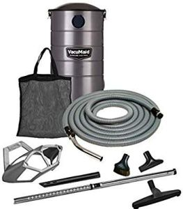
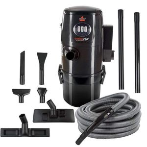
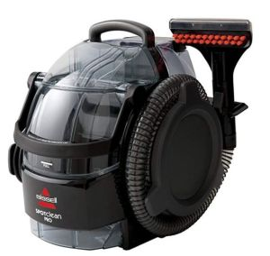
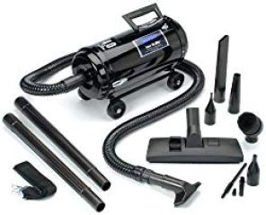
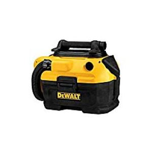
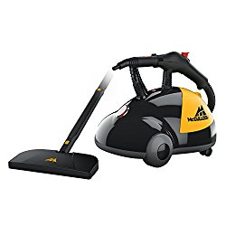
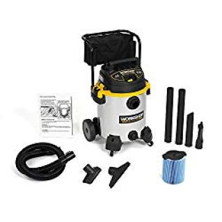
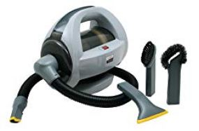

Do you own a car and are unable to find the ideal vacuum cleaner? I’ll show you the quickest, the easiest way to find the best vacuum for car detailing from this list of vacuums that work best for your car’s interior.

I agree that you may have spent hundreds or even thousands of dollars in the past for the same. That is now history. This 5-minute read well-detailed write-up will surely be what you’ve been looking for.

Later on this article, I’ll discuss with you 8 factors to consider when choosing the **best professional car vacuum cleaner**. Only then, will you be in the best position to know the best car vacuum detailer that is fit for your car.

Before we look into those finer details, here is an in-depth review of car cleaning vacuum cleaners. The list contains quick pointers to some of the features you should look out for, a number of pros, and of course cons if any. Let’s start the voyage.

##  The Best Vacuums for Car Detailing

| Name | Picture | Type | Hose Length |
|---|---|---|---|
|  | VacuMaid GV30PRO Wall Mounted Garage and Car Vacuum with 30 ft. Hose and Tools. | Wall Mounted | 50 ft. |
|  | BISSELL Garage Pro Wall-Mounted Wet Dry Auto Detailing Vacuum | Wall Mounted | 32 ft. |
|  | Bissell 3624 SpotClean Professional Portable vacuum - Corded | Portable | 4 ft |
|  | Carrand AutoSpa 94005AS Bag less Auto-Vac Hand-Held Vacuum | Bagless Hand-Vac | 40 ft. |

## 1\. VacuMaid GV50PRO Wall Mounted Car Vacuum

VacuMaid GV50PRO is one of the best vacuum for car detailing in the market today. Virtually every online store that deals with vacuum cleaners stocks more of this product thanks to its quality.

Some of its features are not duplicated in most of the vacuums. [**Click here to see today’s price on Amazon.**](https://www.amazon.com/gp/product/B0085ZZY5S/ref=as_li_tl?ie=UTF8&camp=1789&creative=9325&creativeASIN=B0085ZZY5S&linkCode=am2&tag=bestofvacuum2-20&linkId=2ef1b68a34918f38dfa64cf083c5ee11) 

### Features

-   Comes with a hanger.
-   Caddy wands.
-   Upholstery tools.
-   Dusting brush.
-   50-ft hose.
-   Ametek lamb motor. This motor enables this auto detail vacuum to work 75% more than most of the car detailer vacuums.
-   HEPA-style that is completely sealed.
-   Galvannealed steel.
-   Coated with powder.
-   Dirt capacity that can hold up to 7 gallons.

### Pros

-   Comes with a 5-year warranty.
-   Does not rust thanks to the powder-coated body as well as the galvannealed steel.
-   Has a long hose (50 feet).

### Cons

-   Might be expensive to some.
-   I heard a neighbor argue that the end of the hose suction power isn’t good.

**Also see:**

-   [**Water filtration vacuums**](https://www.bestofvacuum.com/best-water-vacuum-cleaner/)
-   [**Cat litter vacuum**](https://www.bestofvacuum.com/best-vacuum-for-cat-litter/)
-   [**Best vacuum for shag carpet**](https://www.bestofvacuum.com/best-vacuum-for-shag-carpet/)

## 2\. Bissell 18P03 Garage Pro Wet Dry Car Cleaning vacuum

This is one of the widely used commercial auto detailing vacuums in the market.

Bissell 18P03 Garage Pro is credited with several features that you’ll definitely find useful besides being the best wet dry vac for car. [**Click here to see today’s price on Amazon.**](https://www.amazon.com/gp/offer-listing/B003R3JFJO/ref=as_li_tl?ie=UTF8&camp=1789&creative=9325&creativeASIN=B003R3JFJO&linkCode=am2&tag=bestofvacuum2-20&linkId=a4d0f29d0df17453be2d5a28efebb62f) 

### Features

-   A 12-amp motor that has the ability to pick both wet and dry messes from the interior of your car. It is also able to pick dirt from the workshop and your garage.
-   Comes with seven attachments. All these attachments are versatile.
-   Accessory bag, which you can use to clean upholstery, carpets, and the bare floor.
-   This best detailing vacuum has 2-stage filtration.
-   A semi-translucent dirt tank that has the capacity to carry up to 4 gallons of debris.
-   A long hose that measures 32 feet.
-   It works as a blower too.

### Pros

-   The 7 attachments make it versatile.
-   With Bissell 18P03 Garage Professional car vacuum, you do not need to buy a blower. It works like one as well.
-   The price is pocket-friendly.
-   Bissell 18P03 Garage Pro’s ability to detect water is superior.
-   Picks almost everything whether dry or wet.

### Cons

-   The hose carrier is a bit messy.
-   The attached screws don’t work. You might need to look for your own.
-    Noisy.

## 3\. Bissell 3624 SpotClean

Bissell 3624 SpotClean professional car vacuum cleaner is one of my favorites.

As a matter of fact, I almost recommend it to anyone and anybody who contacts me with the question, “Which car detailing vacuum cleaner will you recommend?” [**Click here to see today’s price on** **Amazon.**](https://www.amazon.com/gp/offer-listing/B008DBRFBK/ref=as_li_tl?ie=UTF8&camp=1789&creative=9325&creativeASIN=B008DBRFBK&linkCode=am2&tag=bestofvacuum2-20&linkId=5ecdc6440b217a12b907ce7bb855aa2d) 

### Features

-   Comes with a 5-flex hose that extends its usage area including area rugs, upholstery, and stairs.
-   Power cord with a length of 22”.
-   A 4-ft hose.
-   3/4 capacity gallon.
-   6-stair tool.
-   An 8oz professional deep formula for cleaning.
-   Attached 3-tough stain tool.
-   Comes with a 5.7-Amp motor.  

### Pros

-   The 22” power cord will help you reach many areas you couldn’t access otherwise.
-   The 8oz deep cleaning formula enables you to have a deep clean of your car’s interior as well as achieve an ever-clean garage or workshop.
-   A large liter tank.

### Cons

-   The 2-year warranty is not enough time for such a machine.
-   I’ve heard a case where a client complained of the hose breaking. It was, however, one incident.

## 4. Metrovac Vac N’ Blo Automotive Car Vacuum

It is so far the most powerful high-end vacuum for car detailing.

You can use it as a vacuum cleaner to clean around the house or as a blower in your yard or as a car cleaning vacuum. [**Click here to see latest price on Amazon.**](https://www.amazon.com/gp/offer-listing/B003FVLGZ4/ref=as_li_tl?ie=UTF8&camp=1789&creative=9325&creativeASIN=B003FVLGZ4&linkCode=am2&tag=bestofvacuum2-20&linkId=34ab4da046a190a41d4ed1af314685be) 

### Features

-   Has a 4 HP twin-fan with the ability to create over 95 inches of water lift. This is incredibly one of the powerful suctioning in the market.
-   Full-range attachments.
-   6-ft hose.
-   Compatible body solely covered with steel. This ensures less damage to the car detailer vacuum.
-   It is designed to be used in cars, workshop or garage, home, and yard among other places. 

### Pros

-   Easy to handle.
-   No folding.
-   Durable thanks to all-steel body cover.
-   Comes with many attachments that assist in reaching many areas.

### Cons

-   The small brush clogs often.
-   The cord is not retractable.

## 5\. DEWALT DCV581H Wet/Dry detailing vacuum

### 

### Features

-   DEWALT DCV581H is available for those who like corded and for those who prefer it cordless.
-   If you prefer the former, DEWALT DCV581H offers an AC outlet whereas the latter offers you either an 18V or 20V outlet.
-   Comes with a 2-gallon tank. [**Click here to see latest price on Amazon.**](https://www.amazon.com/gp/offer-listing/B00DD1UQ3Y/ref=as_li_tl?ie=UTF8&camp=1789&creative=9325&creativeASIN=B00DD1UQ3Y&linkCode=am2&tag=bestofvacuum2-20&linkId=234f5e11cc77e4fd13150af79ec3393b) 
-   DEWALT DCV581H’s filter is washable and can be reused after washing it.
-   5-ft hose.
-   This detail vacuum is crush-resistant thanks to its compact body formation.
-   Onboard storage.

### Pros

-   3 years warranty isn’t a bad idea.
-   It is ergonomically designed.
-   Lightweight at 11 lbs.
-   Offers versatility (corded and cordless) for those who like either.
-   Accessories fit the hose perfectly. They hardly fall off like is the case with most car cleaners vacuum.
-   It is extremely easy and quick to clean it.
-   Use it in its cordless state and you will retain plenty of power.

### Cons

-   Noisy
-   Difficult to handle the DC section with an old-style socket.
-   The blower is not as remarkable as other sections.

## 6\. McCulloch MC1275 Heavy Duty Car Detail Steam Cleaner

Those who know McCulloch MC1275 Heavy Duty Steam professional car vacuum will agree with me that it’ll not be an exaggeration to say that it is a good auto detailing steam cleaner. [**Click here to see latest price on Amazon.**](https://www.amazon.com/gp/offer-listing/B0000DF0RB/ref=as_li_tl?ie=UTF8&camp=1789&creative=9325&creativeASIN=B0000DF0RB&linkCode=am2&tag=bestofvacuum2-20&linkId=065e344f5b75b39cdb07cfd8ead9dbda) 

The price in many online stores including Amazon is also reasonable. I particularly love this best vacuum for car interior because of the exceptional customer care service McCulloch offers. The team works from an office in Andover. I tell you it is exemplary.

### Features

-   When you decide to clean McCulloch MC1275 Heavy Duty Steam, you do not need any chemicals or deep formula. You simply need soap and water and it is clean.
-   The beauty of using this steamer cleaner also rests on when you are using it. You do not need to use expensive detergents, as is the case with other car detailing steam cleaners.
-   McCulloch MC1275 Heavy Duty Steam uses hot steam that is accompanied by pressure to eliminate even the most stubborn stains such as grease and oils.
-   This [multi purpose steam cleaner](https://www.bestofvacuum.com/best-multi-purpose-steam-cleaner/) does better in a variety of services including sealed wood floors, granite, grout, ceramic tiles, autos, grills, laminate surfaces, appliances and many more.
-   A large water tank that has the capacity to clean the entire interior and exterior of your car and still reserve some for cleaning up the mess around your workshop or the garage.
-   Although the water tank is 48 ounces, it takes only 8 minutes to heat it up.

-   After heating the 48-ounce water tank in just 8 minutes, McCulloch MC1275 Heavy Duty Steam provides approximately 45 minutes of hot steam that cleans every surface you have planned.
-   McCulloch MC1275 Heavy Duty Steam is fitted with 18 versatile accessories that include mop pads, floor mop, brass brush, nylon brushes, squeegee, scrub pad and many more.

### Pros

-   Large water tank (48 ounces).
-   18 versatile accessories.
-   Reaches each corner of your car interior thanks to the 15.7-ft power cord and the 9-ft extension hose.
-   Suitable for a variety of surfaces and upholstery.
-   Quality customer care service courtesy of McCulloch’s Andover station.
-   Takes a very short time to heat the water, which in turn remains hot for close to an hour.
-   At only 3 lbs, it is lightest.

### Cons

-   At 900W-1500W, it is considered inefficient.
-   McCulloch says that McCulloch MC1275 Heavy Duty Steam was designed to only meet with U.S power standards.
-   With the 18 accessories, it might be complicated to operate or make good use of it to some people.

## 7\. WORKSHOP Wet/Dry WS1600SS Stainless Steel Vacuum

Workshop is the manufacturer of this car detail vacuum that is steadily gaining people’s approval.

Going through the reviews of many clients that have used it, I sense that most of those who purchase WORKSHOP Wet/Dry WS1600SS Stainless Steel 16 Gallon commercial auto detailing vacuum do so because of its durability. [**Click here to see latest price on Amazon.**](https://www.amazon.com/gp/offer-listing/B00FX36W7O/ref=as_li_tl?ie=UTF8&camp=1789&creative=9325&creativeASIN=B00FX36W7O&linkCode=am2&tag=bestofvacuum2-20&linkId=11db394cad386ee5535f6453b027b084)

Of course, there are those who do so because of the vacuum’s exceptional features, which I believe you will also find enticing.

### Features

-   Large rear wheels, which help in the easy transportation of the machine even on bad terrain.
-   Ergonomic handle.
-   Exceptionally powerful suction power with the ability to pick up to 1 gallon of water every second.
-   Has an aggregate of 27-ft access from the 20-ft power cord and the 7-ft extension hose thus able to reach most parts of your choice.
-   A variety of accessories including the utility car nozzle, dust bag, two extension wands, crevice tool, wet nozzle, ‘qwik’ lock for fine dust and many more.

### Pros

-   Easy reach on a wide area thanks to the aggregate 27-ft cords’ coverage area.
-   5-year warranty.
-   Strong and powerful suction.
-   The ergonomic design that includes the cart design enables quick and easy storage.
-   A number of accessories for various cleaning services and surfaces.

### Cons

-   It is heavy, weighing 38 lbs.

## 8\. Carrand AutoSpa 94005AS Auto Hand-Held Car Vacuum

Carrand AutoSpa 94005AS is so far the most affordable best vacuum for car detailing on my list. [**Click here to see latest price on Amazon.**](https://www.amazon.com/gp/offer-listing/B00445L290/ref=as_li_tl?ie=UTF8&camp=1789&creative=9325&creativeASIN=B00445L290&linkCode=am2&tag=bestofvacuum2-20&linkId=13dbb84ac4af5afd6ecd81896312f482) 

### Features

-   Carrand AutoSpa 94005AS is designed to consume 550W, an economic power consumption for such a powerful car detailing vacuum.
-   The vacuum is fitted with a staggering 40-ft flexible hose with an additional 12-ft power cord. All these allow you to reach even the most distant place of your car.
-   Carrand AutoSpa 94005AS features three special vacuum heads that include carpet and upholstery tool, a crevice tool, and a brush tool.  
-   Comes with a reusable dirt collection basket.
-   Onboard storage for various tools.

### Pros

-   Extremely affordable.
-   Contains the longest aggregate cords in the industry (40-ft for the extension hose and 12-ft power cord).
-   550 watts is electric-efficient.
-   The onboard storage design helps those with limited storage space.

### Cons

-   I cannot find any downside as of now.

It is my belief that after going through my list of best vacuums for car detailing, you have been able to point out a few auto detailing vacuums.

Before you make the very last decision on the best car vacuum, I urge you to look at this last subtopic. It will certainly add value to the insights you have gathered from the above section.

## Tips On Choosing The Best Car Vacuum

In this section, I’m going to cover 8 pointers that you need to consider before you press on the ‘Add to Cart’ button in case you are shopping for the best vacuum cleaner for car detailing.

There are many factors to look before you make the payment but my list contains the most important factors.

### 1\. Motor Size

It is conventional that the bigger the size of the motor, the higher the performance. With that in mind, when choosing the best wet dry vac for car detailing, go for those brands whose motors are 10+ amps. These machines usually offer best services for long hours.

### 2\. Purpose For The Vacuum

This is a very important thing to consider. If you buy a vacuum for the sake of it, you will regret. Vacuum cleaners are designed to perform different tasks. In this write-up, I have covered auto detailing vacuums for your car.

Each of the vacuum cleaners mentioned above does better in cleaning your car. Although it may clean carpets, upholstery, and your house floor, you will realize that there’re vacuums specifically meant for that.

### 3\. Attachments

Attachments add value to the vacuum cleaner. Just as different tools and appliances make a home look complete, a professional car vacuum cleaner is incomplete if it lacks essentials such as crevice tool, brush roll, mounting hangers, and screws among others.

### 4\. Type of Vacuum

Yes, I have mentioned this shortly in the past. I’m not talking about things such as hand-held, portable or such like. This factor mentions the types of vacuum available. Hitherto, there’re three main types namely:

-   Wet/dry vacuum cleaner.
-   Steam vacuum cleaner.
-   Automatic/garage vacuum cleaner.

Each of the above vacuum cleaners is best in a specific task.

### 5\. Cord Length

Why should I consider the cord length? This depends on the size or the area of what you want to clean. The size of your car is also important.

If you intend to detail your family car with a hand-held vacuum that does not have a cord, it will mean you need to be as close as possible to the area you want to clean.

However, from my experience, most auto detailing vacuums come with long power cords. This helps especially if you have one of a few power sockets at your garage.

Some say that a longer power cord is clumsy but I do not agree with them. As long as the vacuum cleaner has the unwind feature, you shouldn’t worry.

### 6\. Wall Mount/Portable

As the names suggest, you can decide to purchase a car cleaning vacuum that you can mount on the wall of your garage or even somewhere inside your car or a detail vacuum that is portable.

The difference is that one has to be in a specific position while the other can be placed anywhere in your car.

### 7\. Weight

The best vacuum for car detailing does not need to be heavy. As you have seen, manufacturers are trying to design light vacuum cleaners.

The aim is to ensure their products as light as possible. A heavy car detailer vacuum will be cumbersome to handle. It will mean that only the ‘strongest’ person in your family will be able to use it.

On the other hand, if you consider a light auto detail vacuum, it will be easy for any family member to clean the car whenever the need arises. Auto detail vacuums that are below 10 lbs are highly recommended.

### 8\. Warranties

Would you not love the idea when a company tells you that you can take back the appliance anytime it develops a problem? Everybody will love to hear such kind of news.

When you are purchasing a car detail vacuum, it is important to look for the manufacturer that is willing to repair, exchange, or at least listen to you when the vacuum develops a problem. Car detail vacuums with 5+-year warranty are always given the priority.

#### Conclusion

It is my hope that you have identified the best vacuum for cleaning your car from the above list. Before you finally press the ‘Add to Cart’ button, look at all factors.

Do not concentrate on a single factor. In the end, I’ll be very happy to learn that I helped you get the best vacuum for car detailing.