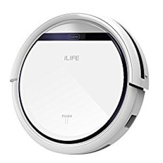
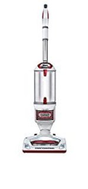
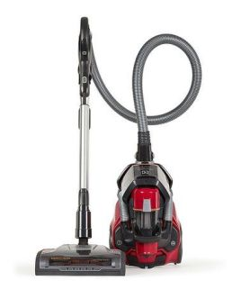
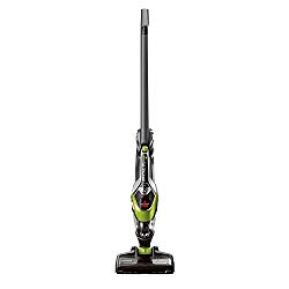
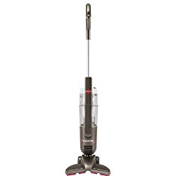
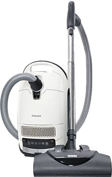

If you have a cat inside your house, you know how difficult it is to curb the spread of cat litter. Even if you have the most disciplined cat, kitten, or even the best litter box, cat litter will somehow scatter or get tracked somewhere outside the litter box. This is why you need the best vacuum for cat litter.

In their quest to see that their houses are free from cat litter, many homeowners have tried several ways. Many have been able to get rid of cat litter successfully and live to tell their story. A small number of others have failed to find a solution. The beauty is that there are homeowners who are not relenting in their quest for a solution to remove cat litter from their houses. Before I look at a solution to
that problem, here is a question we must answer:

### Does Cat Litter Ruin Vacuums?

“Ah! How is that even possible?” many people ask. Although it seems that there is no harm in using a vacuum cleaner to do away with cat litter, the truth of the matter is that even the best vacuum cleaner for cat litter can be spoiled fast.

Traditionally, vacuum cleaners are not meant to clean cat litter. The fact that it may help in removing away cat litter, does not really mean that it will do so forever.

Many cleaning experts and manufacturers know that cat litter can easily clog inside the vacuum cleaner’s system thus slowly reduce the machine’s ability to work effectively.

**Also See:**

-   [**Best lightweight hoover for elderly**](https://www.bestofvacuum.com/best-lightweight-vacuum-cleaner-for-the-elderly/)
-   **[Vacuums for long hair](https://www.bestofvacuum.com/best-vacuum-for-long-hair/)**
-   [**Best vacuum for car detailing**](https://www.bestofvacuum.com/best-vacuum-for-car-detailing/)
-   **[Best shark hoover for pet hair](https://www.bestofvacuum.com/best-shark-vacuum-for-pet-hair/)**

### Why Cat Litter Is Dangerous To Many Vacuums

Unless you get the [best vacuum cleaner](https://www.bestofvacuum.com/best-vacuum-cleaner/) for cat litter and pet hair, chances are you will do your house more harm than good. Experts warn that cat litter destroys a machine because when it gets in contact with water, it molds together, just as cement does when it gets contact with water. You see! That is exactly what happens when cat litter catches a cold, mold, or even a little dampness.

Nonetheless, vacuum cleaner manufacturers are now slowly getting an antidote to this problem. The following list contains some of the best vacuums for cat hair and litter that can help you clean your house. But first, here is a comparison table for best cat litter vacuums.

### Best Vacuum for Cat Litter – Comparison Table

| Picture | Name | Type | Ratings [/5] |
|---|---|---|---|
|  | Shark Rotator Professional Upright Vacuum for Carpet and Hard Floor | Upright | 4.5 |
|  | ILIFE V3s Pro Robotic Vacuum, Newer Version of V3s | Robot | 4.3 |
|  | Bissell Bolt Pet Lithium Ion Cordless Stick Vacuum, 1954 | Cordless Stick | 3.7 |

## What is the best vacuum for cat litter?

Here we review the best vacuums that you can use to clean cat litter and hair.

## 1\. Shark Rotator TruePet Upright NV752 Vacuum for Cat Litter

When it comes to vacuum cleaners, Shark Rotator is number one. It doesn’t matter what kind of a house. This vacuum cleaner is always on the top. [**Click here to see latest price on Amazon.**](https://www.amazon.com/gp/product/B00X7R1FZ2/ref=as_li_tl?ie=UTF8&camp=1789&creative=9325&creativeASIN=B00X7R1FZ2&linkCode=am2&tag=bestofvacuum2-20&linkId=2f5acf59e3efbb94f62fa192aaf86ed9) 

### Review

Shark Rotator TruePet Upright NV752 detaches to enable users to conduct a thorough cleaning of their houses. One of the best things about this vacuum for cat cleaner is that it comes with a powerful brushroll.

You will also love the machine’s controls that you can access just right at the fingertips. To provide superior service, it has the ability to pick debris no matter how hard they’ve been embedded in the floor.

### Suggestions

The best way you will utilize this cleaning tool is to know how to deal with the Swivel Steering together with its LED Light. Use the two to drive to where the debris is.

### Tips

If you want this kitty litter vacuum to give you the best service, learn how to adjust the controls that are on the handle.

### Buyer’s Guide

When buying a cat litter vacuum, do not just look at the height, weight, and perhaps the color. Look at other intricate things such as its motor. Shark Rotator TruePet Upright NV752’s motor is truly incomparable.

### Pros

-   The push-button operation makes it easy to operate.
-   The attachments add value to the vacuum.
-   Has a nicely-designed dirty container.
-   Many users praise the seal saying it’s complete.

### Cons

-   Because the controls are close to the fingers, it is easy to press the machine to open the dirty cup thus empty the litter on the floor.

## 2\. ILIFE V3s Pro-Robotic Vacuum (Newer Version)

ILIFE V3s Pro Robotic cleaner comes with the latest pet hair lifting technology. In fact, this enhanced feature makes this newer version appealing. [**Click here to see latest price on Amazon.**](https://www.amazon.com/gp/offer-listing/B06Y56NDF4/ref=as_li_tl?ie=UTF8&camp=1789&creative=9325&creativeASIN=B06Y56NDF4&linkCode=am2&tag=bestofvacuum2-20&linkId=c15218294df992cbf09460efe15cf904) 

### Review

From the name, you can tell that ILIFE V3s has an auto charge. This makes this vacuum cleaner of the best in the market.

The pet hair technology ideally picks up any debris. It does not only pick kitten litter but goes beyond to gather all sorts of pet hair as well as debris.

This vacuum for cat litter has a low-profile design. With a low profile, it is possible to clean under the beds, as well as sofas, the ideal hideouts for cats when they are in the house.

Other features that you will definitely love are programmable schedule, anti-bump, and the smart sensor.

### Suggestions

This vacuum cleaner has a low-profile design. Use it to reach places that are considered unreachable in your house.

### Tips

With a smart sensor, you do not need to struggle one when to change something on the machine. The smart sensor will alert you on virtually anything.

### Buyer’s Guide

ILIFE V3s Pro-Robotic Vacuum For Pet Hair is one of the lightest yet best vacuum for cat hair and litter weighing just 4.5 lbs. When you are out there in the market searching a vacuum for cat litter, put this point into consideration.

### Pros

-   It is light, weighs just 4.5 lbs.
-   Comes with quick and swift auto clean feature enabling users to effectively achieve their work.
-   With the low profile, you can reach every area unreachable by other vacuums.
-   Better on floors.
-   Comes with automatic features such as powering and self-charge.

### Cons

-   The power cord is a little thin.

The battery doesn’t stay for long.

## 3\. Shark Rotator Professional NV501 Lift-Away Vacuum

It is important to note that this is a product from the Shark Company, a reputable vacuum cleaner manufacturer. [**Click here to see latest price on Amazon.**](https://www.amazon.com/gp/offer-listing/B0091JG0LY/ref=as_li_tl?ie=UTF8&camp=1789&creative=9325&creativeASIN=B0091JG0LY&linkCode=am2&tag=bestofvacuum2-20&linkId=9af47e747f4d5ae36222718af2374753) 

### Review

Whatever the case, the red Shark Rotator Professional NV501 Lift-Away vacuum is a professional cat litter vacuum and pet hair that comes with a premium brushroll.

With the above premium brushroll, it is extremely easy to pick pet dander as well as cat litter. You have no idea how this does so.

You will love this vacuum cleaner for many reasons. Among them, of course, is the fact that it is built with a professional and extra-large dust cup. This allows you clean for long without stopping unnecessarily to empty the cup.

The other beautiful thing is that you are free to refer to the user’s manual in the event that there is something you do not quite understand. By the way, the user’s manual is pretty easy to understand.

### Suggestions

You are not supposed to worry about the length of the area you are cleaning. You shouldn’t worry about how long you will take. The dust cup will carry whatever cat litter is in your house.

### Tips

Beware of the LED light that will definitely help you locate whatever debris, cat litter or even pet dander that is hidden somewhere in the corner of the house.

The other thing you should utilize is the 2-in-1 Lift-away feature. You should be careful about this nice thing. Many times, users tend to overlook that this is an advantage over other vacuum cleaners.

### Buyer’s Guide

In the event that you are out there to purchase the best vacuum for cat litter, it is important you look at some the features of each cleaner. For this one, look for two things: the brand name and of course the XL dust cup.

### Pros

-   Has a 5-year warranty.
-   Comes with extra large dust cup.
-   The LED light helps locate debris and dirt.
-   It has a Premium Pet Power Brush that picks up pet hair and debris, and deep cleans dander from all surfaces.

### Cons

-   Clients complain of overall poor quality service.
-   Shark asks you to pay for the cost of shipping in the event you need to replace something that indeed is their fault.

## 4\. Electrolux EL4335B Ultra Flex Corded Canister Vacuum

Electrolux EL4335B Ultra Flex is a premium vacuum cleaner ideal for home use. Many of the users praise this vacuum saying it is the best canister vacuum for cat litter. [**Click here to see latest price on Amazon.**](https://www.amazon.com/gp/offer-listing/B071NZGW3L/ref=as_li_tl?ie=UTF8&camp=1789&creative=9325&creativeASIN=B071NZGW3L&linkCode=am2&tag=bestofvacuum2-20&linkId=29a822b9132ef0b4c485f2d611c0d262) 

### Review

This vacuum cleaner for home and office use comes with a 3-position adjustable, ideal for cleaning whatever place inside the house.

It is also built with a brushroll that you can simply switch on and off. What is more, the Electrolux EL4335B Ultra Flex has a suction power that you can adjust allowing for efficient HEPA filtration.

With a slim and bagless dust cup, emptying of any gathered dirt will not be a problem. You only need to press a button and there you are.

Remember too that the Electrolux EL4335B Ultra Flex comes with a 21-ft power cord with an addition 8-ft hose. These two extensions allow you have a wider coverage area for your cleaning.

Whichever way you’ll decide to store it, whether horizontal or vertical, the Electrolux EL4335B Ultra Flex is flexible.

### Suggestions

You do not have to worry that you can’t reach every part of your house. Remember there is a 21-ft power cord that allows you to connect the cleaner at one end of the house then clean the other end. Besides, there is an 8-ft hose. Use these to reach every corner of the house.

### Tips

When you want to clean upstairs, just fold the vacuum into the size you want and continue with your cleaning. Do the same with the floor or anywhere in the house.

### Buyer’s Guide

Although there are many nice features that you are supposed to look for in this Electrolux EL4335B Ultra Flex cleaner, think of the 5-year limited warranty. If you play by the rules, this will work in your favor.

### Pros

-   It is lightweight.
-   The cord and the hose make it possible for users to access larger cleaning areas.
-   A nice 5-year warranty from the manufacturer.
-   Low voice level.

### Cons

-   The hose is rigid thus hard to navigate.
-   Other users claim that the head is not made to the standard.

## 5\. Bissell Bolt Lithium-Ion Cordless Pet Stick Vacuum (1954)

Do you love cordless stick vacuum cleaners that you simply carry to whatever cleaning area you want and start to work? This is the ideal home cleaning appliance you need. [**Click here to see latest price on Amazon.**](https://www.amazon.com/gp/offer-listing/B01LQXCQ3I/ref=as_li_tl?ie=UTF8&camp=1789&creative=9325&creativeASIN=B01LQXCQ3I&linkCode=am2&tag=bestofvacuum2-20&linkId=7c9518ad9a70ca8c87799a7422cdf3ac) 

### Review

Bissell Bolt Lithium-Ion Cordless Pet Stick Vacuum (1954) is one of the nicest vacuum cleaners that is known for its superior quality when it comes to picking very tiny dirt such as pet dander, cat litter and any other dust with ease.

No wonder, with this ability, the product can be used to accomplish other important things. Whenever you buy Bissell Bolt Lithium-Ion Cordless Pet Stick Vacuum (1954), $10 goes to the Bissell Pet Foundation.

The vacuum cleaner comes with a removable handle, to help users maneuver around easily. This is also ideal when it is time to store the machine in a small space.

Bissell Bolt Lithium-Ion Cordless Pet Stick Vacuum (1954) does not come with a power cord or a hose. It is fitted with a 14.4V Lithium Ion. Once complete, the battery can last you for more than 25 minutes. That is enough to clean the entire house.

You will also love the idea that this 1954 cordless vacuum comes with an extra large dust cup. With this ability, you do not have to stop along the way to empty the litter bin. You will go with it until the whole 25 or so minutes.

### Suggestions

What kind of a vacuum are you looking for? Isn’t the best vacuum for cat litter and pet hair and dander? If so, do not wander around.

### Tips

Bissell Bolt Lithium Ion Cordless Pet Stick Vacuum (1954) is a cordless vacuum cleaner. It is designed that you can use it to clean whatever part of your home with ease. You simply need to fold it; dismantle it to even lift it to wherever you want.

### Buyer’s Guide

Although some users may say that a corded vacuum is the best but you need to ponder about this for a moment; what is it that you need? Look! I assume you need the best vacuum for cat litter. This is it. With the Bissell Bolt Lithium Ion Cordless Pet Stick Vacuum (1954) you are able to clean your carpet, hard floor, upholstery, counters, stairs, and many other places.

### Pros

-   By buying Bissell Bolt Lithium Ion Cordless Pet Stick Vacuum (1954) you contribute your $10 to the Bissell Pet Foundation.
-   Comes with a crevice tool.
-   The battery lasts long enough until you finish your cleaning at least 25 minutes.
-   2 years warranty.
-   It is damn light weighing only 5.8 lbs.

### Cons

-   Hard to clean a laminated floor.
-   It is gentle on dirty carpets and upholstery. Not so good.

## 6\. Bissell PowerEdge 81L2A Hardwood Floor Stick Pet Vacuum

Bissell PowerEdge 81L2A is one of the few vacuum  in the market that meets virtually every need of the user. Do you know what I mean? Well, here is it’s review. [**Click here to see latest price on Amazon.**](https://www.amazon.com/gp/offer-listing/B00450U7V8/ref=as_li_tl?ie=UTF8&camp=1789&creative=9325&creativeASIN=B00450U7V8&linkCode=am2&tag=bestofvacuum2-20&linkId=64f15eb7c18ea476e161b1e97137d7bc) 

### Review

Bissell PowerEdge 81L2A is one of the most affordable best vacuums for cat litter on the carpet. In many online stores, this vacuum doesn’t go beyond $70.

It has the ability to capture dust, pet dander, cat litter, and other dirt easily from whatever corner of the house. Its design enables this vacuum to access even the hardest-edged in the house. For this reason, in part, it is called ‘PowerEdge’.

Speaking of the design, the Bissell PowerEdge 81L2A has a V-shape. This was an ingenious way to ensure that all the dirt is drawn to the center for easy collecting.

The 20-ft power cord will also allow you to clean a large hall without necessarily stopping amid your work to change the power source.

### Suggestions

If I were you, I’d capitalize on some of these features above. However, it is prudent to center on the V-shape. It is a beauty that the manufacturer looked at this.

### Tips

You do not have to struggle when it comes to sweeping or even cleaning the edges. Bissell PowerEdge 81L2A’s V-shape will do all this for you. Learn how to utilize this feature.

### Buyer’s Guide

When looking for the best vacuum for cat hair and litter, it is prudent to look for the one that can help you reach where cat litter usually hides. Bissell PowerEdge 81L2A is ideal thanks to the V-shape.

The other thing you should center your mind on is the vacuum’s power consumption. Bissell PowerEdge 81L2A has a motor with just 6 Amps. This is incredible!

### Pros

-   Consumes less power.
-   The power cord is long enough at 20 feet.
-   The V-shape is nice for reaching hard-to-reach places.
-   It’s lightweight at 7.5 lbs.
-   Excellent service on all types of floors.

### Cons

-   The long power cord is an issue to those with smaller rooms.

## 7\. BLACK + DECKER CHV1410L Cordless 16V Hand Vacuum

Without a doubt, BLACK + DECKER CHV1410L is one of the widely-sort vacuum cleaners in the market today. It is easy to see why it is also considered the best vacuum for cat litter. [**Click here to see latest price on Amazon.**](https://www.amazon.com/gp/offer-listing/B006LXOJC0/ref=as_li_tl?ie=UTF8&camp=1789&creative=9325&creativeASIN=B006LXOJC0&linkCode=am2&tag=bestofvacuum2-20&linkId=4df5a52f85c5c1924c5c3805e834b002) 

### Review

The first thing you need to know about this premium vacuum BLACK + DECKER CHV1410L is that it comes at a pocket-friendly price. Who doesn’t want something they are able to purchase without going into a debt?

With the 16V Lithium Ion battery, you are assured of quality cleaning service that will last for as long as you are cleaning. Yes, as long as you want to continue cleaning.

The other incredible thing about this is that it is fitted with a Smart Charge Technology feature, which will help you save up to 50 percent energy.

Most of its applications and features are removable. This means you are able to detach, clean, and then replace them back. This makes work pretty easy. Doesn’t it?

### Suggestions

Although BLACK + DECKER CHV1410L is a very nice home cleaning appliance, there are a few things you must observe. Yes, you need to learn how to effectively and appropriately charge it. Otherwise, you will hate this machine.

### Tips

BLACK + DECKER CHV1410L is fully charged. Some say that the Ensure that battery takes many months before it goes down. I’m yet to confirm this particular claim.

### Buyer’s Guide

Affordability and quality do not go together many times. But there are chances that they do. Although you will find that these two things are in the BLACK + DECKER CHV1410L, I’d advise you to look at this vacuum from a different point of view, the 16V Lithium Ion battery. It is very durable.

### Pros

-   Last long after a complete charge.
-   Pocket-friendly price.
-   It is the lightest so far at just 2.6 lbs.
-   Collects cat litter with amazing ease.
-   Extra big fan.

### Cons

-   Takes long to recharge.
-   Some claim that it takes very few hours to run even after you charge it fully.

## 8\. Miele New Complete C3 Cat & Dog Canister Vacuum

New Miele C3 Complete Cat and Dog Hair Upright Vacuum are by no means one of the latest newest high-end vacuum cleaners. As you can see, it is ‘complete’. In what sense is the New Miele C3 Complete canister complete?

### Review

As mentioned in the above section and from the name, this is a new vacuum cleaner. You will never go wrong with it if you have pets in your home. [**Click here to see latest price on Amazon.**](https://www.amazon.com/gp/offer-listing/B07JMHW1WP/ref=as_li_tl?ie=UTF8&camp=1789&creative=9325&creativeASIN=B07JMHW1WP&linkCode=am2&tag=bestofvacuum2-20&linkId=6ef624fd5f6d79888f7db22fd86d6c7e) 

The New Miele C3 Complete Cat and Dog Hair Upright Vacuum have a variable power motor that can control the machine’s speed in six different stages.

What is more is that the switch to adjust the different stages of speed is placed at the foot. This strategic position, allows users to use both the foot and hands to operate the machine.

The machine’s suction power comes with high-velocity ability. In fact, it is as high as 1,200W.

New Miele C3 Complete Cat and Dog Hair Upright Vacuum are fitted with integrated features and accessories, some of which you will not find in other vacuum cleaners.

### Suggestions

If you have pets in your home, this the best vacuum for you.

### Tips

For effective use of this home-cleaning appliance, learn how to use both your hands and foot. Only then you will be able to get the best of the New Miele C3 Complete Cat and Dog Hair Upright Vacuum.

1.  New Miele C3 Complete Cat and Dog Hair Upright Vacuum’s six-speed controls are located at the foot pedal.

### Buyer’s Guide

Most people, me inclusive look at how much they spend on an item. While there is no harm in doing so, it is important not to center your mind on the cost. Sometimes it is prudent to look at what the product offers. Therefore, with the New Miele C3 Complete Cat and Dog Hair Upright Vacuum, don’t look at its cost but the service.

### Pros

-   It is extra effective to pick cat hair,  litter and dog hair.
-   The six-speed motor gears help you to improve the quality of your cleaning.
-   Has datable accessories.

### Cons

-   It is damn expensive.
-   The product is heavy at 19.4 lbs.

### Things To Consider When Buying A Vacuum Cleaner for Cat Litter

After looking at a list that gives you a glimpse of the best vacuum for cat litter, it is time we delve at what you need to consider when choosing the ideal kitty litter vacuum.

-   **Suction Power**

The term suction power should interest you as it does the machine itself. When you are sourcing out your vacuum cleaner, you need to understand whether it has the ability to pick up the litter you need it to pick.

For now, your interest is if the vacuum at hand will pick cat litter. To be honest, if it’s going to take you the whole day to pick cat litter, how the hell are you going to complete your cleaning?

The number of watts in the appliance’s motor may measure suction power. However, this is not a guarantee.

-   **Portability**

You are not the only one going to use this vacuum cleaner. Well, you may be, but really, would you go for a 20+ lbs vacuum cleaner while there is one that has 2.5 lbs?

-   **Durability**

It is true that machines differ in size, shape, color, suction ability, features, and many other things. One of those many things is durability. It’d be a waste of money if you bought a vacuum cleaner that lasts a few days even weeks.

You may have spent little in buying it but if you buy many such products in a year, that’d be a lot of money thus wastage of family money that could buy something else.

-   **Corded Vs Cordless**

This is a point. Yes, users may opt to buy a corded vacuum because there are power sources everywhere in their house. What if you want to clean a large hall whose power source is stuck in one corner 120 feet away? Are you still going to buy a cat litter vacuum that has a 20-ft power cord?

### Practical Ways To Prevent Litter Tracking and Scattering Everywhere

Whether you are using the best vacuum for cat litter or the latest most affordable vacuum for cat litter, chances are litter may scatter. What will do to prevent this mess? Here are 3 main tips to help you prevent this from happening.

#### 1\. Use High-Sided Litter Box

Sometimes shit happens. This is even when we have the best gadgets around. Yes, because such things happen, it is possible that somehow, cat litter my scatter.

Some people have however found out that having a litter box with high sides will help a lot. Think about it: a shallow litter box will not work as much as a 3-ft tall litter box will.

#### 2\. Use Rags and Mats

This is a very ingenious was to track cat litter. By the way, if you are thinking that you are hiding dirt in your house, you are wrong. The aim here is to stop the litter from scattering.

In a way, quality rags and mats that are hand-picked can help you contain the litter like this one – [JUMBO Cat Litter Mat](https://www.amazon.com/gp/offer-listing/B016PHLNRA/ref=as_li_tl?ie=UTF8&camp=1789&creative=9325&creativeASIN=B016PHLNRA&linkCode=am2&tag=bestofvacuum2-20&linkId=ee130265e573da2473973251c48312f5). In the end, you will clean it off from the rags and mat using the best vacuum cleaner for cat litter.

#### 3\. Use Extra Room

What is the extra room for? Many users complain that litter boxes are messy. If that is the case with you, the ideal advice is to look for an extra space in your house, put the litter box inside and lock it up. There will be no more litter scattering around the house.

#### Verdict

The above list of vacuum cleaners will definitely help you understand some of the hand-picked vacuum cleaners in the market today. That is not all. The list will help you pick the best vacuum for cat litter that you have been looking for. Whatever you decide, look at the specs, tips, buyer’s guide and all that you need. I’ll be happy to know if my article helped you find the ideal vacuum cleaner for cat litter.