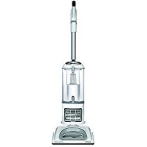
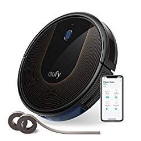
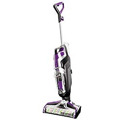

Floor vacuuming is one of the delicate and subtle things in housekeeping. Homeowners with concrete floors often find it difficult to choose the right vacuum cleaner.

Nonetheless, this article will give you a guide into finding the best vacuum for concrete floors you’ve been looking for.

After talking about the seven different types of concrete floor vacuums to check out, I will also focus on how to clean and maintain different types of concrete floors.

If you are the type that has been struggling to maintain cleanliness in your house without success, do not move but pull the chair.

Keep reading to see some of the impeccable tips on cleaning different types of concrete floors, but first things first …

### Top Rated Vacuums for Concrete Floors

| Picture | Name | Weight | Special features |
|---|---|---|---|
|  | Shark Navigator Lift-Away Professional NV356E | 13.7 lbs | Anti-Allergen Complete Seal + a HEPA Filter |
|  | eufy [BoostIQ] RoboVac 15C, Self-Charging Robotic Vacuum, Cleans Hard Floors to Medium-Pile Carpets | 5.73 lbs | Anti-scratch tempered glass-top cover for protection.*infrared-sensor for evading obstacles |
|  | Hoover Linx Cordless Stick Vacuum Cleaner, Lightweight, BH50010, | 10. lbs | EDGE CLEANING BRISTLES: Removes dirt, dust, and pet hair against those hard to reach edges. |

### **Types Of Concrete Floors**

It is true that different types of floors require a specific vacuum cleaner to ensure the floor looks neat.

There is difference when handling concrete floors. In this article, I have used the term concrete floors in its affiliates several times. But do you know that there are several types of different floors?

**You may also be interested in: [Best Vacuums for Laminate Floors](https://www.bestofvacuum.com/best-vacuum-for-laminate-floors/)**

This section will point out to the different types of concrete floors that exist. Knowing the kind of concrete floor in your house will help you know the ideal vacuum for concrete floor you need to purchase.

The following are common types of concrete floors:

-   Stained.
-   Painted.
-   Stamped.
-   Polished.
-   Sealed.
-   Unsealed.

### **Advantages of Using Concrete Floors**

Without a doubt, many people would love to have concrete floors in their houses whether that means a part of the floor or the entire house. However, do you know why it is a good idea to put a concrete floor in your house?

Here are some of the benefits of having a concrete floor:

-   Allergy reduction.
-   You can heat the floor using radiant system.
-   The floor is VOC-free.
-   Concrete floors are friendly to pets.
-   It is possible that a concrete floor will last many years.
-   Requires minimal maintenance.
-   Gives you the option to be as creative as you want.
-   If adequately sealed, the floor can resist stains as well as moisture.

Concrete floor can come with numerous benefits. However, you also need to beware that there could be a few disadvantages of having a concrete floor.

With the best vacuum for concrete floors, you can easily maneuver your way through and make your house clean.

### **Disadvantages Of Concrete Flooring**

-   You must include area rugs to increase warmth and comfort.
-   Slippery and maybe fatal when and if wet.
-   It is difficult when patching.
-   May require sealing after some time.
-   If cracks develop, it loses shape.

### **Where You Can Use Concrete Floors**

Although it is a good idea to put a concrete floor in your house, certain parts do not require concrete flooring. The following areas may be ideal for concrete flooring:

-   Kitchen.
-   Basement.
-   The bathroom.
-   Entryway.
-   Garage.
-   Commercial places such as retail shops, restaurants, cafés, churches, and any other place the public gathers.

Now that you know what a concrete floor is, why it is important to have it, the disadvantages of having concrete flooring, and areas that warrant concrete flooring, it is time to look at some of the best concrete floor sweepers in the market.

**Also read: [Best vacuum cleaners for hardwood floors](https://www.bestofvacuum.com/best-vacuum-cleaner-for-hardwood-floors/)**

## **The 7 Best Vacuums for Concrete Floors**

After weeks of researching, I finally managed to pick seven vacuums that will give you the best service when cleaning your concrete or carpeted floor.

As you go through each product, try to look at the subtle differences between the products.

In the end, be sure to find the ideal vacuum for concrete floors that will not only last but also serve your family the right way possible.

## **1\. Shark Navigator Lift-Away Professional NV356E**

There is no doubt that Shark has been around for a long time. The company is famed for many home use products that include vacuum cleaners and air purifiers.

Shark Navigator Lift-Away Professional NV356E is one of those products you can trust. Why? [**Click here to see today’s price on Amazon.**](https://www.amazon.com/gp/product/B005KMDV9A/ref=as_li_tl?ie=UTF8&camp=1789&creative=9325&creativeASIN=B005KMDV9A&linkCode=am2&tag=bestofvacuum2-20&linkId=00eb5e07ca86ac05a6cf29b861081e90)

It is easy to reach hard-to-access areas using this lightweight concrete vacuum.

To start with, you need to press the soft button at the top of the handle to lift the vacuum.

After which, you are now able to clean behind the kitchen cupboard, under the bed, chairs, tables, and on the walls.

This cement vacuum cleaner features a dust cup with a capacity of 2.2 quarts.

With an anti-allergen total seal technology, Shark Navigator Lift-Away Professional NV356E will definitely capture up to 99.99 percent allergens, dust, and mold.

You can choose to shutoff the brushroll if you want to clean the surface of the carpet gently.  Besides, for portability, this best vacuum cleaner for concrete floors is fitted with a canister that you can detach and attach easily.

The HEPA filters that are carefully inserted in the vacuum cleaner make it easy to capture and remove even the finest particles that can be harmful to your family.

**Notable features**

-   Brushroll shut off button.
-   Detachable canister.
-   Complete seal technology.
-   Easy-to-press buttons.
-   HEPA filters.

**Pros**

-   You can easily carry it away.
-   Easy to clean hard-to-reach areas.
-   Captures over 99.99 percent dust and allergens.
-   Versatile and portable.
-   Comes with additional accessories.

**Cons**

-   Fragile bodywork.
-   Suction power may deteriorate after some time.

## **2\. eufy \[BoostIQ\] RoboVac 15C, Wi-Fi, Upgraded, Super-Thin Vacuum Cleaner**

This is a seemingly new product in the market but it is quickly gaining an unprecedented approval among users.

There are a few reasons why this product is garnering massive approval fast. [**Click here to see today’s price on amazon.**](https://www.amazon.com/gp/product/B07H3JNDL5/ref=as_li_tl?ie=UTF8&camp=1789&creative=9325&creativeASIN=B07H3JNDL5&linkCode=am2&tag=bestofvacuum2-20&linkId=dfc0f30ac0df1b6dbe8fafdd44ddb068)

One of the reasons is that this product is Wi-Fi enabled. As you well know, technology makes our lives simple.

As such, you don’t need to be physically present to do cleaning in your house. Rather, you need to turn on your Wi-Fi, connect it to the product and let it do the cleaning.

The second thing why a majority praises this vacuum cleaner is that it is super thin. Perhaps you have seen that from the name.

Yes, this vacuum cleaner is ultra thin, which makes it the best when you are dealing with lack of space.

**You may also be interested in: [Best vacuums for small apartment](https://www.bestofvacuum.com/best-vacuum-for-small-apartment/)**

The high-capacity rechargeable battery is yet another thing. Thanks to the Li-ion battery, you can have more than 100 minutes to clean the house continuously without stopping. No other vacuum for concrete floors and carpet does that.

Other premium features you need to watch out in this best robot vacuum for concrete floors are an anti-scratch top cover that ensures maximum protection, drop-sensing feature that guard the product against falls, and of course the infrared sensor that enables the vacuum cleaner to evade obstacles.

Although eufy Self-Charging 15C Wi-Fi Upgraded Super-Thin Vacuum Cleaner is famed for its powerful 2 AAA batteries, the machine also come with an AC power adapter.

**Notable features**

-   WI-Fi enabler.
-   Super thin design.
-   High-capacity Li-Ion dry cells.
-   AC power adapter.
-   BoostIQ Technology.
-   Anti-scratch cover.
-   Infrared sensor.
-   Drop-sensor technology.

**Pros**

-   Longer battery life for continuous cleaning.
-   Extremely strong suction power.
-   Large wheels that easily move and roll-over carpets.
-   No scratches on the top for long.
-   Easy and fast to recharge.
-   Large dustbin that you don’t need to empty as you clean.
-   More premium features and additional accessories that make cleaning fun.
-   Extremely lightweight.
-   12-month manufacturer warranty.

**Cons**

-   Doesn’t pick all dirt.
-   Not so good on high-pile carpets

**You may also be interested in: [Best vacuums for  high pile carpets](https://www.bestofvacuum.com/best-vacuum-for-shag-carpet/)**

## 3\. Hoover Linx Cordless Stick Vacuum Cleaner, Lightweight, BH50010

Another best vacuum for concrete floors you need to think of is the Linx Cordless BH50010 by Hoover.

One of the foremost things you are likely to appreciate about this concrete floor vacuum sweeper is that it is cordless.

Sometimes, I have seen that homeowners need some sense of flexibility.

With this cordless vacuum, you are able to move anywhere in the house without the mess of cables and cords. [**Click here to see today’s price on Amazon.**](https://www.amazon.com/gp/product/B001PB8EJ2/ref=as_li_tl?ie=UTF8&camp=1789&creative=9325&creativeASIN=B001PB8EJ2&linkCode=am2&tag=bestofvacuum2-20&linkId=30c7e063a29ab09f40ed2359ba2a38d3)

To add to its flexibility and portability, the vacuum for carpet floors comes with an extremely recline handle.

With this feature alone, you are sure of cleaning even the lowest parts of the house without much bending.

The wind tunnel technology is another exception. Thanks to the technology, it is easy to remove even the hardest stain on concrete and carpeted floors.

In addition, the technology enhances the vacuum cleaner’s suction power.

Hoover Linx BH5001 is fitted with a brush with edge-cleaning bristles. With these bristles, you can easily capture dirt and clean the furthest parts of the room.

**Notable features**

-   Windtunnel technology.
-   Lithium ion battery.
-   Extreme recline handle.
-   Edge cleaning brush.

**Pros**

-   You can clean without much bending.
-   Cordless freedom when cleaning.
-   Easy transition from concrete floor cleaning to carpet cleaning.
-   Strong suction power.
-   The battery charges super-fast.

**Cons**

-   Lacks light at the head to help you point out dirty spots on the floor.
-   Hair stucks in the brushroll.
-   Filters need constant cleaning.

## **4\. BISSELL 2306A Crosswave Concrete Floor and Carpet Vacuum**

Bissell has been around long enough to know what you need when it comes to home cleaning.

In fact, the company is one of the few in the world that produces the best and perhaps versatile vacuum cleaners.

There’s no doubt that the company will give you the best concrete floor vacuum. **Click here to see today’s price on Amazon.**

With a power cord that measures a staggering 25 feet, you know you will not miss a point in your house that will not touch BISSELL crosswave concrete floor and carpet vacuum.

For easy and quick cleanup, the vacuum cleaner comes with two features, a pet hair strainer and a pet brush roll.

These two works together to give you the best experience when cleaning multiple surfaces.

In addition, BISSELL 2306A is famed for its convenience in cleaning different types of sealed floors as long as they are made of concrete or any other hard material. Besides, the cleaner does well in cleaning area rugs too.

This cement vacuum cleaner comes with two separate tanks. The bigger tank, with a capacity of 28 ounces carries clean water, while the smaller tank, which is two times less in capacity carries dirt water.

With these two tanks, you are sure to start and finish your cleaning without stopping to either refill or empty.

**Notable features**

-   Fingertip controls.
-   Two large-capacity tanks.
-   Pet brush roll.
-   Pet hair strainer.
-   Storage tray.

**Pros**

-   You can easily switch from hard floor cleaning to rugs.
-   The long power cord enables you to cleaning a large area without unnecessary unplugging.
-   You can vacuum as well as mob at the same time thus convenience.

**Cons**

-   Doesn’t really dry the area at once.
-   Loses suction power overtime.

## **5\. Shark ION F80 Lightweight Cordless Stick Vacuum Cleaner (IF281)**

Shark ION F80 gives you the liberty to choose between blue and gold colors.

This best vacuum for concrete floors easily picks up debris, dirt, and pet hair from high-traffic parts of the house. [**Click here to see today’s price on Amazon.**](https://www.amazon.com/gp/product/B07FX7Z3NR/ref=as_li_tl?ie=UTF8&camp=1789&creative=9325&creativeASIN=B07FX7Z3NR&linkCode=am2&tag=bestofvacuum2-20&linkId=beb2714b902bea435608eacdb1e73edb)

The vacuum cleaner is cordless thus gives you the freedom to move with it whenever you want within the house.

Besides, Shark ION F80 has a battery compartment.

Once you insert new batteries, the vacuum cleaner can run up to 80 minutes nonstop.

Thanks to the vacuum cleaner’s multiflex technology, you can reach hard-to-access areas effortlessly.

In addition, you can decide to use the machine’ free-standing mode, thus, you will not be needed to bend especially if you are cleaning areas that do not have many obstacles.

The Duoclean technology is another feature to reckon with.

Thanks to the special feature that is invented to help you remove fine dust from your house, you can also ensure your carpets are free from any dirt whether large, small or even fine.

**Notable features**

-   Removable batteries.
-   Charging compartment.
-   Duoclean technology.
-   Multiflex technology.

**Pros**

-   It is cordless thus you can clean the house conveniently.
-   Easy to use.
-   Longer battery life.
-   Picks up large, small, and fine particles on concrete floors.
-   Easy to reach hard-to-access areas.
-   You can use it while standing.

**Cons**

-   Small vacuumed container.
-   The top is heavier than the bottom thus can fall easily.

## **6\. Karcher 1.766-303.0 S650 Concrete Floor Cleaner**

According to Karcher’s promise, you don’t need to just clean the house but clean it fast, easily, and conveniently.

That is exactly what Karcher 1.766-303.0 S650 Cleaner, will help you achieve. **[Click here to see today’s price on Amazon.](https://www.amazon.com/gp/product/B00WSE713U/ref=as_li_tl?ie=UTF8&camp=1789&creative=9325&creativeASIN=B00WSE713U&linkCode=am2&tag=bestofvacuum2-20&linkId=e0a2556b52348c523f63bdd6ce923ac5)**

Compared to a conventional broom and contemporary vacuum cleaners, Karcher 1.766-303.0 S650 Cleaner, Yellow/Black cleans up to 5 and 3 times faster respectively.

In just one hour using this vacuum cleaner, you can clean up to 19,000 square feet.

You don’t need electricity to make this work. This best vacuum for basement concrete floor is no doubt a time saver.

Besides, when you push the buttons, you require minimal efforts because the prompts are super flexible and soft.

For easy and convenient storage, Karcher’s S650 folds down so that you do not require a large space when you are done using the machine.

In what looks like the best feature, this best concrete floor vacuum sweeper comes with a whopping 16-ltr empty tank.

You can agree with me that it is not an easy thing to find a vacuum cleaner with an empty water tank of this capacity.

With a long handle, measuring some 36 inches, you will not go wrong when cleaning house hallways, pathways, sidewalks, driveways, garages, patios, and garden paths.

**Notable features**

-   Large-capacity waste tank.
-   Long ergonomic handle.
-   Dual spinning brushes.

**Pros**

-   Handle folds down for easy storage.
-   The buttons require minimal effort to operate.
-   Easy to empty dirty tank.
-   Robust suction power.
-   Two-stage height adjuster helps your back.
-   Ergonomic handle.

**Cons**

-   Bodywork is weak.
-   Front caster is not attached firmly.

## **7\. Miele Complete C2 Hard Floor Canister Vacuum Cleaner** 

While I have tested and used several vacuum cleaners, I have not something close to this.

True to its name, Miele Complete, the vacuum cleaner is indeed what you need for your house to stay sparkling clean. [**Click here to see today’s price on Amazon.**](https://www.amazon.com/gp/product/B075QPCX9L/ref=as_li_tl?ie=UTF8&camp=1789&creative=9325&creativeASIN=B075QPCX9L&linkCode=am2&tag=bestofvacuum2-20&linkId=e6e94c68cec83f9068fd4f26d604c6fe)

This vacuum cleaner is designed to offer cleaning on a 33 feet radius with its effortless cleanup and vacuuming that includes the picking up of large and fine particles.

You can adjust the height of the vacuum thanks to an ergonomic handle.

In addition, Miele Complete C2 Hard Floor Vacuum cleaner operates on a 1,200W motor. With a motor of this wattage, you are sure the machine’s suction power is out of this world.

The parquet and soft brush will be an added advantage, when working on hard floors such as concrete, tiles, and even on carpets.

For better performance, the vacuum cleaner comes with additional tools and accessories. They include dusting brush, crevice tool, and upholstery.

The vacuum cleaner offers 180 degrees angle rotation, something that helps you clean areas that you wouldn’t reach otherwise.

**Notable features**

-   1,200W electric motor.
-   Adjustable handle.
-   Stainless steel tube (telescopic).
-   Additional accessories (crevice tool, upholstery tool, and dusting brush).
-   Automatic position of filter bag.

**Pros**

-   Easy to use.
-   Powerful suction.
-   Long and retractable cord.
-   Ergonomic handle that is easy to adjust.
-   You can lock the head when not in use.
-   Soft brush on soft surfaces but hard for hard floors.
-   36-month warranty.
-   Durable stainless steel tube.

**Cons**

-   It is heavy.
-   The compartment for additional accessory storage is at the top. Wish it was placed elsewhere.

## **How to Maintain Different Types of Concrete Floors**

All types of concrete flooring require regular cleaning and maintenance for the floor to remain in good shape.

The good thing about concrete floors is that they are relatively cheap and easy to maintain when compared to other types of modern floors.

With that in mind, you may ask, how the hell do I care for a stained or polished concrete floor? Well, I will look into that but first; here is what you need when cleaning your concrete floor:

-   Mild soap.
-   Clean water in a basin/bucket.
-   Cleaning detergent if any.
-   Concrete cleaner if any.
-   Mop on wax.
-   Finish wax.
-   Microfiber mop.

## **How To Clean Concrete Floors**

***PS**. With an exception of polished, sealed, and painted floors, all other concrete floors can accommodate the use of any detergent on them.*

*For the other concrete floors that include plain, stamped and stained concrete floors, you can follow this procedure when doing your daily, weekly, or even occasional cleaning:*

1.  The first step would be to mix water with a mild soap.
2.  If the floor has been dirty for days, you can decide to add a friendly detergent.
3.  Then, dip the mop into solution; squeeze it to remove excess water.
4.  You have to ensure the mop is moist and damp.
5.  Roll the mop on the surface of the floor putting away the area rugs and carpets if any.
6.  Ensure you remove any spills as fast as you can because if they stay longer, they will stain.
7.  You can do another round of mopping to ensure the floor is dry.
8.  For occasional heavy-duty cleaning, you need to repeat the above process but can also apply finish wax for shining after cleaning.

## **Fixing Concrete Floor Cracks**

Concrete floors suffer occasional cracks dues to poor construction, natural causes, or traffic on the floor. When such cracks appear, the prudent thing you can do is to act quickly to fix the matter.

A quality patching material is the ideal solution for minor flaws such as gouges, scratches, and cracks. However, if the cracks tend to run on a large area, you can decide to use an overlay.

Alternatively, you can put tiles on top of the cracks, something that will seal the cracks completely.

#### **Conclusion**

With best vacuum for concrete floors, you are sure that your floor will always have a sparkling shine that is required.

Good vacuuming will ensure your floor lasts longer without major problems such as widespread cracks. In addition, a clean floor will lead to a healthy family and of, course the pets in the house will love and enjoy staying with you.