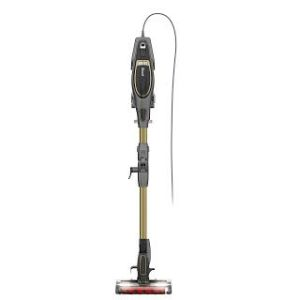
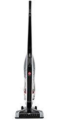

Has it ever crossed your mind why people are so much interested in finding the best vacuum for laminate floors? If you have, you are not alone.

Many times, the very people think about how to find the ideal laminate floor vacuum have at some point in their lives bought a vacuum cleaner.

You might be interested in [stationary floor vacuum](https://www.bestofvacuum.com/best-stationary-vacuum/) proficient in grabbing pet hair, soil, dust from hard floors.

You may have vinegar, soap, a special detergent for laminate flooring, and several other washing materials, but still, you are not satisfied with what you see on your hard floors.

The secret lies on the following list of 11 vacuum cleaners for laminate flooring.

Each of the hard floor vacuums listed below has unique features that have been carefully hand-picked for you.

**Also Read:**

-   [**Best commercial vacuum**](https://www.bestofvacuum.com/best-commercial-vacuum/)
-   [**Multi purpose steam cleaners**](https://www.bestofvacuum.com/best-multi-purpose-steam-cleaner/)
-   [**Best vacuum for shag carpet**](https://www.bestofvacuum.com/best-vacuum-for-shag-carpet/)
-   [**Vacuum for car detailing**](https://www.bestofvacuum.com/best-vacuum-for-car-detailing/)

| Picture | Name | Features |
|---|---|---|
|  | ECOVACS DEEBOT N79S Robot Vacuum Cleaner | *Max power suction mode – where necessary, you can increase suction power to 1000 pascals.*Smart App & Voice Controls*Auto-Clean + 3 Specialized Cleaning Modes |
|  | Bissell CrossWave Floor and Carpet Cleaner with Wet-Dry Vacuum, 1785A | *Vacuums and washes your floors.*Dual-action Multi-Surface brush roll.*Two-tank system keeps cleaning solution and dirty water. |
|  | BISSELL PowerEdge Pet Hardwood Floor Bagless Stick Vacuum Cleaner, 81L2A | *Bagless*Cyclonic Technology*Swivel Head |

## 11 Best Vacuums for Laminate Floors Reviews

## 1\. ECOVACS DEEBOT N79S Robot Vacuum

ECOVACS DEEBOT Robot N79S is among the few robot vacuums for laminate flooring that utilises modern technology.

For instance, the vacuum uses a remote control and a special app.

Take a moment to think about this: when in the world did you think that you would get home, raise your voice and command a vacuum cleaner, which in turn will listen and act according to your command?

Thanks to the Voice Controls as well as the Smart App, it is now possible for homeowners to utilize the Google Home voice or the Alexa to direct the ECOVACS DEEBOT Robot N79S to perform a deep cleaning. [**Click here to see latest price on Amazon.**](https://www.amazon.com/gp/offer-listing/B077HW9XM7/ref=as_li_tl?ie=UTF8&camp=1789&creative=9325&creativeASIN=B077HW9XM7&linkCode=am2&tag=bestofvacuum2-20&linkId=9c43bc445c838b7bd63a2fb749bad234)

Still, on the Smart App and the Voice Controls feature, I bet you will love the idea that through a customizable control panel, you will receive error alerts as well as the status of the vacuum cleaner.

ECOVACS DEEBOT Robot N79S is fitted with extra large wheels and a bigger dustbin, which help the robot vacuum to climb most places in the house and carry a lot of dirt respectively..

### **Tips**

As is the case with proper communication, you need to speak up and properly pronounce words correctly for the Smart App and Voice Controls to be able to pick your command(s).

### **Buyer’s Guide**

Technology is inevitable. Yes, the IoT is doing things the right way. As the world continues to embrace technology, you too should see how you can make it easier cleaning your house by choosing an appliance like ECOVACS DEEBOT Robot N79S that will help you do so.

### **Pros**

-   Uses the latest smart technology.
-   Takes a small space.
-   Light in weight (7 lbs).
-   You can clean the house from the comfort of your couch.

### **Cons**

-   The Smart App and Voice Controls need a stable network.

**Also read: [Best vacuum cleaners for hardwood floors](https://www.bestofvacuum.com/best-vacuum-cleaner-for-hardwood-floors/)**

## 2\. Bissell CrossWave 1785A  Hard Floor and Carpet Vacuum

I personally love the sleek design of the improved Bissell CrossWave 1785A because of two main things: this vacuum washes and vacuums  your hard floors and carpet  like no other. All these things take place at the same time.

### **Review**

Perhaps the first reason why many people love this best hoover for laminate floors is that it keeps dirt and clean water in separate tanks. Are you wondering why that is important? [**Click here to see latest price on Amazon.**](https://www.amazon.com/gp/offer-listing/B01DTYAZO4/ref=as_li_tl?ie=UTF8&camp=1789&creative=9325&creativeASIN=B01DTYAZO4&linkCode=am2&tag=bestofvacuum2-20&linkId=5a76ce821eac66091cdc24c5b01fdd44) 

Think about this; your floor cleaning solution, which may include some detergents, are kept in Tank A, while the dirt solutions, evidently from the cleaning, is kept in Tank B. This helps save a lot of water.

Many homeowners praise Bissell CrossWave 1785A for its ability to do a multiple of things at the same time.

For instance, apart from the washing and vacuuming that we have already talked at the intro, the vacuum cleans area rugs as well as floors that are sealed.

Essentially, what I am saying is that Bissell CrossWave 1785A is the best vacuum cleaner for hard floors and carpets.

There is also the issue of how to control the vacuum. Bissell CrossWave 1785A has one of the easiest control panels.

In fact, it is placed on the fingers, where you can easily reach them thus you are able to switch when cleaning different types of floors.

[**See our Reviews for best vacuum mop combo**](https://www.bestofvacuum.com/best-vacuum-mop-combo/)

### **Suggestions**

Bissell CrossWave 1785A has a 25-ft long power cord. Before you start cleaning, ensure you unwind the cord.

### **Tips**

Did you see that Bissell CrossWave 1785A has a dual tank? Yes, it does. First, clean the room as you normally do by applying a small amount of the cleaning solution.

When the dirty water tank is full, you can empty it before you continue with the cleaning.

### **Buyer’s Guide**

I am sure by now; you know what you need in a vacuum. However, I’m also aware that if I told you that it is better to have a vacuum that separates dirty and clean water, you’ll love the idea. Think about this factor.

### **Pros**

-   The 25-ft power cord ensures you clean a large area with a single power source.
-   Ensures clean floors thanks to double tank.
-   Consumes less energy (4.4 Amps).
-   Easy to reach controls.

### **Cons**

-   Somewhat heavy at 11.02 lbs.

## 3\. Shark Flex DuoClean Ultra-Light Upright Vacuum 

Shark Flex DuoClean HV391 is one of the premium vacuum cleaners that will give you real value for your money thanks to its durability.

### **Review**

Every word that is in the name of this vacuum cleaner communicates a lot.

For instance, the words Multiflex refers to the underlying technology that enables users of Shark Flex DuoClean HV391 to clean difficult to reach places such as under furniture and beds. [**Click here to see today’s price on Amazon.**](https://www.amazon.com/gp/offer-listing/B074F2PHLB/ref=as_li_tl?ie=UTF8&camp=1789&creative=9325&creativeASIN=B074F2PHLB&linkCode=am2&tag=bestofvacuum2-20&linkId=f99cd32c707da345777027f695261b30) 

Shark flex comes with two types of brushes. The first brush is a bristle brush that you can use to ensure a deeper cleaning of the carpet.

To achieve a nice sparkling look, after the initial deep clean, you will use the second soft brushroll. The latter will help you pull larger dirty particles together.

Shark Flex DuoClean HV391 is fitted with an Active-Glide Technology for smooth maneuverability on floors and carpets while maintaining powerful suction.

**You may also be interested in: [Best rated Vacuums for Concrete Floors](https://www.bestofvacuum.com/best-vacuum-for-concrete-floors/)**

### **Suggestions**

Shark Flex DuoClean HV391 has many quality features. Chief of these is that it is an upright, hand-held vacuum cleaner. Utilize this and many abilities to clean the ceiling, under chairs, and other hard-to-reach places.

### **Tips**

As already tipped in the ‘Review’ section, Shark Flex DuoClean HV391 comes with a DuoClean Feature. This is a nice feature because, without it, it is hard to achieve the best cleaning results. My advice is you learn how to use both the hard brush and the additional soft brushroll.

### **Pros**

-   The upright mode makes it easier for all to use the vacuum even those with back problems.
-   The 30-feet power cord is nice for those with big rooms.
-   Comes with LED lights to detect dirt.
-   Quick and easy to assemble.
-   It is versatile (you can lift it to be a hand-held vac).

### **Cons**

-   A 30-ft long cord  may be clumsy to other homeowners.

## 4\. Dyson V6 Cord-Free Hard Floor Vacuum

Dyson V6 is a cordless vacuum cleaner that continues to be the choice of many homeowners.  It is important to note that if many people love it, there must be reasons. Check out why.

### **Review**

One of the biggest reasons why you will love Dyson V6 is that it comes with a washable filter. Yes, you do not need to change the filter.

Whenever it gets dirty, your work will be to remove it, make sure it is clean and then replace it back.  [**Click here to see latest price on Amazon.**](https://www.amazon.com/gp/offer-listing/B00SMLJPIC/ref=as_li_tl?ie=UTF8&camp=1789&creative=9325&creativeASIN=B00SMLJPIC&linkCode=am2&tag=bestofvacuum2-20&linkId=d9903a2ad31b65e1f7cb2b249224aaeb) 

Dyson V6 is designed in a manner that enables the vacuum to clean all types of floors.

The floors include, of course, laminate, hardwood, carpets, and even cemented floors.

If you keenly look at the vacuum’s bristles, you will realize that they cover the entire head. This deliberate design allows the vacuum to reach every corner of the house.

### **Suggestions**

For optimal performance of the Dyson V6, you need to know how to use at least two main features. One of the features is its cordless state.

Use it to reach every edge of your house. The second feature is the head with bristles covering nearly the entire head. This makes it easier to clean the lowest places such as under low couches.

### **Tips**

Before you start using Dyson V6, make sure it is fully charged. Because the battery can run for approximately 30 minutes, you’d have cleaned the entire house.

### **Buyer’s Guide**

Do you live in a big house that has many small or big rooms? If yes, you need Dyson V6. The cordless feature is what you need to capitalize on because you can now freely carry the vacuum cleaner to any room.

### **Pros**

-   It is cordless. This allows for easy carriage and maneuverability around the house.
-   It can be handheld. This is ideal to use inside the car, where there isn’t any AC power socket.
-   Super light, at only 4.5 lbs.

### **Cons**

-   Dyson V6 requires a battery. If it fails or is not charged, you will remain to dwell in a dirt environment.

## 5\. Hoover Hardwood Floor Cleaner

Hoover WindTunnel UH70400 is one of the few high-end vacuum cleaners that can be used to clean multiple floor types.

### **Review**

Although Hoover WindTunnel UH70400 weighs approximately 18 pounds, you won’t feel the weight especially when you consider how it works perfectly.

You can easily clean your house’s staircases as well as some hard-to-reach places. [**Click here to see latest price on Amazon.**](https://www.amazon.com/gp/offer-listing/B004G5TQIM/ref=as_li_tl?ie=UTF8&camp=1789&creative=9325&creativeASIN=B004G5TQIM&linkCode=am2&tag=bestofvacuum2-20&linkId=72c91c2b7889e6baba99f166891bb930)

The vacuum has a 1200W motor. This tells you that you cannot compare Hoover WindTunnel UH70400’s suction power with most of its competitors.

Remember too that Hoover WindTunnel UH70400 is fitted with a 30-ft long power cord.

This with an additional horse ensures that you can clean a large room without necessarily moving your vacuum from one end to the other in search of a power source.

### **Suggestions**

Use the power cord and the extended hose to ensure that the whole house including the furthest ends are washed and vacuumed.

### **Tips**

In the event that the 30-ft power cord does not allow you to reach a certain end of the room, do not panic. Use the hose extension to clean the area.

### **Buyer’s Guide**

From my experience, although I stand to be corrected with facts, a vacuum cleaner with a powerful motor has a superior suction power.

That of course, is the case with Hoover WindTunnel UH70400. Therefore, when you are out there sourcing for a vacuum cleaner for hard floors, it is important to put that in mind.

### **Pros**

-   Superior suction power.
-   Long power cord to reach a large area.
-   Hose extension aids the power cord to reach an even larger area.

### **Cons**

-   It is heavy, weighing 18 pounds.

## 6\. Bissell PowerFresh Tile Cleaner and Hard Wood Floor Cleaner, 1940

Bissell is one of the internationally recognized companies that has been around for a long time.

During this time, the company has devoted its resources and time to develop creative home cleaning appliances such as Bissell PowerFresh Floor Steamer 1940, one of the highly-esteemed vacuum cleaners on the market.

### **Review**

With Bissell PowerFresh Floor Steamer 1940’s natural steam power, it has the ability to eliminate germs from hard floors floors, carpets, and rugs.

Thanks to the vacuum’s smart digital control, you are able to choose between low, medium, or high steam cleaning. This capability is not found in any of its competitors. [**Click here to see latest price on Amazon.**](https://www.amazon.com/gp/offer-listing/B0091YYUAM/ref=as_li_tl?ie=UTF8&camp=1789&creative=9325&creativeASIN=B0091YYUAM&linkCode=am2&tag=bestofvacuum2-20&linkId=feeb3a9ecd6996a487897068b37890cc) 

Others things you will love about Bissell PowerFresh Floor Steamer 1940 include the 23-ft power cord, the swivel steering, a carpet glider, fragrance discs that leave your house with a sweet aroma after vacuuming, and microfiber soft and scrubby pads to ensure your  floor is shiny.

### **Suggestions**

Bissell PowerFresh Floor Steamer 1940’s strength rests on not only the steam alone but also on the ability to shift between the intensity of the steam.

With this, no stain that will permanently remain on the laminate floor.

### **Tips**

If you want to achieve the best results, which I bet you do, learn how and when to use different steam intensities. If the stain isn’t that deep and stubborn, set the Bissell PowerFresh Floor Steamer 1940 on a low steam.

### **Pros**

-   Perfect for stubborn stains.
-   Doesn’t scratch your laminate flooring.
-   Leaves a nice scent behind once the room is clean.
-   Less costly comparing the features.

### **Cons**

-   It might be a challenge for some homeowners to decide which stain needs a certain level of steam. In the end, you might use a lot of steam on your floor than necessary.

## 7\. Shark Rocket DuoClean Ultra-Light Vacuum (HV382)

Shark Rocket HV382 Complete DuoClean is a premium vacuum cleaner that works better on a variety of floors. You can use it on carpets as well as hardwood.

### **Review**

As is the case with most of the other Shark Company products, Shark Rocket HV382 Complete DuoClean is light in weight. With just 9.9 lbs, anybody in your home can use it to clean the house. [**Click here to see latest price on Amazon.**](https://www.amazon.com/gp/offer-listing/B01K7L8U62/ref=as_li_tl?ie=UTF8&camp=1789&creative=9325&creativeASIN=B01K7L8U62&linkCode=am2&tag=bestofvacuum2-20&linkId=ef61ee28a37dd102162d52449961c011) 

The other thing you will love about Shark Rocket HV382 Complete DuoClean is that it comes with a dual brush.

With a dual brush, you are assured of efficient cleanliness. The first brush is aimed at removing hard and stubborn stains. The other brush, the soft brush, leaves your floor shiny.

The LED lights that are strategically placed on the nozzle and close to the handle are designed to help you spot dirt and hidden debris fast.

### **Suggestions**

If you want Shark Rocket HV382 Complete DuoClean to really help you for a long time, use it as it should. One way that I have seen working best is to first clean the laminate floor using the hard brush, then repeat using the soft brushroll.

### Pros

-   Sleek and intuitive design.
-   Versatile and friendly to all types of floors.
-   Long cord to help clean a large area.
-   LED light to help you spot hidden dirt.

### **Cons**

-   Some users have complained about the rate at which the belts wear out. Once the rubber is burnt, the smell can be messy.

## 8\. Miele Complete C2 SBD285-3 Hard Floor Canister Vacuum Cleaner

It is not long ago when Miele entered the market. But, the manufacturer has come with products of substance.[**Click here to see latest price on Amazon.**](https://www.amazon.com/gp/offer-listing/B07B3LR8JB/ref=as_li_tl?ie=UTF8&camp=1789&creative=9325&creativeASIN=B07B3LR8JB&linkCode=am2&tag=bestofvacuum2-20&linkId=c9baf6d263a61f4f067c50654ca3b659) 

One of these products is Miele Complete C2 SBD285-3 Hard Floor Canister Combination Rug With SBB400-3 Parquet Twister Vacuum Cleaner.

### **Review**

Miele Complete C2 SBD285-3 With SBB400-3 Parquet Twister poses advanced features that are not in many vacuums that have dominated the market for a long time.

For instance, the manufacturer says that the vacuum has the ability to last for up to 20 years. Is this possible? Fortunately, it is possible! [**Click here to see latest price on Amazon.**](https://www.amazon.com/gp/offer-listing/B07B3LR8JB/ref=as_li_tl?ie=UTF8&camp=1789&creative=9325&creativeASIN=B07B3LR8JB&linkCode=am2&tag=bestofvacuum2-20&linkId=c9baf6d263a61f4f067c50654ca3b659) 

The vacuum uses a very powerful 1200W motor. As you may beware, one of the fundamental features of the best vacuum cleaner for laminate floors is a powerful motor, which allows for strong suctioning.

Another thing you will love about Miele Complete C2 SBD285-3 with SBB400-3 Parquet Twister is that it is equipped with 6 different speeds.

Yes, while others have utmost three speeds, Miele Complete has 6 speeds.

Did you see the Miele SBB400-3 Parquet Twister name? it means the vacuum comes with an extra large brush that can reach virtually every corner of the house.

### **Suggestions**

To achieve faster cleaning, you will utilize the SBB300-3 Parquet Twister.

### **Tips**

With the Miele Complete C2 SBD285-3 With SBB400-3 Parquet Twister, you will have crevice tool, telescopic wands that are stainless steel, and a dusting brush among other accessories.

### **Buyer’s Guide**

Very few vacuum cleaners come with many features as Miele Complete C2 SBD285-3 with SBB400-3 Parquet Twister. With it, you will be sorted.

I personally love the 90 degrees rotation ability. It helps to ensure each part of the house is clean.

### **Pros**

-   Has a crevice tool.
-   Many quality features.
-   Sleek design.
-   The 6 speeds allow you to clean the house 20% faster than other cleaners.

### **Cons**

-   It is heavy, at 19.5 lbs.
-   May be expensive to some.

## 9\. BISSELL PowerEdge Pet Hard Floor Vacuum,

Bissell PowerEdge Pet 81L2T is one the most prolific vacuum cleaners in the market with high-velocity performance, yet it is among the most affordable.

### **Review**

Bissell PowerEdge Pet 81L2T is designed with a V-shape. This is an ingenious way to ensure the vacuum captures debris and any dirt with easy.

The suction control does not come with many sophisticated commands and variables, enabling easy and stress-free cleaning on laminate floors. [**Click here to see latest price on Amazon.**](https://www.amazon.com/gp/offer-listing/B00450U7V8/ref=as_li_tl?ie=UTF8&camp=1789&creative=9325&creativeASIN=B00450U7V8&linkCode=am2&tag=bestofvacuum2-20&linkId=a0038686678e8b933fd17f05ec002797) 

Bissell PowerEdge Pet 81L2T is fitted with a 20-ft long power cord. This is ideal for medium-sized to large rooms covering up to 400 square feet.

Although there is no hose, the swivel steering, the V-shape, powerful suction power, and the low-profile stature make Bissell PowerEdge Pet 81L2T one of the best vacuum cleaner for laminate floors and pet hair.

### **Suggestions**

At times, it is important not to underestimate certain features, however small they may be. For instance, the easy-to-clean dust cup allows you to empty the dustbin very fast as you go back to your cleaning.

### **Tips**

In the event that you are not certain about what to do with what feature, the best advice I’ll give you is to refer to the user’s manual prepared by the manufacturer.

### **Buyer’s Guide**

Before you read this description about Bissell PowerEdge Pet 81L2T, there are chances you knew a few things about it. Now that I have added quite a number, it is time you looked for. Consider that this vacuum cleaner has a 6 amps power motor. This will help you save energy.

### **Pros**

-   Easy to set up.
-   Easy to use. No complications.
-   A long power cord to reach each corner of a medium-sized room.
-   Low profile to clean each corner.
-   Economical in terms of energy consumption.

### **Cons**

-   Maybe less powerful with the foam filter intact.

## 10\. Hoover Linx BH50010 Hardwood Floor Vacuum

If you have never used any vacuum cleaner by Hoover, it is time you tried it. You will never go wrong.

### **Review**

Hoover Linx BH50010 comes with fade-free interchangeable lithium batteries that provide the vacuum with the energy you need for cleaning. [**Click here to see latest price on Amazon.**](https://www.amazon.com/gp/offer-listing/B001PB8EJ2/ref=as_li_tl?ie=UTF8&camp=1789&creative=9325&creativeASIN=B001PB8EJ2&linkCode=am2&tag=bestofvacuum2-20&linkId=dab0c6ddd1b659db427a23937fd43a4f) 

As is the case with many modern vacuum cleaners, Hoover Linx BH50010 has an extreme recline ability.

With this feature, cleaning very low ends such as under beds, chairs, and couches will not be a problem.

The other interesting feature is the battery gauge, which lets you know the remaining battery life. With this feature, you will never be caught unaware with a flat battery.

### **Suggestions**

When you are in the usual cleaning and vacuuming process, ensure your eye checks on the battery gauge.

### **Tips**

Because Hoover Linx BH50010 is cordless, ensure that it is fully charged before you start using it. This will save you any embarrassment that might come as a result of the battery running low amid the cleaning process.

### **Buyer’s Guide**

Hoover Linx BH50010’s interchangeable batteries are the vacuum’s strength. When buying this best vacuum , ensure they are in good condition.

**See our reviews for [best vacuum for car detailing](https://www.bestofvacuum.com/best-vacuum-for-car-detailing/)** 

### **Pros**

-   It is cordless thus hustle-free.
-   Interchangeable batteries last long after a full charge.
-   Fuel Gauge that shows the battery life is essential if used properly.

### **Cons**

-   The battery may go flat when you are at the middle of your cleaning thus embarrassing you.

## 11\. Kenmore Elite 21814 Canister for Pet and Allergy Vacuum

Kenmore Elite 21814 Pet and hard floor Canister  vacuum is so far one of the most elite vacuums for pet hair and laminate floors that comes with a double motor to ensure optimum functionality.

The LED light indicator will help you to easily locate any hidden and hard to see stains in the house. [**Click here to see latest price on Amazon.**](https://www.amazon.com/gp/offer-listing/B075F8DZQV/ref=as_li_tl?ie=UTF8&camp=1789&creative=9325&creativeASIN=B075F8DZQV&linkCode=am2&tag=bestofvacuum2-20&linkId=7802ab8fef87918f1ca5463e12dbc45a) 

Do not forget the Kenmore Elite 21814 Friendly CrossOver Canister comes with HEPA filtration feature.

This makes the vacuum ideal for homeowners that live with asthma complications or in one way or another are allergic to bad odor, pet dander, dust or even mold.

### **Suggestions**

Use the LED light whenever you approach corners of your house.

### **Tips**

Although Kenmore Elite 21814 Friendly CrossOver Canister comes with a 26-ft power cord, the auto-rewind makes it simple to fold the cord within seconds.

### **Buyer’s Guide**

Everybody wants good things. If you were to look at the price, chances are you will not buy Kenmore Elite 21814 Friendly CrossOver Canister.

However, if you concentrate on quality, such as the double motor, LED light, and other high-end features, you won’t regret spending whatever amount on it.

### **Pros**

-   Long power cord to reach a large area.
-   2-motor system to ensure powerful suction power.
-   Allergy and asthma-friendly.
-   HEPA Filtration.

### **Cons**

-   The price may be high for some homeowners.
-   It is heavy (29.6 lbs).

## Can You Vacuum Laminate Floors?

Why not? After all, would you not want to stay in a clean environment? The bottom line is that everyone needs to live in a clean and conducive environment.

As to whether one can vacuum laminate floors, the answer is a resounding ‘Yes.’ However, it is important to know from the word go that you need to use the ideal tools and detergents.

If you use wrong or harsh cleansers, chances are your laminate floor will soon warp or simply develop nasty scratches.

**You might also be interested in [best vacuum for vinyl floors](https://www.bestofvacuum.com/best-vacuum-for-vinyl-floors/)** 

Those who hold the view that if you vacuum a laminate floor you will be spoiling the floor are wrong. Perhaps, the only good practice you need to observe is that you do not hold the vacuum cleaner for laminate floors unnecessarily longer on one spot.

Also if you only have an upright vacuum, remember to turn off the rotating brush to keep the bristles from scratching your floors.

The other thing that will help you when vacuuming a laminate floor is doing it regularly or as quickly as possible after you spot a stain on the floor. This will help you clean the floor before the stain gets rigid.

## **How To Ensure Your Laminate Floors Shine**

Many people around the world love laminate floors because they are durable. Besides, laminate floors are usually pricey, something that denotes quality and of course, they are available in a wide range of lovely colors.

Although that sounds nice, there is a challenge. Unless one is keen, keeping laminate floors sparkling and shiny as they are supposed to be is an endless daunting challenge.

Nonetheless, you are not left alone. There are practical ways to make laminate floors look shiny.

Essentially, there’re four main steps you will need to observe if you want to make your laminate floor shine. But before we look at these five steps, here are the things you need:

-   Bucket
-   Broom
-   Mop
-   Vacuum
-   Lint-free cloth.
-   Clean cloth.
-   White vinegar (preferably distilled).
-   Laminate floor polish.

## Step-by-Step Guide To Make your Laminate Floor Shine

If you want to achieve a sparkling shiny laminate floor, you need to follow these steps one after another.

-    **Sweep The Floor**

The debut step is thoroughly sweeping the laminate floor with a broom. This initial step allows you to get rid of any litter, debris, pet fur or dander and any dirt that may be on the floor.

-   **Mob the Floor**

Fill the bucket with clean water. Mix distilled white vinegar and any other soft detergent or soap. When doing this, ensure you use a soft mop or piece of cloth.

**PS 1.** You deep the piece of cloth inside the mixture, squeeze it then use it on the laminate floor while it is dumb.

-   **Mop Again**

Why do you have to mop the laminate floor for the second time in quick succession? The aim of this second mopping is to remove the vinegar and any other detergent that remained during the initial mopping.

Use the clean lint-free cloth in this process. To achieve optimum results, rub the laminate floor in a circular motion.

**PS 2.** During this second mopping, you ONLY use clean water.

-   **Apply Polish**

This final stage is the most important part. It is the part that tells the world what you have done. It tells the difference between who cleans a laminate floor and who leaves the laminate floor sparkling.

You will need to apply the laminate floor polish from the furthest corner of your house or room as you exit.

In the end, my advice is, although you have used the best vacuum for laminate floors, it is not enough if it doesn’t remain shiny for the next 7 days.  Once you exit the room, try not to step on it for 24 hours. You will love the shining floor that will welcome you the next day.