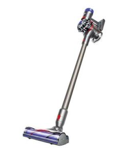

Long human hair or pet hair can be a hassle to vacuum. Well, unless you have the best vacuum for long hair.

Long hair – just like pet fur, pollen, lint, and skin flakes shed by humans and pets, are source of food for dust mites. Those nasty creatures are the most common cause of allergy from house dust. Certainly not the type of pest you can tolerate in your house.

Fortunately, vacuum cleaners that are good for long hair will also eliminate everything else.

The key characteristic of such vacuums is the powerful suction. This ensures both large, small or stubborn particles are sucked off the floor. Plus, they have highly effective HEPA filters to trap allergens and dust.

And they don’t easily get clogged up like Shark Navigator (ZU561).

That’s a particularly irritating issue in low-quality vacuums, which can turn a 5-minute vacuuming session into a miserable 30-minute ordeal.

Most importantly, you need a vacuum that’s not only fast and effective, but also safe.

The good news is there exist a collection of vacuums with excellent hair removal capabilities. These include upright, stick, corded and even robot vacuums. That gives you the freedom to pick one that suits your needs when it comes to cleaning long hair.

## Quick Comparison Chart

| Best Vacuums for Long Hair | Name | Type | Features |
|---|---|---|---|
|  | Shark ZU561 Navigator Lift-Away Speed Self Cleaning Brushroll Lightweight Upright Vacuum | Upright | Self-cleaning brushroll for powerful pet hair pickup with no hair wrap. |
|  | Shark ION Robot Vacuum R75 with Wi-Fi and Voice Control | Robot | Multi-surface brushroll removes long hair, dust, and dander to prevent everyday buildup. |
|  | Dyson V7 Animal Cordless Stick Vacuum Cleaner, Iron | Stick | Motorized brush bar tackles long hair and ground in dirt in tight spaces. |

## Top Best Vacuum Cleaners For Long Hair

This review highlights  some of the best vacuum cleaners for people with long hair.

## **1\. Shark Navigator Upright Vacuum with Zero-M Anti-Hair Wrap Technology (ZU561)** 

You will love this Lift-Away vacuum cleaner from Shark Ninja because of among other reasons, the Zero-M vacuum cleaner head. This is a perfect defense against hair wrap. [**Click here to see today’s price on Amazon.**](https://www.amazon.com/gp/product/B07FX7Z3NL/ref=as_li_tl?ie=UTF8&camp=1789&creative=9325&creativeASIN=B07FX7Z3NL&linkCode=am2&tag=bestofvacuum2-20&linkId=1bbd93c3c6f837f8f20207efdb19180b) 

### Review

Shark Navigator ZU561 Lift-Away Upright Vacuum is designed to last for long. For this reason, the vacuum cleaner is among the few in the market that are referred to as ‘NextGen’ or Next Generation home cleaning appliances.

To guard your home against long, short, and all types of pet hair, Shark Navigator ZU561 Lift-Away Upright Vacuum comes with Zero-M technology. The technology works best in the brush roll.

The HEPA filter, together with the Anti-Allergen Complete Seal Technology, used in the appliance, makes Shark Navigator ZU561 Lift-Away Upright Vacuum one of the best vacuum cleaners for long hair in the market. Besides, the filter comes with an excellent capability of trapping allergens and dust inside the vacuum.

You can use [Shark Navigator](https://www.bestofvacuum.com/best-rated-shark-vacuum/) ZU561 as an upright vacuum. In this state, the vacuum cleaner becomes the ideal home cleaning appliance on whatever kind of floor and carpet.

Alternatively, you can use Shark Navigator ZU561 to clean stairs, furniture, ceilings, and any other surface above the floor.

Shark Navigator ZU561 is fitted with a swivel steering that makes it easy to maneuver around the house. This maneuverability makes it easy to clean hard-to-reach areas.

**Also read: [Can You Use A Vacuum Without A Roller Brush?](https://www.bestofvacuum.com/can-you-use-a-vacuum-without-a-roller-brush/)**

### Suggestions

If you want Shark Navigator ZU561 to serve you better, you need to master how to use it. The first way to use Shark Navigator ZU561 is as an upright vacuum. The other way is by detaching the canister. This makes the vacuum cleaner the best Lift-Away tool.

### Buyer’s Guide

Shark Ninja has proved itself as one of the high-end vacuum cleaner manufacturers in the market. Do not go with this alone. Shark Navigator ZU561’s suction power, swivel steering, cord length, the vacuum’s color, and its Zero-M technology are enough to settle on the vacuum cleaner.

### Pros

-   Easy to clean.
-   It is quite easy to assemble the vacuum.
-   Anyone can use the vacuum.
-   Powerful suctioning.
-   Traps allergens and dust, making it easy for allergic individuals to use it.
-   The power cord is long enough.
-   No stress emptying the canister.
-   The on/off switch toggles on the hard floor.
-   A clear bucket for dirt is easy to monitor.

### Cons

-   It is a bit difficult to make a sharp corner while vacuuming.
-   The 3 different hose detachable nozzles do not fit the vacuum.

**Also Read:**

-   [**Best wet dry vacuum for laminate floors**](https://www.bestofvacuum.com/best-vacuum-for-laminate-floors/)
-   **[Best vacuum that also mops](https://www.bestofvacuum.com/best-vacuum-mop-combo/)**
-   [**Best vacuum for picking up cat litter**](https://www.bestofvacuum.com/best-vacuum-for-cat-litter/)

##  **2. Dyson v8 Animal Cordless Vacuum Cleaner**

Dyson V8 Animal Cordless Stick Vacuum for long hair

### **Review**

Dyson V8 Stick Vacuum Cleaner is rechargeable. Perhaps, this is the first reason why it takes the lead in this list. It is also portable and can clean up carpets from deep inside. With this ability, its performance can be equated with heavier cleaning machines that are available in the market today. [**Click here to see today’s price on Amazon.**](https://www.amazon.com/gp/offer-listing/B06XG7WKKL/ref=as_li_tl?ie=UTF8&camp=1789&creative=9325&creativeASIN=B06XG7WKKL&linkCode=am2&tag=bestofvacuum2-20&linkId=6b297b8e5d3abf6d9c3aa7a032b82330) 

If you do not have a very large home to clean, this type is the most preferred. With this vacuum cleaner, you can release the dirt very easily, and do not need to take hair out of the roller.

**You might also be interested in  [corded stick vacuum](https://www.bestofvacuum.com/best-corded-stick-vacuum/)** 

The only setback with this vacuum cleaner for long hair is its battery, which lasts only for a short while.

### **Suggestions**

If your home space is large, use this for quick cleaning jobs. Alternatively, you can go for [a Dyson vacuum](https://www.bestofvacuum.com/best-dyson-vacuum/) that runs on an AC outlet power.

### **Tips**

In order for this vacuum cleaner to serve you for many days, you need to master the art of using it. When using it, it has to be on the regular suction setting. Never should you use it on the maximum suction setting. Are you wondering why this has to be so?

The battery power can last up 40 minutes when you use the vacuum cleaner on a regular setting. Surprisingly, the battery will last for only 10 minutes when you use it on the maximum.

### **Pros**

-   Dyson V8 has up to 40 minutes of run time when fully charged.
-   The vacuum cleaner is light in weight at just 2.55 kg, and can be maneuvered easily throughout the working space.
-   It has a robust suction, which helps it to pick up long hair, cat litter, and even tough dirt with ease.
-   Dyson V8 removes stubborn dog hair with ease; it is the best vacuum for long dog hair.
-   Quite – in fact quieter than a hair dryer.
-   Easy to attach/detach the various attachments.

### **Cons**

-   Some of its components look and feel slightly flimsy.
-   When compared to the Dyson Cyclone V10, it does not pack as effective a punch.

## **3\. Shark Rotator TruePet Upright Vacuum (NV752)**

This is an extremely versatile shark vacuum for long hair that transforms easily into a canister or upright whenever needed.

### **Review**

Shark Rotator TruePet Upright Vacuum is comes with a caddy whereon you can safely put the canister. It also works as a powerful storage bin for the accessories. You may use the Hard-floor genie attachment or the main floor tool to clean up bare floor surfaces. [**Click here to see today’s  price on Amazon.**](https://www.amazon.com/gp/product/B00X7R1FZ2/ref=as_li_tl?ie=UTF8&camp=1789&creative=9325&creativeASIN=B00X7R1FZ2&linkCode=am2&tag=bestofvacuum2-20&linkId=285a6f4d5a515b3f3ea1ffc7e7946563) 

Its primary motorized tool comprising of stiff bristles, help it agitate and clean up carpets effectively.

### **Suggestions**

You need to dust the foam filter at regular intervals after vacuuming for some days. During the process, your hands will be dirty but this will help you to remove a large amount of fine dust from the filter.

Experts advise that you need to wash it sooner than necessary, as the vacuum might lose its suction power if you do not ensure that it is clean shortly after using it. The HEPA filter will also get worn out prematurely.

**You might be interested in  [uv vacuum cleaners](https://www.bestofvacuum.com/best-uv-vacuum/)**

### **Tips**

You can get better cleaning experience when you set it at an upright position.

### **Buyer’s Guide**

Do not try to pick up a lot of heavy particles at the same time. If you do this, it will only end up making litter go to the wrong area of the bin and not in the space for dirt collection.

### **Pros**

-   The device offers a robust cleaning performance on hardwood floors as well as on carpet.
-   The Lift-Away technology, powered by motor, makes the vacuum cleaner highly versatile.
-   It boasts of Sealed HEPA Filtration that can get rid of 99.99% of allergens even as small as 0.3 microns.
-   The vacuum cleaner is fitted with a mini-motorized brush, which is effective in [cleaning pet hair](https://www.bestofvacuum.com/best-vacuum-for-pet-hair/) or long human hair on fabric upholstery.
-   It comes with a 5-year warranty.

### **Cons**

-   It is slightly heavy, which can make it a little inconvenient to maneuver for petite people.
-   It has a high price tag. But it is inexpensive than Dyson vacuums.

## **4\. Shark ION ROBOT 750 Vacuum with Wi-Fi Connectivity (RV750)** 

The Ion Robot vacuum is the company’s debut attempt of the brand Shark at offering a robot-vacuum cleaner.

### **Review**

This vacuum cleaner is very effective in tidying up messes, and can clean up surfaces by avoiding obstacles. It is smaller compared to the Roomba, and it’s convenient to use it when cleaning the space beneath large furniture items. [**Click here to see latest price on Amazon.**](https://www.amazon.com/gp/offer-listing/B075JRB2Z9/ref=as_li_tl?ie=UTF8&camp=1789&creative=9325&creativeASIN=B075JRB2Z9&linkCode=am2&tag=bestofvacuum2-20&linkId=042e6b8f0823bd81bfd7c7cd76467267) 

Ion Robot vacuum cleaner is able to pick up 90% of debris from vinyl and wood floor surfaces thanks to its infrared sensors. On average, it can clean for 60 minutes before its battery power is completely drained.

### **Suggestions**

The unit cleans following only a random pattern, and you have to move the equipment regularly from one spot to another for proper home cleaning.

### **Tips**

It is possible to use the Google Assistant and Amazon Alexa integration feature, and operate a cleaning cycle with the aid of a voice command.

### **Buyer’s Guide**

You can use any of the 3 hardware buttons that are at the top of the Ion Robot 750 to prompt its functions. Alternatively, you can download the Android or iOS companion app that offers stronger controls that collect data on the cleanup cycles.

### **Pros**

-   It works quietly, and the noiseless operations make it a joy to use during early mornings or the dead of night.
-   It can clean up low pile carpet and bare floor surfaces very well.
-   The dual side brushes are effective in cleaning up dirt from the corners and the edges.
-   You can use the companion app for Smartphones to get remote access to the device and operate it with WI-FI connectivity.

### **Cons**

-   It is ineffective in deep cleaning carpeted surfaces.

## **5\. Shark Navigator Lift-Away Professional NV356E** 

This is a detachable lightweight vacuum cleaner that offers consistent suction power and can let you clean up carpets, rugs, and other upholstery easily.

### **Review**

Shark Navigator Professional NV356E vacuum cleaner lets you clean up ceiling fans, drapes, upholstery, furniture, stairs, and even spots that are tough to clean otherwise. In terms of performance, it resembles the pricier Dyson vacuums. [**Click here to see latest price on Amazon.**](https://www.amazon.com/gp/offer-listing/B005KMDV9A/ref=as_li_tl?ie=UTF8&camp=1789&creative=9325&creativeASIN=B005KMDV9A&linkCode=am2&tag=bestofvacuum2-20&linkId=8ab081a8ce0bb18a73a6c8a4cd626d78) 

If you are annoyed with pet hair cleaning issues at home, the Turbo brush will make your job easier. Because of this reason alone, Shark Navigator NV356E is the best shark pet vacuum cleaner for long human hair.

### **Suggestions**

This vacuum cleaner consists of a small ring that you can use to reduce the suction power in case the vacuum turns too tough to be pushed.

### **Tips**

Keep checking the indicator light on the motorized brush that turns green anytime the brush is not properly working.

1.  **PS**. In case of a jam or blockage, the indicator turns red.

### **Buyer’s Guide**

The vacuum has its dirt release tab located at the canister’s bottom rather than the hinge. For you to press the button with ease, you have to keep it high enough. It can make your hands dirty, and you must routinely release the contents into the trash can. Experts advise that you have to do this when there is no blowing of high wind.

### **Pros**

-   It is a great vacuum cleaner for people with allergies because dust is kept in canister.
-   The vacuum cleaner is very effective in removing long human hair, dust, and dirt from rugs and carpets, which makes it the best vacuum for long human hair.
-   The vacuum itself is very convenient to clean up, partly due to its hassle-free dust cup.
-   It has plenty of suction power, and the adjustable suction feature makes it easier to use on drapes or lighter rugs as well.
-   You can easily transform the cleaner from an upright vacuum to a hand-held canister vacuum.

### **Cons**

-   It tends to make some noise during cleaning operations.
-   It is top-heavy in design, which makes it hard to move around during a cleaning exercise.

## **6\. Eureka Mighty Mite Corded Canister Vacuum Cleaner, 3670G**

Mighty Mite Vacuum Cleaner is lightweight canister that has the ability to clean up vents, upholstery, and difficult spots.

### **Review**

This vacuum cleaner is powered by a 12-amp robust motor. With this motor, the vacuum cleaner boasts of a powerful suction feature that allows it to easily pick up long hair, dust, mites, dust, cheerios, pet litter, pet hair, and more. [**Click here to see latest price on Amazon.**](https://www.amazon.com/gp/offer-listing/B00002N8CX/ref=as_li_tl?ie=UTF8&camp=1789&creative=9325&creativeASIN=B00002N8CX&linkCode=am2&tag=bestofvacuum2-20&linkId=507a9340ab56a2555ffad9e32bc054e0) 

There are two extension wands of removable form, which make length adjustment more flexible based on which area you wish to clean up.

### **Suggestions**

While carpeting, the floor attachment can get stuck and cause problems. You should try cleaning carpets without extending the bristles.

### **Tips**

This vacuum cleaner does not come with a shoulder strap. This means less convenience. But you can tackle this issue by stopping between cleaning sessions, to give your hands some rest.

### **Buyer’s Guide**

The vacuum tends to get clogged, especially in the spot where the hard plastic section bends while connecting to the hose. You have to take care of this.

### **Pros**

-   Eureka Mighty Mite is only 8.6 pounds in weight, which makes it easily transportable and conveniently maneuverable.
-   It is a bagged vacuum cleaner, and stands as a perfect choice for individuals suffering from allergies.
-   It works very well on bare floor, and the long extension wand allows easier reach to spots that are difficult to clean.
-   The vacuum cleaner boasts of a robust suction power. There is blowing feature that can be used when needed.
-   It is offered with quite a few accessories that let you clean up stairs, blinds, upholstery, etc easily.

### **Cons**

-   The lack of a motorized brush means that it does not make an effective cleaning job on rugs or carpets.
-   There is an absence of cord rewind feature.

## **7\. Shark Navigator Lift-Away Deluxe Vacuum (NV360)** 

Shark Navigator NV360 is a robust  upright vacuum that can be used to clean long hair on bare floors and all types of carpets.

**You might also be interested in  [shark vacuum for pet hair](https://www.bestofvacuum.com/best-shark-vacuum-for-pet-hair/)** 

### **Review**

This vacuum cleaner is based on Advanced Cyclonic technology, which lets it separate dust particles from the air that is sucked in. It is equipped with an anti-clogging system that allows suction pressure to be maintained. You can steer and move this vacuum with utmost convenience. [**Click here to see today’s price on Amazon.**](https://www.amazon.com/gp/offer-listing/B00JH98GR4/ref=as_li_tl?ie=UTF8&camp=1789&creative=9325&creativeASIN=B00JH98GR4&linkCode=am2&tag=bestofvacuum2-20&linkId=ee647330f30d5b19415b63f46c598024) 

### **Suggestions**

While cleaning the stairs, you should take the canister off the roller base. However, do not expect it to stand upright. Use your knee(s) to support it. Otherwise, it can tip over.

### **Tips**

There are clogging issues with this vacuum. It is important to always empty the cleaner’s dust cup following each use. The canisters should be taken off and replaced periodically.

### **Buyer’s Guide**

Shark Navigator NV360’s brush head is motorized, and you need to avoid exposing it to water. It is important to go through the entire user’s manual before you start using the cleaner.

### **Pros**

-   It’s bagless which saves you time, energy, and money with no bags to buy or replace.
-   The cleaner is ergonomically designed, which allows ease of grip and maneuverability.
-   It comes with the promise of superior efficiency.
-   The operational costs are lowered for users.
-   It acts fast and can deliver clean rooms very quickly.
-   Its filters are protected from clogging thanks to its proper design, and the vacuum can be used for long without any need to have the components replaced.

### **Cons**

-   Some users feel that the cord is shorter in length compared to those of other vacuum cleaners. This reduces the amount of coverage that is possible for the rooms. But at 25 feet, the cord is long enough for most people.

## **8\. Hoover Linx Cordless Stick Vacuum Cleaner, BH50010** 

In all battery powered vacuum cleaners, the BH50010 provides users with excellent cleaning power to clean up long hair, debris  and dust.

### **Review**

Hoover Linx BH50010 is an easy to use stick vacuum, which comes with a bagless design that can be emptied easily. It has a wider cleaning path than most other Linx models. [**Click here to see latest price on Amazon.**](https://www.amazon.com/gp/offer-listing/B001PB8EJ2/ref=as_li_tl?ie=UTF8&camp=1789&creative=9325&creativeASIN=B001PB8EJ2&linkCode=am2&tag=bestofvacuum2-20&linkId=3b936a0e1055f69ddf675ba1f3651121) 

### **Suggestions**

Do not expect it to clean up a wider area on low power. Once the battery is completely drained out, it takes 3 hours to be fully charged. Keep this in mind when you are short on time and need to clean up a large area.

### **Tips**

The bristle area of this vacuum cleaner is smaller than those of some vacuums available in the market today. If you have long haired members or many pets at home, you may need to sweep the hair first before using the vacuum to clean up the leftovers.

### **Buyer’s Guide**

Do not use this vacuum to pick up larger stuffs than mid-sized dirt chunks, cat food and dog food bits, cereals, and fine powdered substances. It finds it tough to clean up larger objects.

### **Pros**

-   The vacuum cleaner comes with a powered brushroll with windtunnel technology, which helps in the transition from hard floor to area rugs and low pile carpeting easily.
-   Despite its tall stature, it is just 7.25 pounds in overall weight.
-   It is less noisy in operations, and produces just 75 decibels, which does not jar the eardrums in any way.
-   The foam filter can be washed easily, and the dust / dirt cup can be emptied conveniently as well.
-   It boasts of excellent suction power and can clean up bare floors right up to the edges.
-   It allows ease of use, with the ability to stand upright without any support. The vacuum’s power switch can be accessed conveniently.

### **Cons**

-   There is limited mobility, given that its base is unable to swivel during cleaning operations.

## **9\. Bissell Pet Hair Eraser Lift-Off Bagless Upright Vacuum**

As the name suggests, Bissell Pet Hair is an upright vacuum cleaner that has a noticeable suction power. With this irresistible suctioning ability, you can easily up long hair, objects, dust, and dirt. [**Click here to see latest price on Amazon.**](https://www.amazon.com/gp/product/B073DBKFCP/ref=as_li_tl?ie=UTF8&camp=1789&creative=9325&creativeASIN=B073DBKFCP&linkCode=am2&tag=bestofvacuum2-20&linkId=8769a3cb9572eea0dbcaf63ac83b63ff) 

### **Review**

Pet Hair Eraser is a 2 in 1 vacuum cleaner thus can be used in 2 ways – as a lightweight canister vacuum and as a standard upright vacuum cleaner. It is an excellent equipment to clean up cars, homes, RV, and offices. The Febreeze filter insert helps freshen up the air while you vacuum

### **Suggestions**

While cleaning spots that are tough to reach, you should make use of the lighted crevice tool. The light stays on as long as the vacuum cleaner is plugged in and the attachment is joined to the vac.

### **Tips**

You have to make some additional passes for cleaning, given that the brush is narrower in width compared to some of the other vacuum cleaners available today.

### **Buyer’s Guide**

If you have lots of pets at home that shed hair, you need to empty the canister frequently. It is not a big deal to empty the canister.

### **Pros**

-   There is excellent convenience in using this vacuum, given that it comes with a fast release wand to allow specialty tools to be easily replaced. There is a brush roll of tangle-free type.
-   You can empty the contents in a hands-free manner, and ensure that your fingers do not get dirty.
-   The vacuum comes with a 30-feet cord, which allows wider coverage of rooms and no stopping between cleaning sessions.
-   Its LED crevice tool helps it spot pet hair as well as other types of dirt easily even in tight spaces.

### **Cons**

It is slightly heavier than most upright vacuum cleaners in the market.

##  **Features To Look For When Sourcing Out a Good Vacuum For Long Hair**

***Brushroll Clean technology*** – this removes the tangled hair from your vacuum’s brushroll and deposits it into the dust cup with the touch of a button.

***HEPA or Washable filters*** – The former is good for people with dust allergies – check out [vacuum cleaner with water filtration system](https://www.bestofvacuum.com/best-water-vacuum-cleaner/) they are also great for people with allergies.

***Weight*** – Always choose a hair vacuum cleaner that is low in bulk, and can be carried and maneuvered with ease.

***Dirt capacity*** – The amount of dirt that its dust cup / dirt cup can hold is also worth considering.

***Ergonomic design*** – The best vacuum for hair cleaning is one that allows ease of grip during operations, and keeps your hands protected.

## **Best Ways To Remove Long Hair From Carpet**

If you are using the best vacuum cleaner for long hair, you should be able to remove long hair out of a carpet. However, often times, try as you may, some hair may stick in a carpet, making it difficult to remove it. Nonetheless, you are not going to sit and watch as long hair and pet dander stick in your precious carpet.

Here are 10 best ways of removing long hair out of a carpet:

### **1\. Use a Rubber Broom**

A rubber broom is the first tool that comes into mind when you want to remove long hair from a carpet. The good thing about rubber brooms is that you can use them on any kind of carpet. If you have a big carpet, go for a rubber broom with wider bristles.

### **2\. Sponge Mop Your Carpet**

Using lukewarm water, you can sponge mop the carpet. A normal kitchen sponge is better for the job. This method is ideal for small-sized carpets.

### **3\. Shower Squeegee Using a Rubber Head**

If you already own a shower squeegee, it is one of the best tools to get rid of that long hair from a carpet. A shower squeegee head works best in removing long hair from small carpets made of fiber.

### **4\. Try Using A Rug Rake**

Like rubber brooms, rug rakes are also effective in removing long hair from a carpet. The only difference with rubber brooms is that the bristles of a rug rake are thinner. Nonetheless, it is a good tool for removing long hair out of a carpet.

### **5\. Vacuum Clean Using a Motorized Brushroll**

Motorized brushrolls are super effective. Just like a vacuum cleaner for long hair would do, a motorized brushroll does the same. The only thing that is rather weird with this method is that in most cases, the price of a motorized brushroll is overrated thus; many people tend to use the other methods.

### **6\. Rubber Shoes & Rubber Gloves**

Rubber is a magic material that captures not only long hair from carpets but also all sorts of hair. Wearing rubber shoes and rubber gloves whenever you are in the house or cleaning, helps increase the chances of capturing long hair out of carpets.

### **7\. Sprinkle a Little Baking Soda**

How does baking soda help remove long hair from a carpet for heaven sake? Well, this method is incredible. You see, baking soda is good in removing bad smell. Besides, it helps reduce carpet grip on any other foreign material, which include long hair.

However, for you to remove long hair from a carpet, you need to rub the carpet using a brush after sprinkling some baking soda.

### **8\. Use Balloons**

Like rubber, balloons are another effective way of attracting hair their way. In addition, balloons produce static energy or electricity, which in turn helps attract hair to the balloons for easy capture and subsequent removal.

### **9\. Steam Clean Your Carpet**

Steam cleaning your carpet on a regular basis not only helps to capture and remove hair out of a carpet but also a very effective way of killing allergens, removing grime, and dirt from the carpet.

### **10\. Try Using a Double-Sided Tape**

Although time consuming, a double-sided tape is an ingenious way of removing hair out of a carpet. For this method to work, you need to wrap the double-sided tape around your hands. Then, you will need to pass your hands over and around the carpet. At the end of the day, long hair would have stuck on the tape. It’s that simple!

#### **Conclusion**

When it comes to the best vacuum for long hair cleaner, there are plenty of options available on the market. If you need to clean above the floor surfaces as well as floors and carpets, go for 2-in-1 cleaners that can be used as upright as well as handheld cleaning units. But if it’s a lighter cleaner, go for a corded vacuum without brush roll. However, if you need more portability and wider coverage at just one go, you should choose battery operated units. For large homes, corded units are the best vacuums for long hair.