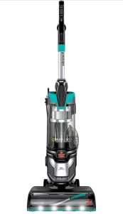
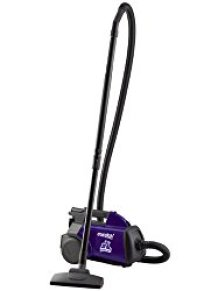

As a pet keeper, you love your pet to bits but hate the fact that their hair is everywhere – on the floor, over furniture sets, on the carpet, on the stairs and many other spots. This not only ruins the overall ambience of your home, but emits bad odor as well.

This can be unhygienic, and even dangerous to breathe in for your kids and guests, something that warrants the best vacuum for pet hair. 

And with lots and lots of brands on the market promising the heaven in terms of cleaning, how many of them actually deliver the expected results? That’s why it is important to look for best vacuum for pet hair to help you in the cleaning operations.

Take a look at some of the best pet hair cleaners that exist today on the market, as you go about your quest to find the pet [hair vacuum](https://www.bestofvacuum.com/best-vacuum-for-long-hair/)**.**

## The Best Vacuum for Pet Hair  Comparison Chart

| Image | Pet Hair Vacuum | Weight [lbs] | Cord Length [ft] |
|---|---|---|---|
|  | Shark ZU561 Navigator Lift-Away Speed Self Cleaning Brushroll Lightweight Upright Vacuum | 17 | 25 |
|  | Shark Rotator Powered Lift-Away TruePet Upright Vacuum, Bordeaux (NV752) | 15.4 | 30 |
|  | BISSELL 2999 MultiClean Allergen Pet Vacuum | 15 | 30 |

## Best Vacuum for Pet Hair Reviews

Well, let’s jump on to our top **best vacuum for pet hair.**

## **1\. SharkNinja Canister Upright Vacuum, TruePet Mini-Motorized Brush**

[- Best vacuum for pet hair ")](https://www.amazon.com/dp/B00X7R1FZ2?aod=1&ie=UTF8&th=1&linkCode=ll1&tag=bestofvacuum2-20&linkId=cfe11fafd373a6fbda808b5bf0fb827d&language=en_US&ref_=as_li_ss_tl)

This one is a lightweight upright vacuum that comes with a detachable canister and offers portable cleaning power. With a simple button push, it can allow you to clean the spots that are difficult to reach. [**Click here to see latest price on Amazon.**](https://www.amazon.com/gp/offer-listing/B00X7R1FZ2/ref=as_li_tl?ie=UTF8&camp=1789&creative=9325&creativeASIN=B00X7R1FZ2&linkCode=am2&tag=bestofvacuum2-20&linkId=3708b507cf79a2599c192d4df3b984b3)

It boasts of the powerful Lift-Away technology that is useful for cleaning operations. The vacuum also comes with a HEPA filter and a fully sealed system for trapping allergens and dust.

There is the Dust-Away hard floor accessory to lift dust and debris from bare floors, and a Brushroll Shutoff button that allows easy switching between bare floor and vacuum carpets.

### ***Suggestions***

The cleaner comes with washable sponge filters. You can rinse those and allow them to be air-dried, before starting with cleaning again. It would be nice to buy a spare set as the filters can take some time for air-drying. You cannot vacuum without those.

### ***Tips***

While cleaning up solid surface flooring, you have to turn off the beater bar to avoid marring the finish. The bar is disengaged automatically once the vacuum is powered on and in an upright posture. This means no more scratched wood floors or burnt carpets.

### ***Buyer’s Guide***

-   Shark Lift-Away has a stiff-bristled brush that is excellent for cleaning upholstery. However, it is not good enough for dusting electronic items.
-   If you want to use the built-in, longer cleaning wand, you will need to unravel the power cord completely and then detach the cord from the cord hook.

### ***Pros***

-   It boasts of powerful suction, and you will be amazed at how much dirt it can lift from the carpet.
-   The **pet hair vacuum** can easily be assembled and used.
-   It has a bigger dust cup that can be emptied and cleaned easily each time you sit down for cleaning.
-   Shark Lift-away comes with an affordable price tag. It comes at a third of what an upright Dyson costs, and you can compare the cleaning performance as well.

### ***Cons***

**Shark Lift-Away** is found to tip over very easily. While using attachments or wand, the vacuum can topple over due to the slightest pull.

## **2\. Dyson V6 Animal Stick Vacuum** 

This handheld vacuum cleaner has an ergonomic shape, and can fit easily into the hand. It’s  the best stick vacuum for pet hair on hardwood floors.

Dyson V6 boasts of robust suction power of 100 AW and has a low weight of only 3.4 pounds, which makes it easy to be used for even longer cleaning operations.

It can run for 20 minutes at a stretch. It is made of plastic and has purple, nickel and red colors. **[Click here to see latest price on Amazon.](https://www.amazon.com/gp/offer-listing/B00SMLJQ7W/ref=as_li_tl?ie=UTF8&camp=1789&creative=9325&creativeASIN=B00SMLJQ7W&linkCode=am2&tag=bestofvacuum2-20&linkId=597db668eb5d7ac0264ece8e98c2d33d)**

***Suggestions***

Emptying the bin can be quite tough, and there is a sliding mechanism that you have to use for cleaning up the bin.

***Tips***

There are two power levels on this unit. You have to use a push button located at the rear part of the vacuum that can be accessed with the thumb. The lower power can work well enough although the maximum level is better for cleaning sessions that are more powerful.

### ***Buyer’s Guide***

The canister is cylindrical in shape and is clearly visible. However, when you have to empty its contents, you need to slide the release that is in a slightly difficult to reach position. You have to use two hands to have the door released and opened down.

***Pros***

-   It is perfect for cleaning all types of hair, even husky hair from pets and furs making it best vacuum for pet hair.
-   The unit has a straight-on design, which allows easier reach into spots that are difficult to access otherwise.
-   It has a flat stand that can hold all the accessories that are offered with the unit.
-   The cleaner has a fairly tolerable noise level, and you will not have much problems regarding noise output.

***Cons***

-   The unit has a moderate battery life, which can be a bother for people who love to clean for a long time in a single session.
-   It is too expensive, and those looking for a device within budget might not find it suitable.

## 3\. Dyson Ball Animal 2 Upright Corded Vacuum

This is a robust upright vacuum cleaner aimed to **clean hair** from multiple surfaces. It boasts of the newest Ball technology that allows convenient steering into spots that are difficult to reach. [**Click here to see latest price on Amazon.**](https://www.amazon.com/Dyson-Ball-Multi-Floor-Origin/dp/B0771GVCV3?pd_rd_w=FwGhO&content-id=amzn1.sym.8ca997d7-1ea0-4c8f-9e14-a6d756b83e30&pf_rd_p=8ca997d7-1ea0-4c8f-9e14-a6d756b83e30&pf_rd_r=S2Z5YATNDPBVS89N07DY&pd_rd_wg=TP6e0&pd_rd_r=2a35208c-343d-4e55-bede-c3f477f09e08&pd_rd_i=B0771GVCV3&th=1&linkCode=ll1&tag=bestofvacuum2-20&linkId=4b48cf2e4aed5ce738f357a37db9ff27&language=en_US&ref_=as_li_ss_tl)

The self adjusting cleaner head and Radial Root Cyclone technology lets it suck dirt from floors and carpets. In the Dyson vacuum range, the animal 2 is the [best Dyson pet vacuum](https://www.bestofvacuum.com/best-dyson-vacuum/) has it  boasts of the best overall pick-up.

It has a tangle-free turbine tool that cleans without getting stuck anywhere. The self-adjusting cleaner head can seal the suction in across hard floors and carpets.

It consists of counter-rotating heads consisting of brushes that can remove dirt and hair from upholstery. The reconfigured brush bar has 25% more amount of power to remove more dirt and drive bristles deeper into the surface of carpets.

### ***Suggestions***

Some users have reported that the unit sometimes throws off plenty of heat. This is not something to bother about while vacuuming single rooms. It is best to wait for sometime between vacuuming various rooms of the entire home.

### ***Tips***

It has HEPA air filters, which can get soiled after some cleaning operations. However, the product manual mentions that the air filters need to be washed after every 3 months.

### ***Pros***

-   At 21.2 pounds, this is a very lightweight **pet floors** cleaning tool.
-   The unit boasts of a long hose and long cord, allowing greater reach for cleaning operations.
-   This is a noiseless device, and quietly goes about cleaning all surfaces.
-   It can be emptied easily, which is a big plus during regular cleaning operations.
-   There are two washable filters.

### ***Cons***

-   The storage box cannot hold all the accessories offered with the vacuum.
-   The price point can be a bother for some buyers, as this one is a fairly expensive cleaner. See [inexpensive vacuums](https://www.bestofvacuum.com/best-vacuum-under-100/).

**Related Post**: **[Best vacuum for long human hair](https://www.bestofvacuum.com/best-vacuum-for-long-hair/)** 

## **4\. BISSELL 2999 MultiClean Allergen Pet Vacuum**

[](https://www.amazon.com/dp/B08DZQWQLQ?pd_rd_i=B08DZQWQLQ&pd_rd_w=TX8dU&content-id=amzn1.sym.3481f441-61ac-4028-9c1a-7f9ce8ec50c5&pf_rd_p=3481f441-61ac-4028-9c1a-7f9ce8ec50c5&pf_rd_r=7X0H11FA33BMHVQQM6BM&pd_rd_wg=ij8xD&pd_rd_r=161869df-b012-46e7-a02e-6fa4909a6797&s=home-garden&sp_csd=d2lkZ2V0TmFtZT1zcF9kZXRhaWxfdGhlbWF0aWM&spLa=ZW5jcnlwdGVkUXVhbGlmaWVyPUEyQjJSVUVUTjhOUVFZJmVuY3J5cHRlZElkPUEwOTAyODI0M0hLSDExMEJQOE5aUiZlbmNyeXB0ZWRBZElkPUEwMjU2NDkyMTE2NUxIVDlUSTI2RiZ3aWRnZXROYW1lPXNwX2RldGFpbF90aGVtYXRpYyZhY3Rpb249Y2xpY2tSZWRpcmVjdCZkb05vdExvZ0NsaWNrPXRydWU&th=1&linkCode=ll1&tag=bestofvacuum2-20&linkId=b9ec79c6c6aee4193728b4a2e9a9594e&language=en_US&ref_=as_li_ss_tl)

The BISSELL 2999 MultiClean Allergen Pet Vacuum comes in as our third vacuum for best vacuum cleaner for pet hair because it  has been designed exclusively for **cleaning pet hair** from various surfaces.

It consists of specialized pet tools to clean embedded hair, eliminate odors and capture allergens. The smart seal Allergen system ensures convenient cleaning of allergens. The patented cyclonic spooling system offers hands-free tank emptying facility. [**Click here to see latest price on Amazon.**](https://www.amazon.com/dp/B08DZQWQLQ?pd_rd_i=B08DZQWQLQ&pd_rd_w=TX8dU&content-id=amzn1.sym.3481f441-61ac-4028-9c1a-7f9ce8ec50c5&pf_rd_p=3481f441-61ac-4028-9c1a-7f9ce8ec50c5&pf_rd_r=7X0H11FA33BMHVQQM6BM&pd_rd_wg=ij8xD&pd_rd_r=161869df-b012-46e7-a02e-6fa4909a6797&s=home-garden&sp_csd=d2lkZ2V0TmFtZT1zcF9kZXRhaWxfdGhlbWF0aWM&spLa=ZW5jcnlwdGVkUXVhbGlmaWVyPUEyQjJSVUVUTjhOUVFZJmVuY3J5cHRlZElkPUEwOTAyODI0M0hLSDExMEJQOE5aUiZlbmNyeXB0ZWRBZElkPUEwMjU2NDkyMTE2NUxIVDlUSTI2RiZ3aWRnZXROYW1lPXNwX2RldGFpbF90aGVtYXRpYyZhY3Rpb249Y2xpY2tSZWRpcmVjdCZkb05vdExvZ0NsaWNrPXRydWU&th=1&linkCode=ll1&tag=bestofvacuum2-20&linkId=b9ec79c6c6aee4193728b4a2e9a9594e&language=en_US&ref_=as_li_ss_tl) 

It has a tangle-free brush roll that eliminates the need for hair-wrap. The Smart Seal Allergen System comprises of Febreze Pet Odor Eliminator that can eliminate pet odors while vacuuming and also keep allergens trapped within the vacuum.

There is a Pet TurboEraser Tool that removes hair embedded from upholstery and carpets, and hidden dirt is uncovered by the LED-lit crevice tool. There are specialized pet tools that come with Quick Release Wand for trapping pet hair from any spot. The Cyclonic Patented Pet Hair Spooling System ensures emptying without the use of hands.

### ***Suggestions***

It is important to use the plastic accessory with care, as it is soft and can break easily if pressed on.

### ***Tips***

The flexible hose does not offer sufficient reach in the form of a stable wand. There is also a short wand, although it is shorter than a few other best vacuums for pet **hair**. While using the wand with the hose, you should first extend your hose all the way. Else, there can be risks of pulling the vacuum over as well.

### ***Buyer’s Guide***

The unit comes with a soft brush attachment, which stores directly on the wand. However, it attaches to the wand in a slightly awkward fashion. However, there are rubber nubs on one of the sides for hair collection. The other side consists of soft bristles that are perfect for dusting.

### ***Pros***

-   The roller bar stays clean even after tidying up pet hair properly from varied surfaces.
-   It has a wonderful crevice tool, which allows easy access into difficult areas. The strong suction helps in convenient cleaning.
-   A toggle switch on the cleaner handle makes it easy to turn the brush on or off. It can easily be reached and used, as **reviewed** by many users.
-   It consists of a canister that can easily be emptied and even small balls getting stuck into it can be removed easily.

### ***Cons***

-   The cleaner works better on carpet surfaces than over hardwood floors. However, this is probably true for most of the full-sized upright **vacuums**.

## 5\. iRobot Roomba s9+ (9550) Self Emptying Robot Vacuum

The iRobot Roomba s9+ (9550) is an advanced and innovative self-emptying robot vacuum designed to efficiently clean your home, especially suited for households with pets and pet hair concerns. [**Click here to see latest price on Amazon.**](https://www.amazon.com/dp/B07QXM2V6X?ots=1&slotNum=1&imprToken=80c51da3-f0b2-a0cd-c78&ascsubtag=%5Bartid%7C10055.g.44129251%5Bsrc%7Cwww.google.com%5Bch%7C%5Blt%7Cpsv%5Bpid%7Cf61b58d0-fe93-42aa-8161-1b8368771a46&linkCode=ll1&tag=bestofvacuum2-20&linkId=98652a9bc17deaddf633e23c41912464&language=en_US&ref_=as_li_ss_tl)

This smart vacuum offers a range of features that make it a top choice for maintaining a clean living space without constant manual intervention.

Here’s a breakdown of its key features:

**Self-Emptying Technology**: One of the standout features of the Roomba s9+ is its self-emptying capability. The vacuum comes with a Clean Base Automatic Dirt Disposal unit that the Roomba docks into. This base can hold dirt and debris for up to 60 days, reducing the frequency of manual emptying and maintenance.

**Pet Hair Cleaning**: The Roomba s9+ is optimized for picking up pet hair and other debris. Its high-powered suction system effectively captures dirt, dust, and hair from various surfaces, ensuring a thorough clean even in homes with shedding pets.

**Advanced Mapping and Navigatio**n: The vacuum is equipped with intelligent mapping and navigation technology. It uses sensors and cameras to create a detailed map of your home, allowing it to navigate around furniture, obstacles, and objects with ease. This helps ensure comprehensive coverage and efficient cleaning.

### ***Tips***

You have to keep looking at the text display to understand any difficulties being faced by the unit. It does not have any voice instructions, and you need to keep an eye on the bright text display to know about its status and challenges.

### ***Buyer’s Guide***

The robotic vacuum tends to wander a bit from time to time, and you will have to guide it a bit to understand how it works.

***Pros***

-   The unit boasts of a good battery life, and can run anywhere between 45 and 90 minutes on a single charge.
-   This is a smart cleaner, and can clean up dirt and pet hair easily.
-   It is very powerful in cleaning operations, and can pick up ‘clinging’ stuffs with greater ease.
-   Due to its round shape, it is capable of cleaning up edges and corners with more ease. It consists of a side cleaning brush that can toss things on the edges to be sucked up by the unit.

***Cons***

-   The **pet vacuum** produces loud noise, although it is still manageable. You can keep watching TV even while the device is running.
-   At times, the strings and hair are caught up and get near the edge of the rollers and brushes, which can be almost impossible to get out.

## **6\. BISSELL PowerGlide Pet Vacuum 1305 with Pet TurboEraser Tool** 

[](https://www.amazon.com/dp/B083JWGWK2?pd_rd_i=B083JWGWK2&pd_rd_w=ZgtaU&content-id=amzn1.sym.75a6ae50-ae51-4345-a10c-c82f5c4e7192&pf_rd_p=75a6ae50-ae51-4345-a10c-c82f5c4e7192&pf_rd_r=8NW0RPJXMNMXW0FR7Z72&pd_rd_wg=XfqtA&pd_rd_r=1a8cd8e4-2e00-42d1-b1bd-21fc2302f163&s=home-garden&sp_csd=d2lkZ2V0TmFtZT1zcF9kZXRhaWxfdGhlbWF0aWM&spLa=ZW5jcnlwdGVkUXVhbGlmaWVyPUFWUUdQOVM3MUM3REImZW5jcnlwdGVkSWQ9QTA4MTE2MDIzTUQ5VjYyR0lXQkhIJmVuY3J5cHRlZEFkSWQ9QTA4NjkxNTVLUkZEVTFMTTNPVEMmd2lkZ2V0TmFtZT1zcF9kZXRhaWxfdGhlbWF0aWMmYWN0aW9uPWNsaWNrUmVkaXJlY3QmZG9Ob3RMb2dDbGljaz10cnVl&th=1&linkCode=ll1&tag=bestofvacuum2-20&linkId=779e8721df6620ffbeb10494e73e8c34&language=en_US&ref_=as_li_ss_tl)

This is a vacuum cleaner from the brand Bissell, and comes with the exclusive BISSELL SuctionChannel Technology that can pick up dirt and other things easily with a direct suction path.

It has swivel steering and a lightweight design that makes it easily maneuverable. The Pet TurboEraser tool can remove **pet hairs**, and its extended reach hose can handle stairs easily.

It has paddle-like bristles, which rotate and pick up pet hair from upholstery and stairs. It has Multi-Level Filtration. [**Click here to see latest price on Amazon.**](https://www.amazon.com/dp/B083JWGWK2?pd_rd_i=B083JWGWK2&pd_rd_w=ZgtaU&content-id=amzn1.sym.75a6ae50-ae51-4345-a10c-c82f5c4e7192&pf_rd_p=75a6ae50-ae51-4345-a10c-c82f5c4e7192&pf_rd_r=8NW0RPJXMNMXW0FR7Z72&pd_rd_wg=XfqtA&pd_rd_r=1a8cd8e4-2e00-42d1-b1bd-21fc2302f163&s=home-garden&sp_csd=d2lkZ2V0TmFtZT1zcF9kZXRhaWxfdGhlbWF0aWM&spLa=ZW5jcnlwdGVkUXVhbGlmaWVyPUFWUUdQOVM3MUM3REImZW5jcnlwdGVkSWQ9QTA4MTE2MDIzTUQ5VjYyR0lXQkhIJmVuY3J5cHRlZEFkSWQ9QTA4NjkxNTVLUkZEVTFMTTNPVEMmd2lkZ2V0TmFtZT1zcF9kZXRhaWxfdGhlbWF0aWMmYWN0aW9uPWNsaWNrUmVkaXJlY3QmZG9Ob3RMb2dDbGljaz10cnVl&th=1&linkCode=ll1&tag=bestofvacuum2-20&linkId=779e8721df6620ffbeb10494e73e8c34&language=en_US&ref_=as_li_ss_tl)

### ***Suggestions***

The unit comes with a paper manual. However, if you would like to download a PDF version of the same, you can visit the official website of Bissell. However, there is a problem in the download were the end of the file name consists of a dash. This can prevent the file from opening up. You have to remove the dash from the name of the file manually, in order to open up the file.

### ***Tips***

It does not have a very long tight space tool, and you cannot reach very high with it. You need to bend over to clean up stairs and similar spots.

### ***Buyer’s guide***

It is bag-less in operations, and you do not have to replace any bags. However, you have to replace or clean up 3 filters every 3 – 6 months for optimal performance. While some filters can be washed up, others cannot be.

### ***Pros***

-   Bissell PowerGlide boasts of powerful suction, and can be used well even many months later.
-   This pet hair vacuum is very easy to maneuver, and can be navigated around with convenience.
-   It can be propelled easily on carpet surfaces, and the only challenge is cleaning up high pile wall-to-wall carpeting.
-   The suction and power of the device are praiseworthy, and is loved by customers.

### ***Cons***

-   **BISSELL PowerGlide** is quite loud at the time of operations.
-   It has a shorter power cord, and you will need to do plenty of unplugging and plugging.

## **7\. Eureka Mighty Mite Canister Vacuum with Pet Attachments, 3684F**  

It is from the eminent brand Eureka, and this lightweight and robust canister vacuum offers good pet cleaning experience. [**Click here to see latest price on Amazon.**](https://www.amazon.com/gp/offer-listing/B00002N8CX/ref=as_li_tl?ie=UTF8&camp=1789&creative=9325&creativeASIN=B00002N8CX&linkCode=am2&tag=bestofvacuum2-20&linkId=fc530c174a55ae8cfee2ce7332aafdb4)

Eureka Mighty Mite has HEPA filtration technology that can capture most of the allergens and dust.

It has powerful cleaning tools on-board that can clean up hairs of **pets** from area rugs, upholstery, stairs and bare floors making it the best vacuum for pet hair. The 12AMP vacuum tool is less than 9 pounds in overall weight.

### ***Suggestions***

You have to reduce the suction power while cleaning rugs. Once you have finished with your rug, you have to twist the adjustment piece slightly so that you can get back to the complete suction power.

### ***Tips***

You have to adjust the **vacuum pet** suction with the help of a rotating ring that is present on the handle, just the spot where the hand goes.

If you move the hand accidentally to position that is more closed, you can have your skin sucked in along with it. It is important to take care about that.

### ***Buyer’s Guide***

Although it can be a little difficult to store the vacuum, you can keep it in your coat closet.

### ***Pros***

-   The cleaning tools in the unit are placed conveniently on its top, and this allows easy storage.
-   This is an extremely lightweight vacuum cleaner, and comes with decent suction and a telescoping pole with sufficient reach.
-   Its pet hair attachment is convenient, and works well on rugs and sofa.
-   The powerful HEPA filter helps reduce the amount of dust in the home, and is obviously a plus.

### ***Cons***

Although the unit can be moved easily, a cord longer than 20 feet would have been helpful.

The on-board storage has space only for a crevice tool and a small attachment. It does not have room for all the attachments needed to **vacuum hairs**.

## **8\. Black + Decker Platinum BDH2000FL20-Volt**

This is a cordless vacuum cleaner that comes with a sleek look, and boasts of a built-in flip-up brush and crevice tool along with a rotating slim nozzle. **[Click here to see latest price on Amazon.](https://www.amazon.com/gp/offer-listing/B00CCYLBZ0/ref=as_li_tl?ie=UTF8&camp=1789&creative=9325&creativeASIN=B00CCYLBZ0&linkCode=am2&tag=bestofvacuum2-20&linkId=6f7e0e189d66d1facb973877071fd999)**

This is the best vacuum for cleaning up pet hair, dust and crumbs that is accumulated every day. It boasts of cyclonic action triple layer filtration system that can keep off dirt from the filter. The long-lasting suction power allows cleaning of bigger messes with ease. 

***Suggestions***

You have to discharge the battery completely for a whole house vacuum, although not during clean ups of spot pet hair and spills.

***Tips***

The crevice tool can easily pull out dirt and pet hair, but you need to be careful that it clicks properly into place. Otherwise, it will retract with any pressure on the end.

### ***Buyer’s Guide***

Although the unit comes with a nice look, there is an important flaw in its design. As expected, the on and off switch is place over the handle. However, there is a release for the filter in front of the switch that separates the front dirt-containment chamber from the rest of the unit.

You can confuse this easily for the on and off switch, which can lead to the detachment of the front section and its eventual falling off during usage. The moment you hit the release button, the whole front section straightaway drops to the ground. You have to remember this to avoid accidental drop offs from time to time.

***Pros***

-   The battery-powered vacuum can vacuum cars very easily, and the beater brush helps to pull up pet hair with a lot of ease.
-   The on-board crevice tool works perfectly, and can pull out dirt and pet hair with a lot of ease. It clicks properly into position.
-   It has a brush that flips into place, and directly hinges to the nozzle. When you need it, you do not have to look about for it.
-   It is slightly awkward to empty the vacuum for trash, although you can do it easily anyway.

***Cons***

-   The suction power is not as great as expected from cleaners from this brand.
-   It has a type of design that needs the vacuum to be vertically placed on the charger. This means more shelf or counter space is taken up.

## **9. Shark Perfect II Cordless Hand Vacuum**

This hand held [shark vacuum for pet hair](https://www.bestofvacuum.com/best-shark-vacuum-for-pet-hair/) cleaning is light in weight, and powerful in operations. It is capable of cleaning bare floors, upholstery and carpet surfaces. [**Click here to see today’s price on Amazon.**](https://www.amazon.com/gp/product/B004SS8AMU/ref=as_li_tl?ie=UTF8&camp=1789&creative=9325&creativeASIN=B004SS8AMU&linkCode=am2&tag=bestofvacuum2-20&linkId=1e34af46d5fa7583541f520013506b4a)

It has a Motorized Pet Brush for lifting pet hair that is embedded, and a rubberized handgrip that allows easy handling.

The unit boasts of Twister Cyclonic Technology, which offers consistently strong suction while cleaning all types of surfaces. It has an XL Motorized Pet Brush, which lifts embedded pet hair from any type of surface.

It has a LED charging indicator and consists of 18 volt battery of rechargeable form. The operations are driven by the rechargeable 18V batteries. You can store the vacuum in an easy wall mounted form. 

#### ***Suggestions***

If you are doing more than spot cleanup or using the motorized brush for intense cleaning jobs, the battery can die very fast. Given that the battery life is not very strong, it can last for more time per charge when used without the on-board motorized brush.

***Tips***

It is a good idea to go through the manual, which emphasizes that you do not recharge until you have discharged the battery completely. Otherwise, the battery life would be reduced.

### ***Buyer’s Guide***

Given that the filter picks up a lot of dirt and grime, it is a good idea to give it a weekly cleanup in order to have it always ready for operations.

***Pros***

-   It is very easy to take the device apart and then put it back together. It is easy to disassemble and assemble, although there are no easy to break components.
-   Shark Perfect  consists of a motorized brush, which can withstand plenty of use.
-   It includes compact mounting and you can mount and un-mount the cleaner easily as well as for charging it conveniently.
-   There are as many as 4 cleaning options – a crevice tool, a dusting brush, an XL motorized pet hair brush and a direct suction mode for cleaning up spots that are tough to reach.

***Cons***

-   It has an average battery life. This can be a downer if you are habituated to vacuuming with cleaners that clean for longer time.
-   The suction power for **vacuuming floor** is not something to write home about.

## **10. Shark Rocket Ultra light Vacuum**

The Shark Rocket comes  from the brand SharkNinja, and is handheld and convenient in operations. It is super lightweight in form.

It boasts of Never Loses Suction Technology and comes with a stretch hose having extended reach. You can get superior control over the cleaning operations and have the ability to access tight spaces. It has a 15-inch long power cord that allows you more freedom while cleaning the entire room.

 **1. PS.**  There are two new [Shark upright vacuum cleaners](https://gardenpowertools.co.uk/vacuum-reviews/shark-ax-vacuum-cleaner-review/) now available in the UK. They have been specifically designed for larger homes, due to some upgrades to the vacuum head and dust collection tank.

In addition, they are available with the TruePet attachment which is a powerful motorised pet hair removal tool. The idea is for it to help lift up stuck on hair from carpets, rugs and upholstery around your home.

Shark Rocket is best vacuum for pet hair because it has a motorized hand tool that can extract allergens, dust, dirt and pet hair from within the upholstery. [**Click here to see latest price on Amazon.**](https://www.amazon.com/gp/offer-listing/B00NGVF4II/ref=as_li_tl?ie=UTF8&camp=1789&creative=9325&creativeASIN=B00NGVF4II&linkCode=am2&tag=bestofvacuum2-20&linkId=a31e91bd4fd5dc28459c6bdb9c835627)

***Suggestions***

The cord of the **hair cleaning** device is not retractable. Nor does it wind around. Naturally, it is recommended that you use Velcro strips for the purpose.

***Tips***

You should stick the cleaning tool onto the nozzle over the motor directly, which would offer stability at the time of vacuuming floor or stairs.

***Buyer’s Guide***

Keep in mind that the cord is pretty long for use. There is no cord management or retracting feature, and you have to wrap it around the cleaner motor after you complete the cleaning operations.

#### ***Pros***

-   **Shark Rocket** boasts of good suction, and it’s designed to be used over floor level where it is impossible or inappropriate to use the upright vacuum.
-   The vacuum allows you to reach spots that are difficult to access, and can clean them well enough. It is easy to empty the vacuum. You will simply need to take off the dust cap and remove the debris, without the need for any vacuum bag.
-   Shark Rocket  has a wonderful dusting brush, which can easily dust off various types of surfaces – such as hard ones.
-   It has a TruePet Motorized Brush that can pick up loose debris and pet hair, and deep clean various surfaces. It can ensure pet hair removal from upholstery as well as floors, and can ensure a fresh job.
-   There is a flexible hose attachment that can connect the Rocket to cleaning tools, for superior control and for reaching tight spaces.

***Cons***

-   It has a short hose and does not work with other accessories from the brand.
-   It does not offer a good reach to the ceilings for cleaning up cobwebs and **haired** spots.

#### **Conclusion**

To conclude, when you are looking for the **best** **vacuum for pet hair**, you will find plenty of devices available on the market that can fit your bill. Each unit comes with a specific set of features, unique technology and price tag – and you have to choose one that fits your needs and budget.

I’ll recommend that you compare the features and capabilities against the price tag of each cleaner, in order to make a proper choice.  Also, you need to consider the ease of operations, and determine whether you would like to get a standard vacuum cleaner, a robotic vacuum or a handheld vacuum device. It is only after such considerations that you should choose a vacuum cleaner for your needs.