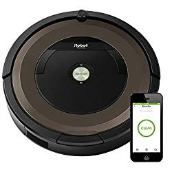

Shag carpets  are smooth and nice, offer a warm sensation to touch and add a nice accent to homes. However, you have to maintain this high pile carpet or thick pile carpet properly to ensure that the appearance and texture continues to last for a long time.  For that, you will need to find the best vacuum for shag carpet to keep them beautiful because not every vacuum is designed to handle these type of carpets.

### Quick Comparison Table

| Picture | Name | Type | Features |
|---|---|---|---|
|  | Soniclean Soft Carpet Upright Vacuum Cleaner | Upright | Patented sonic cleaning technology produces 200 vibrations per second, proven to loosen embedded dirt and dust in the carpet pile. |
|  | Shark APEX DuoClean with Self-Cleaning Brushroll Upright Vacuum | Upright | The self-cleaning brushroll delivers nonstop hair removal. |
|  | iRobot Roomba E5 (5150) Robot Vacuum | Robot | Premium 3-Stage Cleaning System and Power Lifting Suction deliver 5X the air power for improved pick-up performance. |
|  | Shark Rotator Powered Lift-Away TruePet Upright Vacuum, Bordeaux (NV752) | Upright | Anti Allergen Complete Seal Technology and a HEPA filter trap dust and allergens inside the vacuum. |

##  **Best Vacuums for Shag Carpet**

These are our best picks vacuums for shag carpet:

## **1\. Shark APEX AZ1002 DuoClean with Self-Cleaning Brushroll**

Shark APEX AZ1002 DuoClean with Self-Cleaning Brushroll is perhaps one of the best vacuums for shag carpet you can trust thanks to three main features. The three main features you would love about this vacuum cleaner include the powered lift-away, self-cleaning brushroll, and the DuoClean. [**Click here to see today’s price on Amazon.**](https://www.amazon.com/gp/product/B07FX5PCMN/ref=as_li_tl?ie=UTF8&camp=1789&creative=9325&creativeASIN=B07FX5PCMN&linkCode=am2&tag=bestofvacuum2-20&linkId=55c20dc375d51cad5f5d454380321347)

The DuoClean feature enables this vacuum cleaner to work on your shag carpet especially the edges to ensure the carpet has a deep clean. Thanks to the technology, the machine has a unique ability to clean and penetrate to the core of the carpet, leaving it clean.

What would you say about a vacuum cleaner that delivers nonstop hair removal? I bet you’d love it. Interestingly, that is exactly what Shark APEX AZ1002 DuoClean offers you. Whether it is human hair, pet dander, or fur from your dog, this vacuum cleaner will pick the remains nonstop.

To maneuver on whatever surface you are cleaning, the vacuum cleaner is equipped with another feature called the Anti-Glide Technology. Because of this rare technology, you can get moving whether you are cleaning a dirty carpet or working on hard floors while the machine maintains powerful suction.

The noise-reduction feature is yet another thing I believe will make you fall for this product.  The machine is almost noiseless. In fact, the noise has been tuned in a way that makes it possible to operate any time of the day and night even when your toddler is sound asleep.

To tap all the dirt in one go, the product comes with an Anti-Allergen Complete Seal feature. Together with True HEPA filtration, the best vacuum for shag carpet traps dirt including dust and hair inside its dirt can without releasing it until you decide to open the dirt compartment.

**Notable features**

-   12-inch crevice tool.
-   Pet power brush.
-   DuoClean technology.
-   Powered Lift-Away.
-   Noise reduction technology.
-   Anti-allergen technology.
-   Anti-glide technology.

**Pros**

-   Easy to maneuver
-   Collects small and large dirt nonstop.
-   Easy to carry and transport.
-   Strong and unlimited suction power.
-   Captures and seals dirt without letting it loose.

**Cons**

-   The brushes clog fast.
-   The connector to the roller breaks easily.

**Also Read: [How to Get Mold Out of Carpet](https://www.bestofvacuum.com/tip-on-how-to-get-mold-out-of-carpet/)**

## **2\. Soniclean Soft Carpet Vacuum** 

Soniclean Soft Carpet Upright Vacuum Cleaner

It may be an easy thing to find a cheap vacuum cleaner. But if you are looking for the best vacuum for a shag carpet, you know it is not going to be a walk in the park.

For many people with shag carpets, it is not an easy thing to finally find a vacuum that will completely remove the dirt. Perhaps you are wondering why this is so. [**Click here to see today’s price on Amazon.**](https://www.amazon.com/gp/product/B00W2994WM/ref=as_li_tl?ie=UTF8&camp=1789&creative=9325&creativeASIN=B00W2994WM&linkCode=am2&tag=bestofvacuum2-20&linkId=4a3e52734cadbf145fa23880f26ca6cd) 

As the name suggests, a shag carpet is comprised of a deep pile (a raised fabric surface made of loops of yarn) with long yarn fibers that give it a shaggy and haggard appearance thus can easily conceal debris. You need a really  good cleaner to remove dirt from this ‘shaggy’ carpet.

###  **Review**

Soniclean vacuum is clearly designed to clean specific carpets. As already mentioned, it is ideal for shag carpets and Soft Style carpets. Some of the carpets in this category include SmartStrand, Caress, Soft Spring, and Silk.

In order to discharge superior cleanability, Soniclean is equipped with the Sonic Cleaning Technology.

Besides, this vacuum cleaner comes with a uniquely designed venting system that cannot be compared with what other cleaners have. The cleaner also comes with an exceptional brush roll.

The beauty is that the cleaner’s vents can be easily adjusted to suit your preferred taste. But you need to consider the thickness as well as the style of the shag carpet you are cleaning.

Soniclean soft carpet Vacuum with Sonic Technology has something else that will make you love it even more. The cleaner has extra large (XL) front wheels. With this feature, it is easy to maneuver the cleaner when tidying the surface of your soft carpet.

If you have never seen a cleaner that does its work the best way, you will no doubt fall in love with this cleaner. Whether it is the dust that is deep down the ‘shaggy’ rugs, pet hair, or even the dirt on the ground, Soniclean Upright will make it right.

Many homeowners have commended the manufacturer of this vacuum cleaner. What is their reason for their praise? The cleaner makes around 12, 000 vibrations in only 60 minutes. This is incredible!

### **Suggestions**

Make good use of its extra large wheels. They were not haphazardly designed. It was a deliberate design to aid in easy maneuverability. Whether you are cleaning a small or large carpet, it is easy for the cleaner to float thanks to the size of the large wheels.

**Tips**

For effective use, ensure that you fully understand how to handle the Soniclean Upright Vacuum Cleaner for soft carpets.

**PS**. Did you know that in the event that something gets stuck inside the brush, the cleaner will shut down? Now you know! This is an ingenious technology that helps to save the motor and the belt.

**Buyer’s Guide**

When sourcing out this appliance, ensure that you capitalize on its patented technology. Remember that the Sonic Technology will help you achieve your preferred shag carpet cleaning experience.

**Pros**

-   The cleaner is fitted with an ergonomic handle. This offers comfort and a firm grip.
-   Unlike most vacuum cleaners that have short power cords, Soniclean Upright Soft Carpet has a staggering 35-feet cord.
-   It is designed in a way that allows it to lie flat on the floor. The result is that you can reach under the chairs, beds, and tables.
-   It’s lightweight and versatile.
-   Comes with HEPA filter bags that provide a whopping 99.97% filtration.
-   It is very easy to change the cleaner’s bags.
-   When buying the cleaner from a genuine dealer, you’ll get a 5-year warranty for the motor. Besides, there is a 1-year warranty for the appliance’s parts.

**Cons**

The only setback is that it has large front wheels. This may prove a challenge to some homeowners.

**Also See:**

-   [**Heavy duty vacuum cleaners**](https://www.bestofvacuum.com/best-commercial-vacuum/)
-   [**Good vacuums for $150**](https://www.bestofvacuum.com/best-vacuum-under-150/)
-   [**Vacuums for Vinyl Floors**](https://www.bestofvacuum.com/best-vacuum-for-vinyl-floors/)

## 3\. iRobot Roomba 890 Robot Vacuum

If there is a robot vacuum cleaner you’d love, then it should be iRobot Roomba 890. This best robot vacuum for shag carpet will make your work easier especially if you install voice control commands by incorporating the appropriate Alexa device. [**Click here to see latest price on Amazom.**](https://www.amazon.com/gp/product/B07QNM7YDM/ref=as_li_tl?ie=UTF8&camp=1789&creative=9325&creativeASIN=B07QNM7YDM&linkCode=am2&tag=bestofvacuum2-20&linkId=f305b50bad01080b7d5d23da9afc1d8a) 

The other reputable thing about this vacuum cleaner you will find useful is its suction power. Although small, iRobot Roomba 890 comes with a powerful suction ability, 5 times than contemporary vacuums.

### Features

-   Fitted with a unique 3-stage vacuuming and cleaning system. This high-quality cleaning system entails dirt suction, lifting and loosening of dust, pet hair, and different forms of dirt.
-   Comes with an in-built dirt sensor, which enables this small machine to quickly clean less-dirty areas but concentrate on extremely dirty regions.
-   Has dual multi-surface brushes that are made of high-quality rubber. These brushes are the reason why iRobot Roomba 890 achieves a cleaner floor when compared to ordinary machines.
-   Combined with other relevant apps such as Google Assistant and Amazon Alexa the iRobot Home app has the ability to receive and work on your commands. With this capability, you can schedule the machine to clean even when nobody is at home.

### Pros

-   Works smart with Wi-Fi.
-   The vacuum cleaner can work at anytime even if there’s nobody in the house.
-   Safes time.
-   Works best for those who are on schedule because you do not need to be present for it to work.
-   Versatile and works best on a number of floors including hard floors and thick carpets.
-   Strong suction power.
-   Long runtime (approximately 90 minutes).

### Cons

-   It is pricey.
-   A little difficult to set up with Alexa device (s).

## ***4\. Shark Rotator Powered Lift-Away TruePet Vacuum***

The vacuum comes with lift-away capability, and you can isolate the vacuum motor and the reservoir.

This allows you to clean various tough to reach areas easily, such as the corners and stairs.[**Click here to see** **latest** **price on Amazon.**](https://www.amazon.com/gp/product/B00X7R1FZ2/ref=as_li_tl?ie=UTF8&camp=1789&creative=9325&creativeASIN=B00X7R1FZ2&linkCode=am2&tag=bestofvacuum2-20&linkId=36abce77b8e64ba1fdbb0475f2c20de6) 

Shark Rotator has 270AW suction power, which lets it clean dust, debris and more from the ceiling, floor or shag carpet. Its washable micro fiber pad and Hard-Floor Genie lets it clean bare floors easily.

It has a large dirt collection capacity, and its vibrant LED lights can aid you in hunting down dust bunnies and pet hair very easily on shag carpets. Its power cord is 30 foot long, which allows greater reach at the time of cleaning.

Its ergonomic handle lets you vacuum easily. It is offered with a 7 year warranty, which shows confident manufacturers are with its quality, construction and performance. Shark Rotator powered lift-Away comes at an affordable cost, which can be excellent for people looking for a budget offering. **See inexpensive [vacuums under $100](https://www.bestofvacuum.com/best-vacuum-under-100/).**

## ***5\. SharkNinja Navigator Deluxe \[NV42\]***

[![SharkNinja Navigator Deluxe [NV42]](images/SharkNinja-Navigator-Deluxe-NV42.jpg)](https://www.amazon.com/gp/product/B007L5I7DY/ref=as_li_tl?ie=UTF8&camp=1789&creative=9325&creativeASIN=B007L5I7DY&linkCode=am2&tag=bestofvacuum2-20&linkId=d38da7cb523b07b9872339ad483a5d5d)

This upright vacuum has a bagless design, and is ideal for shag carpet also known as high pile carpet and hardwood floors.

It is 15.1 pounds in weight and although not the lightest vacuum around, it can be used without much pressure on the hands or shoulder due to its convenient design.

It has washable filters and on/off brushroll control. With a power cord of 25 feet in length, it can be used to clean up a wider area at one go. Its strong suction makes it perform capably on bare floors as well as shag rugs. [**Click here to see latest price on Amazon.**](https://www.amazon.com/gp/product/B007L5I7DY/ref=as_li_tl?ie=UTF8&camp=1789&creative=9325&creativeASIN=B007L5I7DY&linkCode=am2&tag=bestofvacuum2-20&linkId=d38da7cb523b07b9872339ad483a5d5d) 

The cleaner performs very well, especially on carpets, and can be maneuvered easily. Its powerful pet hair brush allows cleaning of pet hair from stairs, carpet and upholstery.

SharkNinja Navigator Deluxe \[NV42\]  is not too loud, which ensures comfort for the user as well as others. It has a robust suction and can work perfectly in picking up pet hair. It is priced reasonably, and is worth picking up.

## ***6\.*** ***Miele Classic C1 Olympus Canister Vacuum Cleaner***

This compact cleaner offers a high quality and convenient cleaning operation. Its power cord is 29.5 foot, which offers a larger cleaning radius. [**Click here to s****ee** **latest price on Amazon.**](https://www.amazon.com/gp/product/B06XHPLYZL/ref=as_li_tl?ie=UTF8&camp=1789&creative=9325&creativeASIN=B06XHPLYZL&linkCode=am2&tag=bestofvacuum2-20&linkId=7a2c1b5a0d1b2780e9e94e140923badc) 

Its 1200-Watt Vortex Motor made by Miele can handle the cleaning operations of most homes quite ably.

The [Miele AirClean Sealed System](https://www.bestofvacuum.com/best-miele-vacuum/) ensures a high capture rate of up to 99%.

It is light in weight, and can be maneuvered easily. It is really noiseless and is powerful in operations. The vacuum offers wonderful cleaning results on light carpet and hardwood. This is a durable unit and can last long. For a Miele, it comes at a great price.

The lack of HEPA filtration and motorized brushroll does not have much impact on its performance. It mainly relies on direct suction, which is strong enough without being noisy. You can choose from 6 varied stages of suction. It has an extendable wand, which can be enhanced with the long electrical cord.

## ***7\. Dyson Ball Animal Vacuum*** 

The cleaner is Radial Root Cyclone Technology, and comes with improved dirt particles separation and suction power. The Ball Technology ensures better maneuverability, and lets the unit access to tight corners and spaces. [**Click here to see latest price on Amazon.**](https://www.amazon.com/gp/product/B01BGS9JVA/ref=as_li_tl?ie=UTF8&camp=1789&creative=9325&creativeASIN=B01BGS9JVA&linkCode=am2&tag=bestofvacuum2-20&linkId=09190fc42b889cbbac54c1954ea1ed79) 

You can control and use it with only one hand. It also lowers the center of gravity of the equipment and offers it more stability during cleaning operations.

[Dyson DC65](https://www.bestofvacuum.com/best-dyson-vacuum/)  vacuum is perfect for cleaning up wood floors,  shag carpets, and consists of many accessories  such as soft dusting brush, multi-angle brush and a stair tool that ensure more convenience.

It is the right vacuum to use in emergencies as well as in situations involving fast cleaning for pets and kids. Its cleaner head can easily be adjusted to seal the flow of air in across various kinds of cleaning surfaces.

The manufacturer offers it with a warranty of 5 years on labor and components. It has a dust capacity of 0.55 gallons and comes with a tangle-free turbine tool and better brush bar.

## ***8\. Electrolux EL4335B Corded Ultra Flex Canister Vacuum***

This is a versatile canister cleaner that vacuum cleans different surfaces, such as upholstery, stairs,  high pile carpets and hardwood floors.

It has 3-level height adjustment, which makes it perfect for cleaning all kinds of floor surfaces.

Its primary cleaning tool is powered by suction power of adjustable variety. The cyclonic system offers consistent suction power irrespective of how much dirt is there in the bin. **Click here to see latest price on Amazon.** 

Its HEPA filter is of premium variety and can trap up to 99.97% of pollutants, dust and allergens. You can easily clean its dirt bin, which has a capacity of about 0.4 gallons.

Its hose is 8 feet long and the power cord extends up to 21 feet, which allows a lot of reach while cleaning. The cord has an automatic rewind system.

## ***9\. Kenmore Upright Bagless \[22614\] Vacuum*** 

[![Kenmore Upright Bagless [22614] Vacuum ](images/Kenmore-Upright-Bagless-22614-Vacuum-Cleaner.jpg)](https://www.amazon.com/gp/product/B075GH2KYR/ref=as_li_tl?ie=UTF8&camp=1789&creative=9325&creativeASIN=B075GH2KYR&linkCode=am2&tag=bestofvacuum2-20&linkId=39a07846b2510aafabd94769613a23dd)

This canister vacuum  is the best vacuum for shag rug. It comes with various useful features like a telescopic wand, carpet pile-height adjustment, suction control, brush on/off switch and retractable cord. [**Click here to view latest price on Amazon.**](https://www.amazon.com/gp/product/B075GH2KYR/ref=as_li_tl?ie=UTF8&camp=1789&creative=9325&creativeASIN=B075GH2KYR&linkCode=am2&tag=bestofvacuum2-20&linkId=39a07846b2510aafabd94769613a23dd) 

It also has a crevice tool and a dusting brush. Its power cord is 24 feet in length, and can offer a wider area for cleanup. This also makes it more easily maneuverable.

Its suction is consistent and powerful, and offers a very reliable performance during cleaning operations. The compact size makes it suitable for longer operations, although it is not powerful enough to do an extended cleaning.

### **How to Choose the Best Vacuum for Shag Carpet.**

Keep these factors in mind when choosing the best vacuum for shag carpet.

-   **Weight** – Ensure that you have a [lightweight cleaner](https://www.bestofvacuum.com/best-lightweight-vacuum-cleaner-for-the-elderly/) in hand, which would make it easily portable and more convenient to use. One that is around 7 pounds in weight can be a good buy.
-   **Suction power** – Smaller models and wheeled units have a robust suction, which would be ineffectual for long carpets or pile rugs. Look for those with adjustable suction power. Also look for a vacuum cleaner that have a concentrated sealed suction, which is not very powerful.
-   **Cleaning mechanism** – You also need to look at how close the cleaning mechanism of your vacuum comes to your rug surface. If it is too high above the surface, it will be incapable of removing any embedded dirt or debris. On the other hand, a too low setting will make your carpet look fuzzy. This will damage a few areas, and make them look frayed in appearance.

-   **Adjustable height** – Keep in mind that extended cleaning with a vacuum not suited to your height can put undue strain on your body. A vacuum cleaner with adjustable height is recommended, as you can clean up more easily when you adjust the equipment to your physical stature.
-   **Power head** – Snagging can lead to tangling of fibers around themselves, making them useless. This can lead to overheating of the rubber bands of the bar, and make them snap ultimately. Look for a vacuum consisting of a detachable power head that can be removed while using on carpets. A self-propelled or lightweight cleaner with larger or oversized wheels can easily move over carpets, without sinking into the surface.
-   **Carpet rake** – With a long pile carpet rake, you can provide your carpets with a more effective cleaning when you use them gently in a back and forth motion. The action, although time consuming, can let you go around the fibers of the rug without causing any damage to them.

## **Cleaning Tips for Different Types  of Shag Carpets**

Find out how various types shag carpets are cleaned up.

### ***1\. Flokati Rugs***

Flokati shag rugs are a form of handcrafted wool rug that is made traditionally in Greece. Such kinds of rugs are typically of a cream or white color, although these can be dyed. These are made of 100% wool, which includes the rug backing. These shags are one of the fluffiest in form, and have a texture similar to a sheepdog. The rugs can get dirty quickly and easily and often need to be brushed and cleaned.

If you want to preserve the fluffy, soft appearance of the rug, you have to clean it up regularly – even before the rug turns dirty. Else, it will become yellow, messy and matted, and you will not feel like touching it. You have to follow the manufacturer’s directions or the tag, to know whether a specific spot needs special care, when you want to wash this rug.

Generally, you can clean these in a cool, gentle cycle with the softest wool cleaning soap. While washing the rug, do not use chlorine bleach, abrasive detergents or hot water at any time. These can harm and discolor the wool fibers in the rug. After washing it, air dry it. Never dry it in a dryer, as the wool fibers can be damaged otherwise. While air drying the rug, never try to dry it under direct sunlight. The wool can be discolored due to UV rays, and the process can be irreversible.

### ***2\. Wool Rugs***

Wool shag rugs are primarily of 2 types. The first one is the “Noodle” rug that has thick wool fibers shaped like noodles. This gives them the unique name. These have a luxurious and soft texture. However, the soft fibers tend to draw almost everything, such as hair, crumbs, dust and dirt. Thus, the rugs draw plenty of dirt and it is particularly tough to get them out. The tufts are attached to the backing only loosely, which makes them extremely convenient to draw out.

The “shaggy” wool rug is the second form of wool shag rug. These fibers are much thinner and are spaced much closer than the noodle rug. These small-sized shag rugs are knotted by hand with 100% natural wool. It is much easier to clean this type than the other one.

Due to their construction, cleaning them up with a standard vacuum is impossible. It would be disastrous to use a Dyson vacuum on the rugs. You will need an upholstery attachment or a canister **vacuum for shag rug** to clean up the sides of the fibers and those located row by row in between them.

### ***3\. Leather Rugs***

Cleaning up these rugs is slightly easier, as you can tidy up them with leather cleaner. It is a good idea not to put them in an area with high foot traffic, or where these are not exposed to pets, liquids or foods.

Using an upholstery add-on to clean it can let you spot clean it with the suction power of the Hoover. Never vacuum on the rug, as the leather pieces can be entrapped in the vacuum’s turning mechanism – leading to your rug being damaged. It is best to spot vacuum the area, without any risk of exposing the rug to the rotating portion.

### ***4\. Acrylic Rugs***

These have a cheaper appearance than wool, and are highly flammable in form. As these carpets dry up too fast, it is best to deep clean them. You can hire or purchase a deep cleaner and use a high-grade machine cleaning formula. Acrylic carpets dry up fast, and it is essential to give them sufficient time to be fully dried before being re-used. You should open up the windows and install fans to accelerate the drying process.

Although acrylic rugs are vulnerable to wearing down, most of them can be cleaned up in a washer without any damage. A man-made material, Acrylic does not show a good response to heat. You should make use of a warm iron for smoothening out the dents caused by furniture. If acrylic is exposed to heat, it can melt. You should use a brush instead to smoothen the tiny wrinkles and dents in the acrylic rugs. For the larger dents resulting from furniture, use a hairdryer.

Cleaning up this type of fabric is extremely similar to cleaning up any other type of rug surface, such as wool. You should deep clean an acrylic carpet after about every 12 to 16 months.

### ***5\. Synthetic Rugs***

Synthetic shags might not be rugs of the best quality. However, cleaning it can be an easier. This is because as compared to wool, these can sustain cleaning by a steam cleaner – for a few times at least. Although these are of lower quality and do not last for a long time, you can clean these up in this way.

Most synthetic based shags can be cleaned by washing them thoroughly by washing them in gentle, cold cycle and letting them be air-dried. Some of the specialized may need particular soap and cleaning methods.

### ***6\. Silk Rugs***

These rugs and carpets have a smooth, natural shimmer, and a soft texture that is unbeatable. Silk is mainly composed of a type of protein known as fibroin, which makes them astonishingly strong. Silk fibers, as far as tensile strength is concerned, can also match steel yarn. But it is essential to know how to clean them up properly. When wet, silk fibers tend to lose a lot of strength. Pure silk carpets are very expensive, and you should treat them with a lot of care.

You should call up a professional cleaner to deal with serious stains, and let experts deal with the problem. Less serious stains can be removed with home treatment. If you act faster, you are likelier to succeed. Do not wait for a liquid stain to dry before you remove it. Use a paper towel or an absorbent pad to blot as much spill as you can. Do not be tempted to rub it.

Fill up a spray bottle with a solution containing vinegar and water in equal parts, confirming that the solution is tepid or cool at most. Mist the affected carpet area heavily, and blot the moisture up. Repeat the method until you have fully removed the unpleasant stain. Then allow the carpet to naturally dry up.

#### **Conclusion**

The **best vacuum for shag carpet** is one that fits your budget and purpose. Top brands like Dyson, Bissell, Panasonic and Electrolux have some fantastic equipment on offer, as do other manufacturers. You should choose one that has all the features that you need, matches the cleaning requirements of the type of home you have and satisfies your budget concerns.