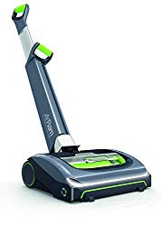
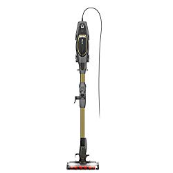
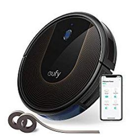
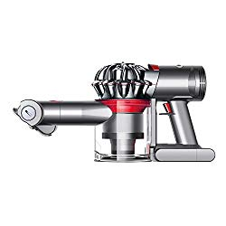
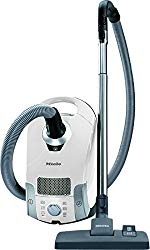

We talk a lot about vacuum cleaners here at [Best of Vacuum](https://www.bestofvacuum.com/). And we’ve covered quite a lot over time. However, we realized that we don’t have a guide for people who’re looking for the best vacuum for small apartment. So if you’re looking for a guide on vacs for small apartments, this article is for you.

### Best Vacuums for Small Apartment.

| Picture | Name | Floor Type | Weight |
|---|---|---|---|
|  | Bissell Air Ram Cordless Vacuum, 1984, Green | Multi Surface | 7.9 lbs |
|  | Dyson Cyclone V10 Absolute Lightweight Cordless Stick Vacuum Cleaner | Hard Floors and Carpets | 6 lb s |
|  | eufy [BoostIQ] RoboVac 30C, Robot Vacuum Cleaner | Hard Floors to Medium-Pile Carpets | 6 lbs |

##  **The Best Vacuums for Small Apartment** 

We’ll let you in on the best-rated options, tell you their features, highlight their pros, and write down their disadvantages. The goal of this guide is to help you choose the right vac for your small space or apartment with ease.

So without further ado, let’s get down to the reviews.

## 1\. Bissell 1984 Air Ram Cordless Vacuum

Bissell is a big dog in the cleaning business. Serious about giving their consumers the best vacuum cleaners. The brand works hard to bring high quality vacs that can give you the value for your money. Their Ram Cordless Vacuum, model 1984, is a true statement of quality, with a performance rate that can give you the biggest bang for the buck. [**Click here to see latest price on Amazon.**](https://www.amazon.com/gp/offer-listing/B01LCY0KIO/ref=as_li_tl?ie=UTF8&camp=1789&creative=9325&creativeASIN=B01LCY0KIO&linkCode=am2&tag=bestofvacuum2-20&linkId=8954502be68ac213c2010cae114ed8c7) 

This unit is cordless. Once you fully charge the interchangeable lithium ion battery, you’re good to go. And with a weight of just 7.9 pounds, Air Ram is one of the lightweight options in Bissell’s product line.

### **Features**

-   This vacuum cleaner has a suction seal that makes it suitable for hardwood floors. The suction squeeze with a rubberized sweeper lets you clean different sections of your room with ease. That includes the hard to reach areas. Because the brushroll is large, you get to clean your small apartment in just a couple of minutes.
-   This vacuum cleaner for small apartments uses a 22-volt lithium ion battery, which promises a runtime of 30 minutes with the motorized brush off. The runtime is relatively less if you turn the motorized brush on. It takes about 4 hours to charge the battery, so if you have a lot of vacuuming to do on the go, then you should consider buying an additional battery.
-   Cleaning under furniture and dark spots can be quite difficult. But Bissell 1984 has built-in LED lights that let you clean these sections with ease.
-   The Bissell 1984 Air Ram cordless vacuum cleaner for small apartments has a dustbin capacity of 0.5 liters. For small vacuuming, especially when there isn’t much dust to collect, this capacity should suffice. But if there is a lot of dust to collect, you may need to empty the bin more than once.

### Pros

-   It’s the best vacuum cleaner for pet hair and area rugs in a small apartment.
-   The lithium ion battery charges fully in just 4 hours.
-   The battery has a decent runtime when the brushroll is off.
-   It’s versatile, easy to use, and easy to store away after use.

### Cons

-   The dirt bin gets small when you convert this to a stick vacuum.
-   Less suction power compared to [Dyson V10](https://www.amazon.com/gp/product/B0798LCJK9/ref=as_li_tl?ie=UTF8&camp=1789&creative=9325&creativeASIN=B0798LCJK9&linkCode=am2&tag=bestofvacuum2-20&linkId=c0e1076d7883e82cedfcdd4ea5fe05b4).
-   It doesn’t feature an above the floor cleaning capability.

## 2\. Shark Flex DuoClean Ultra-Light Upright Vacuum \[HV391\]

[Pet hair](https://www.bestofvacuum.com/best-vacuum-for-pet-hair/) and dander can make your house look messy. But getting rid of the dust and debris shouldn’t be an issue if you invest in a high quality vacuum cleaner, like the Shark HV391 Flex Duo. With this vac, you can easily get rid of tufts of fur, because it has enough suction power to get the job done right. And with a good rating for performance, flexibility in particular, you can be sure this unit will give you the value for your money. [**Click here to see latest price on Amazon.**](https://www.amazon.com/gp/offer-listing/B074F2PHLB/ref=as_li_tl?ie=UTF8&camp=1789&creative=9325&creativeASIN=B074F2PHLB&linkCode=am2&tag=bestofvacuum2-20&linkId=66b871741bcb8e6c00d5e9e22f1bbc23)

### **Features**

-   Shark HV391 Flex is a dual clean vac that combines a soft roller brush and a bristle brush to form a single, powerful cleaning head. These brushes work together to collect small and large particles, like fine dust and pet hair, leaving the area completely clean.
-   The Active Glide technology is a special feature that enhances the maneuverability of this vacuum cleaner. By providing you with a smooth ride over different types of floors and across obstacles, you can easily vacuum just about any area of your room including the hard to reach areas.
-   While the manufacturer doesn’t clearly specify the noise level of Shark HV391 Flex Duo Clean, the built-in noise reduction technology helps to decrease noise as much as possible. The unit does make some noise during operation, but the loudness is not the kind that would be annoying to the ears.
-   Shark does care about your health, too. Which is why they’ve added an anti allergen complete seal technology to clean allergies. Whether you are allergic to pet hair, pollen, dust, or whatever kind of allergies, you can take advantage of this technology and enjoy a convenient environment indoors.
-   Shark HV391 Flex Duo Clean has a True HEPA filter, which is ideal for sucking up both small and large particles. To be precise, the filter can suck up dust particles as small as 0.3 microns. Then, the filter releases clean air in your room so you can breathe quality.

### Pros

-   The built-in LED lights track and trap dirt in hard to reach areas.
-   The HEPA filtration helps to improve air quality.
-   Duo Clean system guarantees exceptional cleaning performance.
-   The built-in pet turbo brush easily [vacuum pet hair from stairs](https://www.bestofvacuum.com/best-vacuum-for-stairs/) and fabric upholstery.

### Cons

-   This vacuum cleaner is somewhat heavy and the dirt cup is very small.

## 3\. Dyson Cyclone V10 Absolute Lightweight Cordless Stick Vacuum

Granted, [Dyson](https://www.bestofvacuum.com/best-dyson-vacuum/) is one of the best vacuum cleaner brands in the market today. Every vacuum model they’ve ever worked on got into the limelight, mostly because of quality, versatility, and performance. With such a great reputation in the market, and good rating for nearly all of it vacuum models, there’s no denying that the Cyclone V10 Vac is a good unit too. Let’s look at the features to see if it truly stands out. [**Click here to see latest price on Amazon.**](https://www.amazon.com/gp/offer-listing/B0798FVV6V/ref=as_li_tl?ie=UTF8&camp=1789&creative=9325&creativeASIN=B0798FVV6V&linkCode=am2&tag=bestofvacuum2-20&linkId=5c3205f1f4aa01b9a98233929f6df726)

### **Features**

-   Dyson cyclone V10 features a nickel-cobalt aluminum battery that, on paper, provides up to 60 minutes of runtime. This is 30 minutes more time of what the Dyson V7 gives in the powerful mode. In practice, however, the runtime varies. You do get 60 minutes if you don’t use the vacuum with a motorized tool; otherwise, the time is less.
-   The Dyson V10 has 3 suction power modes: low, medium, and max. The low suction mode gives you a runtime of 30 minutes on a single battery charge. The medium suction setting will give you a runtime of 290 minutes. But you only get 6 minutes of runtime if you set the suction mode to max.
-   You will love the dustbin of Dyson 10. The capacity is 0.76 liters, obviously bigger than that of Dyson V8 Absolute. Still it doesn’t come close to the capacity of [bagged vacuums](https://www.bestofvacuum.com/best-bagged-vacuum/) like Miele.
-   Dyson Cyclone V10 Absolute features two cleaning heads: soft roller and motorized brushroll. The soft roller head is good for all types of hard floors. Because of the softer rolling effect, you can vacuum hardwood floors without worrying about possible scratches. The brushroll is more traditional. It uses firm bristles to lift dust before eventually sucking it up.
-   You will love Dyson Cyclone 10 Absolute because it features a host of accessories. These include a wand, a charger, a torque drive brushroll, a crevice tool, a wall mount, a direct drive brushroll, and a dusting brush.

### Pros

-   It has a better suction power than many vacuum cleaners for small apartments.
-   Dyson Cyclone V10 is a good vacuum for stairs and pet hair.
-   The dust cup is easy to empty and clean.
-   You get additional accessories for the price.

### Cons

-   This vacuum cleaner is pricey.
-   It makes a lot of noise on max mode.

##  4. eufy \[BoostIQ\] RoboVac 30C, Robot Vacuum Cleaner

Boost IQ Robot Vac 30C, the latest model in the eufy’s smart vacuum series, is already a global contender with a growing consumer base. Unlike BoostIQ 11S, which uses an old bounce technology to clean your floor, the RoboVac 30C utilizes the power of a mapping software solution, which you can easily control via a smartphone app. [**Click here to see latest price on Amazon.**](https://www.amazon.com/gp/offer-listing/B07D75MVX9/ref=as_li_tl?ie=UTF8&camp=1789&creative=9325&creativeASIN=B07D75MVX9&linkCode=am2&tag=bestofvacuum2-20&linkId=1516317b038093fee72265347fcc6fac) 

The brand, eufy, has also tweaked the overall design of this unit by giving a thinner and smarter look while ensuring that it stays quite regardless of the duration of operation. Add the heavy-duty wheels and only 3 inches in height, and what you get is a vacuum cleaner that can clean every nook and cranny of your house.

### **Features**

-   Boost IQ Robot Vac 30C is a Wifi-enabled vacuum cleaner. Moreover, it’s compatible with Google Assistant and Amazon Alexa. Now you can get this device to vacuum different floor without lifting a foot from your couch. This digital convenience gives you the freedom to handle other task around the house as this robot vacuum does the vacuuming for you.
-   This robot vacuum has 1,500 PA of suction power, which is more than enough for a majority of vacuuming tasks. The three brushes at the bottom easily form Three Point Cleaning Systems, which easily sucks up dust, leaving the floor clean. The dust collects in a 0.6 liters dust cup, which isn’t a bad capacity for such a tiny robot vacuum.
-   This robot vacuum has a good score for noise levels. In fact, it’s nearly 75% quieter than many vacuum cleaners. For people that love silent-operating machine, and willing to sacrifice a couple of dollars extra, this is the best option to purchase.
-   Battery life is something eufy takes seriously. And if you think about it, the 100 minutes runtime isn’t a joke. That’s nearly two hours of nonstop vacuuming. In fact, the 100-minute operation also goes a long way to justify the price of this vacuum cleaner.
-   Boost IQ Robot Vac 30C also feature Boundary Strips, which allows you to maneuver the unit as you please. The boundaries tell the vacuum where to clean and where not to clean. And then the built-in sensors detect the strips and clean only the areas you want vacuumed.

### Pros

-   This robot vacuum doesn’t make noise during operation.
-   The Boundary Strips let you decide areas to vacuum and those not to.
-   Works well with Amazon Alexa and Google Assistant.
-   It automatically increases suction power for carpet cleaning.

### Cons

-   It’s expensive.

## 5\. Dyson V7 Trigger Cord-Free Handheld Vacuum

Dyson V7 is one of the best vacuum cleaners in the brand’s product line. And although it isn’t as improved as the V10, its performance and versatility is honestly up to the standard. Generally, this vacuum cleaner is so versatile that you can use to vacuum clean pet hair, [vacuum laminate floor](https://www.bestofvacuum.com/best-vacuum-for-laminate-floors/) with ease, [clean shag carpets](https://www.bestofvacuum.com/best-vacuum-for-shag-carpet/)**,** and more.

The battery life of this version isn’t nearly as good as that of Dyson V10. But if you intend to vacuum only for a few minutes this should work just fine for you. [**Click here to see latest price on Amazon.**](https://www.amazon.com/gp/offer-listing/B0748TR6Q1/ref=as_li_tl?ie=UTF8&camp=1789&creative=9325&creativeASIN=B0748TR6Q1&linkCode=am2&tag=bestofvacuum2-20&linkId=a6770f4a507a3795e1c6c0db20967bff) 

### **Features**

-   This model feature a digital V7 motor that provides the suction power needed to vacuum your small apartment. While Dyson named the motor V7, they really didn’t give it much of an upgrade. At the end of the day, the motor still delivers a power of only 100 air watts, which is exactly what you get from the V6 motor of the Dyson V6 model.
-   One of the things you will love about Dyson V7 Trigger is the runtime. Actually, how long the battery will last depends on the vacuuming mode you choose. You have two modes here: powerful and max. With max mode, which gives you a stronger suction power to vacuum tough debris, you only get a runtime of 6 minutes on a single charge. The powerful mode, on the other hand, gives you a runtime of 30 minutes on a single charge.
-   To be clear, there are times you’ll need to combine both modes to get the best vacuuming results. In such a case, the runtime will vary.
-   No one loves loud vacuum cleaners. And if Dyson V7 were too loud to use, it wouldn’t fit on our list of the best vacuum for small apartments. Overall, this model is quieter than the V7. At 89 decibels, you can vacuum with ease. The V6 version is 7.9 decibels louder.
-   This vacuum has 15 cyclones. These are significant because they ensure that the filter doesn’t clog. As such, you don’t have to clean the filters regularly.

### Pros

-   The plastic used to design this vacuum is of good quality and will last long.
-   You get a battery runtime of 30 minutes, which is quite decent.
-   The max mode has a great suction power.
-   It has a bigger dust cup than the Dyson V6.
-   It comes with tons of additional accessories.

### Cons

-   It’s expensive.
-   Dust cup is still small anyway.

## 6\. Hoover Linx BH50010 Cordless Stick Vacuum

Hoover has been in the cleaning business since 1908. The brand designs some of the best home and [commercial vacuum cleaners](https://www.bestofvacuum.com/best-commercial-vacuum/)**.** Another unit in their product line is the Linux BH50010, a low-profile cordless stick vacuum that weighs only 7.3 pounds. [**Click here to see latest price on Amazon.**](https://www.amazon.com/gp/offer-listing/B001PB8EJ2/ref=as_li_tl?ie=UTF8&camp=1789&creative=9325&creativeASIN=B001PB8EJ2&linkCode=am2&tag=bestofvacuum2-20&linkId=50bb3462fa0e408f1d9e4ef36f40dfc8)

Hoover Linux BH50010 is a battery-powered unit. The lithium ion battery, which you can charge in a small docking station, powers the brush roll consistently as you vacuum the hard floor and carpet.

### Features

-   One of the best things about Hoover Linx BH50010 is the size of the cleaning head. It is 11 inches wide, which means you get a larger surface area that allows you to clean large areas with ease. This means that large room will generally take a very short time to vacuum.
-   The performance is generally impressive. It sucks up flour on carpet, hardwood floors**,** and area rugs with one pass. It cleans up small as well as large particles nicely. And since it has enough suction power to clean much of the large debris from area rugs, you’ll be impressed with the results.
-   The filtration system of this cordless stick vacuum isn’t up to the HEPA standards per se. The biggest problem with this is that the air quality emitted from the vacuum is downright unhealthy. So this vacuum cleaner may not be a good option for you if you suffer from airborne allergies.
-   The battery’s runtime depends on where you plan to vacuum. You get only 15 minutes of runtime on hardwood floors and about 10 minutes on carpet.  It takes a whopping 3 hours to charge the battery. This means that this vac is good for vacuum cleaning, a more reason why it’s a good option for small apartments.
-   The filter of this vacuum cleaner is quite easy to clean up. Press the release button to release the dirt cup. Press the empty button over a garbage bill to release dust. Remove the baffle tube to clear stuck particles if there are any. Remove the filter cup and clean the filter. Then put it back in place ready for the next use.

### Pros

-   The suction power is good enough for vacuuming a small apartment.
-   It’s lightweight and easy to move around.
-   The foam filter is easy to clean.
-   It can clean hardwood and carpet floors with ease.

### Cons

-   It’s rather bulky for stairs.

## 7\. Miele Pure Suction Canister Vacuum

Canister vacuums are always better than upright vacuums because they don’t limit your movement. And if it can give you the maneuverability you need, then it’s worth buying. Miele Pure Suction is such a high quality canister vac, which offers you an unwavering suction power to make vacuuming easy and fun. [**Click here to see latest price on Amazon.**](https://www.amazon.com/gp/offer-listing/B06XHPLYZL/ref=as_li_tl?ie=UTF8&camp=1789&creative=9325&creativeASIN=B06XHPLYZL&linkCode=am2&tag=bestofvacuum2-20&linkId=ebedca2c5bae6522011714b4c3451a64)

### **Features**

-   With its 1,200 watts of power, this vacuum cleaner can and will give you enough suction power to clean even the most stubborn dirt and dust. There are 6 settings that allow you to customize the power of the motor, giving you the flexibility you need to vacuum different types of floors.
-   The 6 suction controls, which you can easily manage with the rotary dial, make this vacuum more versatile than many options in the market today. And the best part is? You can switch from one setting to another on the fly, which means you save time as you continue to vacuum indoors.
-   Miele Pure Suction Canister Vacuum doesn’t have many accessories like Dyson Vacuum V10. But these extra components are good enough to help you tackle any vacuuming job. The upholstery tool, with velvet strips attached to the bottom, enables you to clean different floor types. The crevice tool enables you to clean hard to reach area. And the dust brush can easily clean dust from different surfaces with ease.
-   This vacuum cleaner performs differently on different floor types. It performs so well on hardwood floors, easily sucking up pet hair, kitty litters, and even coffee grounds. It works well on low pile carpet, easily getting rid of pet hair and pet litters, but it might not suck up cheerios well. Unfortunately, this isn’t a good option for high pile carpets.
-   The variable speed motor, the high-grade filtration system, the long cord, the telescopic wand, and the suction control options make this vac easy to use.

### Pros

-   The multi-layer filtration system helps to release clean air in your house.
-   The dust bag is made of higher quality polymer fiber.
-   The 6 speed settings easily adjust to match different types of floors.
-   It’s small, lightweight, and compact.

### Cons

-   It doesn’t have a motorized brush.
-   It doesn’t work well on high pile carpet.

### **What Features Should the Best Vacuum for small Apartments Have?**

-   **Great suction power**

Choose a small vacuum with great suction power. The more the suction power a vacuum cleaner has, the faster it will vacuum floors and carpets.

-   **Adequately Compact**

The vacuum you choose should be so compact that it’s easy to store away when not in use. This is ideal especially if you live in a small apartment.

-   **Lightweight**

Remember, you will be moving the vacuum cleaner from space to space in your room. If you choose a heavy unit, you’ll end up experiencing muscle strains. Moreover, heavy vacuum tend to hinder mobility and they are hard to maneuver.

The bottom line is, choose a lightweight small vacuum that you can easily move around.

-   **Large Dirt Holding Capacity**

Some vacuums have large dust cups. Some have small ones. It’s best to choose one that has a larger dirt cup so you don’t have to empty it frequently.

-   **Efficient Filtration**

A small powerful vacuum cleaner should feature a True HEPA filtration. HEPA filters are the industry standards for two reasons. First, they clean up small and large particles. Second, they release clean air to the room so you breathe fresh and healthy.

#### **Conclusion**

As you can see, choosing the best vacuum for small apartments isn’t hard after all. If the vacuum cleaner has a good suction power, is lightweight, has a dust cup with a good capacity,  and a good filtration in place, then it’s worth buying and using in your small house.