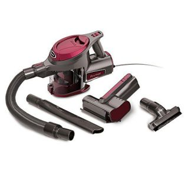
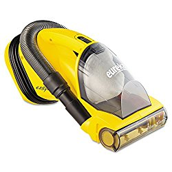

Vacuum cleaning stairs is an important task, and you have to choose a device that allows easy cleaning, convenience in maneuvering and the ability to access difficult corners, the areas beneath stairs and more. Find out about the best vacuum for stairs and how to choose the best ones among them.

## Best Vacuum Cleaners for Stairs

| Picture | Name | Brand |
|---|---|---|
|  | BLACK+DECKER Furbuster Handheld Vacuum | BLACK+DECKER |
|  | BLACK+DECKER 20V Max Handheld Vacuum, (BDH2000PL) | BLACK+DECKER |
|  | Shark Rocket Corded Hand Vac (HV292) | Shark |
|  | Eureka 3670M Mighty Mite Canister Cleaner | Eureka |

##  **10 Best Vacuum Cleaners for Stairs**

Here are reviews for vacuums that I have found to work best for cleaning stairs.

## **1\. Black+Decker BDH2000PL MAX Lithium Pivot Vacuum** 

This is a noisy, but otherwise wonderful vacuum that allows easy each to difficult areas and makes the entire process enjoyable. [**Click here to see latest price on Amazon.**](https://www.amazon.com/gp/product/B00IOEFBKS/ref=as_li_tl?ie=UTF8&camp=1789&creative=9325&creativeASIN=B00IOEFBKS&linkCode=am2&tag=bestofvacuum2-20&linkId=69b33f21371c0382f8c0a3215adf067a) 

### ***Suggestions***

It is best to use it as a spot cleaner, as it does not remove dirt embedded in shaggy rugs or fails to deep clean carpets.  **See [best vacuum for shag carpets.](https://www.bestofvacuum.com/best-vacuum-for-shag-carpet/)**

### ***Tips***

Do not use it for cleaning your entire dining room or kitchen room floors. It should best be used as a spot cleaner for wood stairs, carpets etc.

### ***Buyer’s Guide***

It does not come with any attachments, which allows the convenience of not misplacing anything.

### ***Pros***

-   It has robust suction power and its nozzle rotates while also keeping suction maintained.
-   The vacuum head can twist in various directions, and you can easily reach the area under tables, difficult spots on the ceiling and more.
-   It has a 3-stage filter that keeps the air clean and prevents clogging.
-   When not used, its lithium ion battery does not lose charge. Also, through the entire charge cycle, there is minimal fading of power.
-    Black+Decker BDH2000PL needs small space to be stored up.

### ***Cons***

At 94.4 dB, it can be too loud for comfort unless you live in a generally noisy environment.

## **2\. Shark Rocket Corded Hand Vac (HV292) Vacuum**

This is undoubtedly one of the best handheld vacuum for stairs, and can be used to remove dust, small spills, cat hair etc in moderate amounts from any spot. [**Click here to see latest price on Amazon.**](https://www.amazon.com/gp/product/B00P9Z36T8/ref=as_li_tl?ie=UTF8&camp=1789&creative=9325&creativeASIN=B00P9Z36T8&linkCode=am2&tag=bestofvacuum2-20&linkId=86505d49dd0082609330c62d979e3bd4)

### ***Suggestions***

It has a 15-feet power cord which can be a little short at times. You can use an extension cord with the model.

### ***Tips***

After you wash the filter, let it air-dry to prevent the growth of mildew and mold on it.

### ***Buyer’s Guide***

The unit lacks a retractable cord. However, you may wrap the cord around the cleaner.

As the vacuum has its handle at the end, use it only for occasional spot cleaning. Any more usage can worsen problems such as Carpal Tunnel Syndrome.

### ***Pros***

-   Until its dirt cup is nearly full, it does not lose suction power.
-   Its hose attachment is flexible and nice. It has a dusting brush and a crevice tool fitting on the hose.
-   The motorized brush on the vacuum can easily remove pet hair from couches or stairs. You can easily set this brush up.
-   Shark Rocket Corded Hand Vac (HV292) can be easily and quickly assembled.
-   At 5 pounds, it is lighter than most other vacuums available on the market.

### ***Cons***

-   Its filters lose effectiveness with each wash, and finding replacement filters can be tough.
-   The hose does not fit the model upright, and sharing accessories between them is impossible.

## 3\. Tineco A10 Hero 350W Cordless Vacuum Cleaner

If you have been in the search of the best vacuum for staircases, Tineco A10 Hero lightweight cordless vacuum cleaner is the best bet. You will love this vacuum cleaner because of among other things; its lightweight, low power consumption, ultra-quiet suction power, and the Hero space blue color. [**Click here to see latest price on Amazon.**](https://www.amazon.com/gp/product/B07C5MXJMX/ref=as_li_tl?ie=UTF8&camp=1789&creative=9325&creativeASIN=B07C5MXJMX&linkCode=am2&tag=bestofvacuum2-20&linkId=b792baa507a88f64992132910ad383fb) 

### Features

-   The vacuum cleaner is extremely quiet when turned on.
-   Comes with a 350-watt digital motor that is very economical with regard to power consumption.
-   Enabled with 110W suction ability that will not be compared with contemporary machines in the market. In the event that you want to draw a comparison, Tineco A10 does 4x better than its competitors.
-   Fitted with a detachable Lithium battery whose runtime is a topic of discussion among users who praise the manufacturers for such a quality battery.
-   It is handheld.

-   This is one of the few machines in the market whose main brush are LED light enabled, making late night vacuuming extremely easy.
-   Comes with an easy-to-empty litterbin.
-   Designed with in-built 4-stage filtration system that is fully sealed.
-   Extremely quiet, making it ideal for a family with kids.
-   Has the ability to release fresh air that is completely non-allergic to members of your family.
-   The package comes with the handheld, lightweight Tineco A10 vacuum machine, a 2-in-1 brush for dusting, mini power bush, storehouse, versatile charging adaptor; crevice tool, power switch lock, large dustbin, and a highly LED-powered multi-tasker brush among other accessories.
-   This unit comes with a 2-year manufacturer warranty.

### Pros

-   Beautiful color.
-   A nice and sleek design.
-   The vacuum’s cordless ability is a plus because you can clean without stress.
-   It is handheld, meaning you can carry it along as you clean the stairs, the ceiling, walls, and any other surface above the floor.
-   You will fall for the front LED lights that enable you clean even at night when there are no lights.
-   High suction power.

### Cons

-   The o.4-ltr dustbin is small for such a vacuum cleaner.
-   When fully charged, the machine runs for only 25 minutes.

## **4\. Hoover FH50150 Carpet Basics Power Scrub Deluxe Carpet Cleaner**  

With a convenient design, multiple handles and removable components, this is the best hoover for stairs. [**Click here to see latest price on Amazon.**](https://www.amazon.com/gp/product/B009ZJ2M7G/ref=as_li_tl?ie=UTF8&camp=1789&creative=9325&creativeASIN=B009ZJ2M7G&linkCode=am2&tag=bestofvacuum2-20&linkId=b0053d473d45c26b7b24a07520859336) 

### ***Suggestions***

You will need a screwdriver, preferably a flathead one, for assembling this device.

### ***Tips***

The machine sprays water in a slightly uneven way, and you have to spray with care.

### ***Buyer’s Guide***

Keep an eye on the water indicator in this vacuum, which would tell you when you need to empty or refill it.

### ***Pros***

-   Its upholstery tool makes **vacuuming stairs** and other spots very easy.
-   Its crevice tool lets you suck dirt up easily from tight spots like living room sofa, and clean well.
-   Hoover FH50150 has a DualV nozzle which lets you enough suction for cleaning up rigid stains.
-   Its rinse technology lets you clean carpeted stairs with soap, and there is also a rinse setting to remove rest of the soap residue.
-   It has tanks for dirty water as well as clean water, and these are simple and convenient to use.

### ***Cons***

As its tank is not too large, you have to refill it frequently.

## **5\. Bissell Cleanview Deluxe Handheld Vacuum, 47R51**

This lightweight  stair vacuum is designed just like the Pet model from BISSELL, but is quite different too. It is packed with many features that offer a more expert general cleaning. [**Click here to see latest price on Amazon.**](https://www.amazon.com/gp/product/B002KCMH7A/ref=as_li_tl?ie=UTF8&camp=1789&creative=9325&creativeASIN=B002KCMH7A&linkCode=am2&tag=bestofvacuum2-20&linkId=a1b35a871f65cfca382b15bfb240d674) 

### ***Suggestions***

Do not use it for extended periods, as the vibrating motor makes it tough for you to hold it for longer time.

### ***Tips***

It is best not to use it for picking up larger pieces, as the wide-mouthed tool is unable to do so.

### ***Buyer’s Guide***

As it lacks a rechargeable battery, carrying the unit with its extra cord can be stressful for your arms. It is best to use it, put it down a little and use it again.

### ***Pros***

-   The vacuum consists of a 4 Amp motor, which offers a thorough cleaning experience.
-   It has a 2-foot hose and an 18-foot power cord that offers a full reach of 20 feet, allowing an extended reach during cleaning.
-   This is a bagless cleaner, and there is no need to touch the accumulated dirt or go on replacing it.
-   Its dust cap can easily be emptied, and its transparent design lets you see how much it is filled.
-   It can reach tight spaces easily, and can effectively remove pet hair and other objects from carpets.

### ***Cons***

As it depends on power for operations, you can be in a fix when there is a power outage.

## **6\. BISSELL Zing Rewind Bagless Canister Vacuum** 

This is a low-cost canister vacuum cleaner that is perfect for low pile carpets and hardwood floors. [**Click here to see latest price on Amazon.**](https://www.amazon.com/gp/product/B08671LHZB/ref=as_li_tl?ie=UTF8&camp=1789&creative=9325&creativeASIN=B08671LHZB&linkCode=am2&tag=bestofvacuum2-20&linkId=f6a38a171d6c0a1aa37695c28cc168d2) 

### ***Suggestions***

It is easy to empty its dirt cup. You should empty it when the dirt level is ‘FULL’. Never wait until the bin is 100% full.

### ***Tips***

Remember to reduce its suction while cleaning fabrics, draperies, cushions, curtains etc.

### ***Buyer’s Guide***

If there is a dip in performance level, wash its filters and thoroughly dry them before reinserting them into the cleaner.

### ***Pros***

-   It has a lightweight and compact design, which allows ease of operations.
-   The unit has a low profile, which lets it easily get beneath furniture and clean up dirt, debris, pet hair etc.
-   Its extension hose is long and allows nice reach to areas that are generally tough to access.
-   It is affordable and yet offers very powerful suction and performance.  

### ***Cons***

It does not clean up medium pile rugs and carpets too well.

## **7\. Eureka EasyClean Corded Hand-Held Vacuum, 71B** 

This is a fantastic cleaning tool for upholstery and stairs, and is capable of removing pet hairs easily. [**Click here to see latest price on Amazon.**](https://www.amazon.com/gp/product/B0006HUYGM/ref=as_li_tl?ie=UTF8&camp=1789&creative=9325&creativeASIN=B0006HUYGM&linkCode=am2&tag=bestofvacuum2-20&linkId=9205572322de1d06716df718795bcd9c) 

### ***Suggestions***

It is a handheld vacuum, and you should avoid using it for cleaning floors as you would have to bend down for reaching the floors. It works best as a spot cleaner.

### ***Tips***

It can struggle with bigger dirt pieces as these may be unable to fit in between brush roll bristles. Use the crevice tool and hose to work around this issue.

### ***Buyer’s Guide***

Its cord is about 20 feet long and lacks rewind feature. But you can use the cord wrap section at the rear part of the vacuum.

### ***Pros***

-   It is perfect for cleaning up vertical areas on upholstery and stairs.
-   It is rather quiet despite its robust suction power.
-   Light in weight, it can easily be carried about and used for cleaning.
-   It is bag-less and comes with washable filters, which reduces its operational expenses.
-   It is a versatile unit, courtesy its crevice tool and flexible hose.

### ***Cons***

Its dirt bin tends to fill up fast and you need to empty it more frequently.

### **What Makes a Specific Vacuum a Good Choice for Cleaning Stairs?**

Various factors go into deciding which  stair vacuum is a good choice. You have to get one that can be maneuvered precisely and easily. You should also check the following:

-   **Light weight** – vacuum for stairs should be lightweight so that it can be easy to reach difficult places and also be  transported conveniently. Go for lighter units, preferably with detachable canisters. It is best to opt for those that are less than 10 pounds in overall weight.
-   **Longer cord** – Look for those that come with longer cords – so that you do not have to break your operations after every few feet. While cleaning stairs, a long corded vacuum with rechargeable Lithium Ion batteries can allow power-free operations. Some people like to go for 2-in-1 vacuum cleaners.
-   **Long hose** – Make sure that its hose is long enough, and there are enough nozzles to clean the stairs without the need to move the device.
-   **Features** – Go for one with features like an assortment of brushes, crevice tools, varying pivoting degrees, portable canisters, various attachments and the ability to rotate 180 degrees. The hose and the crevice tool should be 3 ft long at least. Special HEPA filters and multiple brushes can help reduce allergens too.

## **Corded Handheld Vacuums**

It is best to choose vacuum cleaners with long cords for tidying up stairs. The last few years have witnessed a shift in the market for vacuums, and cordless varieties have come into popular usage. Although some people like to use cordless handheld vacuums, these are not very good for stairs – usually for the following reasons:

-   **Short battery life** – Unless you go for the really expensive ones, you have to do with a short battery life on a single charge – which is usually around 15 minutes. That might not be enough if you have hardwood stairs or two or three floors to cover.
-   **Costly** – These are often expensive, and come at a premium price. You can find it tough to get a good one that costs less than 200 USD.
-   **Low power** – As these are battery operated, you cannot often get the kind of suction and power that can be expected from corded units that run on AC outlets. The really powerful ones are typically expensive. Most of these are better for spot cleaning, and lack the features or capability to offer a deep cleaning experience.

## Handheld corded vacuum

Are the best choice for vacuuming the stairs, and cost-effective as well. These  vacuums never run out of power, and are perfect for longer cleaning operations or larger spaces. Unlike the latter that run for only about 15 – 30 minutes, you can operate them for longer time. Those that run on batteries often need around 12 hours to charge up to 100% again.

Although you have to deal with more noisy operations, tangled cords and charging outlets, these offer far more power than cordless units. You can usually get much higher suction power and pick up more amount of dirt, debris and other types of rubbish at one go. Usually, battery power determines the amount of suction power that can be expected from a vacuum cleaner.

The handheld varieties are portable as well, and you do not suffer from strain on the hands during prolonged operations.    These are very light and compact in design, and generally weigh less than 10 or even 5 pounds. When you choose a model that is of the right size and height for you, the operations can be far easier. The cleaning results can be better as well.

However, some top brands such as Dyson are bringing out cordless handheld vacuums that can offer more suction power and can run for longer time. These are very light in weight as well, which means they are not painful to use or carry for extended time.

#### **Conclusion**

That was all about vacuums for stairs, and a lowdown on some of the best vacuum models for cleaning up stairs. The best vacuum for stairs for your home will depend on your individual preferences, budget, expected features, type of design, length of stairs and the type of stairs that you have – wooden, carpeted, non-carpeted etc. Your choice should be guided by such factors, which are important for making the best choices for satisfying your own cleaning requirements.