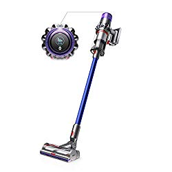
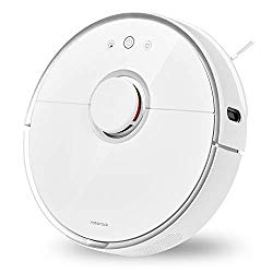

If you’re looking for the best vacuum for tile floors, this guide is for you. To be clear, there isn’t a specific vacuum for tile flooring. But that doesn’t mean that the available options can’t get the job done.

When it comes to tiles, you need a vacuum cleaner that can wipe and suck up all dirt particles with just a few passes.

A vac with sufficient suction power should suffice. And if you’re sure it won’t damage your tile flooring, go for it.

## **Top Rated Vacuums for Tile Floors**

| Picture | Name | Weight | Rating (/5) |
|---|---|---|---|
|  | Dyson V11 Torque Drive Cordless Vacuum Cleaner | 6.68 lbs | 4.6 |
|  | Roborock S6 Pure Robot Vacuum and Mop | 7 lbs | 4.5 |
|  | Shark ION F80 Lightweight Cordless Stick Vacuum | 8.51 lbs | 4.3 |

## **Best Vacuum Cleaners for Tile and Hard Floors Review**

To help you choose the best tile and hard floor vacuum with ease, we’ve put together a list of recommendations that we believe are worth consideration. Check our reviews below.

## **1\. Dyson V11 Torque Drive Cordless Vacuum Cleaner** 

Lightweight like V11 Absolute and quieter than Hoover Floormate Deluxe, Dyson V11 Torque Drive is the best vacuum cleaner for hard and tile floors for 2020.

Like robot vacuums, this model falls in the high-end category. And Dyson has added tons of relevant features possible to justify the price. [**Click here to see the price on Amazon.**](https://www.amazon.com/gp/offer-listing/B07NX8XBMP/ref=as_li_tl?ie=UTF8&camp=1789&creative=9325&creativeASIN=B07NX8XBMP&linkCode=am2&tag=bestofvacuum2-20&linkId=9a058ad8c55edf1919b87267292c30de)

**Features**

-   Dyson V11’s rechargeable battery has an impressive runtime on a single charge. You can vacuum for nearly 50 minutes before the battery shows the signs of running out.
-   The LED light indicator at the back is a special communication channel between you and the V11. It lets you know when to replace the filters, the remaining runtime before the battery dies, the current power mode, and blockages if any.
-   V11’s Dynamic Load Sensor helps to adjust the speed of the motor depending on the floor types. This takes away the need to adjust the power settings manually.

**Pros**

-   It’s easy to use, has a decent battery life, and includes a LED light indicator for easy communication.
-   This vacuum cleaner has three cleaning modes: echo, auto, and boost. How long the battery last depends on the mode you choose.

**Cons**

-   This product is expensive.
-   The dust cup is small.

**Also read: [Best vacuum cleaners for hardwood floors](https://www.bestofvacuum.com/best-vacuum-cleaner-for-hardwood-floors/)**

## **2\. BISSELL Crosswave Pet Pro All in One Wet Dry Vacuum Cleaner and Mop, 2306A**

Bissell Crosswave Pro is more like the Symphony model, because it’s [a vacuum that can mop and sweep at the same time](https://www.bestofvacuum.com/best-vacuum-mop-combo/).

Its ability to clean tile and hard floors with ease, thoroughly removing all dry and wet debris from these floor types definitely justifies the asking price.

While it fails to handle carpets, it doubles as a good solution for cleaning area rugs. [**Click here to see today’s price on Amazon.**](https://www.amazon.com/gp/product/B079WCPPQD/ref=as_li_tl?ie=UTF8&camp=1789&creative=9325&creativeASIN=B079WCPPQD&linkCode=am2&tag=bestofvacuum2-20&linkId=4efb8ff6545bf5cc008c2e1a339b6ac7)

**Features**

-   Crosswave features a brushroll made of soft cloth, which easily absorbs detergents and water so you can clean tiles, hard floors, and area rugs effortlessly.
-   Bissell Crosswave Pro also has two tanks, one for holding clean water and detergent and the other for keeping sucked up debris and dirty water. The clean water tank has clear calibration, which enable you to make the right amount of solution depending on the size of the space that you’d like to clean.

**Pros**

-   Cleans tiles, hard floors, and area rugs, leaving the area not only dust free but also shining like newly made floors.
-   This vacuum cleaner is easy to use.

**Cons**

-   This model is not a whole home cleaner. So while it performs well on area rugs, it’s not an ideal vacuum cleaner for carpets.

## **3\. Roborock S5 Robotic Vacuum and Mop Cleaner** 

Roborock S5 trends like Powerbot from Samsung and Roomba from iRobot.

And mostly it’s because it has a powerful laser navigation and an accurate floor mapping.

Able to vacuum and mop at the same time, this unit lets you clean different types of floors as well as vacuum your couches when you need to dust and get maximum comfort. [**Click here to see today’s price on Amazon.**](https://www.amazon.com/gp/product/B084Z5P2BX/ref=as_li_tl?ie=UTF8&camp=1789&creative=9325&creativeASIN=B084Z5P2BX&linkCode=am2&tag=bestofvacuum2-20&linkId=ffb0f80c41bdd422937892e9dfdbfb19)

**Features**

-   Roborock S5 features three buttons at the very top. One option activates it for automatic cleaning. Another button lets you set it for spot cleaning. And then there’s a button that, when pressed, sends it back to the charging station, an option to use if you want to charge this vacuum cleaner.
-   You don’t expect a unit this small to have a bigger dust cup. And that’s really a common thing with all robot vacuums anyways. To be clear, its dustbin is only 0.6 liters, which isn’t ideal for extended period of mopping. Still, it’s easy to get around this. You just need to monitor the dust cup, empty it frequently, and then put the vacuum back to work.
-   The spin brush and roller brush located on the underside are specifically for edge cleaning. It even includes a cloth and a separate water tank that you can attach to the bottom to mop hard floors.

**Pros**

-   The laser navigation and accurate floor mapping makes it easy to mop hard floors, including under furniture.
-   The vacuum has multiple cleaning modes, so you have full control over how you would like it to work for you.
-   Roborock is a dual function robot vacuum, a good pick if you’re in the market for a unit that can thoroughly vacuum and mop at the same time.

**Cons**

-   It doesn’t have any smart home integration. But as long as all you want to do is mop and vacuum your house, then the lack of this feature isn’t really a deal breaker.

## **4\. Shark ION F80 Lightweight Cordless Stick Vacuum for Tile Floors**

Are you looking for a cordless vacuum that can clean hard floors and carpets? Or maybe you’re interested in a quite model that can do the same job but at a lower price?

Think Shark ION F80 Multiflex. It’s the only upgrade of ION Flex 2X vacuum that does both jobs really well. [**Click here to see today’s price on Amazon.**](https://www.amazon.com/gp/product/B07FX7Z3NR/ref=as_li_tl?ie=UTF8&camp=1789&creative=9325&creativeASIN=B07FX7Z3NR&linkCode=am2&tag=bestofvacuum2-20&linkId=63d72433f69b90a016e2570bb2b7e4e1)

This battery-operated vacuum is a well-built model with a combination of features that makes cleaning easy.

Lightweight than canister vacuum and available at almost half the price of Miele vac models, the Shark ION F80 is an affordable yet effective gadget that can give you the best value for your money.

**Features**

-   The suction power goes up to 38 CFM at high settings and 24 CFM at the lowest. Combined with powerful brushes attached to the cleaning head, this power range is good enough to get rid of even the most stubborn dirt from hard floor and carpet.
-   The 25.2V lithium-ion battery produces 300 watts of powder, has a decent runtime, and takes only 3 hours to fully charge. How long it takes to drain the battery depends on the cleaning mode that you choose, with the ION Boost and carpet modes sucking up the most power in a very short time.
-   The Multiflex hose bends nicely under furniture, allowing you to easily vacuum areas that would be difficult to reach otherwise.
-   Also, Shark ION F80 Multiflex features headlights, which make it easy for you to view dirt in dark areas and vacuum them with one sweep.

**Pros**

-   Shark ION F80 Multiflex cleans both hard floors and carpets, so you don’t have to buy a separate vacuum cleaner for the latter.
-   The battery doesn’t just deliver sufficient suction for vacuuming, but also has a long runtime on a single charge.
-   Shark ION F80 Multiflex features dual brushes, which is what makes it easy for you to clean different surfaces with ease.

**Cons**

-   While cordless means ease of movement, this vacuum cleaner is bulky and tiring to hold for an extended period.
-   It doesn’t feature a true HEPA filtration, so you will have to buy one separately if you want to replace your filter.
-   Can be hard to maneuver on carpet on high power suction.

## **5\. Miele Complete C2 Hard Floor Canister Vacuum**

From parquet floor brush to a combined floor and rug tool, Miele Complete C2 has all the built-ins that makes vacuuming both easy and fun.

You expect sufficient suction power for the price. And for the sake of better performance, the brand ensures that the C2 gives you just that. [**Click here to see today’s price on Amazon.**](https://www.amazon.com/gp/product/B07P97JJNZ/ref=as_li_tl?ie=UTF8&camp=1789&creative=9325&creativeASIN=B07P97JJNZ&linkCode=am2&tag=bestofvacuum2-20&linkId=45e129d49ad2f8955f9f3d1b5e08a551)

**Features**

-   Miele C2’s 1200-watt motor provides sufficient suction power to clean up dirt from tiles and hard floors. The built-in Hyclean GN Dust Bag and Sealed System Construction keep all dust and debris in the vacuum. And the Super Air Clean filter helps with air cleaning so you breathe quality as you vacuum your house.
-   It includes 6 suction settings, which you can easily control via the plus/minus pedal. This gives you full control over its suction power, allowing you to vacuum different surfaces using the right power level.
-   A bag change indicator isn’t a common canister vacuum feature. But given the important that it plays, it’s easy to see why Miele adds it to the C2 model. It’s an airflow detector, which basically lets you know when it’s time to change the bag.

**Pros**

-   The Complete C2 is a quite model, an option you can use to vacuum tiled and hard floors even when other members of your household are asleep.
-   Includes an AirClean filtration system that keeps air clean, so you can vacuum dirt and debris while purifying the air around you.

**Cons**

-   You aren’t getting a true HEPA filter with this. So you’ll have to spend extra if you want to replace the standard filter.
-   Miele markets this unit as a lightweight model. But that’s quite far from the case. It does pack some weight, which means that if you seriously need a lightweight canister vacuum, consider a different model.

## **6\. Shark LZ601, APEX UpLight with Self-Cleaning Brushroll Stick Vacuum**

APEX DuoClean hasn’t picked up really well commercially. But given that it’s from Shark, a brand known to build high quality vacuum cleaner, it’s only a matter of time before the model becomes popular.

Shark says the cleaning performance is incredible. And that’s exactly what you should expect from a hypervelocity suction. [**Click here to see today’s price on Amazon.**](https://www.amazon.com/gp/offer-listing/B07S651MW2/ref=as_li_tl?ie=UTF8&camp=1789&creative=9325&creativeASIN=B07S651MW2&linkCode=am2&tag=bestofvacuum2-20&linkId=c1927a4f8a375b1157740128fb3ee46e)

**Features**

-   Shark knows how frustrating pet hair can be. So they’ve added a self-cleaning brushroll system to make it easy for you to [clean up long hair with the least effort possible](https://www.bestofvacuum.com/best-vacuum-for-long-hair/). Plus, the brushroll works really well, with no instance of hair wrap whatsoever.
-   Everyone hates allergies. And we believe that you’re not an exception. And why would you? Shark adds an anti-allergen complete seal and a true HEPA filter to this unit, which trap even the smallest dust, as small as 0.3 microns, inside the vacuum. It’s thus a good cleaner to use in a household with people who are allergic to dust.
-   APEX DuoClean cleans more than just tiled and hard floors. The design even features an extended hose that allows you to clean different areas in your house, including windows, walls, tight spaces, bookshelves, and coaches. This one also makes a good vacuum cleaner for car.

**Pros**

-   This vacuum cleaner is so versatile that it can clean more than just tile and hard floors. Feel free to use it to clean your couches, vacuum tight spaces, and even clean your upholstery.
-   Good for deep cleaning a carpet thanks to the dual clean technology. Plus, it doesn’t just get rid of dust; it also gives your floors a polished look.

**Cons**

-   This vacuum cleaner is somewhat expensive.

## **7\. Bissell Symphony Pet Steam Mop and Vacuum for Tile Floors**

Bissell hasn’t strayed from making the [best pet vacuum cleaners](https://www.bestofvacuum.com/best-vacuum-for-pet-hair/) at a fair price. And the Symphony model is an example of an inexpensive pick that can vacuum and mop at the same time.

Going for under $150, it’s by far the best alternative to Miele bagged vacuums, an option to consider if you’re on a tight budget and a vacuum is a must-have. [**Click here to see today’s price on Amazon.**](https://www.amazon.com/gp/offer-listing/B014UM9N3I/ref=as_li_tl?ie=UTF8&camp=1789&creative=9325&creativeASIN=B014UM9N3I&linkCode=am2&tag=bestofvacuum2-20&linkId=b9de2df4b36beac44370a8b8fd8e75b6)

**Features**

-   Symphony’s cleaning path easily draws attention at a first glance. About 11 inches in width, it covers quite a wide section, cleaning up dirt and debris with just one pass. A width this large is a bonus if you live in a bigger house because it lets you mop and steam a large room in just a couple of minutes.
-   From hand on testing, it takes around 25 seconds for Symphony to warm up. The rest comes easy after that. You only have to push and pull its on tile and hard floors, and the 1110 watts steam power and 400 watts vacuum power will do the heavy lifting for you.
-   As if the steam and vacuum power isn’t even enough to justify Symphony’s price tag, Bissell goes an extra mile to add an Exclusive Drop It Tank. Sure, this is not the model’s strongest selling point. But if you’re someone who would rather not get your hands dirty, this feature is for you.

**Pros**

-   This vacuum clear can get rid of any pet mess from any bare and tiled floors. Powerful enough to clean up even very stubborn debris.
-   This vacuum cleaner is not only easy to assemble but also very easy to use. Plus, it’s an affordable option, good for someone who’s on a budget.

**Cons** 

-   You will need distilled water for this to work. And while a gallon only costs $1, that’s an extra expense that you’ll need to add to your budget anyway.
-   This unit doesn’t have an on and off button and it won’t work well on carpet.

## **9\. Bissell PowerEdge Pet Hardwood Floor Bagless Cleaner** 

You don’t have to struggle cleaning up pet messes with a regular mop and a brush.

You can invest in Bissell PowerEdge Bagless Cleaner to clean up dirt from your animal friend.

Praised as one of the most powerful vacuum from a reputable brand, this device can clean up any kind of debris, from dog hair and [cat litter](https://www.bestofvacuum.com/best-vacuum-for-cat-litter/) to food chunks and dust from hard floors. [**Click here to see today’s price on Amazon.**](https://www.amazon.com/gp/offer-listing/B00450U7V8/ref=as_li_tl?ie=UTF8&camp=1789&creative=9325&creativeASIN=B00450U7V8&linkCode=am2&tag=bestofvacuum2-20&linkId=70976b025248303c50e12c0261d977a1)

PowerEdge pet cleaner is one of the most compact vacuum in the market.

Small in size and weighing only 7.5 pounds, this unit is easy to carry and move around the house. Such a weight is reasonable even for an extended cleaning period.

**Features**

-   The cleaning power of this unit lies in the v-shaped base. From a basic perspective, the base may look like just a creative design to make the vacuum look different from the competition. But it’s what makes sucking up dust and debris easier. In fact, there’s more suction power at the center of the V, which means this unit can easily suck up even large particles that many vacuum cleaners struggle to.
-   Versatility is one thing to look for in a vacuum cleaner. And this pet ninja takes the cake for being such a versatile unit. Its versatility means convenience, because you can vacuum nearly anything without adding accessories like brushes and pads to the cleaning mix.
-   The 200 feet cord is enough. Even if you live in a bigger house, we’re confident that this will suffice. This length means easy mobility. And it’s highly unlikely that you’ll be plugging it to and from a power outlet after another.

**Pros**

-   This unit doesn’t just clean up pet hair. It’s also a good option for cleaning tile and hard floors.
-   It’s lightweight, only weighing 7.5 pounds, which is the lowest weight we’ve seen so far in this consumer guide.
-   The v-shaped base sucks up dust quite fast. And it can even clean large particles with just a few passes.

**Cons**

-   This is not a good carpet cleaner.
-   You aren’t getting an automatic cord rewind, so you’ll have to do this manually.

## **How to Do You Identify the Best Vacuum Cleaner for Tiles?**

Here are a few things to consider when choosing a vacuum for tiles and hardwood floors.

-   **Brush Roll On/Off**

You don’t need a motorized brush to clean tile floors. But if you also intend to clean other places such as area rugs and carpet, then you’ll need to consider a vacuum cleaner that has a brush roll with an on/off function. Just remember to turn the brushroll off when cleaning tile.

-   **Versatility**

Don’t just go for the best vacuum tile floors but go for a vacuum cleaner that can clean even clean carpet, help with pet stains, vacuum couches, and clean your upholstery, go for it. The 2-in-1 models often have a strong cleaning power, hence good choices.

-   **Wheels**

Choose a vacuum cleaner that has rubber wheels. Not only are such wheel floor-friendly but also they glide easily on tiles. The chances of such wheels sliding are simply nonexistent.

-   **Suction**

You should choose a vacuum cleaner with the strongest suction power. Such a vac not only cleans up tile floors in just a short time but also sucks up all dust, dirt, and debris with ease.