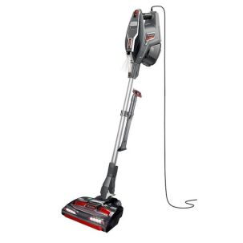
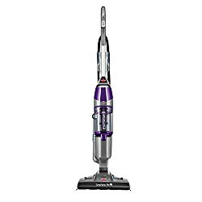

When cleaning your vinyl floors, one of the biggest concerns is avoiding scratches, it is for that reason that you need to find the best vacuum for vinyl floors which is well adapted to care for your shiny floors and with the ability to get dirt wherever it may be on the floor.

In this article, I’ll talk about  best vacuums for vinyl floors. Each of the 9 quality vacuums will have at least one strongest point why you should purchase it. Besides, each brand will have its main features. Then, I will talk about the vacuum’s pros and cons.

| Picture | Name | Weight | Features |
|---|---|---|---|
|  | BISSELL CrossWave Floor and Carpet Cleaner with Wet-Dry Vacuum, 1785A | 11.5 lbs | *Dual Tank Technology - keeps clean and dirty water separate.*Dual-Action Multi-Surface Brush Roll |
|  | iRobot Roomba 690 Robot Vacuum | 7.8 lbs | *Patented dirt detect sensors alert roomba to work harder on concentrated areas of dirt, such as high-traffic zones of your home |
|  | Bissell Symphony Pet Steam Mop and Steam Vacuum | 9.74 lb | *Dry Tank Technology.*Quick-Release Mop Pad Tray.* Cyclonic Vacuum |

Before I crown it over, I will also talk about the difference if any, between vinyl and vinyl plank floors. You will also have a chance to know the advantages and disadvantages of vinyl flooring. Lastly, I will highlight on the practical steps on how to care for your vinyl floor.

**You may also be interested in: [Best Vacuums for Concrete Floors](https://www.bestofvacuum.com/best-vacuum-for-concrete-floors/)**

Now you know what to expect. Without further ado, let’s delve into the real deal.

## Top Best Vacuums For Vinyl Floors

When cleaning your vinyl floors, one of the big concerns is avoiding scratches, it is for that reason that you need to find the best vacuum for vinyl floors. These are the best vacuums for vinyl plank floors.

## 1\. BISSELL CrossWave 1785A Floor and Carpet Cleaner

It is pretty easy to tell why many people love BISSELL products. Apart from giving you a chance to show your generosity, you get a quality product. BISSELL CrossWave 1785A is all you need thanks for its ability to wash and vacuum your vinyl floor at the same time. [**Click here to see latest price on Amazon.**](https://www.amazon.com/gp/product/B01DTYAZO4/ref=as_li_tl?ie=UTF8&camp=1789&creative=9325&creativeASIN=B01DTYAZO4&linkCode=am2&tag=bestofvacuum2-20&linkId=33288e61816106c50553da3738687ed4) 

### Features

-   This is a multi-surface cleaning tool. It is ideal for hard floors, covered floors, evidently including vinyl floors, carpets, and rugs.
-   You won’t find it hard to operate the machine. BISSELL CrossWave 1785A comes with smart touch controls. Their placement is also one thing you are bound to love. The controls are right at the handle for easy operation.
-   Equipped with dual-action brush roll that combines the use of a nylon brush and the innovative microfiber to pick up large debris. Besides, this feature helps in the mopping of the vinyl floor at the same time.

### Pros

-   Easy to operate.
-   Completes your vinyl floor vacuuming and mopping in minutes.
-   Cleans multiple surfaces including rugs, carpets, hard floors, vinyl floors, and several other covered floors.
-   Saves you the agony of spilling dirty on the floor while cleaning.
-   Excellent engineering for those who know what I’m talking about.
-   Nice sleek design.

### Cons

-   Ball bearings are prone to fast damage.
-   A bit costly.

## 2\. iRobot Roomba 690 Vinyl Vacuum

Did you see Wi-Fi connectivity? Yes, that is the biggest reason why you are going to love this best robot vacuum for vinyl plank flooring. Thanks to the latest technology that is in control, it is not necessary to use your hands when operating iRobot Roomba 690. Just speak and the job is done! [**Click here to see latest price on Amazon**.](https://www.amazon.com/gp/product/B06XRT2B3P/ref=as_li_tl?ie=UTF8&camp=1789&creative=9325&creativeASIN=B06XRT2B3P&linkCode=am2&tag=bestofvacuum2-20&linkId=b5f6c7647046e89700726bae90c49039)

### Features

-   iRobot Roomba 690 has a unique, round sleek design. With this appliance in your home, you are sure the interior décor is complete.
-   Equipped with dual brush that works on multi-surface basis.
-   Virtual wall barrier. This feature enables you to clean your preferred room rather than a haphazard cleaning.
-   iRobot Roomba 690 brushes have a unique ability of picking large debris that contemporary vinyl vacuums don’t.
-   The robot vinyl cleaner comes with dirty detect feature that allows the machine to exert more power on areas with high dirt concentration.
-   Has highly intelligent sensors that enable you to command the vacuum to clean every corner of the house.
-   Schedule cleaning with the help of Google Assistant, and Amazon Alexa that are compatible with iRobot home app.
-   Has edge-sweeping brush.
-   Highly sensitive Wi-Fi connectivity.
-   Automatically adjustable cleaning head.
-   Runs for 90 minutes after which it automatically docks to recharge.

### Pros

-   Wi-Fi enabled, making it easy to operate.
-   You do not have to use your hands to guide the vacuum.
-   Works faster.
-   Long runtime.
-   Very light.
-   Easily picks pet hair and dander.
-   Uses your voice to work.
-   You do not need to be around for it to work.
-   Deeply cleans highly-concentrated areas thanks to dirt detectors.
-   Nice design.

### Cons

-   You need to shout if you intend to use voice command.
-   Not very good for hardwood floors.
-   Requires battery to operate.

## 3\. Shark Rocket DuoClean HV382 Ultra-Light Vacuum

Shark Rocket HV382 DuoClean remains to be regarded as the best vacuum for luxury vinyl plank floors. I’m sure one of the reasons for this is its durability. The other thing you will love about this vinyl floor vacuum is that it is a lift-away vacuum. [**Click here to see latest price on Amazon.**](https://www.amazon.com/gp/offer-listing/B01K7L8U62/ref=as_li_tl?ie=UTF8&camp=1789&creative=9325&creativeASIN=B01K7L8U62&linkCode=am2&tag=bestofvacuum2-20&linkId=21582efef981f7bf5c57d37484811ed1) 

### Features

-   It is fitted with DuoClean Technology. With this advanced technology, you can clean your vinyl floor in minutes. The machine’s brushes do not leave any stain behind.
-   This is a master of all lift-away corded yet bagless vinyl floor vacuums thanks to its light in weight.
-   The brushroll garage is so close to you in the event there is a clog.
-   Shark Rocket DuoClean HV382 has LED lights that are strategically placed on the floor nozzle. This is a deal because you are able to spot dirt easily even if you are cleaning you vinyl floor in the middle of the night without lights.
-   Fitted with pet multi-tool that is ideal for among other things to capture pet dander and pet hair.
-   Comes with wall mount hook.
-   Has crevice tool.

### Pros

-   Very light at 4.6 lbs.
-   Strong suction power.
-   Powerful brushroll with hard and soft bristles.
-   You can use it anytime thanks to the powerful LED lights.
-   Easy-to-access garage, crevice tool for maintenance.
-   Easy to maintain thanks to washable filters.
-   The lift-away feature helps you to clean other areas above the vinyl floor.

### Cons

-   Requires battery thus you may not clean the house at night in case there are no lights.
-   The cord is heavy, at around 2 lbs.

## 4\. BISSELL Symphony 1543A Vinyl Steam Vacuum Cleaner

Like you, I love good things. Yes, Bissell Symphony 1543A Steam Mop Vinyl floor vacuum cleaner is the real deal. This is not just a vacuum cleaner for your vinyl floor. It is the best all in one vacuum. [**Click here to see latest price on Amazon.**](https://www.amazon.com/gp/product/B014UM9N3I/ref=as_li_tl?ie=UTF8&camp=1789&creative=9325&creativeASIN=B014UM9N3I&linkCode=am2&tag=bestofvacuum2-20&linkId=34aa00d73ad5c971a75f98f9b74df5aa) 

I’m certain you will like a machine that apart from vacuuming, it mops and [steam clean](https://www.bestofvacuum.com/best-multi-purpose-steam-cleaner/)  your floors at the same time. Bissell Symphony 1543A does just that.

Another important thing is this: the moment you purchase this or any other BISSELL product for that matter, you get a chance to support a noble initiative. I’m talking about the Bissell Pet Foundation, dedicated to save pets.

### Features

-   All-in-one vacuum that cleans the vinyl floor through moping, vacuuming, and steaming.
-   You cannot get your hands dirty. The machine comes with a Drop-It Tank feature, which ensures all dirt enters the tank without necessarily touching it.
-   Disposable pads to discard pet messes.
-   Highly-powered motor with 1100W output.
-   The heater warms and dries the vinyl floor in less than a minute.

### Pros

-   Large tank capacity.
-   You do not contaminate your hands by touching dirt.
-   The machine exclusively does three things at ago namely mops, vacuums, and steams.
-   Powerful motor that turns out to be what you need for fast cleaning.

### Cons

-   Doesn’t really do all things at ago. It must be one after another.
-   Slightly heavy.

## 5\. Dyson DC50 Animal Compact Upright Vacuum Cleaner

Actually, a few high-end in the market can come close to this vacuum. Dyson Upright Ball Animal 2 Vinyl vacuum cleaner is one of the few machines with strongest suction power. [**Click here to see latest price on Amazon.**](https://www.amazon.com/gp/product/B01N4BI77I/ref=as_li_tl?ie=UTF8&camp=1789&creative=9325&creativeASIN=B01N4BI77I&linkCode=am2&tag=bestofvacuum2-20&linkId=cbc433c0dfe971379ee0edca0c1d8081) 

### Features

-   The machine’s tank carries up to 55 gallons of water, enough to clean several large rooms.
-   Push-on-button litter bin for fast and efficient dirt emptying.
-   Equipped with an economical but powerful motor.
-   Fitted with true HEPA filtration mechanism that allows for the removal of bacteria, viruses, allergens, and other germs.
-   This best vacuum for vinyl planks comes with stair tool, turbine tool (tangle-free), and a combination tool.
-   Has a power cord with a generous length of 35 feet.
-   The self-adjusting feature enables you to turn this vinyl vacuum into whatever you want. In the end, you will not only clean the vinyl floor but also the hard floor, furniture, carpet, rugs, various upholstery, and ceilings.

### Pros

-   Swivel floor nozzle that easily maneuvers to every corner of the house.
-   Strong suction ability.
-   Generous power cord with sufficient length that measures 35 feet.
-   Self-adjusting ability that allows you to turn the vacuum into what you need.
-   Kills germs and harmful bacteria.
-   Ideal for large rooms thanks to the motor strength.
-   You can use it to clean virtually any surface.
-   Extra large water tank.

### Cons

-   Heavy.
-   Expensive.

## 6\. Oreck Commercial ORB550MC Commercial Floor Buffer Machine

Sometimes your vinyl floor needs a good scrub to bring out that hidden beauty that may have been covered up by stubborn dirt. This Oreck Commercial ORB550MC floor buffer is just what you need. It is tough on the dirt but remains soft on the floor without living any scratches. Another thing you will definitely  about this best vacuum for vinyl floors is that it comes with a whopping 50-ft long power cord. [**Click here to see latest price on Amazon.**](https://www.amazon.com/gp/offer-listing/B008BPFK1U/ref=as_li_tl?ie=UTF8&camp=1789&creative=9325&creativeASIN=B008BPFK1U&linkCode=am2&tag=bestofvacuum2-20&linkId=4ea01b643197a5d1e054bd313481e581) 

### Features

-   The vacuum is designed to clean extra large areas without necessarily changing power outlets. You can vacuum a room 50 feet away from the power source.
-   Fitted with a spacious ¾ -horsepower.
-   Has a 5.4Amp motor that enables the machine to beat its competitors.
-   Compatible with other cleaning agents such as shampoos, various detergents and tools that include pads, bonnets, and brushes.
-   Designed with an orbital drive. With this ability, it is easy to scrub, clean, sand, polish, twist, and strip whatever floor without leaving any marks.
-   Multiple surface cleaning tool, ideal for hard floors, vinyl, hardwood covered floors, and works on other surfaces above the floor.

### Pros

-   Great for vinyl floor stripping, waxing, and buffing.
-   Easy to maneuver around.
-   Nice steering.
-   Extra long power cord.
-   Orbital oscillating head makes cleaning easy.
-   Weighs 24 lbs.
-   Excellent height.
-   Cleans multiple surfaces.
-   Compatible with other cleaning agents and tools.

### Cons

-   Very heavy.
-   Fairly expensive.
-   Brushes are sold separately.

## 7\. BISSELL PowerEdge 81L2A Bagless Pet Hardwood Floor Vacuum Cleaner

You’ll love this best stick vacuum for vinyl floors if you decide to buy it. One of the things that stand out about BISSELL PowerEdge 81L2A is that it is extremely affordable. [**Click here to see latest price on Amazon.**](https://www.amazon.com/gp/offer-listing/B00450U7V8/ref=as_li_tl?ie=UTF8&camp=1789&creative=9325&creativeASIN=B00450U7V8&linkCode=am2&tag=bestofvacuum2-20&linkId=5dc429f8c5bfb9e0d5855385df40d17c) 

### Features

-   The V-shape directs larger debris into the center suction path, while the ends of the V capture small, fine debris.
-   Power is rated at only 6 amps.
-   Comes with a dirty cup that is very easy to empty.
-   Does not come with hose.
-   Has a 20-ft power cord.
-   Cleans with an exceptional 11.35-inch width.

### Pros

-   Swivel steering.
-   Easy to clean especially in a congested room.
-   The V-shaped base allows for quick and easy dirt collection.
-   Low power consumption.
-   Collects fine and large debris alike.
-   A sizeable 20-ft power cord.

### Cons

-   Suction power is lower than most other BISSELL products.
-   Doesn’t do well on carpets.

## 8\. BISSELL PowerFresh 1940 Floor, Hard Wood And Tile Steam Mop Cleaner

Designed to look like a ‘super rocket’, BISSELL PowerFresh steam vinyl floor vacuum is one of the most affordable premium vinyl floor vacuums today. [**Click here to see latest price on Amazon.**](https://www.amazon.com/gp/offer-listing/B0091YYUAM/ref=as_li_tl?ie=UTF8&camp=1789&creative=9325&creativeASIN=B0091YYUAM&linkCode=am2&tag=bestofvacuum2-20&linkId=3d1218148a32486591b35127fe78cf3e) 

### Features

-   The vacuum is equipped with febreze fragrance discs that provide the house with spring breeze after cleaning.
-   Equipped with a smart set digital, the vacuum has the ability to set different steam levels to complete floor cleaning.
-   Has three-stage vacuuming process thanks to its low, medium, and high power steam rating.
-   BISSELL PowerFresh 1940 comes with an unimaginably strong motor rating at 1500W.
-   Has a built-in easy scrubbing mechanism, making it clean 2x quicker than contemporary vinyl floor vacuums.

### Pros

-   Extremely light, at 6 pounds.
-   Ability to kill 99.9% of viruses, germs, and bacteria.
-   Faster than most vinyl floor vacuums.
-   Strong suction and drying power.
-   Ideal for cleaning vinyl floors with stubborn stains even if the stain has been on the floor for 10 years.
-   Adds fragrance to the house after the cleaning process.
-   Easy to maneuver around.

### Cons

-   Consumes a lot of power, at 1500W.

## 9\. Hoover FloorMate Moondust Deluxe Hard Floor Cleaner

With over 4000 user reviews on most online stores, Hoover FloorMate Moondust Deluxe is one of the best vinyl floor vacuums to look for. One of the things I love about this best vacuum for vinyl floors is that it comes with soft wheels. You definitely know why soft wheels are ideal for a vinyl floor. [**Click here to see today’s price on Amazon.**](https://www.amazon.com/gp/product/B00CM220CK/ref=as_li_tl?ie=UTF8&camp=1789&creative=9325&creativeASIN=B00CM220CK&linkCode=am2&tag=bestofvacuum2-20&linkId=d5b4a38df785a3038b410ba7e21b2269)

### Features

-   Built with SpinScrub brushes. These kinds of brushes continue to receive praises following their ability to deliver utmost results. The technology behind SpinScrub brushes does not allow for scrubbing the flow thus leaving scratches. The brush is gentle on the vinyl floor, the grout, and tiles.
-   The vacuum comes with wash and dry capability. While the two complement each other, not all vacuums have this feature. When set on the wash mode, Hoover FloorMate Moondust Deluxe uses its brushes to suction all the available water from the floor.
-   On the other hand, the vacuum cleaner stops the SpinScrub from rotating. Instead, it dries up whatever remaining water leaving the floor dry in seconds.
-   Equipped with clean boost control. This feature is strategically placed on the handle to enable you control the vacuum fast and easily.
-   Hoover FloorMate Moondust Deluxe has a dual tank. You do not have to worry of clean water mixing with dirty water. Each has a separate reservoir.

**Pros**

-   Elegant design.
-   Hoover FloorMate Moondust Deluxe is just 16 lbs.
-   Soft wheels.
-   Large clean/dirty water tank.
-   Strong suction power.
-   Dries up the floor in seconds.

**Cons**

-   The handle is not strong enough when you compare with the machine’s weight.

Now that you have the 9 different products, is that all? What else is involved in choosing the best vacuum for vinyl floors? This following part will address three other things you need to know.

## Vinyl Vs Vinyl Plank Floors

Are you thinking of floor installation in your house? What about how to care for your vinyl floor? Look no further, vinyl flooring ranges as one of the best floors. The trend on it is growing day by day. Don’t miss out!

Vinyl and vinyl plank floors are both used for commercial areas. Residential kitchens and washroom get a good finish look with these floors. If you are searching for views on these floors, this article directs you in the best direction.

## Vinyl And Vinyl Plank Floors, Are They The Same?

Online searches give little results on the difference. Yet still, a few unique physical features that separate the two floors are available. The table below shows some significant difference between the two floors.

| Vinyl Floor | Vinyl Plank Floor |
|---|---|
| Stone or tile resemble | Hardwood floor look-alike |
| Less scratch resistant | More resistant to scratch |
| Feels like real on surface texture | Embossing or scraping surface texture |

## What Are The Advantages And Disadvantages Of Vinyl Flooring?

### Advantages

-   Easy to clean thus best for kitchens and bathrooms.
-   Affordable low prices compared to other floor materials.
-   Resistant when it comes to moisture, thus suitable for the washroom.
-   Wide range to select from including designs, colors and shapes are available. All these options to choose from depend on prices, quality, and material used.

### Disadvantages

-   Looks dull after using for some years, has a short life span.
-   Fades or cracks seen on the extreme sun and cold exposure.
-   Over time it becomes hard to polish or refinish, thus loses its luster.
-   Tear and damage are fast if mishandled, thus a delicate and fragile product.

## How To Care For Vinyl Floor

-   Vinyl floor is a PVC type of building material, made of polyvinyl chloride. Today it is also called Linoleum. Rooms that you will find with this type of floor include washroom, kitchens, and corridors. These rooms receive high human traffic. Spills and other floor damage may occur, thus proper care and maintenance are necessary.
-   A vinyl floor needs extra care and frequent maintenance when using or handling. Make use of these care tips listed below. This will help extend the life and improve the physical touch of your vinyl floor.

-   Vinyl floor packaging comes with a manufacturer’s label at the sides. Check for the right quality of cleaning products written on it. The manufacturer recommends the best cleaning products. This is a stripper, for soap build-up removal done once a year. Another product is a refinishing to bring the shiny look back. Lastly, a cleaner diluted and for weekly mopping.
-   Regular mopping and sweeping are the best and simple ways to ensure your vinyl floor is clean. This leaves your floor feeling fresh, free from air dust and dirt.
-   Avoid placing chairs and other furniture with rollers on the vinyl floor. These rolling forth and back will cause damage over time.
-   New vinyl floors are best cleaned after three days. This gives the adhesive time to dry and stick well. Repair in time any minor cut to avoid further damage. This saves time and costs if done immediately. Use the seam sealer from the manufacturer to seal the cut.
-   Immediately wipe or clean out any spills to prevent further damage or discoloring.
-   Avoid using non-cleaning methods and other products. Look for what the label recommends.
-   Look around for these and more features while selecting the best vacuum for vinyl floors.

These include –

-   Has no-scuff bumper protecting your wood furniture during vacuuming.
-   A light-weight vacuum and upright, for easy movements. A steady and uniform suction.
-   Long power cord with duo settings for floor surfaced and carpets.