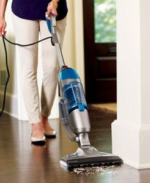
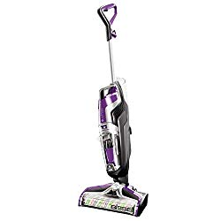
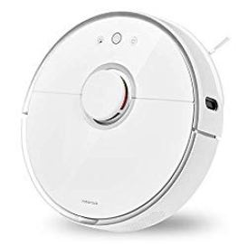
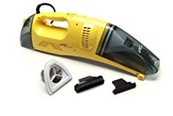
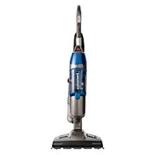
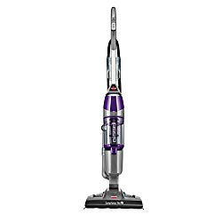

The best vacuum mop combo seamlessly combines the traditional cleaning method with the modern, producing a far more effective cleaning tool.

A mop may seem effective on its own, but it isn’t.

Yes, it will wipe the sticky grime off the floor better than a vacuum, but in the process, it disperses dust in the air.

Besides, it can’t remove fine dust off the floor or reach through cracks.

That’s where a vacuum comes in.

Vacuums may have a hard time dislodging hard-to-remove particles stuck on the floor.

However, they’ll effectively suck up the most minute dirt particles from the tiniest crevices.

Most of all, having HEPA filters, they won’t disperse dust back into the air.

Naturally, you’ll want to get the best of both worlds.

That’s why you need the best vacuum steam mop combo.

Besides giving you the benefit of a grime-cleaning mop and dust-sucking vacuum, it usually comes with several other features not found in ordinary vacuums.

**You might also be interested in [water filter vac](https://www.bestofvacuum.com/best-water-vacuum-cleaner/)**

## **Top Rated Vacuum Steam Mop Combos**

| Picture | Name | Weight | Surface Type |
|---|---|---|---|
|  | BISSELL Crosswave Pet Pro All in One Wet Dry Vacuum | 11.5 lbs | Multi Surface |
|  | Tineco Floor ONE S3 Breeze Cordless Hardwood Floors Cleaner | 9.26 lbs | Hardwood Floors |
|  | Roborock S6 Pure Robot Vacuum and Mop | 7 lbs | Carpet and Hard floor |
|  | BISSELL CrossWave Floor and Area Rug Cleaner, Wet-Dry Vacuum | 11.5 lbs | Sealed Hard Floors And Area Rugs |

In this article, I have handpicked best vacuum and mop combo cleaners.

Besides, I will also discuss five benefits of having a mop vacuum combo and of course, some of the things you need to consider before you purchase these home-cleaning appliances.

## **Best Vacuum and Steam Cleaner Combo Reviews**

The best vacuum mop cleaners also have steam cleaning capabilities to kill fleas, ants, ticks and other pests.

Hence, they produce hygienic cleaning that’s just as good as chemical cleaning methods.

Here’s reviews of the top best vacuum steam mop combos.

## **1\. BISSELL CrossWave 2306A Pet Pro All in One Wet Dry Mop Vacuum**

If you love pets, there is more reason why you should think of purchasing BISSELL CrossWave 2306A.

According to the manufacturer, every time you buy a pet cleaning product, you help save a pet thanks to the $10 donation that goes to the BISSELL Pet Foundation. Isn’t that what you want? [**Click here to see today’s price on Amazon.**](https://www.amazon.com/BISSELL-Crosswave-Vacuum-Cleaner-2306A/dp/B079WCPPQD?th=1&linkCode=ll1&tag=bestofvacuum2-20&linkId=42ace7ad5de3afb4ce70a3f46d455bcf&language=en_US&ref_=as_li_ss_tl)

**Features**

-   Like some of its sister products, BISSELL CrossWave 2306A comes with the ability to wash and vacuum the floor and carpets at the same time.
-   For easy multi-surface cleaning, BISSELL CrossWave 2306A is equipped with a pet hair strainer and a multi-surface pet brush roll. This function, which is rare among most of the vacuum mop combos in the market, is safe for area rugs and sealed hard floors.
-   If you have gone through some of the best vacuum and steam cleaner combo reviews on the internet, perhaps you’ve seen that BISSELL CrossWave 2306A comes with specialized pet cleaning solution. The solution is excellent in removing pet odors.
-   The best all in one vacuum cleaner is fitted with an innovative nylon and microfiber brush that is a perfect choice in picking up dry debris and mopping at the same time.

**Pros**

-   Easily and quickly switches from an upright vacuum mop combo to a hand-held vacuum cleaner ideal for rugs, carpets, upholstery, ceilings, and other areas above the floor.
-   Equipped with pet solution for removing pet odors.
-   With over 3,000 RPM pet brush roll rotator, BISSELL CrossWave 2306A is the best vacuum mop combo around.
-   The pet hair strainer helps in making the cleaning work easy.
-   It is extremely easy to assemble.
-   No stress in cleaning.
-   Lasts long.

**Cons**

-   The little filter inside the dirty water tank easily gets clogged.
-   The scrubbing brush may load a lot of water.
-   Sometimes the machine doesn’t dry up the bare floor on the initial cleaning.

## **2\. Roborock S5 Robotic Mop and Vacuum Cleaner**

If you are a person moved by colors, you will most likely love this white robot vacuum and mop combo.

**Features**

-   Uses synchronous mopping and sweeping technique, which works better in utilizing the available wind by drawing all the dust inside the room into the vacuum cleaner’s dust bin. [**Click here to see today’s price on Amazon.**](https://www.amazon.com/gp/product/B084Z5P2BX?ie=UTF8&th=1&linkCode=ll1&tag=bestofvacuum2-20&linkId=88d6cfbaac1971b06f4295874e294e81&language=en_US&ref_=as_li_ss_tl) 

When mopping, the technique leaves no trace of dirt water, stain, and hemming behind thus making it the best robot vacuum and mop combo.

-   Roborock S5 Robotic Mop and Vacuum Cleaner uses latest best smart technologies including route plan, schedules, and smart navigation maps.
-   The Roborock S5 is the best vacuum and mop in one that comes with the self-recharge ability and does its work without any omission.
-   If you carefully avoid unnecessary obstacles from the way, such as furniture, stairs, and any other thing that might come along the way, the Roborock S5 Robotic Mop and Vacuum Cleaner will perfectly pick things as low as 2cm.
-   Thanks to its 5200Ah battery, the Roborock S5 runs for over 150 minutes nonstop, making it the ideal vacuum and mop at the same time appliance for large rooms.

-   With 2000Pa suction power and multi-mode system, the Roborock S5 is one of the premium vacuum steamer combos in the market today.
-   It is quiet during washing and mopping on various types of carpets and rugs whether on turbo, balanced or on maximum mode.
-   Comes with Smart App that helps in the cleaning work. Some of the apps featured here include Mi Home App that is excellent for scheduling. The app also goes a long way to do other things such as map saving, spot cleaning, zoned cleaning, setting barrier tape and no-go zone, real time monitoring; direction control, and customization among other smart features.

**You might best in [touchless stationary vacuums](https://www.bestofvacuum.com/best-stationary-vacuum/)**

**Pros**

-   Uses Smart App controls.
-   Ideal for large rooms.
-   It is light at 7 lbs.
-   Comes with a 12-month warranty.
-   Leaves no dust, dirt, and stain even in the initial cleaning.
-   The app controls are compatible with IOS, Android, and Alexa voice control.
-   Extremely quiet.
-   Strong suction power with over 2000Pa.
-   Over 150 minutes running time.

**Cons**

-   No best results on long-pile and dark carpets.
-   Some power plugs are ideal for use only in the U.S. if you live outside the U.S, you might need to look for the ideal power plug, perhaps, the European version.
-   Not very ideal at the corners of the house.
-   Random brush clogs.

## **3\. BISSELL CrossWave Floor and Carpet Cleaner with Wet-Dry Vacuum, 1785A**

Although there are many reasons, why you will love BISSELL CrossWave 1785A, one reason that makes it the best vacuum mop combo is it is a wet dry vacuum.

With it, you do not need any other vacuum cleaner because BISSELL CrossWave 1785A washes and vacuums the floor and/or carpet at the same time. [**Click here to see today’s price on Amazon.**](https://www.amazon.com/gp/product/B01DTYAZO4?ie=UTF8&th=1&linkCode=ll1&tag=bestofvacuum2-20&linkId=9a976372608e59cc302193cb9166cac5&language=en_US&ref_=as_li_ss_tl) 

**Features**

-   BISSELL CrossWave 1785A is categorized as a multi surface cleaning machine. This vacuum has the ability to clean bare floors, sealed floors, and [laminate floors](https://www.bestofvacuum.com/best-vacuum-for-laminate-floors/).
-   This vacuum steamer combo does better in cleaning different types of carpets, rugs and various upholstery.
-   To ensure your house and carpets are clean, BISSELL CrossWave 1785A is equipped with dual-action brush roll that is also multi-surface. The innovative nylon and microfiber brush has the unique ability that is responsible for picking dry debris and mopping at the same time.
-   BISSELL CrossWave 1785A is fitted with Smart-Touch controls. Their strategic position at the handle works to the advantage of users since it is easy to control the appliance throughout the cleaning process.
-   Two-tank-system – this is an ingenious way to keep the cleaning solution separate from the dirty water. **See our reviews for [best multi purpose steam cleaner](https://www.bestofvacuum.com/best-multi-purpose-steam-cleaner/)**

**Pros**

-   You can control the cleaning solution with a simple press on a button at the handle.
-   Works on all types of floors.
-   Ideal for achieving best cleaning results thanks to two-tank system.
-   Quick and easy-to-reach controls.

**Cons**

-   Both the clean water formula tank and the dirty water tank carry a lot of water (28 oz and 14.5 oz) respectively, making it cumbersome to push around.

## **4\. Vapamore MR-50 Vacuum Steam Mop Combo**

When Vapamore introduced Vapamore MR-50 to the market a few years ago, many people did not know how this light, corded vacuum mop combo would change their lives.

Today, most of those who use it regret why they used money on other expensive vacuum mop combos that gave them no value. [**Click here to see latest price on Amazon.**](https://www.amazon.com/gp/product/B004UOP0GG?ie=UTF8&linkCode=ll1&tag=bestofvacuum2-20&linkId=f12e30c6a7c96c121f14cb7ff5d72bf3&language=en_US&ref_=as_li_ss_tl)

Vapamore MR-50 is ideally one of the best hand-held steamers in the market today. Take advantage of its lightweight and exclusive performance to clean your house.

**Features**

-   Vapamore MR-50 easily and quickly removes stubborn stains from any type of carpet, rugs, and upholstery.
-   This best vacuum steamer combo uses 110 to 120v 60Hz.
-   This hand-held steamer eliminates odors from all forms of pet stains and does not leave any chemicals on your floor, rugs, carpets, and upholstery.
-   It is great in the removal of carpet spots, dry/wet stains that may be brought by mold, food, drink, and paint spills as well as pet stains.
-   Comes with two-optional functionality (wet/dry vacuum cleaner).
-   It is ETL certified for your family’s safety.

**Pros**

-   Lightweight (6 pounds).
-   Works as both wet/dry vacuum.
-   It is hand-held.
-   Does not leave behind any chemicals.
-   Removes all forms of stubborn stains.
-   Less energy consumption (110-120V in the U.S.
-   ETL certified.
-   Ideal for small jobs such as car detailing.
-   Works better in curved endings not sharp or right-angled corners.

**See our reviews for [Car detailing vacuum](https://www.bestofvacuum.com/best-vacuum-for-car-detailing/)**

**Cons**

-   Works best when used horizontally, not otherwise.
-   Heavy for a hand-held vac.
-   Not ideal for heavy jobs.

## **5\. BISSELL Symphony Vac and Steam 2 in 1 vacuum and steam mop**

By unveiling BISSELL Symphony 1132A, BISSELL continues to ensure your home is a cleaner and safe place to stay in.

This is now possible because with this best vacuum mop combo will help you save a lot of time thanks to its ability to vacuum large debris and steam tile floors and hardwood floors at the same time. [**Click here to see latest price on Amazon.**](https://www.amazon.com/gp/product/B00KR5UJN6?ie=UTF8&th=1&linkCode=ll1&tag=bestofvacuum2-20&linkId=16670d3a7a236e33e4e8c551a179088b&language=en_US&ref_=as_li_ss_tl)

**Features**

-   Using just water, BISSELL Symphony 1132A has the ability to clean, mop, vacuum, and sanitizes hardwood or tiled floors. According to recent studies, the machine is able to eliminate up to 99.9% of harmful microorganisms.
-   BISSELL Symphony 1132A consumes only 120V.
-   This best all in one vacuum comes with a staggering 5-way adjustable handle. This ability will help you perform all your cleaning comfortably.
-   BISSELL Symphony 1132A has a 25-ft power cord.
-   The quick-release mop pad tray places the 4 mop pads in good use throughout the cleaning process.
-   Easy touch easy to use digital controls.
-   Dry tank technology that enables you to maintain a dry tank while you do the cleaning.
-   BISSELL Symphony 1132A comes with a 12.8 oz tank capacity.

**Pros**

-   Smart digital controls.
-   Adjusts up to 5 different heights thus ideal for all types of users.
-   A long power cord (25 ft), good for large rooms.
-   Removes all forms of harmful bacteria, germs, and viruses.
-   A large tank capacity (12.8 oz).
-   Easy to clean disposal tank.
-   Compact design.
-   Four mop pads to ensure thorough cleaning.
-   Saves time thanks to its 2-in-1 steaming and vacuuming ability.

**Cons**

-   Several troubleshooting complaints when used without properly following the user’s manual.
-   The filter needs a regular checkup.
-   Difficult to clean rugs.

## **6\. BISSELL Symphony 1543A Steam Mop And Vacuum Cleaner**

BISSELL Symphony 1543A is the best all in one vacuum that gives you a chance to show your love for pets.

This will only happen if you make a decision of purchasing it. The BISSELL Pet Foundation will take $10 from your money to support pets. [**Click here to see latest price on Amazon.**](https://www.amazon.com/Bissell-Symphony-Hardwood-Microfiber-1543A/dp/B014UM9N3I?th=1&linkCode=ll1&tag=bestofvacuum2-20&linkId=31221a54826e471fb8f6fe422b436e6b&language=en_US&ref_=as_li_ss_tl) 

**Features**

-   With the BISSELL Symphony 1543A you can vacuum and steam, any type of floor instantly thus saving time and money.
-   Your hands will remain clean thanks to the Drop-It tank Emptying system that allows users to clean the entire house without touching any water.
-   The 1000-Watts for steam, 3.3 vacuum Amps, and the 400-Watts for vacuum makes BISSELL Symphony 1543A the best vacuum and steam mop and the most powerful and cyclonic home cleaning appliances today. This ability results in the machine’s quick and easy picking of pet hair and large debris.
-   Washable and disposable microfiber pads that will help you do your daily cleaning without spending an extra penny.

**Pros**

-   Saves time by performing two chores at the same time.
-   Helps you save a lot of money thanks to the disposable and washable pads.
-   Powerful suction.
-   Has a freestanding ability, making storage easy.
-   Low in power consumption at 1100W.
-   Keeps your hands clean throughout the cleaning work.
-   Light at 10.6 lbs.
-   Low or high-speed adjuster is right at the handle.

**Cons**

-   Some complain that this vacuum and steam mop does not really do two things at the same time.
-   The steam isn’t automated.

It feels heavier when packed.

## **Things To Consider When Buying A Vacuum And Steam Mop Combo.**

By now, you have a vast knowledge on how some of the top-rated vacuum mop combos work by looking at their features. But, that is not all. Before you make your decision, here are 4 things to put in mind:

### **1\. Size And Weight**

The size and weight of the vacuum mop combo to buy should be among the few things to think about. On the size, you need to know the amount of space the vacuum mop combo will occupy when storing.

Weight matters a lot especially when transporting it. The more the vacuum mop combo weighs, the more the shipping fees you will be required to pay.

Besides, weight should also a factor when you know upfront on who is going to use it. Prudence tells you that seniors and kids need a light vacuum mop combo compared to young adults and millennials who may have the energy to carry, push, and pull heavy machines around.

### **2\. Adaptability**

Not all vacuum mop combos can do various chores that you may need them for. While a robot vacuum and mop combo may be ideal in cleaning a hardwood floor, it may not give best results on carpets and rugs.

Additionally, it is good to look for vacuum mop combos that have the versatility of doing all things in one go.

It could be wastage of family resources if you bought a vacuum mop combo, a vacuum cleaner, and an air purifier while one machine can do almost everything at once.

### **3\. Steaming Time**

‘Time is money’, goes a popular quote. True to those words, you do not want to spend a whole day steaming or even cleaning a single room.

The best all in one vacuum should help you save time by cleaning the entire house quickly.

The best vacuum mop combo should take a short steaming time. This will help you spare time to do other important chores.

### **4\. Type Of Floor**

Although most vacuum mop combos work in many types of floors, a few of these machines are designed for specific floors.

It is wise that you know which vacuum mop combo works best in the type of floor in your house.

For instance, certain hardwood floors do not shine when you roll steamers over them. Besides, if the floor is not carefully fitted, some water may penetrate if let loose.

## **What Are The Benefits Of Having The Best Vacuum Mop Combo?**

There could be as many benefits of using the best vacuum mop combo in the world but it is utterly prudent to highlight some of the most important ones.

In this write-up, I’ll discuss 5 important benefits.

### **1\. Work Quickly Thus Save Time**

The best vacuum mop combo will help you save a lot of time thanks to its effectiveness and efficiency.

If you land on the best brand, it will be very easy to clean up even the most stubborn stains.

For instance, the 6 best vacuum and steam cleaner combo reviews above clearly show that most of the brands in the market are either 2-in-1 or all-in-1 home cleaning appliances.

This means they vacuum, steam, and mop all types of floors at one go.

### **2\. Kills Almost Everything**

While many vacuum cleaners in the market are praised for killing harmful microorganisms that include viruses, germs and bacteria, the best vacuum mop combo has the ability to do even more.

Most of the brands featured above have the capacity to kill even insects and pests.

A good example of a pest includes the microscopic dust mites that are hard to spot using the normal eye.

Most of the vacuum mop combos use steam thus are able to kill fleas, tics, ants and other pests that may invade your home.

### **3\. Hygienic Cleaning**

Vacuum mop combos use steam and heat, which are responsible for killing 99.9% of germs. Of all the home cleaning appliances available, vacuum mop combos are respected for killing even the most harmful microorganisms that usually lurk in houses especially in places that are hard-to-reach.

### **4\. Chemical-Free Cleaning**

An on-going debate about which does better between chemical and chemical-free vacuum mop combos, has revealed that the best vacuum mop combo is actually chemical-free. [**See our reviews for water based vacuums**](https://www.bestofvacuum.com/best-water-vacuum-cleaner/)

While some mop combos that use chemicals are excellent in cleaning hardwood and tiled floors, chemical-free vacuum mop combos have also proved to be giving sterling results.

Think of this for a moment, don’t you think that the less the chemicals used on floors, carpets, rugs and other upholstery where kids play is a safe way to avoid health complications?

Home cleaning experts advise that it is prudent to use chemical-free solutions to clean surfaces in houses with kids.

### **5\. They Purify The Air**

I know it sounds a bit strange to talk about air purification on a subject that deals with vacuum mop combos.

In really sense, some of the top-rated vacuum mop combos in this review help clean the air as you continue with the mopping.

Now you know the top benefits of using the best vacuum mop combo. But, there’s still another question that needs to be answered.

## Is there a vacuum that also mops?

Yes, BISSELL 2554A CrossWave Cordless Max All in One Wet-Dry Vacuum Cleaner and Mop is a vacuum that also mops.

## Is there a robot vacuum that vacuums and mops at the same time?

Yes, Roborock S6 Pure Robot Vacuum and Mop and Bissell SpinWave Hard Floor Expert Pet Robot, 2-in-1 Wet Mop and Dry Robot Vacuum are some of the robot vacuums that vacuums and mop at the same time.

#### Conclusion

It is not a hard thing, as it may seem to find the best vacuum mop combo. You only have to carefully consider the best vacuum and steam cleaner combo reviews on the internet before deciding on the type of mop combo to purchase for your home.

In the end, may you find the ideal vacuum mop combo that will serve you to your satisfaction.