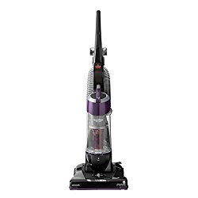
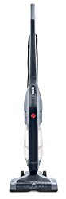

Are you looking for the best vacuum under $100?  You will be in for a pleasant surprise when you see the types of cleaners that the market has on offer. There is a wide variety of cleaners that come in varied configurations and boast of different features.

The market abounds in upright models, canister models, handheld models and more. These models have varied capabilities and features. Some are cordless while others are corded units. Find out about the best vacuum  cleaner under $100.

## To Rated Best Vacuums Under $100

| Picture | Name | Type | Features |
|---|---|---|---|
|  | BISSELL Cleanview Swivel Pet Upright Bagless Vacuum Cleaner | Upright | Triple Action Brush Roll with Scatter-Free Technology. |
|  | BLACK + DECKER CHV1410L 16V Hand Vac | Cordless | Long life, lightweight and no memory effect. |
|  | Hoover Linx BH50010 Stick Vacuum Cleaner, | Stick | Multi-Floor on/off Brushroll instantly switches from carpet to hard floor cleaning with the touch of a button |

## ***1\. BISSELL 9595A Vacuum with OnePass*** 

It is the most popular vacuum cleaner from Bissell, and among the **best vacuum under $100**.

The cleaner can reach the deepest and hardest corners and can easily sweep away all dust particles with superior air performance. [**Click here to see latest price on Amazon.**](https://www.amazon.com/gp/product/B07F6N3RT6/ref=as_li_tl?ie=UTF8&camp=1789&creative=9325&creativeASIN=B07F6N3RT6&linkCode=am2&tag=bestofvacuum2-20&linkId=6c7e5bfe8af067edbd86c66137cbdebd)

### **Suggestions**

The user’s manual has complete instructions about assembling the vacuum cleaner, and you have to use a screwdriver to complete the setup.

### **Tips**

If the unit stops functioning, call up Bissell Support. Follow the instructions offered by the authorized repair centers closest to your locality.

### **Buyer’s guide**

It is best not to use any powder product, as it can enter the motor of the vacuum and make it overheat.

### **Pros**

-   The vacuum cleaner is noiseless in operations.
-   The unit comes with Cyclonic System and OnePass Technology.
-   The company offers great after sales services.
-   It is offered with a 2-year warranty.

### **Cons**

-   The motor turns very hot during operations.

**Also See:**

-   [**Best leaf vacuum mulcher.**](https://www.bestofvacuum.com/best-leaf-vacuum-mulcher/)
-   [**Vacuum for small apartment.**](https://www.bestofvacuum.com/best-vacuum-for-small-apartment/)
-   [**Multi surface vacuums**](https://www.bestofvacuum.com/best-multi-surface-vacuum/)

## ***2\. Shark Navigator Freestyle Premium SV1106 Vacuum***

In case you wish to avoid the hassles of corded vacs and do not want to waste time winding back long cords, **cheap cordless vacuums** are the best choices. If you are looking for cordless vacuums that are low in price and offer the best performance,  with an extra-large dust cup, advanced swivel steering and a robust motorized brush, the Shark navigator SV1106 boasts of an impressive performance. [**Click here to see latest price on Amazon.**](https://www.amazon.com/gp/offer-listing/B00C351GBC/ref=as_li_tl?ie=UTF8&camp=1789&creative=9325&creativeASIN=B00C351GBC&linkCode=am2&tag=bestofvacuum2-20&linkId=f8dedc294db92267b6389fd4bf8989c3)

### **Suggestions**

The battery power should not be wasted, and the cleaner should be charged whenever there is low power.

### **Tips**

This is not for deep vacuuming purposes, and it is important to keep another cleaner close at hand for the job.

### **Buyer’s Guide**

The vac has dual settings – one for bare floors and another for rugs. You have to use your foot to control the setting.

### **Pros**

-    *Shark Navigator Freestyle Premium SV1106* is a light vacuum cleaner with a total weight of just 7.5 pounds.
-   It has a dust cup with XL capacity, which allows longer cleaning and easy emptying.
-   It has a 2-speed brushroll that offers easier pickup of pet hair and cleaning of bare floors.

### **Cons**

-   It discharges if left back on the charger.

## ***3\. BLACK + DECKER CHV1410L 16V Lithium Hand Vac***

It is a vacuum cleaner with just bare essentials, but performs well on most types of surfaces. It comes with smart charge technology, which consumes up to 50% less energy. [**Click here to see latest price on Amazon.**](https://www.amazon.com/gp/offer-listing/B006LXOJC0/ref=as_li_tl?ie=UTF8&camp=1789&creative=9325&creativeASIN=B006LXOJC0&linkCode=am2&tag=bestofvacuum2-20&linkId=8509eea2d4a94fea1ffb621e1f3d1e4d)

### **Suggestions**

Do not open up the cleaner at any time. Else, the warranty will get voided. Ask for replacement from Black and Decker if the unit does not perform properly.

### **Tips**

The cleaner takes around 4 hours to be fully charged, and you should keep it plugged to AC wall outlet to ensure no power drop during operations.

### **Buyer’s Guide**

This is a handheld vac, and is ideal only for spot cleaning carpeted floors.

### **Pros**

-   It is light in weight, which ensures easier movement and operations.
-   Its in-built tools reduce the risks of misplacement.
-   Its battery is very powerful and long lasting, despite being small in size.
-   It is inexpensive.
-   It is available with a 2-year warranty.

### **Cons**

-   It has a small nozzle.
-   It is slightly noisy while in operation.

## ***4\. Bissell Zing Bagless 1665*** 

If canister vacuum is your thing, look for one that is cheap in price and comes without any compromise on the performance and features front. This Bissell vac can be perfect fit in this regard.The vac cleans up entire homes very well, and has variable suction control that lets you turn down the suction and also clean up fabrics such as curtains. [**Click here to see** **latest** **price  on Amazon.**](https://www.amazon.com/gp/offer-listing/B075PL2GDD/ref=as_li_tl?ie=UTF8&camp=1789&creative=9325&creativeASIN=B075PL2GDD&linkCode=am2&tag=bestofvacuum2-20&linkId=453d23186b77694117593f1224fc2ca7)

### **Suggestions**

It is recommended that you use the cleaner for tidying up small apartments or the insides of RVs.

### **Tips**

It has a very powerful suction, and you are advised to begin with the lowest setting.

### **Buyer’s Guide**

This is a versatile vac, and you can attach a dusting brush – crevice tool combo to trap dust and dirt from the surfaces above the floor.

### **Pros**

-   It is lightweight and has a compact design that ensures easy movement.
-   It comes with an easy carrying handle, which helps in easier transportation.
-   The unit offers variable suction control.
-   It can be used to clean up the entire home.  

### **Cons**

-   It can be loud in operations at times.

## ***5\. Hoover Corded Cyclonic SH20030 Stick Vacuum Under $100***

It is one of the **best vacuum under 100** stick cleaners. This is a full-sized upright vac that helps clean up every corner, and has been designed especially for cleaning up floor surfaces. [**Click here to see latest price on Amazon.**](https://www.amazon.com/gp/offer-listing/B003ZYPZ0I/ref=as_li_tl?ie=UTF8&camp=1789&creative=9325&creativeASIN=B003ZYPZ0I&linkCode=am2&tag=bestofvacuum2-20&linkId=8f65441c868e7ad9c050f1612f60b7be)

### **Suggestions** 

The cleaner comes in a corded as well as cordless version. The unit has a 20 feet long cord, which cannot be winded back. You have to uncoil and coil it manually from the cord hooks. If you want to avoid doing this, go for the cordless version that will save you at least 15 minutes of operational time.

### **Tips**

You can turn off the brush roll, and this is recommended when you are using it on hard floors. It will help prevent damage to the surface. The suction power of the cleaner is sufficient to lift the dirt and debris.

### **Buyer’s Guide**

The strong suction and presence of brush roll makes the cleaner perfect for cleaning up fine debris. However, it might struggle with the larger debris due to its lower profile.

### Pros

-   The device is light in weight.
-   It boasts of powerful suction, which can easily pick up dirt and debris from floor and other surfaces.
-   It comes at a pocket friendly cost, and most buyers will find it fitting their budget.
-   Its motorized brush can be activated or deactivated, thus avoiding the scratching of hardwood surfaces.

### **Cons**

-   The cleaner lacks a cord rewind feature.
-   Its dirt bag is small in size.

## ***6\. Eureka EasyClean Corded Hand-Held Vacuum, 71B*** 

This is a perfect handheld vacuum for upholstery and stairs, due to the inlet design and the brush roll that is effectual in pet hair removal from these sections.[**Click here to see latest price on Amazon.**](https://www.amazon.com/gp/offer-listing/B0006HUYGM/ref=as_li_tl?ie=UTF8&camp=1789&creative=9325&creativeASIN=B0006HUYGM&linkCode=am2&tag=bestofvacuum2-20&linkId=d57441b7469940c77e6033aa6d8c3669)

### **Suggestions**

As pet hair often clings to the filter, you should keep a paper towel close at hand to get rid of them.

### **Tips**

Use the cleaner with the brushes on to make the backward strokes work better.

### **Buyer’s guide**

The cord is 20 feet long but comes without a rewind feature. However, despite the absence of the rewind capability, storage of the cord is easy due to the cord wrap area that is located at the back part of the vacuum.

### **Pros**

-   It is light in weight, and you can easily carry it around and even move with it upstairs or downstairs.
-   The vacuum boasts of a strong suction power that makes it ideal for stairs and upholstery.
-   It is comparatively noiseless than other similar hand vacs.
-   It comes with washable filter, and its bagless design reduces the costs of operations.

-   The hose is short.
-   It is not very capable in cleaning up contoured regions, and struggles inside vehicles. It is better to buy some other cleaner for dealing with such types of operations.

## ***7\. Bissell PowerEdge Pet Hard Floor 81L2A Vacuum*** 

This vacuum cleaner has a dustpan can and a broom to capture debris and dirt. It has a V-shaped technology that can direct bigger debris to the suction path in the middle. [**Click here to latest price on Amazon.**](https://www.amazon.com/gp/offer-listing/B00450U7V8/ref=as_li_tl?ie=UTF8&camp=1789&creative=9325&creativeASIN=B00450U7V8&linkCode=am2&tag=bestofvacuum2-20&linkId=77db01d78aaaad8a61cace2efd84adc0">BISSELL PowerEdge Pet Hard Floor Corded Vacuum, 81L2A \(Same as 81L2T\)</a>)

### **Suggestions**

Remember to empty the dust cup only in an area that you can sweep up easily, as you might end up with a fine mist of dander and dust otherwise.

### **Tips**

It is a good idea to sweep the edges next to the walls with some other vacuum or cleaning tool, given that PowerEdge cannot handle those spots well. Do not try cleaning these areas with your vac, as you might waste a lot of time unnecessarily.

### **Buyer’s Guide**

The handle is a vulnerable part of the cleaner, and can break easily after extended use. Take care not to step on it accidentally.

### **Pros**

-   It is light in weight, and can easily be handled and moved about.
-   *Bissell PowerEdge  81L2A* has a high capacity dust cup.
-   It picks up pet hair and grass easily.
-   The pieces of the cleaner can easily be assembled.

### **Cons**

The vacuum cleans up hard floors and short rugs nicely, but area rugs are its problem area.

## ***8\. VonHaus 2-in-1 Corded 600W Vacuum Cleaner***

This is a perfect vacuum cleaner for homes with a long staircase, and can work well on hardwood floors as well even with lower suction power. [**Click here to see latest price on Amazon.**](https://www.amazon.com/gp/offer-listing/B00OHTKVM2/ref=as_li_tl?ie=UTF8&camp=1789&creative=9325&creativeASIN=B00OHTKVM2&linkCode=am2&tag=bestofvacuum2-20&linkId=f5e6dd52d6d26c54c399a5ae9076a457)

### **Suggestions**

Although it cleans up baseboards pretty well, but if you wish to get out pet hair and grit, it is important that you use it parallel to the baseboards as well as head on.

### **Tips**

This is not a full sized vacuum and it is essential to crunch dried leaves, cereals etc to very small pieces to ensure that there is no clogging of the tube. Otherwise, the clogged tube will make the vac stop operating and you would have to opt for repairs.

### **Buyer’s Guide**

Although you might find it a little cumbersome to get rid of the cord and take out the long handle, doing this can allow you to use the cleaner as a hand vacuum.

### **Pros**

-   It comes with robust suction power.
-   *VonHaus 2-in-1 Corded 600W* has a long cord, which measures 19.5 feet in length.
-   It boasts of Sponge and HEPA filtration technology.
-   It has enough air suction power of 130 watts.

### **Cons**

It is not meant for hardwood floors.

## **Best Features of a Vacuum Cleaner under $100**

While buying best vacuum cleaner under $100, you should look for those with powerful filtration capabilities, ease of use, higher suction power and lighter weight.

​Vacuum cleaners under $100 should have:

#### ***1\. High Suction Power***

In most cases, vacuum cleaners for hardwood floors, carpets and dense mats come with awesome suction power. You should look for one with good suction power to deal with floors of most types.

***2\. Attachments***

In case you want the floors, especially those of made of hardwood, to be spotless, go for a vacuum cleaner coming with extra attachments or varied accessories. It is best that you look for a vacuum that comes without a spinning beater brush but with a big suction head, given that floor surfaces can be damaged by these brushes. ​

***3\. Light Weight***

When the time comes to clean up floors, weight happens to be a major problem. Look for lightweight vacuum cleaners that are low in weight and can help you avoid bumping or dropping the machine when you drag it around.

This can also destroy your floors otherwise. The market abounds in vacuum cleaners that are lightweight and cheap. There is no need to spend much for a heavyweight vacuum cleaner.

4\. ​***Warranties***

It is important to look for long warranties. Most companies tend to offer warranties on the cleaners that they bring out. However, you should check what all are the things covered by the warranty as well as the length of time for the same. Reputed manufacturers usually offer their  vacuum cleaners with at least 2-year warranty from the date of purchase.

#### **Conclusion**

By now, you have probably understood what to look in the best vacuum under $100. Keep in mind that the best vacuum cleaner under $100 for you should be the one that comes with the features and capabilities that make your life easier, and make your daily, weekly or monthly cleaning operations more convenient.

Before you go for a corded or a cordless vac, make sure that it fits your pockets and also offers utmost convenience to you as an owner. As a vac buyer, you should always aim at getting the best bang for your buck even when you are spending less than $100. Check the reviews, price, features and customer comments for each unit thoroughly before you choose to buy a unit.

You can try reputed land-based stores such as Oreck, Hoover, Miele, Kirby and Dyson to get such vacs in discounted prices. It is probably a better idea that you try online stores, which offer a higher discount and more value to customers. It is the easiest way to shop and you can even have the vacuum cleaner of your choice delivered to your doorstep.