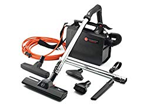
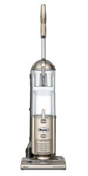
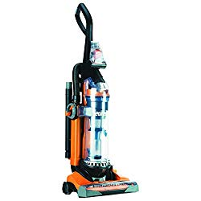
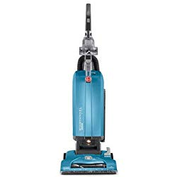
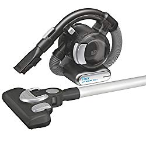
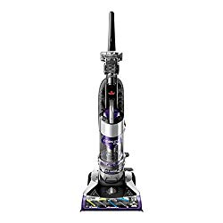

It is everyone’s dream to stay in a home that has a conducive environment. The feeling that you are breathing clean air, which is not intoxicated, is inevitable. But as we all know, it is not always easy especially if we do not live alone in the house.

Now than any other time in the history of man, you can live in a clean environment thanks to the best vacuum under $150.

In this write-up, I’m going to cover a list of top low-cost vacuums that you can choose from. It’s my hope that even before hitting the last product, you’d have selected the best vacuum cleaner under $150 that best suits your home. First, let’s look at a few things to consider when choosing a vacuum cleaner.

It is true that there are many types of vacuum cleaners out there. With that in mind, then you know that not every cleaner is meant for your home. When choosing the best vacuum for under 150, you need to consider the following:

-   Corded vs cordless.
-   Power consumption.
-   Weight.
-   The size.
-   Attachments.
-   Your home (what exactly you want it for).

With those few tips, let’s delve straight into our in-depth review of the best vacuums under $150.

##   Best Vacuum Cleaners Under $150.

| Picture | Name | Type | Cord Length |
|---|---|---|---|
|  | BISSELL Cleanview Rewind Pet Deluxe Upright Vacuum Cleaner | Upright | 25 Feet |
|  | BISSELL Cleanview Rewind Pet Deluxe Upright Vacuum Cleaner, 24899 | Upright | 27 Feet |
|  | Shark Navigator Professional Upright Vacuum (NV360), Blue | Upright | 25 Feet |

## The Best Vacuums Under 150 

These are the best vacuum cleaners under $150 or less.

## 1\. Shark Navigator NV360 Upright Vacuum

Shark Navigator NV360 (Blue), comes with the Lift-Away feature. This will help you transit from the hard floor to the carpet and to the far-end corners of your house.

Besides, it has one of the most powerful yet flexible swivel steerings.[**Click here to see latest price on Amazon.**](https://www.amazon.com/gp/product/B00JH98GR4/ref=as_li_tl?ie=UTF8&camp=1789&creative=9325&creativeASIN=B00JH98GR4&linkCode=am2&tag=bestofvacuum2-20&linkId=007a81455da489d9a303ee55249d81ee) 

With an extendable wand to reach under furniture and corners, you are sure that your house will be clean.

The machine has a large-capacity dirty cup. What is more, it is very easy to empty the dirt, clean and replace it back.

SharkNinja, the manufacturer ensures that the HEPA filter is right in its place to enable you to do your cleaning without the fear of catching flu.

Shark Navigator NV360 is fitted with a power cord that is 25-feet long. This will enable you to clean a large area without necessarily changing power sources.

**Suggestions**

Do you live in a large room, need a vacuum that reaches each corner with ease, and collects dirt until the end of your cleaning? This is the best vacuum for you.

**Tips**

Remember that Shark Navigator NV360 has both the dusting brush and the pet power brush. For excellent cleaning, use each power brush for its purpose. You’ll realize good results.

### Buyer’s Guide

When you are sourcing out for the best vacuum under $150, make sure you look at not just a feature but also several other features.

For instance, you might be living in a large room. Well, a corded vacuum with say 20+ feet power cable is ideal.

However, there are other things such as is the vacuum cleaner affordable? Will it help you clean the house, save energy, and last for long?

Does it reach each corner of the house? Is it easy to clean and replace it? Does it have a crevice tool? These are important things to factor in. thankfully, Shark Navigator NV360 fits the bail.

**Pros**

-   Suitable for all types of rooms (power cord of 25-ft).
-   It is lightweight (weighs 13 lbs).
-   Has attachments.
-   Comes with a removable canister.
-   Very easy when cleaning it.
-   Comes with tolerable sound when set on.

## 2\. Hoover Company 40140201 One Pack with HEPA Cartridge Filter

Hoover Company 40140201 comes with certain features that you may not get in other vacuum cleaners. For instance, this appliance comes with a blower that is inbuilt.

With it, you are able to ensure maximum cleaning of all the area you are working on in your home. [**Click here to see latest price on Amazon.**](https://www.amazon.com/gp/product/B005NASSRO/ref=as_li_tl?ie=UTF8&camp=1789&creative=9325&creativeASIN=B005NASSRO&linkCode=am2&tag=bestofvacuum2-20&linkId=4990d0019243e473dd84837d484a0533) 

What is more is that you can use Hoover Company 40140201’s versatility to clean areas such as the inside of your car that you’d not cleaned otherwise.

The vacuum cleaner is fitted with a reusable cloth bag. When cleaning it, you will only need to detach, clean, and then replace it back. This saves you a lot of money buying new commercial bags.

It also has one of the longest power cords. At 33 feet, you are sure that you will clean the entire room without changing the power source.

Additionally, the attached hose will stretch even further.

### Suggestions

Use this vacuum cleaner anywhere in the house. You can plug the power adapter on one end on the house and continue with the cleaning to the other end.

### Tips

The commercial cloth bag is one of the best features that come with Hoover Company 40140201. Do not think there are any kinds of debris that will not fit in the bag. Just open and throw any dirt or debris. Once the cloth is full, empty it, clean it and replace it back.

### Buyer’s Guide

Look at the length of the power cord plus the hose that is definitely going to add value to the whole unit. With over 33 feet of vacuum reach, you are able to get the ideal vacuum cleaner for your home.

### Pros

-   Hoover Company 40140201 has a commercial bag cloth that is reusable. You do not have to spend lots of money buying new bags.
-   The stretchable hose ensures you reach as many places as possible.
-   Has a nice sleek design.
-   Has a much longer power cord. This is nice for large rooms.

### Cons

-   Some clients report that the cord kept falling while they were cleaning.
-   It is not good for cleaning cobwebs. It might miss.

## 3\. Shark Navigator Upright Vacuum (NV352)

The first thing you will love about [Shark Navigator NV352 is it’s a versatile vacuum](https://www.bestofvacuum.com/best-rated-shark-vacuum/). You’ll  also love many amazing features about this vacuum cleaner. [**Click here to see today’s price on Amazon.**](https://www.amazon.com/gp/product/B004Q4DRJW/ref=as_li_tl?ie=UTF8&camp=1789&creative=9325&creativeASIN=B004Q4DRJW&linkCode=am2&tag=bestofvacuum2-20&linkId=550f34a5b4cb130e238db42e55557032) 

**Review**

The Anti-Allergen Seal is specially designed not to allow any harmful particles to reach you when cleaning.

By simply pressing a button, you can lift away this vacuum cleaner thus enabling you to reach some of the hardest and furthest places in your house.

Shark Navigator NV352 comes with several features but maintains its ability to perform hard chores. Besides, this vacuum is light in weight, with only 12.5 lbs.

I’m sure you’ll love the cleaning tool’s swivel steering wheel. You will also be amazed by the strength of its brush roll shutoff that has a deep yet gentle carpet cleaning ability.

**Suggestions**

I’d suggest that if you need something that is lightweight, you consider this. But there is another thing. For efficiency, use it for at least 5 hours. The entire house will be clean.

**Tips**

Be sure to utilize all the features and the accessories that come with this best vacuum under $150. They are meant to be used by you.

The Lift-Away Technology , for instance, is a nice one. Use it to clean certain areas in your home that are not easily reachable.

### Buyer’s Guide

I’d recommend that you capitalize on the Anti-Allergen Seal. Remember it is completely sealed. That means your work is to clean not to bring dirt to your home. Therefore, when buying, look at this ability.

**Pros**

-   It is lightweight (12.5 lbs).
-   Has a detachable canister.
-   Operates for long hours without heating.

Cons

-   The pet power brush is not powerful.

## **4\. Shark Navigator DLX Upright vacuum** 

If you are struggling with allergies, this is the right vacuum for you. Shark Navigator DLX is credited with True HEPA filters and an anti-allergen technology that have the ability to remove over 99.9% of all germs and allergies from the house. [**Click here to see today’s price on Amazon.**](https://www.amazon.com/gp/product/B00K1NPSWG/ref=as_li_tl?ie=UTF8&camp=1789&creative=9325&creativeASIN=B00K1NPSWG&linkCode=am2&tag=bestofvacuum2-20&linkId=c39c93d756504e24fa1614833a0c8d55)

### **Features**

-   This is perhaps the most powerful yet lightweight vacuum cleaners under $150.
-   The anti-allergen complete seal is one of the things that make this vacuum stand out. Thanks to the technology, all dirt is trapped inside the vacuum compartments so that it does not have room to spread to the rest of the household.
-   You will have excellent control of the vacuum thanks to the swivel steering.
-   Shark Navigator weighs 15.2 pounds. This might look heavy to many people but the weight gives the vacuum the strength and power to clean and remove all the allergens from the house.
-   An easy-to-empty dust cup makes your work simple especially when you want to clean many rooms that are filled with dirt.
-   Has a power cord that measures 25 feet long. Thanks to the power cord, you will be able to access all rooms within the home even if you are forced to use one or two wall socket stations.
-   The vacuum cleaner is equipped with deep cleaning ability when it is on the carpet but it is gentle on bare floor.
-   Brushroll shutoff ensures the machine does not continue to run when there is nothing to clean.

**Pros**

-   Long power cord that ensures you clean a large area.
-   Powerful and deep clean on carpets and upholstery.
-   Very gentle on concrete and tiled floors.
-   Nice color.
-   Ability to eradicate germs and allergies from the house.
-   Easy to empty when dirt fills the dust cup.
-   Saves energy by shutting off if the surface is clean.
-   Reaches every corner of the house thanks to the swivel steering.

**Cons**

-   At 15.2 lbs, the vacuum cleaner is heavy.
-   The long hose is a nuisance to some users.
-   Doesn’t perform better on the edges of the house.

## 5\. Eureka Airspeed AS3030A Vacuum Unlimited Rewind

The words ‘Airspeed’ and ‘Unlimited Rewind’ in the Eureka Airspeed AS3030A Upright Vacuum Cleaner are not meaningless. They carry a specific meaning that adds value to the user. **Click here to see latest price on Amazon.**

For instance, when you read about Unlimited Rewind, it simply means that Eureka Airspeed AS3030A Upright Vacuum automatically rewinds its 27-foot power cord in an instant. You only need to press a power button and you are done.

This [best vacuum cleaner](https://www.bestofvacuum.com/best-vacuum-cleaner/) for under 150 comes with a washable dust cup. Once the dust cup is clean, you can replace it back and continue with your cleaning the following day.

The term Airspeed, on the other hand, means the vacuum cleaner is equipped with the ability to move a sufficient amount of air thus removing more dirt and deeply embedded stains.

Eureka Airspeed AS3030A Upright Vacuum Cleaner has a powerful suction strength as well as imaginable allergen filter power.

### Suggestions

With this vacuum cleaner, you will not have the stress of changing the dust cup. You simply remove it, wash it until it is clean, and replace it.

### Tips

This machine has the ability to suck in air and then give it out in a form of deep cleaner. To ensure this happens to your machine, ensure there is free air circulation in the house. The results are fulfilling.

See our reviews for best [vacuums for cat litter](https://www.bestofvacuum.com/best-vacuum-for-cat-litter/) 

### Buyer’s Guide

Are you the type of person who gets irritated when you take too long to do something? If yes, this is the right tool for you. Suppose you are through with your cleaning and want to put Eureka Airspeed AS3030A Upright Vacuum Cleaner back.

You only press a button, within seconds; the 27-ft long power cord is in its position. It is that simple.

### Pros

-   Comes with unlimited rewind ability.
-   The dust cup is washable thus lasts longer.
-   Has a high-level allergenic filter that ensures you do not catch flu.

### Cons

-   So far there isn’t any badness.

## 6\. HOOVER T-Series UH30300 WindTunnel Bagged Vacuum

All HOOVER vacuum cleaners come with quality features. Being one of them, HOOVER T-Series UH30300 has excellent attributes. **[Click here to see latest price on Amazon.](https://www.amazon.com/gp/product/B08BJX2TLC/ref=as_li_tl?ie=UTF8&camp=1789&creative=9325&creativeASIN=B08BJX2TLC&linkCode=am2&tag=bestofvacuum2-20&linkId=f07cb898bf3206e262632c392fc3cacd)** 

### Review

It will not take you seconds to access the bag. With just a touch on the bag door, you have the bag.

Speaking of the bag door, it is easy to drop any dirt into the bag without touching it.

There is no better way to guard your family against the contamination of any dirt than this.

The WindTunnel Technology enables the quick removal of any embedded dirt leaving your house cleaner.

HOOVER T-Series UH30300 comes with a 30-ft power cord. With the cord this length, you are able to clean the entire room with your vacuum cleaner fixed to a single power source.

### Suggestions

HOOVER T-Series UH30300 comes with a 5-height position. Make sure you adjust the knob to suit your height. This will help in the cleaning. You will be able to clean any floor with this feature. See our reviews for [best backpack  vacuum](https://www.bestofvacuum.com/best-backpack-vacuum/)

### Tips

To ensure that you do not touch any dirt, as it is required, make sure that the bag door is in good condition. If it has a dent or any sort of corrosion, it will not open with ease.

### Buyer’s Guide

Look at how easy it is to access the tool’s features, the length of the cord, extension wand; how easy it is to store the vacuum and of course the 5-height position feature.

### Pros

-   Exceptional suction power.
-   Good for long pet hair and dander.
-   Comes with two filters that you can clean and replace.
-   Belt replacement takes over 2 years or so. This is enough time.

### Cons

-   The lever that is attached to the vacuum body may cause unnecessary tension on the belt thus tearing it.

## 7\. BLACK+DECKER BDH2020FLFH MAX Lithium Flex Vacuum

Everything in the name of this  cleaner is important. For instance, when you read that the BLACK +DECKER BDH2020FLFH MAX is 20Vlts, it simply tells you that the machine doesn’t consume a lot of energy. [**Click here to see latest price on Amazon.**](https://www.amazon.com/gp/product/B00JILGZOC/ref=as_li_tl?ie=UTF8&camp=1789&creative=9325&creativeASIN=B00JILGZOC&linkCode=am2&tag=bestofvacuum2-20&linkId=2681fc66d4e1481cc133743c5d646c9b)

### Review

The first thing you’ll notice is that BLACK Plus DECKER BDH2020FLFH MAX is cordless. This gives you ample reason to believe that this best vacuum for under $150 will clean every part of your room.

It comes with a 4-ft long hose, which is important especially if you want to reach certain areas of the house that are hard to access including the ceiling.

To help keep the filter functional for long, the Cyclonic Action feature keeps the dust away thus leaving the filter clean. In the event that the filter is dirty, you can remove it with ease, clean, and finally replace it.

The BLACK Plus DECKER BDH2020FLFH MAX takes a maximum of 4 hours for its Lithium battery to be full.

Filtration process takes three stages to ensure thorough cleaning. At every point, it is easy to know that your vacuum cleaner is doing a commendable job. In the end, the filter will only release minimal amounts of dirt.

### Suggestions

Fold the vacuum cleaner and stretch its 4-ft long hose to reach distant parts of the house. At the end of the day, you will be able to clean each part of your house.

### Tips

Remember that the vacuum is just 6.8 pounds. With this weight, it is not a big deal to clean anywhere in the house.

### Buyer’s Guide

Capitalize on the fact that you are not going to wind and rewind the cord as is the case with those best vacuums under $150 that come with power cords.

### Pros

-   It is cordless (you are able to go with it anywhere in the house).
-   BLACK + DECKER BDH2020FLFH MAX is lightweight, weighing only 6.8 lbs.
-   Comes with a washable filter and bowl. This saves you huge bucks.
-   Doesn’t take long to recharge. Usually takes 4 hours to fully charge.
-   The 4-ft hose will help you reach each corner of the house.

### Cons

-   If the Lithium battery is low amid your work, you need an additional 4 hours to recharge it then you can carry on with the cleaning. This’ll be embarrassing.
-   Does not have floor attachments.

## 8\. Bissell 1819 Cleanview Bagless Vacuum Under $150

With the Bissell 1819 Cleanview Bagless Upright Vacuum, you will be sure that you will conduct and edge-to-edge vacuuming of your house. [**Click here to see today’s price on Amazon.**](https://www.amazon.com/gp/product/B07LGS8CX2/ref=as_li_tl?ie=UTF8&camp=1789&creative=9325&creativeASIN=B07LGS8CX2&linkCode=am2&tag=bestofvacuum2-20&linkId=14df8ee94865241276eda34cb4933279)

### Review

Bissell 1819 Cleanview Bagless Upright Vacuum comes with a 27-ft power cord. Even though, after you are tired from a hard cleaning exercise, you simply press a button then the cord gets back to its place. It is that simple.

With a Triple Action brush, it is easy to loosen, remove, and lift the dirt that perhaps has been embedded on the hard floor or carpet for a long time.  

Speaking of the triple action feature, you need to combine it with the multi-cyclonic feature. These two features will help you capture any pet dander, dust, and debris in your house.

The Bissell 1819 Cleanview Bagless Upright Vacuum is designed with multi-level filtration. The main component of this is the washable filter. In the event that it is dirty, it is easy to remove the filter, wash it and then replace it back.

With all these and other features, this best vacuum cleaner for under $150 consumes little energy thanks to its 8 amps motor.

### Suggestions

Place the vacuum cleaner on the surface with embedded dirt. Using its powerful suction energy, you are able to remove the dirt in an instant.

### Tips

If you are buying this machine for the first time, do not panic. The user’s manual explains everything super fine. It is very easy to set it up and start working.

### Buyer’s Guide

Somehow, it is super strong when it comes to suction power. One verified user once told me that it almost tore her old mat. So, yes, if you are looking for the best vacuum cleaner for under $150 incomparable suction power, this is the best bet.

### Pros

-   Has high-velocity suction power.
-   It is easy setting it up.
-   You do not have to worry about the tiresome work of rewinding the cord. Bissell 1819 Cleanview Bagless Upright Vacuum does that with a touch on the button.
-   It is suitable for edge-to-edge deep cleaning.

### Cons

-   Although the suction power is good for removing dirt, Bissell 1819 Cleanview Bagless Upright Vacuum’s energy may be overwhelming to your mats or carpets if they have overstayed. Chances of tearing them are high.

## What is the best bagless vacuum cleaner for under 150.00?

1\. BISSELL 2252 CleanView Swivel Upright Bagless Vacuum Carpet Cleaner.  
2\. eureka NEU182B PowerSpeed Bagless Upright Vacuum Cleaner.  
   
3\. Kenmore DU2012 Bagless Upright Lightweight Vacuum Cleaner.  
   
4\. Hoover MAXLife Pet Max Complete, Bagless Upright Vacuum Cleaner, For Carpet and Hard Floor, UH74110.  
   
5\. Shark SV1106 Navigator Freestyle Upright Bagless Cordless Stick Vacuum for Carpet, Hard Floor and Pet.  
   
 

## What is the best vacuum cleaner for under 150.00

1\. Eureka NEU202 PowerSpeed Cord Rewind Vacuum.  
   
2\. BISSELL 2252 CleanView Swivel Upright Bagless Vacuum Carpet Cleaner.  
   
3\. Hoover FloorMate Deluxe Hard Floor Cleaner Machine, Wet Dry Vacuum, FH40160PC.  
   
4\. Hoover Windtunnel Max Capacity Upright Vacuum Cleaner with HEPA Media Filtration, UH71100.  
   
5\. ROOMIE TEC Cordless Vacuum Cleaner, 2 in 1 Handheld Vacuum.

#### Conclusion

This list of best vacuums under $150 has put emphasis on a number of things. It is true that I’ve covered review, suggestions, tips, buyer’s guide (what you need to look for in each vacuum), and the last two parts, pros, and cons.

These parts may look different on their own but accumulatively, they should help you get the best vacuum under $150 that will help you clean your house or office.