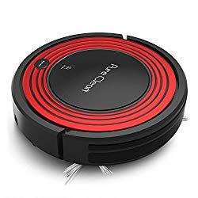
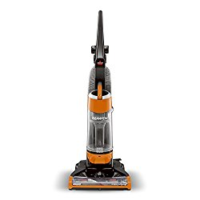
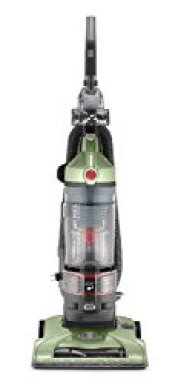

In this article we review some of the best vacuums under $200.  Most of these inexpensive vacuums will perform just as well, if not better than the highly priced ones.

There are cleaners in various forms these days on the market, ranging from hand held varieties to regular uprights and even those with canisters that are of good quality and under 200.

They come with a combination of tools, such as mini vacuums and even 3-in-one or 2-in-1, which are useful for cleaning hidden crevices or stairs.  Let’s dive into reviewing the best vacuum under $200 to help you pick the right one hassle-free.

###  5 Best vacuums under $200

| IMAGE | NAME | FEATURES | STYLE |
|---|---|---|---|
|  | Shark Rotator Professional Lift-Away Upright Vacuum, Red (NV501) | *2-in-1 Vacuum: Upright and Lift-Away for portable cleaning.*Premium Pet Power Brush. | Upright |
|  | Pure Clean Automatic Programmable Robot Vacuum PUCRC95 | *Automatic recharge dock*Dual rotating brushes. | Robot |
|  | Oreck Commercial XL Commercial Upright Vacuum Cleaner, XL2100RHS | *Multi-Floor Cleaning with Microsweep technology.*High Speed Roller Brush. | Upright |

## **9 of the Best Vacuum Cleaner Under $200**

## **1\. Oreck Commercial XL Commercial Upright Vacuum Cleaner, XL2100RHS** 

This is an upright and basic vacuum cleaner that is best for vacuuming carpets. [**Click here to see today’s price on Amazon.**](https://www.amazon.com/gp/offer-listing/B001NDNV18/ref=as_li_tl?ie=UTF8&camp=1789&creative=9325&creativeASIN=B001NDNV18&linkCode=am2&tag=bestofvacuum2-20&linkId=5b3cc96653e5468cdab3fd1022b5e19c) 

Its design is proven and simple, and is ideal for basic carpet vacuuming jobs. It is also excellent for cleaning up hard floors in homes with a combination of various types of floors. This upright vacuum under 200 dollars has a vast bag for the collection of dirt and debris that can be used for a long time before you have to change it. It consists of a long cord of heavy duty form, which allows cleaning of larger area.

### **Suggestions**

It does not come with any headlight, which makes it tough to use during cleaning operations at night. You need an additional front light.

### **Tips**

The cleaner has a cleaning path 12 inches in width, which makes it more appropriate for cleaning up low pile carpets.

### **Buyer’s Guide**

During spring cleaning, spots along corners and baseboards are tough to clean with this vacuum. You will require another vacuum of canister-type for above-floor cleaning, dusting and hard surfaces, and use it as a secondary cleaner.

### **Pros**

-   At 8.2 pounds, it is lightweight enough to use. Its small and compact dimensions also make it easy to maneuver and store.
-   The vacuum comes with auto floor adjustment, and you can move it easily between hard surfaces and carpets without making any alterations to its manual settings.
-   The vacuum cleaner has an on/off switch that is conveniently situated in the handgrip. Its double helix brushes and robust brush roll helps in easier cleaning operations.

### **Cons**

-   There are no attachments with this device.

## **2\. Pure Clean Automatic Robot Vacuum Cleaner**

“This is not just a robot vacuum cleaner. It’s more of a complete and high-end vacuum cleaner of my choice. I wish I discovered it earlier,” says one certified customer who purchased it recently. [**Click here to see today’s price on Amazon.**](https://www.amazon.com/gp/offer-listing/B01KIGH2GA/ref=as_li_tl?ie=UTF8&camp=1789&creative=9325&creativeASIN=B01KIGH2GA&linkCode=am2&tag=bestofvacuum2-20&linkId=85c488d1276af0590b20c249a98a7010)

You too can say with confidence like this homeowner who finally got what he wanted after a long search. But, what makes Pure Clean Automatic PUCRC95 Programmable Vacuum Cleaner stand out? Here are the reasons:

As you may have already known, Pure Clean Automatic PUCRC95 Programmable Vacuum Cleaner comes with a scheduled activation. This works magic. Whether you are in the house or away from home, the Schedule Activation feature sets itself on when the right time comes

Can you imagine a vacuum cleaner that works on your house, carpet, hardwood floor, and other areas whether you are home or away? This is incredible!

It is interesting to note that Pure Clean Automatic PUCRC95 Programmable Vacuum Cleaner is fitted with an automatic charging dock. The feature allows for the vacuum cleaner to recharge itself for approximately 90 minutes before going back to work. Is this not what you want of a vacuum?

You are likely to love the high-end HEPA filtration that is offered by this vacuum cleaner. Without exaggeration, Pure Clean Automatic PUCRC95 Programmable Vacuum Cleaner does not experience pet hair or dander clogging at any given point. This is possible thanks to the 24W suction strength.

The other thing that makes Pure Clean Automatic PUCRC95 Programmable Vacuum Cleaner to stand out is its low profile. Were it not for the low profile, it would be difficult for Pure Clean Automatic PUCRC95 Programmable Vacuum Cleaner to reach other areas such as below the couches and beds.

### **Suggestions**

You can utilize the Schedule Activation Timer, which will help you save time. Many people are usually busy thus do not have time to clean their houses. If you find an appliance that will do so when you are away, that’d be brilliant.

### **Tips**

For best results, you need to remove some things from the way. This is in case you want Pure Clean Automatic PUCRC95 Programmable Vacuum Cleaner to clean the house when you are away from home.

### **Buyer’s Guide**

Without a lie, I personally like doing things for myself but wouldn’t mind if someone or something did the work for me. What is more, Pure Clean Automatic PUCRC95 Programmable Vacuum Cleaner does it perfectly.

If you are looking for a vacuum cleaner look at some of the things that give you immeasurable benefits. For this robot vacuum cleaner, we are looking for things such as the automatic charging dock, low profile that reaches everywhere, and of course, the self-programmable feature.

### **Pros**

-   The vacuum cleaner is super light, at 6 lbs.
-   Does the work seamlessly when you are away thus no supervision.
-   Do you love sports, news, documentaries, soaps and more? Keep watching as the robot vacuum cleaner does its work.

### **Cons**

-   It might overrun thus using unnecessary energy.

## **3\. Shark Rotator Professional Lift-Away Upright Vacuum (NV501)**

A 2-in-1 cleaner, this vacuum comes from the brand Shark and is upright in operations. [**Click here to see latest price on Amazon.**](https://www.amazon.com/gp/offer-listing/B0091JG0LY/ref=as_li_tl?ie=UTF8&camp=1789&creative=9325&creativeASIN=B0091JG0LY&linkCode=am2&tag=bestofvacuum2-20&linkId=a15b45a2e6715e29432e2974b1726adc) 

With flexible hose, aggressive brush roll and long cord, it is easy to use. The cleaner comes with wonderful filtration and suction technology. This upright vacuum  comes with a wide range of useful accessories. It is the best vacuum under 200 for pet hair, and does not clog up easily even when being used for a long time. [Shark Rotator professional is  ideal for almost any type of cleaning operation](https://www.bestofvacuum.com/best-rated-shark-vacuum/) in the home. It can sanitize everything when used along with a steam mop.

### **Suggestions**

The caddy is slightly bulky, but it is recommended that you use it on wheels.

### **Tips**

-   Do not use the accessories of your old Shark cleaner with this one, as these would not fit.
-   You should not it for small cleaning tasks. Its stretch hose gets in the way of operations, and is not ideal for small types of cleaning operations.

### **Buyer’s Guide**

You should change modes for tile / hardwood flooring or carpet. You can get the motorized brush roll deactivated with only a button push. If you keep it active while using on a tile or hardwood surface, it can damage the floor or the brush roll.

### **Pros**

-   The vacuum comes with easy maneuverability, and boasts of a robust suction.
-   It is easy to empty the dust cup of the cleaner.
-   Its front lights are excellent, and can make it easy for you to clean at night.
-   The cost of this cleaner is much less than that of a Dyson or other ‘powerful’ vacuums with similar features.

### **Cons**

-   The lack of an auto rewind feature for the cord makes things slightly inconvenient.

## **4\. Bissell 9595a Cleanview Bagless Vacuum with Onepass** 

BISSELL 9595A Vacuum

It can be used to get rid of most types of debris from any surface, and consists of premium quality accessories for effectual and quick cleaning operations. With robust suction, it can pull up anything – whether it comes to pet hair, dirt or debris. [**Click here to see latest price on Amazon.**](https://www.amazon.com/gp/offer-listing/B00AZBIZTW/ref=as_li_tl?ie=UTF8&camp=1789&creative=9325&creativeASIN=B00AZBIZTW&linkCode=am2&tag=bestofvacuum2-20&linkId=4e9bba6b14e0d7dd0943163a128fae18) 

### **Suggestions**

Do not use it in the early morning or late at night, as it is slightly noisy in operations.

### **Tips**

The hose is slightly stiff when stretched out longer, and you need someone strong to pull it.

### **Buyer’s Guide**

Begin with the lowest setting, or your carpet will be sucked up in places.

### **Pros**

-   The device is light in weight, and there is no need to purchase another bag any more. You can transport it across rooms and even take it up or down floor levels with absolute ease.
-   It has some attachments such as brush tool and crevice that can be affixed to a hose to clean up over the floor surfaces very easily.
-   It comes with very strong suction power, and can lift up debris, dust etc very easily.

### **Cons**

The heavy suction power sucks up the carpet at times.

## **5\. Bissell CleanView Bagless Vacuum with OnePass Technology** 

Bissell CleanView Bagless Upright Vacuum

This bagless vacuum under $200 is light in weight, and comes with OnePass Technology having a unique brush design and a robust suction. [**Click here to see latest price on Amazon.**](https://www.amazon.com/gp/offer-listing/B00KR5UJP4/ref=as_li_tl?ie=UTF8&camp=1789&creative=9325&creativeASIN=B00KR5UJP4&linkCode=am2&tag=bestofvacuum2-20&linkId=dc2cf62c45db0928ca4fa2c1de7dc84f) 

This is a robust piece of cleaner equipment for tidying up various surfaces, with its strong suction power and the robust OnePass Technology. It has a washable foam filter and a dirt tank that can easily be emptied from the bottom.

### **Suggestions**

It can be slightly larger and difficult to push for people with short stature, and you would do well to buy a pair of small wheels to keep it on.

### **Tips**

It is important to be slightly attentive during the cleaning operations, and take care that the filter does not get stuck within the cleaning hose.

### **Buyer’s Guide**

If you have too high windows or areas that you need cleaning up, this might not be the best cleaning equipment to use. Its wand does not expand too far and its hose in quite short as well.

### **Pros**

-   It is capable of picking up a large amount of pet hair, dust, debris and other particles.
-   You can empty it very easily, which means more ease of operations.
-   Even with vacuuming for a short while, you can find a large amount of dirt and debris being picked up and collected.
-   Although it is slightly noisy, the vacuum cleaner boasts of tremendous suction power.

### **Cons**

You have to bend over to turn the power button on or off. A foot activated button would have been a better choice.

## **6\. Hoover Linx Cordless Stick Vacuum Cleaner, BH50010**

This best vacuum under $200 comes with a cordless design, charges quickly and is able to charge itself fast in a matter of a few hours. As its cleaning head is wide, you do not have to move back and forth a lot for the cleaning operations. It boasts of a strong suction power, and offers great cleaning results on low pile carpet, rugs, bare floors and more. [**Click here to see latest price on Amazon.**](https://www.amazon.com/gp/offer-listing/B001PB8EJ2/ref=as_li_tl?ie=UTF8&camp=1789&creative=9325&creativeASIN=B001PB8EJ2&linkCode=am2&tag=bestofvacuum2-20&linkId=73d0067941fac2dfc5845975d1c2e270) 

### **Suggestions**

Use a cloth or plastic / rubber glove while cleaning up the filter, particularly while removing hair from the baffle tube. Otherwise, the mess will end up soiling your hands. Read reviews for [Top corded stick vacuum](https://www.bestofvacuum.com/best-corded-stick-vacuum)

### **Tips**

Do not go too far under your furniture, as the dirt cup has a smaller diameter as is incapable of going too far.

### **Buyer’s Guide**

It has restricted mobility, as its base is unable to swivel.

### **Pros**

-   Hoover Linx BH50010 can clean the edges. It can also be used for tidying up pet hair.
-   It is easy to use, with a washable foam filter, easy to access power switch and easy cleaner mode shifting from hard floors to rugs and carpets.
-   This cordless stick vacuum cleaner is just 7.25 pounds in overall weight, which makes it light enough for everyday operations.
-   It is able to stand upright, which offers more convenience at the time of cleaning.

### **Cons**

Dirt is not trapped very well by the foam filter.

## **7\. Shark Navigator Lift-Away Upright Vacuum (NV352)**

It comes from the reputed brand Shark, known for manufacturing top vacuum cleaners. [**Click here to see latest price on Amazon.**](https://www.amazon.com/gp/offer-listing/B004Q4DRJW/ref=as_li_tl?ie=UTF8&camp=1789&creative=9325&creativeASIN=B004Q4DRJW&linkCode=am2&tag=bestofvacuum2-20&linkId=882d818ad283c5dbb9d03afad6131f64) 

This is a medium priced vacuum cleaner that can be used as a [laminate floor vacuum](https://www.bestofvacuum.com/best-vacuum-for-laminate-floors/) or used to clean up carpeted floors, wood floors, hard floors etc easily and for picking up pet hair and lint. This upright vacuum cleaner has its own dirt cap and filter.

### **Suggestions**

While cleaning hard floors, there is no need to use any brush. You may simply deactivate it and use just suction power.

### **Tips**

While cleaning hardwood floors, it picks up larger debris more easily than fine dust particles. You need to pass it several times to ensure proper cleaning.

### **Buyer’s Guide**

Do not lift it. Use the handle to glide it over the floor surfaces.

### **Pros**

-   It boasts of a powerful suction, and can easily pick up dirt and debris hidden in carpets.
-   It offers a solid performance at a small price, and can be used for almost all forms of cleaning at home.
-   Its light weight makes it useful for transporting in any area, without breaking into a sweat.
-   It is relatively noiseless, despite its robust suction.

### **Cons**

The neck extension cannot be held in place due to a lack of adapter.

## **8\. Eureka Mighty Mite Canister Vacuum, 3670G** 

This powerful  canister vacuum cleaner from the prestigious brand Eureka has been designed to clean varied surfaces. [**Click here to see latest price on Amazon.**](https://www.amazon.com/gp/offer-listing/B00002N8CX/ref=as_li_tl?ie=UTF8&camp=1789&creative=9325&creativeASIN=B00002N8CX&linkCode=am2&tag=bestofvacuum2-20&linkId=648a3698d8ce20bd2c47585ea639bea1)

It is ideal for tidying up linoleum, tiled, bare floor, hardwood and various other surfaces. You can use it for cleaning up hard to access spots due to the long extension wand. It boasts of a powerful 12 amp motor having enough suction to clean pet litter, hair as well as [vacuum dust mites](https://www.bestofvacuum.com/best-uv-vacuum/) and debris.

### **Suggestions**

Do not use it for cleaning up chic rugs or carpet, as it lacks a motorized brush.

### **Tips**

Adjusting the suction involves using an old method. Turn the round shaped hole to full to get optimal suction and turn the knob a little to reveal the hole partially and reduce the power.

### **Buyer’s Guide**

It is best to only try it on thin carpets, as you have to use it for multiple times on thicker ones to get noticeable results.

### **Pros**

-   It has strong suction power, and can easily clean up bare floor surfaces.
-   As it is bagged in design, it is ideal for those with allergies or respiratory ailments.
-   You can get wonderful and equal reach with the long extension wand. Its accessories let you clean up blinds, upholstery, stairs etc easily.
-   It is just 8.6 pounds in weight, and can easily be transported across rooms or floor levels.

### **Cons**

It lacks a motorized brush, which makes it less effectual on rugs or carpets.

## **9\. Hoover T-Series WindTunnel Rewind Plus Upright Vacuum** 

This is a new vacuum cleaner with an upright design, and comes from the brand Hoover that is famous for its wide range of fantastic vacuum cleaning equipment for homes. [**Click here to see latest price on**](https://www.amazon.com/gp/offer-listing/B075785C8K/ref=as_li_tl?ie=UTF8&camp=1789&creative=9325&creativeASIN=B075785C8K&linkCode=am2&tag=bestofvacuum2-20&linkId=adbf56d9ead388cee642e889000b9ee9) [**amazon.**](https://www.amazon.com/gp/offer-listing/B002HFDLCK/ref=as_li_tl?ie=UTF8&camp=1789&creative=9325&creativeASIN=B002HFDLCK&linkCode=am2&tag=bestofvacuum2-20&linkId=0d47cd4f2611d1f362d5070572c58457) 

The cleaner is ideal for carpeted surfaces, and can work on almost all kinds of carpets and rugs. It comes with a D-shaped handle that lets you hold and maneuver it easily during cleaning operations. The working angle can be changed with the pedal release. The brush view window lets you easily see the hair residues or clogs from your brush roll and get them out before any issues crop up.

**Suggestions**

Keep in mind that the [retractable cord](https://www.bestofvacuum.com/best-vacuum-with-retractable-cord/) was is placed low in the vacuum cleaner, and you have to move under your device to be able to obtain it.

**Tips**

You can end up dirtying your hands while cleaning its dirt cup, as it is tough to get hair out. It makes sense to use a rubber or plastic glove and use it, in order to counter this problem.

### **Buyer’s Guide**

You have to use the cleaner with care, as the hose is pulled up by the force of suction. Use it gently, and keep an eye on the hose while you are cleaning. Otherwise, you might face a tough time in bringing the hose out.

### **Pros**

-   It offers a fantastic performance on carpeted surfaces, and can make even the most soiled carpets and rugs look brand new in appearance.
-   It works very nice in removing pet hair, and if you have multiple pets in your home you will love this.
-   This vacuum is inexpensive, but offers a sound performance at the price it comes at.
-   It picks up a lot of dirt, which fits well in the dirt cup that comes along with the cleaner.

### **Cons**

-   The cord is slightly short for use, but that also means you do not have to waste a lot of time or energy in retracting it.
-   The brush roll lacks a switch to turn it on or off, which makes it tough for you to use it on bare floor surfaces.

## **Top Features to Look For When Buying a Vacuum under $200**

While trying to purchase a vacuum cleaner in less than 200 bucks, here are some features to look for.

-   Quiet operations – Make sure that the decibel level is low. If you are in the habit of cleaning up home before leaving for work in the morning, or a couple of hours after coming back from work at night, look for vacuums that work with little or no noise.
-   Bagged or bagless – If you suffer from allergies or asthma, a [bagged vacuum cleaner](https://www.bestofvacuum.com/best-bagged-vacuum/) could be the best choice for you. Bagless cleaners can also save you some costs.
-   Motorized brush / suction power – Suction power is useful for cleaning up a lot of dirt and debris. However, when it comes to cleaning up carpets, a motorized brush can clean up in a better way as compared to a suction powered cleaner.
-   Light weight – Ensure that you get a lightweight vacuum, so that you can move it easily from one room to another.

#### **Conclusion**

So which one of these top rated best vacuum cleaners under $200 should you choose? The **best upright vacuum under 200** for you is undoubtedly the one that offers the best cleaning performance within budget. Try to look for the features mentioned above, so that you can enjoy the best cleaning operations.