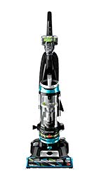
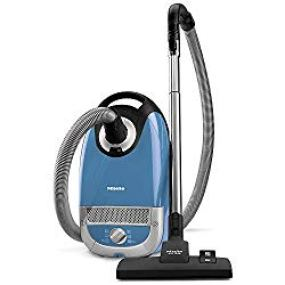
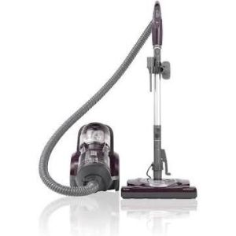
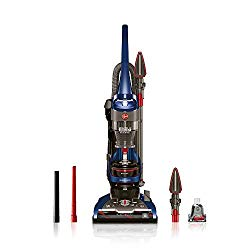
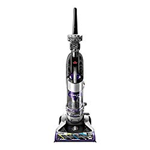
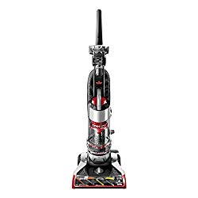

If you’re in the market for a vacuum with retractable cord, this review is for you. This guide includes 6 best vacuum with retractable cord. And, if you think about it, you really can’t go wrong with this kind of a vacuum cleaner.

Unlike vacuum cleaners with standard cords, a retractable cord vacuum is easy to store away after use. That’s because the cord can rewind back up with a simple push of a button or a click of a switch. And the benefit is? You don’t have to worry about tripping over cords, or accidentally getting them wrapped on other tools.

### **Best Vacuums With Retractable Cord**

| Picture | Name | Weight | Rating [/5] |
|---|---|---|---|
|  | Eureka NEU202 PowerSpeed Lightweight Upright Vacuum with Automatic Cord Rewind | 10 lbs | 4.3 |
|  | Hoover WindTunnel 2 Rewind Corded Bagless Upright Vacuum | 16 lbs | 4.3 |
|  | Kenmore Pet Friendly Lightweight Bagged Vacuum with Retractable Cord | 26 lbs | 3.7 |

## **The Best Vacuums with Retractable Cord**

Because of their convenience, especially when it comes to storage in a compartment filled with other cleaning supplies, vacuum cleaners with retractable cords are a good investment to consider.

## 1**. BISSELL Cleanview Swivel Rewind Pet Vacuum**

Bissell is one of the most popular vacuum cleaner brands in the market. And their CleanView 2252 is a product designed to give you the best value for your money over an extended period. Plus, it’s affordable, a good option for someone who’s on a tight budget. [**Click here to see today’s price on Amazon.**](https://www.amazon.com/gp/product/B07LGS8CX2/ref=as_li_tl?ie=UTF8&camp=1789&creative=9325&creativeASIN=B07LGS8CX2&linkCode=am2&tag=bestofvacuum2-20&linkId=d0bc8391b23945d06f3ae130671209bf)

### **Features**

-   This machine has the triple action brush roll that collects dirt from different floor types and carpets.
-   It has a scatter-free technology, which helps to collect dirt and debris on the go. And the Edge-to-Edge technology makes it easy for the vacuum to pick dirt from all surfaces.
-   With BISSELL CleanView 2252, cleaning surfaces above the floor is easy and straightforward. You just need to extend the reach and you’re good to go.
-   The washable filters help you achieve multi-level filtration of dirt and capture even the tiniest particles.

### Pros

-   BISSELL CleanView 2252 weighs just 18 pounds, so it should be easy to move around the house. Also, the swivel steering makes it easy for you to reach and clean under furniture with the least effort possible.
-   The device’s triple action brush roll is powerful enough to forcefully that it absorbs dust, pet hair and debris from surfaces.
-   The ergonomically designed handles make this vacuum cleaner easy to hold. And this is particularly helpful when vacuuming for long hours.
-   BISSELL CleanView 2252 is the best vacuum with retractable cord.

### Cons

-   While this vacuum’s cleaning power is promising, it tends to clog after a few months of use.
-   This device does make noise when in use, and the noise level can be somewhat disturbing when dirt sticks in the hose.
-   The process of emptying the dustbin is sometimes tiresome because you have to unscrew the compartment.
-   It’s also hard to replace the filters. In some cases, you may even have to seek technical assistance, which will cost you some money.
-   The swivel steering mechanism is delicate, and you might have to push the machine around in case the steering damages.

**See Also:**

-   [**How to Clean Pergo Floors Naturally**](https://www.bestofvacuum.com/how-to-clean-pergo-floors/)
-   [**Best vacuum and mop combo for vinyl floors**](https://www.bestofvacuum.com/best-vacuum-for-vinyl-floors/)
-   **[Best uv vacuum](https://www.bestofvacuum.com/best-uv-vacuum/).**

## **2\. Miele Complete C2 Hard Floor Canister Vacuum**

Miele Complete C2 is so lightweight that you can easily carry it around your room while cleaning. It’s durable and has high cleaning power with a reasonable sound level. We recommend this product because of its ability to thoroughly clean surfaces, including carpet floors, area rugs, bare floors, stairs, and even furniture, and because it can get dirt out of crevices and sharp corners. [**Click here to see today’s price on Amazon.**](https://www.amazon.com/gp/offer-listing/B07B3LR8JB/ref=as_li_tl?ie=UTF8&camp=1789&creative=9325&creativeASIN=B07B3LR8JB&linkCode=am2&tag=bestofvacuum2-20&linkId=c7cf927e69dccbe467cc233715fa8e74)

### **Features**

-   The built-in Super Air Clean Filter purifies the air that the vacuum releases to the room during cleaning.
-   The electronic control function allows you to know exactly when to empty the bag by giving you a signal.
-   Made of durable stainless steel, the unit’s adjustable telescopic wand lets you adjust the cleaner to reach surfaces above the ground. And the smooth metal glide surface prevents damages even on the softest surfaces.
-   In addition, [Miele Complete C2 vacuum](https://www.bestofvacuum.com/best-miele-vacuum/) has a Parquet Twister Floor Brush, which provides a 180-degree rotation of the agile while maintaining the soft touch on the surfaces.

### Pros

-   This vacuum cleaner has a Parquet Brush, which cleans different floors thoroughly and gently.
-   The stainless steel wand allows you to reach extra heights above the ground, including the ceilings.
-   The suction power can be set electronically using the 6-stage rotary selector.
-   The ergonomic handle makes the cleaning head easy to move around on different surfaces.
-   It has promising three-point maneuverability, locking system, and park system for vacuuming breaks.

### Cons

-   Miele Complete C2 is bulky and heavy.
-   It can be difficult to clean if dirt clogs in it.
-   While the many setting options add to the effectiveness of this vacuum, they can really confuse some users.

## **3\. Kenmore 22614 Pet Friendly Lightweight Vacuum**

Kenmore 22614 pet vacuum is a [multipurpose vacuum cleaner](https://www.bestofvacuum.com/best-multi-surface-vacuum/), a good option for cleaning laminate floors, **hardwood floors** as well as [high pile carpets](https://www.bestofvacuum.com/best-vacuum-for-shag-carpet/). The suction power is promising, able to pick up 99.9% of the debris in just a short time. [**Click here to see today’s price on Amazon.**](https://www.amazon.com/gp/product/B08QHFRS4N/ref=as_li_tl?ie=UTF8&camp=1789&creative=9325&creativeASIN=B08QHFRS4N&linkCode=am2&tag=bestofvacuum2-20&linkId=61d776e815793564fe3c76c442875466)

You can use Kenmore 22614 to clean pet hair, allergens, dust, and pet dander. It’s not just lightweight; it’s also compact enough to fit in a small space for storage.

### **Features**

-   This vacuum cleaner has a nine-foot attachment reach, it features true HEPA filters, and it includes a telescopic wand made of aluminum.
-   The power cord has a length of 16 feet, fitted with Dual Motors and 8 Cyclones and the suction power is good enough to clean dirt, dust, allergens and debris from any surface.
-   This vacuum cleaner is just 86 pounds and quite compact. That means it is lightweight and it takes up very little space for storage.
-   The device has the Pet Powermate function, which picks embedded hair and other forms of dirt. The reliable suction power prevents the tangling of hair on the brush.

### Pros

-   Kenmore 22614 has an ergonomic handle, which gives you a solid grip of the cleaning head.
-   The power cord is retractable.
-   Kenmore neatly fits all the accessories needed for the proper functioning of this vacuum cleaner. This saves on space and makes storage easier.
-   The canister is transparent, so you can easily monitor the level of dirt in. Plus, it’s easy to empty, clean, and put back in place.
-   The problem of clogging is almost non-existent in this vacuum provided you will empty the bin frequently as you can easily observe the level of dirt.

### Cons

-   The machine is relatively bigger and heavier than the other options on this list. As such, it can be somewhat challenging to move around, especially if you intend to vacuum for an extended period.
-   The replacement of damaged parts like the filters and the detachable handle is complicated, and you might be risking the damage of other parts if you are not well equipped with the skills.

**Also Read: [Can Bed Bugs Live in a Vacuum Cleaner?](https://www.bestofvacuum.com/can-bed-bugs-live-in-a-vacuum-cleaner/)**

## **4\. Hoover WindTunnel 2 Rewind Upright Vacuum**

Hover is a cleaning supplies specialty brand, a company known for designing some of the best vacuum cleaners in the world. The Wind Tunnel 2 Upright Vacuum is a model that features a retractable cord. And it’s cheaper than Miele Complete C2 canister vacuum. So if you’re on a budget, or you just prefer an inexpensive vacuum cleaner with a retractable cord, Hover Wind Tunnel 2 would definitely make the best option. [**Click here to see today’s price on Amazon.**](https://www.amazon.com/gp/product/B01MTFTTQ2/ref=as_li_tl?ie=UTF8&camp=1789&creative=9325&creativeASIN=B01MTFTTQ2&linkCode=am2&tag=bestofvacuum2-20&linkId=6122dcc7d30cb8c9c5c27c1dba35e6de)

### Features

-   Designed to offer maximum cleaning service, the Multi-Floor Brush Roll can get rid of dirt from different floors and all carpet types without scattering them.
-   The Extended Cleaning Reach allows you to clean the ceiling with ease. Of course, you’ll not use this feature often. But you’ll find it handy when you need to vacuum the ceiling. To be precise, you can extend the Wind Tunnel 2 up to 16 feet, so reaching out to the ceiling isn’t going to be a problem at all.
-   The 25-foot power cord can retract automatically to provide you with the ease of operation and storage.
-   The machine has the Pet Turbo Tool that cleans pet hair trapped on the surfaces of the floor and the crevice tool enables you to clean sharp corners and cracks with ease.

### Pros

-   The Multi-Cyclonic Technology maintains high power suction for a long time.
-   The power cord retracts automatically.
-   The unit’s extendable cleaning reach allow you to clean higher surfaces like ceiling with the least effort possible.
-   The machine has an odor absorption feature and the advanced technology of Pet Turbo to capture pet hair that could be stuck in crevices.

### Cons

-   One of the biggest drawbacks of Hover Wind Tunnel 2 is that its suction power tends to lower after a few months of use.
-   Another problem is that the hosepipe can clog easily, especially when the suction power starts to reduce. And this is something to expect, because less suction power means the inability to push dirt into the bin.
-   The machine sometimes produces irritating sound when the hosepipe gets clogged and fixing the problem can take a lot of your time.
-   The other challenge associated with this machine is the ineffective picking of pet hair in crevices, so you might have to use another object to pick them.

## **5.Bissell CleanView Rewind Bagless Vacuum With Retractable Cord**

Bissell CleanView Deluxe Rewind is a masterpiece of a kind. Designed to last for long, and priced under $200 without compromising features and performance, this makes a good choice for budget buyers looking for the best bagless vacuum with retractable cord. [**Click here to see today’s price on Amazon.**](https://www.amazon.com/gp/product/B07LGS8CX2/ref=as_li_tl?ie=UTF8&camp=1789&creative=9325&creativeASIN=B07LGS8CX2&linkCode=am2&tag=bestofvacuum2-20&linkId=d0bc8391b23945d06f3ae130671209bf)

One of the things we love about this vacuum cleaner is that it has sufficient suction power to absorb hair, dust, and allergens from different floor and carpet types.

### **Features**

-   Bissell CleanView Deluxe features an Edge-to-Edge cleaning technology and edge bristle. And they are quite handy when it comes to vacuuming the corners of different floors as well as under furniture. Add to this the edge bristles, and what you get for the price is a vacuum cleaner that can even clean sharp corners of your room and along the baseboards with ease.
-   The scatter free technology, in addition to sucking up dirt and debris, ensures that dust doesn’t spread out on your floors. And you can use this vacuum to get rid of pet hair because it has a Triple Action Brush Roll that helps get the job done.
-   This model’s cord retracts really well, and fast. A simple press of the retract button automatically rewinds the cord, locking it in a compact space, and makes the vacuum easy to store away when it’s not in use.
-   The triple action brush roll, which is compatible with different floor types, removes dirty from any floor with ease. In addition, the vacuum has a multi-level filtration mechanism, which traps allergens and dust.

### Pros

-   Bissell CleanView Deluxe doesn’t just vacuum floors; it also keeps a room free from dust and allergens that cause respiratory infections.
-   The power cord is 27 feet, long enough to vacuum a larger room without the need to unplug and plug it in a different power outlet.
-   The cord retracts nicely, and the whole unit is easy to store away when it’s not in use.
-   Bissell CleanView Deluxe doesn’t make a lot of noise during use. You can vacuum your house with the assurance the little noise it makes won’t disturb people in the room.

### Cons

-   The machine is quite functional for the most part, but it has a few challenges, including the clogging of the cord, which happens when the size of dirt particles gets big.
-   We wish it were easy to empty the canister. It’s not. You have to fit your hand inside the dustbin, loosen the nut that holds the canister in position, clean it, and then put it back in place. Quite tiring, but it’s a process you need to master if you wish to use this vacuum cleaner.
-   Bissell CleanView Deluxe is heavy, so it may not be an ideal choice for frequent movement. However, Bissell makes the vacuum easy to maneuver by ensuring that the retractable cord is long enough to allow you clean big room without actually lifting the vacuum cleaner.

## **6\. Bissell CleanView Vacuum With a Retractable Cord**

If you’re looking for the best vacuum cleaner with retractable cord, an option that won’t break the bank, a pick that has all the bells and whistles for effective cleaning, then you should try the Bissell CleanView Plus. Whether you’re on a budget and you can’t afford Miele Complete C2 or you just prefer an inexpensive vacuum cleaner to a high-end model, the CleanView Plus should cut it for you. [**Click here to see today’s price on Amazon.**](https://www.amazon.com/gp/product/B07LGS8CX2/ref=as_li_tl?ie=UTF8&camp=1789&creative=9325&creativeASIN=B07LGS8CX2&linkCode=am2&tag=bestofvacuum2-20&linkId=2817912cef17e614d393eb10c9bedc2c)

### **Features**

-   This unit has a triple action brush and the integration of scatter-free technology to remove dirt from several types of surfaces.
-   Its mess-free dustbin attached at the bottom makes emptying dirt easy and its multi-level filtration traps debris from several surfaces
-   Bissell CleanView Plus is easy to adjust up to five unique heights that you can even use it to clean as high as 32 feet above the floor.
-   The cord rewinds automatically, easily wrapping in without you moving a finger. The powerful, multi-cyclonic suction easily captures dirt into the dustbin.
-   Bissell CleanView Plus has a multi-level filtration system with washable filters that easily get rid of dust and allergens.

### Pros

-   Bissell CleanView Plus is easy to use, especially because it’s lightweight enough to move around the house.
-   Bissell CleanView Plus has Triple Action Brush Rolls to remove the dirt and the Scatter-Free technology reduces the mess around the house.
-   The multi-level filters are washable, and this makes the machine durable and cost-effective.
-   The 25 ft. power cord allows you to move around the room without necessarily moving the entire vacuum cleaner.

### Cons

-   The machine works well but the challenge comes when your room has loads of pet hair and debris. The hose of the machine can get clogged at the bottom when the dirt being sucked in is heavy. This is a limitation that makes this device somewhat difficult to use.
-   The other problem with Bissell CleanView Plus is on the automatic retraction of the cord. You might have to stretch the cord far from the machine to ease the retraction, and the device seems to be pulling just a few feet at a time. You might find this annoying but at least it saves you the hassle of wrapping up the cord manually.

## **Retractable Cord vs. Standard Cord**

**Retractable Cord**

To say that vacuum cleaners with retractable cords are better than those with standard cord would be misleading.

The term retractable cord simply refers to the ability to fold down the cord of a vacuum cleaner with the click of a switch or a push of a button. And the benefit is minimal effort to fold the cord and easy storage even in a small compartment.

Understand that a vacuum cleaner that has a standard cord work well, just like the options that have retractable cords. The only difference is that you have to fold the cord manually. This, if anything, can be quite tiresome, not impossible.

## **Frequently Asked Questions (FAQs)**

## **Does shark make a vacuum with a retractable cord?**

**Shark does not make vacuums with a retractable cord.**

## **Which upright vacuums have retractable cords?**

1**. Eureka NEU202 PowerSpeed Cord Rewind Vacuum.
2\. Hoover WindTunnel 2 Rewind Corded Bagless Upright Vacuum.
3\. BISSELL Cleanview Swivel Rewind Pet Vacuum.
4\. Bissell CleanView Vacuum With a Retractable Cord.**

## Which vacuum has a retractable cord?

**Here is a list of vacuums that have a retractable cord:**

**1\. Bissell CleanView Vacuum With a Retractable Cord.
2\. Miele Complete C2 Hard Floor Canister Vacuum.
3\. BISSELL Cleanview Swivel Rewind Pet Vacuum.
4\. Kenmore 22614 Pet Friendly Lightweight Vacuum.
5\. Hoover WindTunnel 2 Rewind Upright Vacuum.
6\. Bissell CleanView Rewind Bagless Vacuum With Retractable Cord**.