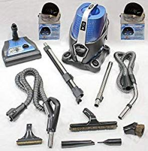
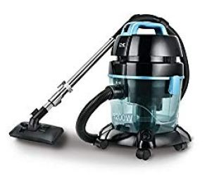
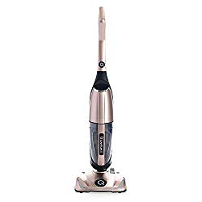
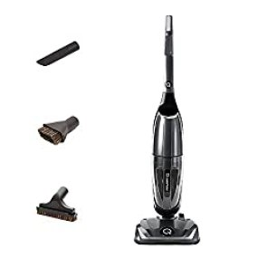
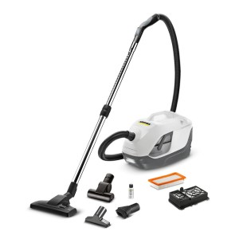
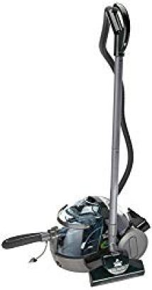
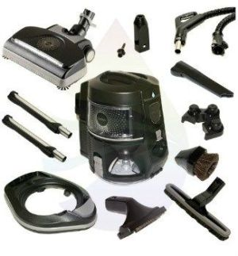
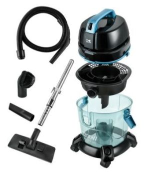
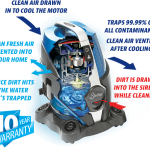

Water vacuums or water filtration vacuums are becoming quite popular. The great thing about these vacuums is they use water as a filter and they can filter more things and not lose suction.  Debris such as pet hair, [long human hair](https://www.bestofvacuum.com/best-vacuum-for-long-hair/) get sucked and trapped in the water instead of getting trapped in a filter. You’re basically water washing the air when you use the best water vacuum cleaner.

But, what is a water vacuum cleaner? How does it work? I will explain these questions in detail later in this article. For now, here is what you need to know:

A water filtration vacuum is just like other vacuum cleaners. It distinguishes itself from the rest because it **uses water as its basic cleansing agent**. A water-based vacuum cleaner has an in-built water tank, which is usually big enough to hold a lot of water. The tank acts as a pressure agent.

**You might also be interested in [best multi purpose steam cleaner](https://www.bestofvacuum.com/best-multi-purpose-steam-cleaner/).**

Dust particles, dirt, allergens, and other germs are extracted from various surfaces into the water tank, which later dissolves the dirt before it is removed into a separate collector tank. You will learn more on how a water filtration vacuum cleaner works later. For now, here is a comparison table of 3 best water vacuum cleaners.

### **Top Rated Water Filtration Vacuum Cleaners**

| Picture | Name | Filteration | Weight |
|---|---|---|---|
|  | Quantum X Upright Water Vacuum Cleaner | Water Only | 16.93 lbs |
|  | SIRENA Water Based 2 Speed Vacuum Cleaner | Water + HEPA | 29.17 lbs |
|  | Kalorik Water Filtration Canister Vacuum Cleaner | Water | 14 lbs |

## **7 Best Water Filtration Vacuum Cleaners**

This list contains some of the best water filtration vacuum cleaners that have been specifically hand-picked for you. As you go through each, see the unique features that will help you find the ideal water filtration vac.

## **1\. Sirena 2-speed  Water Vacuum Newest Model**

You will love this water-based vacuum cleaner because of its double speed, super quality, and the quantity of cleaning water it carries among other things. **[Click here to see today’s price on Amazon.](https://www.amazon.com/gp/product/B013U5TA5M/ref=as_li_tl?ie=UTF8&camp=1789&creative=9325&creativeASIN=B013U5TA5M&linkCode=am2&tag=bestofvacuum2-20&linkId=f68d69b4ea5f0abbb501e47975295b8e)** 

### **Features**

-   This type of water vacuum has a unique design that originates from Canada.
-   The cleaning appliance has a 1200W 2-speed Italian motor that is capable of giving your home a powerful and thorough cleaning.
-   Thanks to its two-tier speed, you are able to use the lower speed (water section), to filter the air in your house, clean any impurities, remove odors, and aromatize the air in the area.
-   Equipped with high-speed motor that is suitable for cleaning, vacuuming, and dusting all the interior and exterior parts of the home.

-   Sirena water filtration vacuum cleaner uses Separator Technology to ensure dirt water does not mix with clean water as you carry on with your job. The technology forces air into the dirty water tank thus keeping dirt away from the air.
-   Washable HEPA filter.
-   Utilizes clean water, which gently circulates inside the machine’s propellers to release scented air to all rooms in the house.
-   Designed with beautiful night light as well as producing nice and soothing ocean wave sound.

### **Pros**

-   Purifies the air in its surrounding.
-   Deodorizes the air.
-   Revitalizes air.
-   Washes the air.
-   Humidifies the air.
-   Sanitizes the surrounding air.
-   Releases soothing sound, the illus of ocean waves for a cool sleep.
-   No clogging of water as traditional vacuum cleaners.
-   Has a 10-year warranty.
-   Good for homes with allergies among its members.

### **Cons**

-   It is super heavy (61 pounds).
-   Difficult to change some units.
-   Some have complained about the hose breaking easily.

## **2\. Kalorik Water Filtration Vacuum**

You will fall in love with Kalorik Pure Air Vacuum because it is designed with cyclonic water filtration system. With this technology, you have nothing to worry about cleaning your floors, carpets, and purifying the air in the house. [**Click here to see latest price on Amazon.**](https://www.amazon.com/gp/offer-listing/B01M1NHQFV/ref=as_li_tl?ie=UTF8&camp=1789&creative=9325&creativeASIN=B01M1NHQFV&linkCode=am2&tag=bestofvacuum2-20&linkId=078261605a06ecd0cb5977f04caed93e) 

### **Features**

-   Since this water filter vac does not use bags, it uses water to efficiently filter dust that has been sucked within its filters. In the end, it uses the water to clean the dust inside its water chamber.
-   Comes with full indicator.
-   Has an auto-stop button, which means you do not have to constantly monitor this water vacuum cleaner.
-   Fitted with extra gasket.
-   Designed to be used on all types of floors.
-   On-board accessory storage chamber.

### **Pros**

-   Does not emit noise. You can use it in the same room while asleep.
-   The auto switch ensures you can be cleaning the house as you attend to other chores since it will shut down as prompted.
-   Water/dust full indicator will tell you when it is time to take the needed action.
-   It is lightweight.
-   The feature of trapping in dirt and releasing fresh air is a healthy thing.

### **Cons**

-   Brushes are not motorized, making carpet cleaning hectic.
-   The air may flow out of the hose if not properly fitted.

## **3\. Quantum X Upright Water Vacuum Cleaner**

Are you tired of changing filters every time you want to use your vacuum cleaner? This is now history. The new Quantum X Upright Vacuum Cleaner with a telescopic body is all you need. The item prides itself as the **best water vacuum cleaner** because it doesn’t use any removable filters except water. [**Click here to see today’s price on Amazon.**](https://www.amazon.com/gp/product/B07CPBZFM1/ref=as_li_tl?ie=UTF8&camp=1789&creative=9325&creativeASIN=B07CPBZFM1&linkCode=am2&tag=bestofvacuum2-20&linkId=46e87fac48ba21cdf157d18f5161a1dd)

### **Features**

-   This vacuum machine does not lose its suction strength. Because it doesn’t require any filters to operate, you will not be worried about clogging.
-   Thanks to its upright and telescopic body, you can clean any part of the house.
-   The vacuum can clean any surface. Some of the surfaces this machine can help you clean include tiled floors, terrazzo, hardwood, laminated, and walls. It also does a tremendous job on carpets, rugs, and all types of upholstery.
-   Apart from cleaning hard surfaces and rugs, you can use the machine to dry up spills as well as pick debris, pet dander and any dirty from the floor or on carpets.

### **Pros**

-   Saves you money.
-   Does not lose suction.
-   No clogging.
-   Reaches every corner of the house.
-   Nice color.
-   Excellent design.

### **Cons**

-   A bit noisy.
-   It is heavy.

## **4\. Quantum Water Filtration Vacuum/Air Purifier with Micro Silver Technology**

This blue best water based vacuum cleaner never loses its suction power no matter the amount of work. The secret is to use it as it should. [**Click here to see today’s price on Amazon.**](https://www.amazon.com/gp/product/B08LXMVY3V/ref=as_li_tl?ie=UTF8&camp=1789&creative=9325&creativeASIN=B08LXMVY3V&linkCode=am2&tag=bestofvacuum2-20&linkId=9cb6eb2f03a82c313123a3b91edc3ae3) 

### **Features**

-   Quantum vac reviews reveal that this particular type of water vacuum comes with advanced water filtration mechanism. With this ability, the vacuum does not experience clogs, as is the case with traditional vacuums. Besides, there is no such thing as lose of suction power or shaky airflow. **Click here to see latest price on Amazon.** 
-   Fitted with stand-alone purifier, which has the ability to quickly remove germs, dust, and various allergens.
-   The Micro Silver Technology is responsible for reducing the amount of particles, which are responsible for reducing germs. Interestingly, with the Micro Silver Technology, you do not need any maintenance.
-   Detachable cord in case you need to move about.

### **Pros**

-   This water filter vac can easily pick up wet/dry spills from the floor, carpet, or any other surface.
-   No clogs.
-   Lightweight (12 lbs).
-   Kills germs, eliminates allergens, and removes dust.
-   Doesn’t lose suction power.
-   Requires minimal maintenance.
-   Doesn’t rust thanks to a stainless steel wand.
-   Has a durable rubber hose.

### **Cons**

-   Hard to disconnect its attachments.
-   The long hose is cumbersome for other users.

## **5\. Karcher water filter vacuum cleaner**

This vacuum cleaner manufactured by Karcher is one of the premium water filtration vacuum cleaners in the market with a sleek design. **Click here to see latest price on Amazon.** 

### **Features**

-   Innovative water filter technology.
-   Comes with washable filters that ensure durability if properly handled.
-   HEPA filter, responsible for trapping allergy-causing pollen, mite excretions, bacteria, and fungal spores.
-   Coated with stainless steel lining to ensure the product does not incur any rusting while it keeps wet.
-   Soft handle that does not injure your hand.
-   Crevice tool and dry nozzle.

### **Pros**

-   Easy to set up.
-   Extremely easy to handle and use.
-   No challenges when cleaning it.
-   Tremendous suction power.

### **Cons**

-   Expensive.

## **6\. BISSELL Big Green Complete Home Cleaning System**

You have many reasons to love BISSELL 7700 Big Green water vacuum. One major reason is that this product by BISSELL big green comes with a 3-stage water filtration technology that enables you to clean carpets, and all types of floors. **Click here to see latest price on Amazon.** 

### **Features**

-   Comes with a bagless technology.
-   Push-button controls for easy setup and use.
-   Sizeable water tank with an in-built water heater in case you need to clean your hard floor using hot water.
-   Microban antimicrobial protection.
-   8-ft hose to reach every point of the house.
-   Two hard floor pads that you can wash and replace.
-   Several on-board tools for additional use.

### **Pros**

-   Ability to clean all types of surfaces, including carpets.
-   Long enough hose to reach a larger area.
-   With a 3-stage filtration stage, this best water vacuum cleaner will leave your house smelling nice.
-   Suitable for homes whose members suffer from various allergies.
-   Big water tank.
-   It is less expensive compared to other products that offer the same services.

### **Cons**

-   It is heavy at 35 lbs.
-   Not very strong suction power.
-   Sprayer is relatively weak.

## **7\. Rainbow E2 Water Vacuum**

Rainbow, the manufacturer of Rainbow E2 Water based vacuum cleaner are leaving nothing at chance. This time, they are giving you vacuum cleaner that uses water with double speed hose power (high- 1.542, and low- .067). [**Click here to see latest price on Amazon.**](https://www.amazon.com/gp/product/B005R4AB1W/ref=as_li_tl?ie=UTF8&camp=1789&creative=9325&creativeASIN=B005R4AB1W&linkCode=am2&tag=bestofvacuum2-20&linkId=23a17a3dba2cc56b973d051be4c191ec) 

### **Features**

-   This water vacuum comes with 23,000 high-speed in its RPM and 3,000 being the lowest.
-   Designed with 1,150W when the appliance is running at its highest speed and 50W at its lowest.
-   Comes with LED lights.
-   The vacuum cleaner has the ability to move and clean up to 80 cubic feet air per minute.
-   Rainbow E2 Vacuum Water filter vac’s hose has an in-built sealed inlet that safeguards the hose against any damage.
-   Comes with several attachments that include upholstery tool, power nozzle, dusting brush, electric hose, wands, attachment caddy, coil cleaner, inflator tool; crevice tool, wall and floor brushes.

### **Pros**

-   Very easy to use.
-   Extremely high results.
-   LED lights show you where to clean in case it is dark.
-   Strong suction power.
-   The two-speed regulation allows you to monitor your cleaning better

### **Cons**

-   Very expensive.
-   Spare parts are expensive too in the event that something is faulty.

### **What Are The Key Advantages Of A Water Based Vacuum?**

Now, let’s know why you seriously need a water-based vacuum cleaner. It is after knowing the advantages of water vacuums that you will be in a position to choose the best water vacuum cleaner. Here are 6 advantages of using vacuum cleaners that use water:

### **1\. Great For Pet Hair**

What is the use of a vacuum cleaner is it doesn’t help clean pet hair and dander from the house? One of the biggest advantages of a water filter vac is that it is superior in eliminating pet hair.

No matter how much your pet sheds hair, water vacuums are powerful enough to collect even the lightest pet hair. Their suction powers are far much beyond any other types of vacuums.

Perhaps you are wondering why and how perfect water based vacuum collects pet hair. Remember that pet hair is trapped in water thus, there is no room for escape. Once the pet hair absorbs water, it becomes heavy thus cannot be tossed away by air.

### **2\. No More Clogged Filters**

Remember that vacuums that use air filters are prone to clogging. When these machines are at work, they draw pet dander, hair, and any other dirt including dust to the filter. As the amount of dirt increases in the filter, chances of this compartment clogging are extremely high.

A vacuum cleaner with water filtration system uses a different approach. By using water to trap all forms of dirt, which in turn is washed away, water filtration vacuums easily end the clogging menace.

The result is what should be of interest to you. Instead of wasting time to regularly clean, repair, and purchase new filters, invest in the best water vacuum cleaner.

### **3\. Great For Home With Allergies**

If your household is struggling with allergies, the antidote is looking at water filter vacuum brands. The best way to know if this is the right choice is to think of how other types of vacuums work.

Vacuums that use alternative means to trap dirt and dust always leave a loophole for certain amounts of dust to escape. It is not the case with vacuums that use water. These cleaning appliances suck all the available dust to their water reservoirs with no room for escape. This way, they seal any chances of allergies spreading.

### **4\. Purify The Air**

All water filtration vacuum cleaners in the market today have an extended feature that make them stand out: they purify the air. Yes, I know this may sound alien to you if you have never used a water based vacuum but, it is time to try it yourself.

I know of many people who have opted to buy a water-based vacuum cleaner and do not see the need to spend extra money to purchase an air purifier. What an ingenious way to save money to other use!

### **5\. More Flexibility When Cleaning**

It is noteworthy to mention that it is easy to move around with a water-based vacuum cleaner than alternative vacuum cleaners. One reason why this is possible is that you do not have the hassle of pushing or pulling the cleaner with a dust cup or a filter bag.

Moving around the house becomes pleasantly easy when you know that you do not have to stop along the way to empty a filled dust tank or a filter bag.

### **6\. Great For Spills**

Each day presents itself differently. Today, you may wake up well, prepare and leave for work and come back without spilling anything on the carpet. However, no matter how careful you may be, there will be a spillage of some kind on the floor. Tea, coffee, yogurt, or even milk can slip from your hand and fill the entire floor. The situation is even worse if you have kids or pets in the house.

A vacuum cleaner that uses water is best in everyday spills. This machine has been designed with special suction power that easily and quickly sucks and dries up liquids from any surface.

After hauling many praises to vacuum cleaners with water filtration system, you may wonder; does it mean that water-based vacuum cleaners do not have limitations? Hardly!

### **What Are Some Of The Downsides Of Water Based Vacuum Cleaners?**

Virtually, there is no single thing on Earth that is all known to be ‘smooth sail’. Although some things may possess many advantages over disadvantages, it doesn’t mean we overlook the lesser tier. Here are some of the notable downsides of using water filtration vacuum cleaners:

### **1\. Heavy To Carry**

You should not be surprised when I say that however best your choice is, water filtration vacuum cleaners are heavy. These home cleaning appliances require heavy compartments to hold several liters of water. Because of the water, which is key in these vacuum cleaners, it becomes inevitably heavy to pull or push vacuum cleaners that use water.

Trust me; it is difficult to carry some water filter vacs upstairs.

### **2\. Unusually Big**

A big vacuum cleaner may not be a problem to some people. However, water based vacuum reviews reveal that almost all the machines in the market are unusually big. Yes, they are bigger than traditional vacuum cleaners.

With their size, it requires that you have a large room where you can store the machine. Finding enough space where you can store large home cleaning appliances and other machines for home use is a daunting challenge to many people today.

### **3\. Expensive**

Water filter vacuum cleaners are good at their job. But, it is also important to note that most of these appliances in the market are expensive compared to traditional vacuum cleaners. It is true that high-end appliances do not come easy, but it will be difficult to get the best water vacuum cleaner if you are on budget.

#### **Conclusion**

Having a clean home is not an easy thing. You must do your research to find the best water vacuum cleaner. Thankfully, this article has helped you find a water vacuum cleaner that meets your desired needs. As you enjoy your cleaning, ensure that you do not leave any spills behind.

## **Frequently Asked Questions**

## **What Is A Water Vacuum Cleaner?**

A water vacuum cleaner uses water as its main filter. By using water, this home cleaning appliance filters things such as dust, germs, and allergens faster than traditional vacuum cleaners. The best water vacuum cleaner hardly loses its suction power.

## **How Do Water Vacuums Work?**

Typically, water vacuums utilize incoming dusty air that enters the water tank. Inside the water tank, the dusty air mixes with a solution that has been put already. A powerful motor then rotates the solution, which in turn separates the dust and any other dirt from the water that is used to clean it.
While there is a complex mechanism that takes place inside a water-based vacuum, the appliance allows for two things to happen.
A water filter vacuum cleaner provides room for oxygen, nitrogen, carbon dioxide, and argon to pass through. After this, dirty particles and dust that by now has bonded with water get trapped inside the chamber thus are dripped back to the basin.
Open the basin to empty the dirty water, which by now contains the dust particles, germs, allergens and any other dirt that has been removed from the house.
To continue cleaning other sections of the house, pour clean water into the vacuum’s tank and carry on.