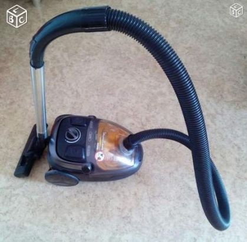

Vacuum cleaning a house is a non-chemical method for controlling bugs that have already infested parts of your home. With *the right vacuum cleaner,* you can easily get rid of these insects especially if they’re still together in clamps.

But *is vacuum cleaning* an option to kill bugs? Or do these bloodsucking animals continue to live in the vacuum cleaner once you clean or suck them up from hiding?

Continue reading to learn more.

## **Can Bed Bugs Live in a Vacuum Cleaner?** 

**A vacuum cleaner isn’t going to kill bugs right off the bat unless you combine the method with insecticide treatment. Bed bugs can live in the vacuum cleaner for** [up to 6 months](https://www.mdpi.com/2075-4450/2/2/232) **without food and water. During this time, the bugs will try to find their way out of the machine by looking for exit point, mostly because the vacuum machine isn’t a conducive environment for them to hunt for their blood meal.**

Your vacuum cleaner may kill a bug or two if they go into the vacuuming mechanism. However, that’s only possible in the event of large bug infestation, which, quite too often, is a very rare case.

## Can Bugs Crawl Out of the Vacuum Cleaner?

Technically, bugs can’t easily crawl out of a vacuum cleaner, but it doesn’t mean they won’t try to. If they can easily crawl up the legs of a bed or sofa, trying to find an exit point to climb out of the vacuum cleaner may not be a problem for them as such.

What makes it hard for them to find an exit point is that the *vacuuming machine* doesn’t have the light that they need to see. Not to mention that the smell in the dust cup or vacuum bag can be quite confusing for them.

The odor in the vacuum cleaner isn’t something the bugs like. These creatures love warmth and dark spot, and that’s the means by which they can hunt for their blood meal.

And even if there were light in the vacuum cleaner, the bugs wouldn’t be able to make their way out because obviously the dust cup or vacuum bag is sealed.

Still, it’s not difficult to find live bugs in the vacuum when you open the debris bag. That’s so especially if you use the device and you tend to open the vacuum bag or dust cup a lot more often.

The live bugs will try to crawl out of the vacuum cleaner to start searching for their blood meal. That’s why it’s always important to make sure you empty the bag after vacuuming the bugs so that you get rid of them completely.

## Where Do the Bugs in the Vacuum Come from Exactly?

Bugs don’t just live anywhere in a house. They have the spots they love the most, usually where they can lay eggs and replicate fast.

Bugs love fabrics and, therefore, they’ll most likely infest and hide in your carpet. That explains why it’s somewhat common to see them in the dust cup of [*vacuums for carpet floors*](https://www.bestofvacuum.com/best-vacuum-for-shag-carpet/)*.*

However, it’s important to understand that bugs aren’t exactly fond of hiding under the carpet because that’s mostly an open space. So while they may *camp* your shag carpet, you’re highly unlikely to find them in large numbers.

Bugs tend to hide in enclosed, narrow, and tight spaces. If the space doesn’t have too much exposure to light, then it’s even better. In other words, bugs are quite common in dark, hidden areas where light can’t reach. That explains why they live under mattresses, in dark colored bedding, and inside furniture.

## Can I Still Vacuum Bugs?

Yes, you should still vacuum bed bugs from tight, enclosed spots as soon as possible. They’re part of the dirt after all, and there’s no point in letting them lie around aimlessly. The best part is that vacuuming is a good way to get the bugs out of their hiding places fast. So while it won’t kill the bugs on the spot, it will make cleaning them easy.

Below are the steps you should follow to vacuum bugs out of their hiding:

-   First, identify the spots where the bugs are hiding.
-   Seal off the area so that the bugs have no way to escape.
-   Use a vacuum cleaner to suck up the bugs.

You can get *any of* [*these corded stick vacuums*](https://www.bestofvacuum.com/best-corded-stick-vacuum/)*,* as they’re often very easy to operate and you can use them while standing up straight.

You can use a [*bagged* vacuum](https://www.bestofvacuum.com/best-bagged-vacuum/), too. However, keep in mind that they tend to be somewhat time consuming to empty and cleanup. The advantage is that they are quite effective in getting rid of the bugs from their hiding spots.

You can even go for [an inexpensive vacuum cleaner](https://www.bestofvacuum.com/best-vacuum-under-100/) if you’re on a tight budget. While they won’t cost you a lot of money, such a cheap vacuum cleaner still has unique features that will give you the best results.

The last step to vacuuming bugs from their hiding spots is to dispose them well. All you have to do is to go outside and empty the vacuum bag or the dust cup in an open trashcan or container.

You should not remove the bag or dust cup from the vacuum when it’s in the house. That because these bloody suckers can escape and re-infest your home. And if they do, you’ll have another round of cleaning, and that can be quite time-consuming.

But protecting your home from re-infestation isn’t the only reason why you should dispose the bugs outside. Doing so exposes them to light, which they happen to hate. Again, the outdoor temperatures aren’t bugs friendly and exposure to harsh sunlight tends to kill them instantly.

Another thing to keep in mind is that bugs aren’t comfortable walking around. Mostly, they had rather stay still in dark spots where they can easily smell and trace their host for their next blood meal. As such, exposing them to a lot of sunlight will help to control them.