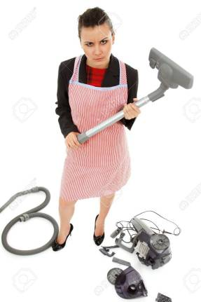

Everything you’ve ever bought with your own money or received as a gift has an expiry date, and a **vacuum cleaner** isn’t an exception. When the time to itch for replacement comes, you’ll have to ditch the old vacuum in favor for a new one.

But even before you go as far as to evaluate the options that you currently have, it’s important to dispose the old thing before spending cash on a new model.

The question is:

How exactly do you go about disposing an old vacuum cleaner?

Can you just throw it away and forget about it? Or is there a better way to recycle an old vacuum cleaner without breaking local garbage disposal law or *looking and feeling silly?*

## **Can I Recycle a Vacuum Cleaner?**

**Yes, you can give your vacuum cleaner to recycling centers as a mean to dispose it correctly. This isn’t just a *green* thing to do. It’s also a good way to earn some few bucks that you can add on top of what you have to get a new vacuum cleaner. Again, proper recycling is a good way to keep the environment around you. And even if you don’t know your local laws on trash disposal, throwing appliance in the trash might be illegal.  So why risk getting in the wrong hands with the law?**

Sometimes, you’ve just used the vacuum cleaner, you feel as if it’s old, and you’ve had enough of it. I’m assuming it’s still in a good condition. If that’s the case, propose a sale to a friend or donate it to charity. If some parts are broken, check if you can fix them and at how much. And if it’s broken, and you don’t want to keep it, drop it at a recycling center for some cash.

## **What’s the Right Way to Recycle a Vacuum Cleaner?**

Recycling a vacuum cleaner is a far much alternative to throwing it away into a trash. And it’s even an easier thing to do because there are several options to consider.

So if you are ready to keep the environment around you clean, here are options to dispose of an old vacuum cleaner correctly.

### **Drop the Old Vacuum Cleaner to a Scrape Yard Nearby**

[Scrape yards](https://www.singletonscrapmetal.co.uk/news/how-recycling-scrap-metal-benefits-the-environment/) may not be all over the place. But it’s highly likely you’ll find them in the urban and suburban areas.

These businesses are the best place to dispose a vacuum cleaner, especially because they’re always willing to pay a little something in exchange for some parts of an old vacuum cleaner.

Keep in mind that scrape yards are only interested in metallic parts of devices. That means you’ll have to find a way to dispose other components.

Before you take your old vacuum cleaner to a scrape yard nearby, take the device apart piece by piece and put the metallic components together. This isn’t a difficult thing to do even for a non-technical person, so it shouldn’t take you more than an hour or two.

Do keep in mind that scrape yards pay per pounds of metal.

The amount you get isn’t going to be anything big. But it still will be significant. You can add the money on top of what you already have and get a new [vacuum cleaner for as low as under $100](https://www.bestofvacuum.com/best-vacuum-under-100/).

### **Recycling Centers**

The world wants to go green to save the environment. So it makes a lot of sense why [recycling](https://lbre.stanford.edu/pssistanford-recycling/frequently-asked-questions/frequently-asked-questions-benefits-recycling) have become such a big deal these days.

So when it comes to disposing off a vacuum cleaner, you need to do it in a way that keeps the environment around you clean and safe for everyone. That’s why it’s important to take the device to recycling centers.

Unlike scrape yards, [recycling centers](https://www.thegoodtrade.com/features/how-recycling-centers-work) accept different items and parts, so your chances of disposing off many parts of the old vacuum cleaner are high.

Again, many parts of a vacuum cleaner, from plastic parts and cords to hoses and body housing, are easy to recuperate. And that’s why it makes a lot of sense to drop the machine to a nearby recycling center if you no longer find it useful.

Because every recycling center works differently, it’s important to find out what they can or can’t receive. You don’t want to waste your time going to the center only to find out that they can’t accept a vacuum cleaner.

### **Selling Vacuum Parts**

Just because a vacuum cleaner stopped working doesn’t mean all the parts have become useless. For example, you can remove brushes, hoses, and nozzles and sell them to shops that buy vacuum parts.

You aren’t going to earn much from selling the parts. But every dollar you earn can make a big difference, especially if you’re saving up to get yourself another vacuum cleaner on a budget.

## **Can I Repair an Old Vacuum Cleaner Instead?**

You can, and especially if it’s something you can fix fast. In my opinion, figuring out the problem with your vacuum cleaner and determining if you can give it a quick fix is the first best way to boost its shelf life.

If the belt, which enables the device to pick up dirt, isn’t working properly, there’s a high chance it has worn out. Visit a nearby hardware store, or where you purchased the vacuum, and get a replacement for the belt.

If the vacuum cleaner doesn’t work properly even after replacing the best, take it to a repair shop. Since they’re a big investment, which cost more money than brooms and steam mops, fixing them can make a big difference.

Getting the machine fixed is a great way to not only go green while saving money but also to increase the duration at which you use the same vacuum cleaner before you can’t avoid the urge to get a new model from a local store or at an online brand such as Walmart or Amazon.

## Can I Give an Old Vacuum Cleaner to Someone Else?

Just because it’s old to you doesn’t mean it’s a similar case to another person. If the device is still working fine but you don’t want to have it around, simply give it to a friend or donate it to charity.