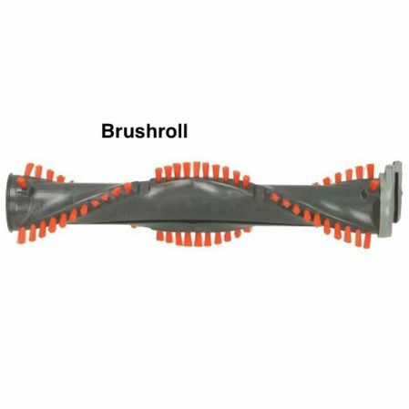
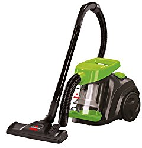

Vacuum cleaning is arguably the most effective way to keep your home spotless, as it sucks debris and dirt that a mopper wouldn’t eliminate. Vacuum cleaners feature essential components that are vital, such as a brush roll, but can you use a vacuum without a roller brush?

**Yes, you can use a vacuum without a roller brush to clean delicate surfaces like vinyl or laminate. However, a vacuum with a brush roll is excellent when cleaning carpets as it helps to loosen debris and dirt from a carpet. Therefore, consider a vacuum cleaner with the option of on/off brushroll**.

Modern upright vacuum cleaners have a lever or button to switch the roller brush on/off. However, you may not find this feature in cheaper vacuum cleaners.

## **What Is A Vacuum Brush Roll?**

A vacuum brush roller is part of a vacuum cleaner, featuring a roller, belt, and occasionally a tiny vacuum head monitor. It has bristles rows or beater bars that help clean carpets and some floor varieties, depending on the model of your vacuum.

It is typically placed underneath the vacuum cleaner, with a small portion found in the attachment tool.

However, remember that you will need to replace it after the bristles suffer wear and tear. You will have to replace your brush roll more frequently if you vacuum every day.

However, you can extend your brush roll’s lifespan by performing monthly maintenance. Moreover, inspect it regularly to see the condition of the bristles.

**Also read: [Best vacuum for long hair](https://www.bestofvacuum.com/best-vacuum-for-long-hair/)**

## **What Does Vacuum Roller Brush Do?**

A roller brush loosens debris and dirt from your carpet’s fibers or a hard surface. The cleaning tool is the roller part of a vacuum roller brush that has brush bristles.

The roller brush’s cylindrical shape is harnessed on no less than one rubber belt’s end, and the bell is responsible for pulling and pushing the brush, thus making it spin.

On the other hand, the belt’s other end joins another roller driven by a motor responsible for making the brush rotate or the wheels’ motion from pushing the vacuum.

Cleaning your carpet would be a near-impossible task without a roller brush. This is because it agitates the carpet’s shallower parts letting dirt and debris trapped by the carpet’s fibers come out easily.

Moreover, the bristles in the roller brush provide a direct path to give way for dirt to travel to the surface of the carpet by disturbing the carpet fibers. Therefore, a roller brush is a must-have if you want to have a clean carpet free of debris at all times.

## **Can You Use A Vacuum Without A Roller Brush?**

**Yes, you can use a vacuum cleaner without a roller brush, depending on the surface you wish to clean. For instance, it is vital to switch on the roller brush if you want to vacuum a carpet as it will ensure all the debris, dirt, and other particles come off, leaving the carpet spotless.**

On the other hand, a vacuum roller brush isn’t suitable for vacuuming bare surfaces like vinyl, wood, and tile floors because it will leave scratch marks. Therefore, you can adjust the brush roller’s settings to the highest or turn it off entirely to protect your floor.

Switching off the roller brush when vacuuming a hard floor also helps prevent your vacuum cleaner from flinging debris and dirt. Turning off the roller brush is vital when sucking up large things such as kitty litter.

An upright vacuum cleaner with an on and off switch feature for the roller brush is valuable for individuals with hardwood and carpeted floors. Having these options at your disposal allows you to appropriately choose whether to vacuum with or without a roller brush.

## Best Vacuum Without Brush Roll

Today’s vacuum cleaners are designed with various features, including the on/off roller brush, and come cordless, bagless, or otherwise. Ultimately, your choice will depend on your preference and the surface you will vacuum.

While the market offers many vacuum cleaner options, consider the following if you want a vacuum with an on/off brush roll.

## **1\. Miele Compact C1 Pure Suction Powerline Canister Vacuum**

This is a [lightweight bagged vacuum cleaner](https://www.bestofvacuum.com/best-bagged-vacuum/) with a combination floorhead ideal for vacuuming a low-pile carpet and hard floors. It is designed to provide a high suction power and comes in lotus white, tech blue, obsidian black, and graphite grey. [**Click here to see today’s price on Amazon.**](https://www.amazon.com/gp/product/B06XHPLYZL/ref=as_li_tl?ie=UTF8&camp=1789&creative=9325&creativeASIN=B06XHPLYZL&linkCode=am2&tag=bestofvacuum2-20&linkId=3fa9010f548144a45211493572ef2666)

Miele Compact C1 vacuum is versatile, allowing you to switch between six different settings for suction power depending on the floor you are cleaning. It could be flooring or upholstery.

In addition, this vacuum provides maximum filtration thanks to AirClean Sealed System from Miele that has 3-tiered filtration prevents dirt and dust from escaping.

The manufacturer offers a 7-year warranty for the casing and motor and a year for labor and parts.

## **2\. Shark NV356E S2 Navigator Lift-Away Professional Upright Vacuum**

Tackle embedded debris and dirt on your thick carpet or gently clean your bare flooring with this 2-in-1 vacuum with an on/off brush roll. It delivers powerful suction and lift-away capability to help you clean the stairs. [**Click here to see today’s price on Amazon.**](https://www.amazon.com/gp/product/B005KMDV9A/ref=as_li_tl?ie=UTF8&camp=1789&creative=9325&creativeASIN=B005KMDV9A&linkCode=am2&tag=bestofvacuum2-20&linkId=30e34dfd6575bbee350c98eac70bfe25)

This vacuum has a detachable pod which makes it portable and lightweight. Moreover, it features a HEPA filter and a full seal technology for allergens, capable of trapping 99% of allergens and dust in the vacuum.

## 3\. BISSELL Zing Lightweight, Bagless Canister Vacuum

BISSELL Zing vacuum cleaner weighs below 8 pounds and has a 9 amps power rating. It facilitates multi-surface cleaning, switching from hard floors to carpets by easily flipping a switch. [**Click here to see today’s price on Amazon.**](https://www.amazon.com/gp/product/B075PL2GDD/ref=as_li_tl?ie=UTF8&camp=1789&creative=9325&creativeASIN=B075PL2GDD&linkCode=am2&tag=bestofvacuum2-20&linkId=8914d1cfd58e14708e1122060daa31f6) 

It also has a detachable, easy empty dirt cup for a fast, mess-free emptying and swivel steering that makes maneuvering between rooms and furniture effortless. In addition, cyclonic technology in this vacuum provides continuous, powerful suction across hard floors and carpets.

#### **Conclusion**

By alternating between vacuuming with and without a roller brush, you will ensure every surface in your house stays clean without damaging your floors. Moreover, being able to switch between carpets and hard floors with your on/off brush roll, you can use one vacuum cleaner for the whole home.