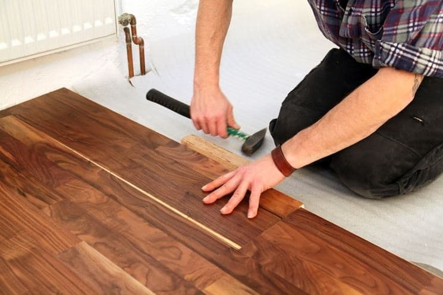

Homeowners love to praise Pergo floors because they’re compact and harder than hardwood. And given that it’s an option that doesn’t demand a difficult installation process, this flooring option is more than likely to grow into popularity as new homes continue to come up. To the eyes, [Pergo floors](https://www.amazon.com/Pergo-Laminate-Flooring/s?k=Pergo+Laminate+Flooring&linkCode=ll2&tag=bestofvacuum2-20&linkId=7585473a848cf873c825f0564bba2be6&language=en_US&ref_=as_li_ss_tl) look beautiful and inviting. Its strength not only makes it robust against damages. Also, its top layer of laminate, with an image of tile flooring, makes it easily resistant to dirt.

But just because Pergo flooring is dirt resistance doesn’t mean you shouldn’t clean it. As with any other kind of flooring, you need to invest your time to cleaning Pergo, so that it’s not only looking it best but also more inviting for you and other people in the room.

In this guide, you’ll learn how to clean Pergo floors in different ways. We’ll also highlight some handy maintenance tips that you can use to keep Pergo floors in their very best conditions all the time.

## **Guide to Clean Pergo Floors**

## **1\. Cleaning Spots and Stains from Pergo Floors**

As much as Pergo floors can stand up to dirt and damages, it doesn’t mean they’re foolproof against spots and stains. Fluids such as grease, juice, and wine can spill on this flooring by accident, leaving spots and stains that make the area look and feel out of place. Fortunately, these spots and stains shouldn’t be difficult to remove. And how long it takes to complete the cleaning will depend on how big the area covered is.

### **Cleaning liquid spills**

Liquid stains shouldn’t be difficult to clean from this type of floor, and usually doesn’t need expensive cleaning supplies.

The first item you need to clean liquid spills from Pergo floors is a non-abrasive cleaner. Good examples include ammonia and vinegar. Mixed with water in the right proportion, these cleaners can not only clean all the liquid stains from the floor, but also ensure the floor stays instant.

To remove liquid stains from Pergo floor using water combined with vinegar or ammonia:

-   Heat water in a bowl until it’s lukewarm and then add either ammonia or vinegar to make a non-abrasive cleaning solution.
-   Pour the mixture into a small spray bottle and apply it to the areas of the floor that have the liquid stains.

By applying this solution, you’ll easily loosen up the liquid stains on the Pergo floor, which should be easy to clean off with a soft, damp dust mop.

**Also Read: [Best Vacuum Cleaners Under $150](https://www.bestofvacuum.com/best-vacuum-under-150/)**

### **Cleaning tough stains**

Tough stains can be hard to remove from Pergo floor, especially if the dirt has been lying around for quite some time. In such a case, a non-abrasive cleaner may not be nearly as helpful. You’ll need propanone to get the job done.

Also known as acetone, propanone is an organic compound well known for its power to remove tough stains from different surfaces, and it’s particularly common in nail polish removers.

Because of its effectiveness, propanone can clean stains from shoe polish, cigarette burns, markers, and lipsticks, to mention just a few. So if you have such stains stuck on your Pergo floor, acetone should help you remove them.

And the compound is very easy to use. All you have to do is to apply a small amount of acetone to the stain and then wipe the area with a piece of cloth.

## **2\. Cleaning Pergo Floors Regularly**

The assumption that Pergo floors can stand up to dirt is true. But that doesn’t exactly mean you can ignore it and expect it to be as clean all the time. Like other floor types, Pergo will attract dust from time to time. If the dirt accumulates, the floor is going to get messy and eventually look ugly. But you don’t want your floor dirty and therefore regular cleaning can help keep it in good condition all the time.

There are different approaches that you can use to clean the floor regularly. The method you choose depends on your preference.

You should:

### **Use a Vacuum Cleaner to Suck Up Dirt and Debris**

Sweeping dirt and debris from Pergo floor isn’t as easy, especially when there’s too much to clean with one pass.

If you think about it, dirt like pet hair and dander will go flying back and forth on the floor and therefore they can be hard to eliminate. Again, debris like small food particles on the floor can be too stubborn to sweet away by a broom.

This is where [a vacuum that can clean laminate floors](https://www.bestofvacuum.com/best-vacuum-for-laminate-floors/) comes in. Designed to give your Pergo floor a clean look and feel in the shortest time possible, a vacuum is the perfect gizmo to use when you want a cleaning task to be quick.

When placed on Pergo floors and set to run, the vacuum cleaner provides sufficient suction power to suck up dirt and debris in just a matter of seconds.

Before you use the [vacuum cleaner](https://www.amazon.com/gp/product/B005KMDV9A/ref=as_li_tl?ie=UTF8&camp=1789&creative=9325&creativeASIN=B005KMDV9A&linkCode=am2&tag=bestofvacuum2-20&linkId=5a5af71b3133e83b21fb2795ecc4b0bd), make sure you pick the correct vacuuming setting that suits hardwood floors. This way, you can collect the dirt with the right vacuum settings and never have to worry about scratching and damaging the floor.

### **Use a Damp Dust Mop to Mop the Floor Regularly**

You don’t necessarily have to mop your Pergo floor daily, but do so regularly so that it’s free of common dirt and dust particles.

My recommendation is that you clean the areas that you use frequently at least every two days and at least every four or five days for the areas you frequent occasionally. However, if you feel like cleaning the floor everyday will keep it in good condition, and you have the time to do the job, don’t hesitate.

For this you’ll need a regular [dust mop](https://www.amazon.com/gp/product/B00L9RL9SA/ref=as_li_tl?ie=UTF8&camp=1789&creative=9325&creativeASIN=B00L9RL9SA&linkCode=am2&tag=bestofvacuum2-20&linkId=05b2e2325ac1bcfedc3a9a332cb47e75), which you can buy on Amazon or from a local store if you don’t already have one. Besides, using this mop isn’t anything complicated. All you have to do is to get the mop damp and use it to wipe the floor.

Another way to use the [dust mop](https://www.amazon.com/gp/product/B00L9RL9SA/ref=as_li_tl?ie=UTF8&camp=1789&creative=9325&creativeASIN=B00L9RL9SA&linkCode=am2&tag=bestofvacuum2-20&linkId=05b2e2325ac1bcfedc3a9a332cb47e75) to clean the floor is to do the job in parts. This is where you use a spray mist to prepare the floor for mopping.  To do this, mix about a gallon of water with a cup of vinegar. Add the mixture in a spray bottle and then spray the solution on the floor in section. Finally, use the dust mop to wipe the floor.

### **Use a Cloth Wipe to Clean Small Sections**

If you clean Pergo floor regularly, you’ll have less dirt and debris to worry you. And that means you’ll only have small sections of the floor to clean most of the time.

To be clear, small sections don’t necessarily need vacuuming or cleaning with a damp dust mop. A small, soft, clean piece of cloth should be more than enough to give the areas the perfect touchup.

While it’s good to leave the cloth dry, it doesn’t hurt to moisten it a little, as this will add some adhesion to the floor. Only make sure that the piece of cloth doesn’t leave moisture on the floor as you wipe.

## Frequently Asked Questions

### **Can I use a steam mop to clean Pergo floor?**

No, you shouldn’t use a steam mop to clean Pergo floor. Here’s why:

Steam mops are designed to generate moisture and heat, not to mention they also exert pressure. When you place the device on hardwood floor, especially if on the laminate type, the mop will exert pressure into the plank while adding heat and moisture at the same time. This can cause the floor to wear, tear, and eventually damage.

You can still use the steam mop if you want, but I’d advice that you do so only with caution. First, make sure you get the steam mop to the very lowest settings. And after you use it to clean your Pergo floor, make sure the surface is dry before you call it a job well done.

### **Is it possible to clean Pergo floor without leaving streaks?**

Imagine this:

You’ve put in the hard work to give your hardwood floor what you consider to be a perfect touchup. But before you can rate the cleaning as a job well done, you see a trail of streaks all over the place.

It’s irritating, or isn’t it?

To be clear, the problem isn’t with the flooring itself. It’s most likely that you haven’t done cleaning enough to make sure you don’t leave a trail of streaks as you clean.

An effective method to clean the floor without leaving streaks is to use streak-free cleaning products. Vinegar mixed with distilled water in the 1:1 ratio is a good solution. Make sure you shake the mixture well before using. You can also mix lemon with water in about the same ratio to get the same results.

#### Conclusion

As you can see, cleaning Pergo floor isn’t that hard. And provided you create a regular cleaning schedule that you can easily stick to, you shouldn’t have a difficult time giving the floor a perfect touchup.