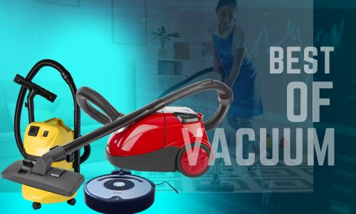

Shark vacuums have a plastic dust bin that contains debris and dirt instead of making use of disposable vacuum bags. There is no need to buy new bags for the vacuum but you are supposed to empty its dust bin from time to time to prevent the loss of suction or the cleaner getting clogged. The vacuum, according its manufacturer, Shark, must be emptied after being used every time or any time when the bin gets full while vacuuming a particularly dirty or large area. Find out how to empty a [shark vacuum](https://www.bestofvacuum.com/best-rated-shark-vacuum/), including its rotating brush, HEPA filters and other important components.

## **How Can You Find Out When the Shark Vacuum Cleaner Needs to Be Cleaned Up?**

Here are a few signs that your vacuum needs to be cleaned up.

### ***Loss of suction power***

Loss of suction power is the prime indicator. In such cases, your vacuum will not perform as well as before. When the filters are clogged and dirty, you will find the suction power taking a hit. The suction power could also be impacted if there is an accumulation of too many debris or other materials with time on the rotating brush located at the bottom.

### ***Bad odor***

If an unpleasant odor is emitted from the vacuum, it could be indicative of a buildup of dust, dirt, debris and other pollutants in the cleaning tool. Once you clean the unit, the smell will go back to normal.

**See Also:**

-   [**How to clean pergo floors without streaks**](https://www.bestofvacuum.com/how-to-clean-pergo-floors/)
-   [Vacuums for pet hair](https://www.bestofvacuum.com/best-vacuum-for-pet-hair/)
-   [Vacuums with auto rewind cord](https://www.bestofvacuum.com/best-vacuum-with-retractable-cord/)
-   [Best hoover for human hair](https://www.bestofvacuum.com/best-vacuum-for-long-hair/)
-   [Wet dry vac for laminate floors](https://www.bestofvacuum.com/best-vacuum-for-laminate-floors/)

### ***Change in sound***

If you find the machine producing a type of sound that is different from what emanated from it before during an operational state, it could mean that the vacuum has to be emptied as soon as possible. It might be unable to suck in all the debris.

## **How Can You Empty a Shark Vacuum?**

How to empty a shark vacuum? You can follow these  simple steps to clean it completely.

### **Step 1**

First things first, turn the unit off. Take its plug off the AC outlet it is connected to.

### **Step 2**

Grab the handle located at the top of the dust bin of the Shark vacuum.

### **Step 3**

Use your thumb to press the button placed on the handle’s front end. Pull up the dust bin, and take it away from the vacuum.

### **Step 4**

Hold the bin over your trash can to empty the contents from within.

### **Step 5**

Press the button found on the bin’s side, close to its bottom. It will make the bin’s bottom open up and let the debris and dirt get released and emptied into your trash can.

### **Step 6**

Press the bin’s bottom with your hand to close it. Restore the bin to the cleaner.

**Also Read: [Can I Recycle a Vacuum Cleaner?](https://www.bestofvacuum.com/can-i-recycle-a-vacuum-cleaner/)**

## **How Should You Clean Shark Vacuum Rotating Brush?**

You have to use these steps to clean the rotating brush of the vacuum.

-   Unplug the vacuum cleaner, in case it is plugged into an AC outlet.
-   Make the cleaner stand on a firm, level surface, with a cover or plastic bag under its base. This is because the process can be a little messy.
-   Get rid of any debris, fiber or hair that is stuck to the brush.
-   Clean the dirt container and the plastic filters.

## **How to Clean the HEPA Filters on Shark Vacuum?**

There is a bag-less system in most of the Shark vacuums. Thus, all the dirt that you have vacuumed is contained within a plastic container. This can be removed to dispose of the dirt easily. You need to regularly clean up the area, for preventing blockage of the entire filter system. Here are the steps to follow for cleaning up the filter.

-   Take the dirt container off. Empty the dirt accumulated in the container into the trash bin.
-   Open its dirt container. Get rid of the HEPA filters.
-   Remove any dust or dirt particles that entered the filter. You can do this by making soft taps on the filter located on the can’s side.
-   After doing this, you can use water to clean up these parts. Go on cleaning your filter system until you find clean water coming out. Rinse the filters in a proper way until you can get them completely clean. You can use a small amount of neutral detergent for making the cleaning process most effective.
-   Let some time to each and every part to be dried out fully, before you put them back to the vacuum. In any situation, you should not use the cleaner while its components are still moist. Squeeze the filters to remove all the excess water, and allow a few hours to them to dry. Keep in mind that it takes longer to dry HEPA filters when compared to plastic filters.

You should regularly clean up the HEPA filters. Most of these have double sets of HEPA filters. Thus, you can clean one set while using the other one.

**Also Read: [Can Bed Bugs Live in a Vacuum Cleaner?](https://www.bestofvacuum.com/can-bed-bugs-live-in-a-vacuum-cleaner/)**