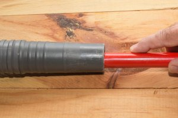

Cleaning dirt and debris manually can be a pain in the butt. Just imagine how long it would take to get rid of pet hair from carpets, stubborn dust stuck on stairs, or food particles littered all over hardwood floors.

Using just a broom, the task could take hours to complete, especially if you live in a bigger house. But when you bring a vacuum cleaner to the picture, everything changes.

Here’s the thing:

A vacuum cleaner is an important cleaning equipment that does a better job than a manual or an [electric broom](https://www.bestofvacuum.com/best-stationary-vacuum/). With just one or two passes, the device can get rid of even the most annoying dirt stick on different surfaces. Some even have true HEPA filters and AirClean technologies that help with air purification.

**Also Read: [Can I Recycle a Vacuum Cleaner?](https://www.bestofvacuum.com/can-i-recycle-a-vacuum-cleaner/)**

But the problem is?

Well, every vacuum cleaner has a hose that’s susceptible to clogging. If you own a vacuum, you’ve probably experienced this and had a difficult time trying to figure out what to do.

So in this article, I’ll walk you through how to unclog your vacuum hose so you can get your vacuum cleaner back to its good state. In particular, you will learn:

* What happens when the hose of your vacuum cleaner clogs
* How to unclog the hose of any vacuum cleaner the right way

Let’s get started.

## **What Happens When a Vacuum Hose Clogs?**

Like a puncture on a hose, a clogged vacuum’s hose is one of the biggest problems you’ll probably ever have to deal with.

It’s important to understand that the hose can clog for a number of reasons:

* The dust cup in the dust compartment may be full, making it difficult for more dirt to get through to the dust compartment.
* You may have vacuumed a chunk of dirt that didn’t make it to the dust cup but stuck in the filters instead.
* Dirt particles may have accumulated on the walls of the hose overtime then stuck instead.

If left unattended to, a clogged hose can affect the performance of your vacuum cleaner.

The unit’s suction power will lower. And when it does, it won’t pick up dirt as much as it used to. That’s because a reduced suction power lowers the speed and strength at which the unit can pick up dust from the brush head to the dust compartment.

You seriously don’t want any obstacle to affect the suction power of your machine, not to mention its overall performance. Which is why you should clean the hose if you notice an instance of clogging.

Here’s how to do that.

## **How to Unclog a Vacuum’s Hose the Right Way**

**Step #1: Detach the Hose from the Vacuum**

Unplug the vacuum from the power outlet and gently pull the hose from the base of the unit. If your model has screws on it, use a screwdriver to loosen the bolts and then take them off.

If you aren’t sure about how to remove the hose from your vacuum cleaner, or if it’s the first time you intend to do this, checking the manual provided the manufacturer can help you take off the hose from the vac in just a couple of minutes.

**Step #2: Check if the Hose is Actually Clogged**

The suction power of your vacuum cleaner could be low for two reasons. Either there’s a hole on the hose or large objects clogged within.

To know whether you’re actually dealing with clogging, hold the detached hose upright and pass a small piece of object down to the other side of the opening. The object can be anything, a small piece of stone, a coin, a bead, or even a bean.

If the object drops off from the other side of the hose, then you know the problem with the suction power is definitely because of something else. If the object doesn’t pass through, though, then you know you’re dealing with a clogged hose. And you have some cleaning work to do.

**Step #3: Force Large Clogs Out of the Hose**

Take a thin, long piece of stick with a soft tip. Wrap a thin piece of cloth on the tip of the stick and try to push it through the hose to force large clogs out.

Push the stick slowly and gently, the hose is so delicate that you can’t push the stick fast. Pushing the stick fast can only break the hose suction power and interfere with the performance of the vacuum cleaner.

If you don’t have a thin, long stick, you can use a tall broomstick to do the same. Some people also suggest that you can use a wire hanger, but I don’t recommend it because it’s a sharp object that can easily poke through the hose.

**Step #4: Clean Out Buildup in the Vacuum’s Hose**

In this step, you will need half a cup of baking soda and half a cup of white vinegar.

Add in the baking powder and shake the hose thoroughly until the powder covers the whole of the interior. Then, add the white vinegar to the hose. Let the two components mix while bubbling for about 5 minutes.

You can also use powdered laundry detergent with hot water if you don’t have white vinegar and baking soda.

**Step #5: Rinse the Hose**

To rinse the hose effectively, it would be best to use hot water. The water helps to soak up baking powder and vinegar that may have remained in the hose.

Make sure the water gets to the hose from both ends.

**Step #6: Dry the Hose and Put it back in Place** 

The last step in unclogging the hose is to dry it completely before putting it back in it places. Essentially, you should dry it for at least one hour. After 60 minutes, fix it to your vacuum and then test it to see if it works. Of course, it should work fine and the suction power of the machine should be as good as before.
