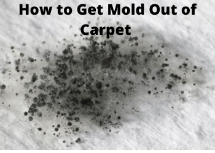

Scrubbing mold from tiled and hardwood floor with water and laundry detergent is easy. But if you have the mildew building up and sticking on your carpet, it can be somewhat difficult to clean. Since [mold spores are as small as three microns](http://www.fsec.ucf.edu/en/consumer/buildings/basics/moldgrowth.htm), they can easily find their ways into the tiniest spaces in soft surfaces. If anything, simply scrubbing the carpet won’t do much to remove them.

While the best way to keep mold from carpet is to ensure they don’t grow in the first place, they’ll more than likely surface if the floor underneath gets too cold and damp, especially when unattended to for quite some time.

In this guide, we’ll look at the most effective ways to remove mold from carpet. While each method has its pros and cons, a constant factor is that they eventually give you the results you need at the end of the day.

## **How to Remove Mold Out of Carpet**

### **Using Home Supplies to Get Mold Out of Carpet**

Using home supplies to get mold out of carpet is a pocket-friendly alternative to hiring a professional carpet cleaner. And it’s my recommended method for removing mold that hasn’t spread to the backing at the base of the carpet.

### **1\. Ventilate the Room with Moldy Carpet**

Start by inspecting the carpet to determine how further the mold reached. It will take a while to remove the mildew if it has spread to the backing at the base of the carpet. If this is the case, you may need to hire the service of a carpet cleaner.

Give the room with the moldy carpet proper ventilation. Simply opening the doors and windows will initiate immediate air circulation, eliminate mold odor, and reduce humidity. If the room doesn’t have windows, get a fan that you can use while pointing in the direction of the doorway.

Sunning the carpet helps remove the mold easily. Consider this as an option if your carpet is removable. Hang it outside over a clothesline and give it about 48 hours of direct sunlight. Doing so will easily kill mold spores and at the same time dry up the moisture that often encourage the growth of molds.

### **2\. Clean Mold Out of Carpet with Vinegar**

There’s more to vinegar than just the health benefits that you know. In addition to being a useful solution for cleaning leather shoes, vinegar can also remove mold fstains quite easily.

When it comes to vinegar for carpet molds, the argument is that the solution won’t kill all mold species, but it’s still an effective and cost friendly option you can use instead of hiring the service of a professional carpet cleaner.

Don’t use any type of vinegar to remove mold from the carpet. Use the white one instead, because you don’t want to end up with a mold-free, stained carpet. You can even mix the white vinegar and methylated spirit in the right ratio for good results.

To use white vinegar to remove molds from your carpet:

-   Add the vinegar to a spray bottle and apply the content lightly to the carpet.
-   Wait a few seconds for the vinegar to soak in and then use a stiff brush to scrub the mold.
-   Use a blow dryer to dry the carpet, or air dry in a well-ventilated room.

If you can, take the carpet outside and sundry it for a few hours. This will get rid of the moisture that would otherwise replenish the mold if left on the carpet.

### **3\. Remove Mold from Carpet with Baking Soda**

If you have light mold problem, or the mold has only spread out to a small part of the carpet, you can use baking soda to remove it. And this method is very easy to apply. You simply have to sprinkle baking soda on the area with the mold. Leave the soda on the carpet overnight, and then use a [vacuum cleaner for shag carpet](https://www.bestofvacuum.com/best-vacuum-for-shag-carpet/) to vacuum the mold the next morning.

## **Using Commercial Products to Get Mold Out of Carpet**

Using commercial products to remove mold out of carpet will cost you money, but it’s the most effective way to consider if you want a quick solution that doesn’t involve using home supplies.

### **1\. Use Carpet Cleaning Products to Remove Mold**

The benefit of carpet cleaning products with deodorizer is twofold. They easily clean out dirt from carpet, from muddy footprints to liquid stains, and also kill mildew in the process.

For example, the [Bissell Professional Stain & Odor](https://www.amazon.com/gp/offer-listing/B005MZLMGE/ref=as_li_tl?ie=UTF8&camp=1789&creative=9325&creativeASIN=B005MZLMGE&linkCode=am2&tag=bestofvacuum2-20&linkId=207ce726dff7182203f52cf60405b934) is a carpet cleaner that can remove tough stains, such as French fry oil, makeup, and pet soils, with ease. Moreover, it features a patented odor removal technology that clears horrible odor such as pet, kitchen, mold, and mildew odor. With at least 33% more enzyme cleaning action, this carpet cleaner work quite well unlike [homemade DIY laundry soap](https://www.bestofvacuum.com/why-homemade-laundry-soap-is-bad/).

Keep in mind that carpet cleaning products have varying user instructions, and therefore it’s best to first read the manufacturer’s instructions before you start using the product.

### **2\. Use Antifungal Sprays**

Also known as anti-mold solutions, antifungal sprays can kill mold spores almost in an instant. These solutions are readily available. You can buy them from a supermarket or from your local store. If you’re an online shopper, you can buy them online from Amazon.

Whatever anti-mold product you choose, first check the instruction label to determine if the solution is safe for your carpet. Avoid any antifungal sprays designed for the bathroom or kitchen, as these can easily discolor your carpet.

If you see the phrase “*mold barrier”* on the antifungal spray, go with it. That’s because it’s a good solution that adds barrier on the carpet so that mold doesn’t grow on the carpet in future.

#### **My Final Thoughts**

As you can see, there are more than one ways to get mold out of carpet. So if you just have a little mold to deal with, consider removing them yourself from home. Hiring a professional carpet cleaner should be the last option, usually when all other options have failed.