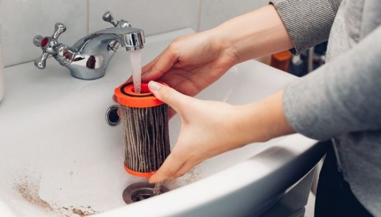

There’s nothing worse in a home you’re trying to keep clean and fresh than a smelling vacuum cleaner. If you think about it, though, even the best vac, especially the [bagged type](https://www.bestofvacuum.com/best-bagged-vacuum/), will start to smell after a period of use.

**Pet hair clogs, mold coffee grinds, dust from [shag carpets](https://www.bestofvacuum.com/best-vacuum-for-shag-carpet/) and stairs, food articles vacuumed from hardwood floors, all these and many more can make the cleaner smell bad.**

Many people wait until the smell gets to a pungent state to figure out the right way to clean the unit. But you don’t have to wait that long.

There’s a reason why professional cleaners recommend cleaning these devices from time to time. First, you want to release fresh air to your surrounding each time you vacuum your house. Second, you want to ensure that the unit stays in good condition, so it can give you the best cleaning service long-term.

The only way to do these two things is to keep the inside of the vacuum system as clean as possible.

So, in this article, you’ll learn two things:

-   Why your vacuum cleaner smells.
-   Steps you can take to clean and keep it fresh.

Let’s get started:

## **What Causes a Vacuum Cleaner to Stink?**

Are you wondering why your vacuum cleaner smells as bad? Any of the following could be the possible reason for the odor.

### **1\. Your carpet is damp**

It’s common for carpets to get in contact with water, especially when mopping.

And if you have the tendency to spread out your carpet on a floor not dry enough after mopping, the carpet will more than likely get damp.

If left unattended, the damp surface will start to release an odor. You use a vacuum cleaner to clean such a damp carpet, and it won’t take time to notice just how foul the smell from it is.

### **2\. The vacuum has too much pet hair**

Pets are great. But then again, keeping them in your home means you have to make some sacrifices. That includes dealing with their messes.

Every time you use a [pet hair vacuum](https://www.bestofvacuum.com/best-vacuum-for-pet-hair/) to clean fur from your animal friend, the device also sucks up the smell that comes along with it.

Pet urine adds to the menace. Mixed with hair, the result is probably the worst stench you’ll ever have to deal with in your house. Of course, the urine sticks on pet hair and in dust. And your vacuum cleaner picks all this up.

Combined with dirt [vacuumed from different surfaces](https://www.bestofvacuum.com/best-multi-surface-vacuum/), the result is a complete recipe for odor that will make your vacuum machine stink like a sewer.

**Also read: [Can you use a vacuum without a roller brush?](https://www.bestofvacuum.com/can-you-use-a-vacuum-without-a-roller-brush/)**

### **3\. Accumulation of mold**

Does your [bagged vacuum](https://www.bestofvacuum.com/best-bagged-vacuum/) smell like shit? It’s highly likely that molds have grown in the bag and around the filter.

Keep in mind that inside that bag is a most environment that’s favorable for the growth of molds. So every time you vacuum a wet carpet, you actually create a safer environment for molds to grow. And, if anything, this makes your vacuum cleaner stink.

**Also Read: [Recycling a Vacuum Cleaner](https://www.bestofvacuum.com/can-i-recycle-a-vacuum-cleaner/)**

## **How to Keep Your Vacuum Clean and Fresh**

Now that you know the possible reasons why your vacuum clear stinks, let’s look at how you can clean and keep it fresh.

### **1\. Identify the cause of the smell**

The odor coming from the vac cleaner could be for one reason or the other.

Is pet hair blocking the filters? Are there solid objects locked in the brushes? Has dirty water accumulated in the unit’s reservoir overtime? Is the smell because of a damp carpet? Or maybe you haven’t cleaned the water tank for a while and it probably stinks by now?

Knowing the cause of the smell means understanding the problem you’re dealing with. And this will make it easy for you to clean the vacuum in a very short time.

### **2\. Clean it up**

Knowing the cause of the smell is one thing. Cleaning up the mess is where the actual work is. If you ask me, I’d say it’s best to clean the device regularly. This will remove dust particles of different sizes from the pores of the vacuum, keep the essential parts clean, and ensure that the cleaner works well all the time.

Let’s say you own a [Shark vacuum](https://www.bestofvacuum.com/best-rated-shark-vacuum/), for example. One of the best maintenance practices for your model would be to have a cleaning schedule for the device, which must include [emptying the dust cup](https://www.bestofvacuum.com/how-to-empty-a-shark-vacuum/), cleaning it up with thoroughly with water and detergent, drying it, and putting it back in place.

The bottom line is this:

As long as you regularly inspect your vacuum, identify the cause of the smell, and clean up the mess, you’ll never have a foul unit lying around.

### **3\. Spray some air freshener on the vacuum**

Cleaning your vacuum cleaner, as described in step two, is all there is to getting rid of the smell. Yet you can take this even a step further and spray some air freshener on the vacuum to make it smell nice.

You can use a spray of your choice to do this. Even better, spray the cleaner indoors so that the scent of the spray can spread out. This will go a long way to get rid of odor quickly.

### **4\. Empty the dust cup regularly**

Cleaning the dust cup so that dust doesn’t stick on the surface is only part of the job. You also have to ensure you empty it as often as possible.

Some people wait until the dust cup is full of dirt and debris to empty it. This, however, may not be a good cleanliness and maintenance practice.

It would be helpful if you empty the dust cap after every vacuuming session. Of course, this seems like a lot to do. But emptying the dust cup frequently is one of the best practices that will go a long way to make your vacuum cleaner smell fresh.

Remember to dry the dust cup and the filters as much as possible. The last thing you want to do is to create an environment where molds can grow and thrive.
