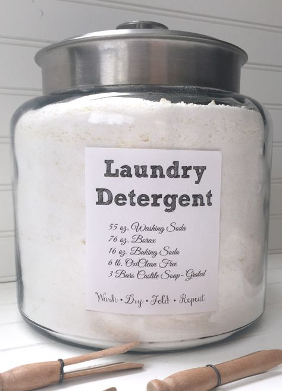

Isn’t it amazing just how popular homemade laundry detergents are these days? There isn’t a time I’ve read about detergents that this DIY solution didn’t for once surface.

To be frank, I completely understand why anyone would resort to homemade detergent soaps instead of the conventional option.

First, and probably the most obvious of reasons is that, unlike chemical detergents, homemade soaps are easy to make and **absolutely cheap.** With just a few ingredients, which you can buy from a local store for just a few bucks, you can make your DIY detergent in just under 30 minutes and get down to cleaning thereafter.

Second, using homemade detergents for cleaning means you’re avoiding exposure to what some of us have gone as far as to refer to as sketchy chemicals.

But as cheap as DIY homemade detergents are, and safe as we generally assume them to be, just how effective are they when it comes to the cleaning business? It turns out that it’s probably not as effective as Pinterest Pins have made you to believe.

You see, the science of cleaning is quite complex in form, and there are many reasons why it’s not a good idea to use homemade laundry detergents in the first place.

**Also Read: [How to Clean Pergo Floors Naturally](https://www.bestofvacuum.com/how-to-clean-pergo-floors/)**

## **Why You Shouldn’t Use DIY Homemade Laundry Detergent as Soap**

### **1\. Homemade Laundry Soap Doesn’t Clean Well**

We can argue about how economical homemade laundry soaps are until we go blue in the face. But tests on the [effectiveness of DIY detergents](https://www.reviewed.com/laundry/features/can-diy-laundry-detergents-compete-with-store-brands) show that these solutions don’t clean well.

Don’t believe that’s true?

Let’s run a small DIY test and see what we get.

-   Get a small amount of your DIY soap formula and a standard, commercial detergent.
-   Grab a piece of dirty piece of clothing and tear it into two pieces.
-   Add the same amount of water into two plastic water basins.
-   Wash a part of the torn cloth using DIY homemade soap in one basin and the other piece with commercial laundry detergent in the other basin.

In each case, record how well each formula cleaned off the same type of dirt in just one cleaning cycle. Don’t forget that while you’ll be using two different detergents for testing, the time scheduled for the cleaning should be the same.

Now compare your results. What exactly do you see?

While the DIY laundry detergent did in fact do some cleaning, it didn’t do a good job compared to the commercial laundry detergent.

The takeaway is this:

While a DIY homemade detergent can clean off dirt, it only does it to certain degree. So as cheap as it may be, it’s not exactly a solution you’d rely on for effective, thorough cleaning.

### **2\. It’s Not a Detergent, It’s Just Actually Soap**

Far too often, people engrossed to DIY homemade concoctions like to assume that the solutions are laundry detergents. In actual sense, they’re just soaps.

That’s not a bad thing, though, or is it?

Think of it like this:

Water has a property known as [surface tension](https://www.usgs.gov/special-topic/water-science-school/science/surface-tension-and-water), which is the tendency for a liquid to resist external force due to the cohesiveness of its molecules.

To reduce the resistance of water to the external force, we introduce a chemical called a surfactant. They will do more than just break the surface tension of the water. It will loosen dirt and hold it in suspension so that you can easily clean the dirt away.

The best part is that your DIY homemade soap is a surfactant.

The worst part is that it leaves a film that isn’t easy to rinse off from clothes. Not to mention it tends to make the fabric feel stiff. Even worse, the molecules of homemade soaps aren’t very versatile, and therefore the solutions can’t easily adapt to different water conditions, fabric types, and cleaning temperature.

The commercial detergents that you buy from the store, on the other hand, have more surfactant, enough to do well in a variety of cleaning conditions. And unlike the soaps you make yourself at home, commercial laundry detergents don’t leave films on clothes.

Even if you were to argue that DIY soaps are effective, we can only assume their value to a certain degree, beyond which they’re not good enough, as they don’t meet the conditions required to be effective for cleaning.

### **3\. DIY Laundry Soap Ruins Clothes, It Doesn’t Clean Them**

You’re more than likely to use a DIY laundry soap because it’s inexpensive and easy to make from home. It could even be that you find them to be *somewhat* effective in cleaning off some stains.

But to be honest, that DIY soap isn’t going to *make the cut.* In fact, it’s good at ruining clothes more than cleaning them.

Let me put it this way:

Every time you use a DIY soap to do cleaning, you’ll notice some soap build up on your hands. We sometimes call it *a problem of soap scum.*

Now take this and apply it to clothes.

Every piece of clothing you wash will pick up the soap and bury the residue in the textile. The continuous accumulation of the soap scum will turn into dirt, making your clothes difficult to clean. Therefore the result is exactly the opposite of what you’d like to see.

You don’t get such an ugly effect from a commercial laundry detergent sold in store.

### **4\. DIY Homemade Laundry Soaps Don’t Work With Washing Machines**

Why *on God’s green earth* would you use a DIY homemade laundry soap to wash clothes in a washing machine? Other than the soap being a cheap cleaning agent that can save you a couple of bucks here and there, I can’t quite think of any other reasonable reason.

To be honest, I do understand the beauty of saving money. The modern economy is just too unpredictable. Only it doesn’t exactly have to apply to cleaning, especially when there’s a washing machine in the picture.

Let me explain why.

First, understand that commercial laundry detergents have strong chemical agents that not only break the surface tension of water but also trap and suspend dirt in water. This makes it easy for the washing machine to clean your clothes and carry the dirt away.

It’s a completely different case with a homemade laundry soap.

Because DIY soaps contain less surfactant, they‘ll need more help to rise the dirt away. And, unfortunately, a washing machine doesn’t provide this kind of support. From what I understand so far, washing machine can only work with commercial detergents, as that’s the solution that they can easily rinse away.

If you’ve been keeping up with this guide, I did mention that DIY soap can build up in your fabric and ruin your clothes. The same thing can happen to your washing machine.

When soap scum builds up in the machine, they’ll remain until you scrub them away. If you’re using DIY soap and you don’t take action early, the soap scum could get to the parts of the machine that are difficult to reach. That can be quite gross.

Another problem with using DIY soap in a washing machine is that it can void your machine’s warranty. Not to mention that you risk destroying an entire cleaning gadget, which you can save simply by not using a cheap, homemade laundry soap.

### **5\. Your DIY Laundry Detergent Doesn’t Have Enzymes**

As good as you think a DIY soap is for cleaning, it doesn’t exactly have the enzymes required to break down stains and make them easy to clean.

Do you recall the experiment we did earlier?

The results showed that DIY soap struggled to remove tough stains. If you further conduct the experiment on clothing that have stubborn stains such as sweat, grease, bloodstains, oil, and grass stain, the results would be more or less the same.

In-store laundry detergents are different. They contain sufficient enzymes, and therefore they can break down these stains with ease and in the shortest time possible.

To match up to the level of the effectiveness of in-store laundry detergents, you’d have to add enzymes to your DIY soap. There’s a procedure to [make enzymes for DIY homemade soaps](http://www.reviewed.com/science/diy-make-your-own-enzymatic-laundry-detergent), with the preparation costing only about $5. However, it will take 14 days for the enzymes to be ready, which, in my strongest opinion, is a long time to wait.

And even after the 14 days elapse, you’ll to have to use the enzymes right away or refrigerate them for up to 30 days. It’s a long waiting game, and it’s silly to think that it’s practical.

In other words, given the waiting period for the DIY enzymes to be ready, and the fact that you have to use what you’ve prepared right away, the waiting game isn’t exactly worth the gamble.

It’s better to stick with what works already, because the cleaning professionals and experts have everything figured out for you already.

#### **Final Thoughts**

Now that you know why it’s not a good idea to use home laundry detergents, I hope you won’t waste your time making them. Instead, I hope that you’ll stick to what works from this point forward.